# House Hub audit, Phase 1: visual capture

| | |
|---|---|
| **App code captured** | `fe6041d` (the Phase 0 baseline). Nothing outside `audits/` has changed since; HEAD `a911cad` adds only `audits/` files. |
| **Date** | 2026-09-23 |
| **Engine** | Playwright 1.63.0, WebKit build 2359, on Windows 11 |
| **Output** | `audits/screens/<area>/<screen>-<state>-<device>-<mode>.png`, plus `audits/screens/manifest.json`, contact sheets in `audits/screens/_sheets/`, and the index at the end of this file |
| **Leads** | `audits/01-leads.md`: app issues the capture agents saw, unverified, as input for Phases 2 and 3 |

## 1. Run it

```bash
node audits/tools/capture.mjs
```

That one command:
- installs Playwright and WebKit on first use (into `%LOCALAPPDATA%\house-hub-audit`, never into the repo);
- starts a local instance seeded with the demo household;
- captures the whole matrix;
- writes the manifest, the contact sheets and the index below.

A full run takes about 65 minutes on this PC with `--parallel 6`. Filters (`--area`, `--screen`, `--state`, `--device`, `--mode`) and `--out` for trial runs are listed in `audits/tools/README.md`. For Phase 6, rerun the affected screens into `--out audits/screens-after/<batch>` (git-ignored like `screens/`), then compare with `node audits/tools/lib/pxdiff.mjs audits/screens audits/screens-after/<batch> --only-changed`.

## 2. What the rig is

**It uses a local instance only.**
- `audits/tools/lib/server.mjs` serves the repo the way GitHub Pages does.
- The same server runs the real Worker source (`worker/src/index.js`) in Node, against an in-memory SQLite database through a small D1 shim (`lib/d1.mjs`). D1 is SQLite.
- The Worker's outbound calls are stubbed: ride waits come from `seed/waits.mjs`, and chat replies come from a local Anthropic stand-in (`lib/anthropic-mock.mjs`). Any other outbound call is refused.
- The browser cannot reach the production API host.
- No family data, production endpoint or secret was touched. The demo PINs and the pairing code are random on every run and are never written anywhere.

**The demo household** is built by `audits/tools/seed.mjs` and the per-app seeds in `audits/tools/seed/*.mjs`. It follows one story (`seed/story.mjs`), so Home, the TV board and Chat agree with the apps:
- the real profile ids and names, plus Grandma Jo as a guest;
- a Tuesday-morning state of every app;
- F260 progress per adult;
- the family memory-verse week;
- who prayed today;
- the kids' stars;
- Elizabeth's running kitchen timer.

All content is invented.

**Data variants:**

| Variant | What it holds |
|---|---|
| `empty` | Profiles, PINs and one device. No app data. |
| `typical` | A realistic morning. |
| `overflow` | Long names everywhere, 20–40-item lists, very large numbers, a guest list, and the chat daily cap reached. |
| `park` | `typical` plus a Dollywood park day: family locations, a meeting point and live ride waits. |

**Clock.** Every capture happens at **Tue 22 Sep 2026, 8:40 am New York**, so every rerun shows the same dates, the same "5 min ago" labels and the same timer readouts. Three mechanisms keep it fixed:
- The seed stamps its rows relative to that instant.
- The browser clock is fixed 0.5 s after it, so rounded labels never sit on a boundary.
- The Worker's clock restarts at that instant on each database reset, then runs 1000× slower than real time.

**Device matrix** (`audits/tools/lib/devices.mjs`):

| Device | Viewport (CSS px) | Emulation |
|---|---|---|
| `ipad-portrait` | 820×1180 | iPadOS Safari as a Home Screen app: Mac user agent, `MacIntel`, 5 touch points, `navigator.standalone` |
| `ipad-landscape` | 1180×820 | Same |
| `iphone-pwa` | 430×932 | iPhone Pro Max as a Home Screen app |
| `iphone-safari` | 430×740 | iPhone in a Safari tab. The height is an estimate of what Safari's bars leave. Captured for the `typical` and `error` states only. |
| `desktop` | 1440×900 | Mac Safari |
| `tv` | 1920×1080 | The kiosk TV, for the `tv` area only |

Every device is captured in **light and dark**, using System theme with the OS colour scheme emulated.

**States:**

| State | How it is made |
|---|---|
| `empty` | The `empty` variant |
| `typical` | The `typical` variant |
| `overflow` | The `overflow` variant |
| `loading` | The typical data, a browser with no local cache, and the data, profile, feed and chat-history API calls held unanswered. The shot is taken at about 1.2 s. |
| `offline` | A warm load, then the API and every external host become unreachable with `navigator.onLine` false, and the screen is opened again from the local cache |
| `error` | The screen's own failure, caused on purpose: a wrong pairing code, a wrong PIN, a revoked session, an API 500, a refused clipboard, and so on. Each error capture gets a fresh database, so rate limits never carry over. |

**Areas.** Every screen of the shell, the TV board and all nine apps is covered, from 12 screen files in `audits/tools/areas/`. Each view, tab, sheet, modal and mode was captured for each audience that can reach it: adult, kid, guest, and the kiosk on the TV. Per-screen notes in the index say what each screen shows and why a state is left out.

**How the scripts were checked.** One agent per area wrote the seed and screen scripts. It trial-ran them over the whole matrix and checked the screenshots by eye. A second, independent reviewer per area then:
- reran the full matrix;
- looked at every screen and state on iPad portrait and iPhone, in both modes, and spot-checked landscape, desktop and Safari;
- checked every data shape against the app code;
- fixed what was wrong.

The reviewers looked at 1,093 screenshots in all, and every area passed its review after fixes.

**Storage.** The full matrix is **4,447 PNGs, about 1.2 GB**. The two Dollywood map areas account for about 0.9 GB, because photographic map tiles compress badly as PNG. GitHub Pages publishes this whole repo and refuses sites over 1 GB, so committing them would break the live hub's deploy on the next push. So:
- **Kept on disk, not committed:** the full-size PNGs in `audits/screens/`, excluded by `audits/screens/.gitignore`.
- **Committed:**
  - the rig, which can regenerate every capture deterministically (fixed clock, deterministic seeds);
  - `manifest.json`, recording each capture's bytes, SHA-256, capture errors and console lines;
  - the contact sheets (JPEG);
  - this index.

If you want the PNGs in git anyway, delete `audits/screens/.gitignore`. That deploy risk would then apply.

## 3. Where the captures differ from a real device

These are emulation choices. Keep them in mind when grading the screenshots.

1. **This is not Safari on iOS.** It is Playwright's WebKit build for Windows.
   - **Fonts.** SF Pro, SF Pro Rounded (`ui-rounded`) and New York are missing, so the design tokens fall back to Segoe UI and, for serifs, Palatino Linotype or Georgia.
   - **Emoji** are Segoe UI Emoji.
   - **Form controls and scrollbars** are drawn by this engine.
   - **`backdrop-filter` is reported as supported but paints no blur.** `CSS.supports` and the computed style both say `blur(20px)`, but the stripes behind the panel stay crisp. Evidence: `audits/evidence/p1-webkit-backdrop-filter-no-blur.png`, reproduced by `node audits/tools/lib/check-backdrop-filter.mjs`. Every Liquid Glass surface (tab bar, top bar, sheets, pills, glass cards) therefore captures as a flat translucent panel. **Glass quality cannot be graded from these screenshots.** It needs the real iPad and iPhone; see §4.
2. **No Home Screen chrome.** Nothing draws a status bar or home indicator, and `env(safe-area-inset-*)` is 0. Standalone mode is emulated only through `navigator.standalone` so the shell's own logic takes the installed-app path.
3. **Pixel scale.** Captures are at 1 image pixel per CSS pixel. 1 px hairlines and inner highlights look softer than on a 2× or 3× Retina screen. `--scale device` captures at the device ratio when detail matters.
4. **Motion is finished.** Screenshots finish CSS animations, so each capture is the settled frame. Toasts appear only where a screen opts in (`animations: 'allow'`). The clock is fixed, so countdowns and the TV's 45 s rotation never advance.
5. **Service workers are blocked** in every capture except `shell/first-visit`. That screen shows the shell's "Hub updated" toast on a first install. Playwright WebKit cannot serve an offline navigation from a service worker, so the `offline` state serves the site files from the rig in place of the service-worker cache. The build guide is not precached in reality (`scripts/bump-sw.mjs:18`), so its offline captures overstate what a real offline device would show.
6. **Speech and other device APIs are stubbed.** The engine has no `webkitSpeechRecognition`, which Safari has, so an inert stand-in makes the hub's mic buttons appear. It never hears anything. Read-aloud uses a silent stand-in where an area needs it.
7. **Not available at all:** push (the local instance is `http:`), geolocation (never granted), WebAuthn, camera and file pickers, native `confirm()`/`alert()` (Playwright dismisses them), and the on-screen keyboard.
8. **The TV** is WebKit at 1920×1080, not the TV's own browser.
9. **Prayer's Google Fonts** are the only outside requests during a capture. Prayer loads them itself (`apps/prayer.html:12-14`). For a Safari user agent, Google serves a single variable Manrope file, and this WebKit build ignores its weight axis. So the prayer area asks Google for the per-weight static files instead (`audits/tools/areas/prayer.mjs:12-22`), and 400/500/600/700 render as they do on an iPad. The offline state blocks these requests like any other outside request.
10. **The Worker runs in Node, not workerd.** The code is identical; D1 is replaced by SQLite and the Cache API by a shim.

## 4. What Playwright WebKit cannot show: manual checks on the real iPad, iPhone and TV

These must be checked on the devices before Phase 6 marks any visual finding fixed (status NEEDS DEVICE CHECK). The consolidated list follows. The capture agents compiled it from everything they could not show, and each item names its screens.

<!-- MANUAL:START -->
The in-scope entries (kinds `untestable`, `untestable-flow`, `rig-limit`) were deduplicated across all builder and reviewer labels. "Home Screen app" means the iPad or iPhone app added from Safari. "TV" means the Downstairs TV kiosk.

#### Rendering and fonts
- **Liquid glass on every glass surface.** This WebKit build says `backdrop-filter` is supported but paints no blur. Sheets, bars and cards therefore capture as flat see-through panels, with the page behind still readable. On the iPad and iPhone, check that text stays legible once the blur really renders:
  - the shell's top bar, tab bar and sheets (Home, Me, Chat)
  - Prayer's sheet, veil and nav (apps/prayer.html:101)
  - the build guide's step sheet, popup cards and menus, and the Home Screen app chrome around them
  - the park map's cards
  - Refs: audits/screens/prayer/detail-typical-iphone-pwa-light.png, audits/screens/dollywood/steps-typical-iphone-pwa-light.png, audits/screens/dollywood/listing-typical-desktop-dark.png, audits/screens/shell/home-typical-iphone-pwa-light.png.
- **TV board from 10 feet.** On the real TV, check that the board reads from the couch, check overscan, and check the TV browser's own engine and chrome. The capture is WebKit at 1920x1080, which is not the TV's browser. Ref: audits/screens/tv/board-typical-tv-dark.png.
- **Motion the rig freezes.** Screenshots finish every animation, so only the settled frame exists. Watch these on a device:
  - TV: the 2.5 s backdrop crossfade and the 45 s album rotation.
  - Timer: the ring's stroke-dashoffset countdown and the blinking 0:00 (apps/timer.html:38).
  - Kid Verse: the confetti (1.2 s) and the 'New badge' toast (3.2 s).
  - F260: the ring-pop, the confetti and the milestone toasts.
  - Refs: audits/screens/timer/done-typical-iphone-pwa-light.png, audits/screens/kidverse/kid-award-empty-ipad-portrait-light.png, audits/screens/f260/week-complete-typical-iphone-pwa-light.png.
- **Print output.** F260 (window.print) and Prayer's More → Print (the print CSS and buildPrint). The rig's `print` screens are print-media stand-ins with no margins or page breaks. Check the real print dialog, or Save as PDF, on the iPad and on desktop. Refs: audits/screens/f260/print-typical-desktop-light.png, audits/screens/prayer/print-typical-ipad-portrait-light.png.

#### Home Screen app chrome and safe areas
- **Safe-area insets.** `env(safe-area-*)` is 0 in the rig's WebKit, so nothing proves that edge-anchored controls clear the notch, the status bar and the home indicator. Check on a Home Screen iPhone and iPad:
  - the shell's top bar, tab bar and timer pill
  - Larder's sticky add bar
  - Prayer's nav and sheets
  - the build guide's phone sheet
  - the park map's pills and cards
  - Refs: audits/screens/shell/home-timer-typical-iphone-pwa-light.png, audits/screens/leftovers/main-typical-iphone-pwa-light.png, audits/screens/dollywood/steps-full-typical-iphone-pwa-light.png.
- **Standalone chrome.** Check the standalone status bar and home indicator against each theme, for the shell and for the build guide's standalone Home Screen app chrome.

#### Touch and gestures
- **Home pull-to-refresh.** Synthetic touches show the armed arrow, but not the rubber-band offset of the content or the busy spinner. Try the real gesture on the iPad and iPhone. Ref: audits/screens/shell/home-pull-typical-iphone-pwa-light.png.
- **Prayer rows.** In this WebKit, a touch tap on a row `<div>` fires no click, so the rig mouse-clicks rows to open details (apps/prayer.html:1230-1266). Tap a row once on the iPad and iPhone to confirm it opens. Also try Pray now's ±60 px swipe. Refs: audits/screens/prayer/list-typical-iphone-pwa-light.png, audits/screens/prayer/pray-mode-typical-iphone-pwa-light.png.
- **Tally.** Check the press feedback (scale .94), rapid taps, and that double-tap zoom is suppressed. Ref: audits/screens/tally/main-typical-iphone-pwa-light.png.
- **Build guide.** Try pinch, drag-pan, drag-to-cut on the cross-section, dragging the phone sheet (apps/dollywood.html:1137-1138), and 3D orbit and pinch. The rig used only taps and handle clicks. Ref: audits/screens/dollywood/cross-section-cut-typical-ipad-portrait-light.png.
- **Park map.** Long-press on the map to set a meeting point (apps/dollywood-live.html:1460): check both the hold timing and the confirm that follows.
- **F260.** Swipe between weeks in reading mode. Ref: audits/screens/f260/reading-mode-typical-iphone-pwa-light.png.
- **Hover-only affordances need a touch path.** Larder's 'Mark used up' exists only as a `title` tooltip on the check button. The build guide's elevation readout on mouse move and its step-list hover preview are also hover-only (apps/dollywood.html:1096-1097).

#### Keyboard and form controls
- **On-screen keyboard.** Playwright renders no virtual keyboard. Check what the keyboard covers:
  - Larder's name field and the fixed add bar (it may cover the bar or push it up)
  - the Chat composer
  - the Me sheets: Add a guest, profile edit, pairing code
  - Home's pairing and reminder inputs
  - Prayer's Add and ask inputs
  - Refs: audits/screens/leftovers/add-typical-iphone-pwa-light.png, audits/screens/shell/chat-typical-iphone-pwa-light.png, audits/screens/shell/guest-add-typical-iphone-pwa-light.png, audits/screens/prayer/add-typical-iphone-pwa-light.png.
- **Native pickers.**
  - Larder's size `<select>` and `<input type=date>`.
  - Prayer's iOS `<select multiple>`.
  - The build guide's phone Terrain basemap picker, a native `<select>` at opacity 0 over the layers icon. Ref: audits/screens/dollywood/view-menu-typical-iphone-pwa-light.png.
- **Native confirm() and alert() dialogs.** Playwright dismisses them. On a device, check the wording and what happens after OK:
  - Me/Admin: Forget this device, Cash in (index.html:1367), Reset week (index.html:1373), remove album photo, Reset/Clear PIN, Remove guest, Purge, Unpair.
  - Build guide: Reset progress (apps/dollywood.html:1098) and the bad-import alert (apps/dollywood.html:1101).
  - Park map: Meet here (apps/dollywood-live.html:1591), long-press (apps/dollywood-live.html:1460) and Done/clear (apps/dollywood-live.html:1457). The Meet here text still says 'Tap Rally afterwards', but nothing offers Rally.
- **Hardware keyboard and TV remote.**
  - Pray now: →, Space, Esc, ←.
  - Build guide: the keyboard shortcuts and the 3D WASD/QE keys.
  - TV: reach Switch and the picker with the TV remote or with no pointer at all. Ref: audits/screens/tv/picker-tv-typical-tv-light.png.

#### Notifications
- **Web Push in Me.** The local instance is http and this WebKit has no PushManager, so these never render: subscribe/unsubscribe, the per-kind switches and 'Send a test notification'. Check them from the Home Screen app on the iPhone and iPad, and confirm a real push arrives. Ref: audits/screens/shell/me-notifications-typical-iphone-pwa-light.png.
- **Timer done.** The local notification (index.html:797-803) needs Notification permission and a service-worker registration, and the rig blocks both. With a real countdown, check the notification together with the shell's 'Timer done' toast and beep at 0. Ref: audits/screens/timer/done-toast-typical-iphone-pwa-light.png.
- **'Meet at <name>' push.** The park map cannot trigger it: `rally()` (apps/dollywood-live.html:1589) has no caller. It can be checked on a device only once a UI calls it.

#### Offline and updates
- **Offline cold start from the service-worker cache.** Playwright WebKit cannot serve an offline navigation from a service worker, so the rig serves the site files itself.
  - Cold-start in airplane mode: Home and the picker, the TV board, Larder, Prayer, Kid Verse and Verses.
  - The build guide is on the precache skip list, so offline it probably does not open at all. Its offline captures overstate it. Ref: audits/screens/dollywood/map-offline-ipad-portrait-light.png.
- **'Hub updated' toast.** It needs a real deploy, where a waiting worker replaces an active one. Only the first-install case is captured.
- **Live sync between two devices.** Start, pause or finish a timer on one device while Timer is open on another. It should show in the open app and in the shell pill (apps/timer.html:130-137; hub.onChange / the 30 s pull). Ref: audits/screens/timer/running-typical-iphone-pwa-light.png.
- **Legacy localStorage migrations.** They run once per device and show no UI, and the rig clears localStorage. Check on a device that still holds old data:
  - Larder's `leftovers.items` (apps/leftovers.html:174)
  - the build guide's `dollywood-build-progress-v2` and `dw-plot` (apps/dollywood.html:1107)

#### Device APIs (wake lock, speech, geolocation, WebAuthn, clipboard, audio, camera)
- **Wake lock.**
  - On the TV kiosk. It needs a user gesture and a real device.
  - In the shell, taken on the first pointerdown (index.html:1708-1712).
  - On the park map.
- **Speech synthesis.** The rig's 'Reading…' state uses a silent stand-in. Check the real speech and the 'This device cannot read aloud.' path:
  - Kid Verse: Read it to me and Read aloud.
  - The shell's kid read-aloud of the verse in Chat (index.html:1456-1459).
  - Ref: audits/screens/kidverse/kid-reading-typical-ipad-portrait-light.png.
- **Speech recognition.** `hub.voiceSupported` is false in Playwright WebKit, and mics show in captures only through an inert stub. On iOS Safari, check:
  - Larder's mic, its listening pulse and 'Couldn't hear that — try again or type it.'
  - the Chat mic (index.html:1521)
  - Prayer's Add mic
  - the first-use microphone/speech permission prompt
  - Refs: audits/screens/leftovers/voice-typical-iphone-pwa-light.png, audits/screens/shell/chat-kid-listening-typical-ipad-portrait-light.png.
- **Geolocation (park map).** The rig never grants geolocation. Check at the park:
  - the 'good' fix with its accuracy ring and heading cone
  - the 'searching', 'weak', 'arriving' (parking lots) and 'far' pills
  - publishing your own spot, so that Eli sees his own marker
  - the compass heading
  - GPS pause and resume on visibilitychange
  - Refs: audits/screens/dollywood-live/map-restored-typical-iphone-pwa-light.png, audits/screens/dollywood-live/map-denied-typical-iphone-pwa-light.png.
- **WebAuthn.** F260's Face ID / Touch ID enable and unlock (PRF). The rig has no platform authenticator, so Settings reads 'Not available in this browser.' Ref: audits/screens/f260/settings-typical-iphone-pwa-light.png.
- **Clipboard.**
  - Larder's Copy for Hearth: the actual clipboard text and the 'Copy failed — select manually' fallback. Ref: audits/screens/leftovers/copy-error-iphone-pwa-light.png.
  - F260's 'Copied' label (1.5 s) and the backup string that restore needs.
- **Audio.** Timer's 880 Hz beep, played both in the app (apps/timer.html:93-101) and in the shell (index.html:788-796).
- **Haptics.** `navigator.vibrate` in the shell's `buzz()`.
- **Camera, files and downloads.**
  - Me → Choose a photo (your own, and admin Edit) and Add a photo to the album: the upload and crop path.
  - Build guide: Export progress (a data: download, apps/dollywood.html:1099) and Import (a hidden file input, apps/dollywood.html:1100-1101).
  - Prayer: Export both lists (a Blob download) and Import.
- **Links that leave the app, from a Home Screen app.**
  - Prayer: 'Tell them you prayed' → Open Messages (an sms: link).
  - F260: the passage links (biblegateway, esv, bible.com).
  - Build guide: the Web / Photos / Videos / dollywood.com buttons (window.open, apps/dollywood.html:977).

#### Performance and 24/7 stability
- **TV left running for 24 h.** Node, interval and listener counts should stay flat, the screen should stay awake and the crossfade should stay smooth. `scripts/test-tv.mjs` proves the counts through `window.__tv`; the rig does not.
- **Midnight rollover while open.** Leave the TV and an iPad open overnight and check:
  - TV: 'today' for prayed and reading.
  - Larder: ages and the date box recompute (apps/leftovers.html:361-375).
  - Prayer: TODAY is frozen at load (apps/prayer.html:712).
  - Kid Verse: the stars rows' stale-week reset.
- **Build guide 3D on the iPad.** Check frame rate and memory, and the requestAnimationFrame loop that keeps running after you return to 2D (apps/dollywood.html:1269). Ref: audits/screens/dollywood/view-3d-typical-ipad-landscape-light.png.
- **Real countdowns.** The browser clock is fixed, so every running capture shows a static remaining time. Check the Timer ring and the shell pill ticking down over several minutes.

#### Accessibility settings
- **Reduce Motion, on and off.** The rig shoots with animations finished, so neither the full motion nor the reduced variant is proven. Cover the TV crossfade, the Kid Verse and F260 confetti, Timer's blink and ring, the pulsing mic and 'Reading…' icons, and the glass sheen drift.
- **Use without a pointer.**
  - The TV with its remote only (Switch, the picker).
  - Desktop with the keyboard only (Pray now's keys, the build guide's shortcuts).
- **Hover-only labels.** Larder's 'Mark used up' is only a `title` tooltip. Confirm the button's purpose is clear by touch and to VoiceOver.

### Screens and states the rig does not capture (yet)

The in-scope entries (kind `missing-screen`, plus `untestable` entries that describe a screen) were deduplicated and checked against the current plan (`node audits/tools/capture.mjs --list`, 4447 captures).

#### Needs clock control (`t.clockTo`)
- **tv:** the board at day (9–17) and dusk (17–20). That means the ambient art, the afternoon/evening greeting, and the System theme at night. Only dawn (`board`, 8:40 am) and night (`board-evening`) exist. A frame in the middle of the crossfade also needs `animations: 'allow'`. Refs: audits/screens/tv/board-typical-tv-light.png, audits/screens/tv/board-evening-typical-tv-dark.png.
- **leftovers:** midnight rollover (apps/leftovers.html:364-375). Ages and groups change in place and it has no view of its own, so capture it only if the audit wants it.
- **prayer:** midnight rollover. TODAY is frozen at load (apps/prayer.html:712).
- **kidverse:** midnight rollover and the stale-week reset of the stars rows.
- **timer:** the done toast for a timer over an hour. `fmtLeft` would read 'Timer done — 120:00 is up.' This matters only if the hours-as-minutes observation is taken up.

#### Needs geolocation
- **dollywood-live:** these pills and markers need a live GPS fix:
  - 'good', with its accuracy ring and heading cone
  - 'searching' (Finding you… / Still looking)
  - 'weak' (Rough fix ± N ft)
  - the '· sharing' badge
  - your own published marker

  A rig option with `ctx.setGeolocation` plus a permission grant would unlock them, but the brief says not to grant geolocation. 'arriving' and 'far' are already reached through a restored fix. Refs: audits/screens/dollywood-live/map-arriving-typical-iphone-pwa-light.png, audits/screens/dollywood-live/map-far-typical-iphone-pwa-light.png.

#### Behind native dialogs (results can be captured by accepting the dialog with `isolate: true`, as `pairing-code-new` does)
- **shell (Me):** the states after a confirm:
  - Kids' rewards right after Cash in or Reset week (★0, 'last cash-in', and the toast)
  - Reset PIN
  - Remove or Purge a guest
  - Unpair
  - remove an album photo
  - Ref: audits/screens/shell/me-rewards-typical-ipad-portrait-light.png.
- **tv:** the unpaired TV after Me → 'Forget this device', showing pairing at 1920x1080. The shell area covers pairing on handhelds only.
- **kidverse:** the toasts 'Cashed in: N stars!' and 'Your week starts over.' (apps/kidverse.html:482-484). The ledger rows are seeded; the toasts are not captured. Ref: audits/screens/kidverse/kid-cashed-in-typical-ipad-portrait-light.png.
- **dollywood:** the Reset progress confirm (apps/dollywood.html:1098) and the bad-import alert (apps/dollywood.html:1101). Only the menu that leads to them is captured, in audits/screens/dollywood/progress-menu-typical-ipad-portrait-light.png. Export (a download) and Import (a file picker) can never be shot.
- **dollywood-live:** Meet here (apps/dollywood-live.html:1591), long-press (apps/dollywood-live.html:1460) and Done/clear (apps/dollywood-live.html:1457) all stop at the dialog.
- **f260:**
  - The erase-journal confirm and the restore confirm ('Replace everything with this backup?'). Both use the same in-app dialog as `reset-confirm`. Restore also needs a real backup string, which the app gives only through the clipboard.
  - The no-crypto `alert()` (apps/f260.html:1131) can never be shown, because the rig's page is a secure context.

#### Toasts and animations (need `animations: 'allow'`)
- **shell (Me):** 'Checked with the house.', 'Saved.' and '<guest> can now tap their name on any device.'
- **shell (Home):**
  - The feed's 'Show more' while loading ('Loading…') and its failure toast 'Could not load more right now.' (index.html:931, 959). This needs a good first page and a failed second one; the offline pass hides Show more.
  - A reminder row disappearing after Done.
- **kidverse:**
  - 'Great listening!' after 'I heard it'. The state after the tap equals audits/screens/kidverse/kid-story-overflow-ipad-portrait-light.png.
  - The award toasts after Done ★.
  - Confetti mid-animation. `kid-award` reliably shows only the badge toast.
- **verses:** the 'Almost' and 'Not yet' rating toasts, and a kid's 'Practise again' reopen.
- **f260:** the week-complete celebration mid-animation (ring pop, confetti) and the milestone toasts. The end states exist as `week-complete` and `complete`.
- **prayer:**
  - Toasts: 'Added to the family list. Open it', 'Removed from the list.' and 'Backup restored.'
  - The state after Undo on Mark answered.
  - Add with the mic listening (the `mic.on` pulse). The stub never hears, but it can be tapped and shot like audits/screens/shell/chat-kid-listening-typical-ipad-portrait-light.png.
- **kidverse, verses:** the 'This device cannot read aloud.' toast. It needs a stub that deletes `window.speechSynthesis`.

#### Taps that write shared data (need `isolate: true`)
- **shell (Me):** the results of submitting: a guest added, a profile saved, a pairing code set. Only the forms and their client-side errors are captured now.
- **shell (Me):** `profile-edit` opened on a guest row, or on the admin himself (Kind select disabled). Ref: audits/screens/shell/profile-edit-typical-ipad-portrait-light.png.
- **prayer:**
  - The Settings ask panels Rename plan, New plan, Delete plan confirm, Rename category and the Add-category error.
  - The 'One category only' (focus) plan editor, which Eli's second plan uses; switching plans writes.
- **prayer:** the family list's List tab, a guest's Family view, and Kiara's kid view (the same component as Ezra's).
- **verses:** the week stepper's −, + and Use week. These rewrite the family week for the whole run.

#### Interactions not yet scripted
- **dollywood:**
  - The contour interval changed to 10 ft or 50 ft (only the View menu is captured).
  - The 'Used in step N' jump link on a listing card (`wireUsed`).
  - Tapping a listing sprite in the 3D view. This is raycast picking (apps/dollywood.html:1270-1273), and the sprite's screen position has to be found first.
  - The Listings-tab click that flies to a card.
  - Mark done ticking a step, and its feed line.
- **dollywood-live:** the building-footprint card (`showBuilding`, the 'b:' pick). It is another raw survey card, like audits/screens/dollywood-live/coaster-card-typical-iphone-pwa-light.png.

#### Error, loading and offline states
- **shell (Home):** `/api/data` answering 500 turns the Me tab's sync dot red (`hub.sync.state` 'error'). This is Home's only error signal, and `t.failApi` can cause it.
- **shell:** the viewer bar in the loading and offline states. `viewer` is captured in typical only. Ref: audits/screens/shell/viewer-typical-ipad-portrait-light.png.
- **tv:** loading and offline on the kiosk iPad. `board-ipad` has empty, typical and overflow only. Ref: audits/screens/tv/board-ipad-typical-ipad-landscape-light.png.
- **dollywood:** '3D library failed to load' (apps/dollywood.html:1157). This needs three.js to be missing, which the rig cannot cause without editing the app.

#### Profiles, themes, sign-in and seed gaps
- **tv:** the named kiosk themes (Parchment, Frost, Forest, an explicit Midnight).
  - The kiosk theme is device-local (apps/hub.js:84-98).
  - The rig can already capture them with `localStorage: { 'hub.theme': 'forest' }` and `modes: ['light']`, so this is a decision for all areas together. The shell captures `me-theme-parchment`, `me-theme-frost` and `me-theme-forest` only.
  - On the TV itself, Appearance can be reached only by typing …#me. Ref: audits/screens/tv/me-kiosk-typical-tv-dark.png.
- **tv:** '#apps' reached by URL on the kiosk, showing 'No apps for this profile yet.' below the board (index.html:696).
- **shell (Admin → Usage):** the push table always reads 'No pushes yet.' No seed writes `push_log`, because `h.push` is unused. Ref: audits/screens/shell/me-admin-usage-typical-ipad-portrait-light.png.
- **shell (Chat):**
  - In overflow, the six-chip 'Finished …' reply has no matching feed lines. Six lines by Eli at 08:29 are needed, from `seed/leftovers.mjs` or whichever seed owns the feed.
  - A live streamed reply with tool chips is never shown, because the mock returns text only, so the chip-danger style never renders.
- **shell:**
  - The transitions from pairing to picker and from PIN to Home. The pairing code and PINs are random per run and never printed.
  - Guest-with-PIN sign-in (Great-Aunt Wilhelmina). It is the same pad as `pin-entry`, so it is low value.
- **timer:** the pill on a kid's Home. The seeded story first needs a fact giving a kid a running timer.
- **tally, timer:** standalone mode, opened outside the hub. No in-product link reaches it; with no profile, both redirect to the shell. Low priority.
- **leftovers:** a kid in the empty and overflow states. They would match the adult `main-empty` and `main-overflow`.
- **verses:** a guest opening Verses. 'Nothing to train yet' looks the same as the empty trainer (audits/screens/verses/trainer-empty-ipad-portrait-light.png).

#### No screen possible until the code changes
- **Kiosk inside any app.** `visibleApps` returns [] for the kiosk (index.html:479), so the TV never reaches:
  - Larder's read-only view (apps/leftovers.html:18, 96; the nudge at apps/leftovers.html:293)
  - Tally's nudge, and Timer running locally on the TV
  - the build guide's `hubGuard` → `kioskNudge`
  - Prayer's read-only toast
  - Kid Verse and Verses (apps.json:11-12)
  - F260
  - the park map
- **dollywood-live:** Rally the family has no UI, because `rally()` (apps/dollywood-live.html:1589) is never called.
- **dollywood-live:** the amenity card (`showAmen`) is blocked by the `pick()` bug. `amenity-tap` is already captured and will show the card once that is fixed. Ref: audits/screens/dollywood-live/amenity-tap-typical-iphone-pwa-light.png.
- **leftovers:** submitting before `hub.ready` reloads the iframe, so there is no stable frame to shoot.
- **verses, kidverse:** the only error path is 'Could not save that.' (apps/verses.html:298), and it needs a read-only profile that cannot open either app. Tally and Timer have no error UI at all.

#### Checked: identical to a captured view, no screen needed
- **Guests** see the adult view in Larder, Tally, Timer, the build guide and Verses. On the park map, guests beyond `family-guest`, `map-restored` and `map-arriving` see the adult views too.
- **F260:** there is no kid or kiosk view. Mea's plan equals the empty state. Loading and offline are captured on Today only, and the app looks the same everywhere until `hub.ready` resolves.
- **Timer:** a remote pause or finish ends in the idle or done view that is already captured.
<!-- MANUAL:END -->

## 5. Verification of this phase

<!-- VERIFY:START -->
Everything below was re-run after the last change to the rig. It is reported from that second pass.

| Check | Result |
|---|---|
| Full run | `node audits/tools/capture.mjs --parallel 6` ran on 2026-09-23 from 15:48 to 16:53 UTC. It produced **4,447 captures, 0 failed**, covering 274 screens in 11 areas: 1,251 MB of PNG and 274 contact sheets (35 MB of JPEG). |
| Console | HTTP errors (401, 429, 500, 502) appear only in the captures that cause them on purpose: `shell/pairing-error`, `pairing-unpaired-error`, `picker-signed-out-error`, `pin-entry-error` and `pin-locked-error`; `leftovers/main-error`; `dollywood-live/waits-error`. Page errors occur only in 32 Prayer loading captures (`list-`, `record-`, `settings-` and `today-family-loading`). Those are the app throwing when a tap lands before its data exists, recorded as a lead in `01-leads.md`. |
| Determinism | 210 captures (Home, picker, the main app screens, the TV board and the park map, across 5 states, iPad, iPhone and TV, light and dark) were shot again into a scratch folder after the full run and compared.<br>• `lib/compare.mjs`: **201 byte-identical**; 9 differ only in the bytes of resampled avatar photos.<br>• `lib/pxdiff.mjs`: **0 of 210 changed** beyond tolerance 48.<br>An earlier pass found real drift in relative-time labels ("1m ago" versus "just now"), caused by the seed's and the browser's clocks being a few milliseconds apart on whole-minute ages. The clock fix in §2 removed it before this final run. |
| Isolation | The Worker's outbound `fetch` refuses everything except the two local stubs, and the browser blocks the production API host. The only outside requests during a capture were Prayer's own Google Fonts. |
| Evidence links | All 301 screenshot paths cited in `01-leads.md` and in §4 exist in the final set. |
| Rig limit | `backdrop-filter` paints no blur in this WebKit build. This was verified directly, not inferred: `audits/evidence/p1-webkit-backdrop-filter-no-blur.png`. |
| My own look | I opened `shell/home-typical-ipad-portrait-light`, `tv/board-typical-tv-dark`, `prayer/today-typical-iphone-pwa-light` and `dollywood-live/map-typical-iphone-pwa-light`, plus the `leftovers--main` and `shell--home` contact sheets. Each shows the intended screen and state, and the data agrees across apps as `seed/story.mjs` intends:<br>• F260 is on week 38, 2/5, next Acts 6.<br>• There are "3 to eat this week" and "6 to pray · 3 done".<br>• Ezra has ★3 and Kiara ★1.<br>• The TV shows Elizabeth and Ezra under Prayed today, and Mae ✓ and Elizabeth ✓ under Reading today.<br>• The park map shows Mae's meeting point.<br>The other 1,093 screenshots checked by eye were checked by the area reviewers (§2), not by me. |

**Not verified in this phase:**
- Anything on a real iPad, iPhone or TV: see §4.
- How close Playwright WebKit on Windows is to Safari on iOS: fonts, glass, form controls. See §3.
- How much of each app's audit-relevant behaviour the screen scripts exercise, beyond the captures listed in the index.
- Whether the iPhone-Safari viewport height (740 px) matches a real Safari tab. It is an estimate.

The seeds match the app code's data shapes as the area agents checked them, but they were not compared with production data. That was deliberate: the rig never reads production.
<!-- VERIFY:END -->

## 6. Contact-sheet index

Each screen has one contact sheet. Rows are state × mode and columns are devices. A red frame marks a failed capture, and a dash means the combination is not captured, with the reason in the screen's note. The full-size frame for any thumbnail is `audits/screens/<area>/<screen>-<state>-<device>-<mode>.png`.

<!-- INDEX:START (generated by audits/tools/capture.mjs — do not edit by hand) -->
Generated by `node audits/tools/capture.mjs` from `audits/screens/manifest.json` (4447 captures, 0 failed; engine Playwright WebKit 1.63.0; demo time 2026-09-22T08:40:00-04:00; scale css).

| Area | Screens | Captures | Failed | Captures with console errors |
|---|---|---|---|---|
| dollywood-live | 44 | 722 | 0 | 10 |
| dollywood | 29 | 432 | 0 | 0 |
| f260 | 41 | 629 | 0 | 0 |
| kidverse | 15 | 240 | 0 | 0 |
| leftovers | 12 | 184 | 0 | 10 |
| prayer | 46 | 809 | 0 | 32 |
| shell | 56 | 979 | 0 | 50 |
| tally | 2 | 60 | 0 | 0 |
| timer | 9 | 150 | 0 | 0 |
| tv | 7 | 34 | 0 | 0 |
| verses | 13 | 208 | 0 | 0 |

### dollywood-live

#### dollywood-live / amenity-tap

Spot placed, zoomed in with the map's + key until the amenity markers draw (:1566, only between 0.3 and 0.6 m/px on the illustrated style), then an uncovered restroom marker tapped. The amenity card (:1574) should open, but today nothing does: pick() (:844) splits "a:restroom:x:y" into only two parts, so x and y are undefined and no amenity matches (see observations). The capture therefore shows the zoomed-in amenity markers after the tap; it will show the card once pick() is fixed. If no marker could be tapped, the capture's console lines say so.

States: typical · devices: desktop, ipad-landscape, ipad-portrait, iphone-pwa, iphone-safari · 10 files: `audits/screens/dollywood-live/amenity-tap-<state>-<device>-<mode>.png`

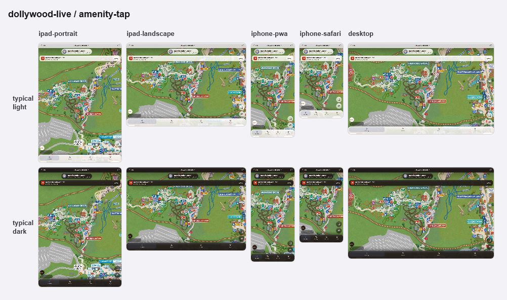

#### dollywood-live / coaster-card

Thunderhead's card → Track (#i-coast, :984): the build guide's coaster card (showCoaster :989-1003) — mapped track length, footprint, ground under the track, a track mini-map and a ground-elevation profile. liveCard (:1438) reshapes only listing cards, so this one arrives in the park map as the survey card. One state: nothing in it is app data.

States: typical · devices: desktop, ipad-landscape, ipad-portrait, iphone-pwa, iphone-safari · 10 files: `audits/screens/dollywood-live/coaster-card-<state>-<device>-<mode>.png`

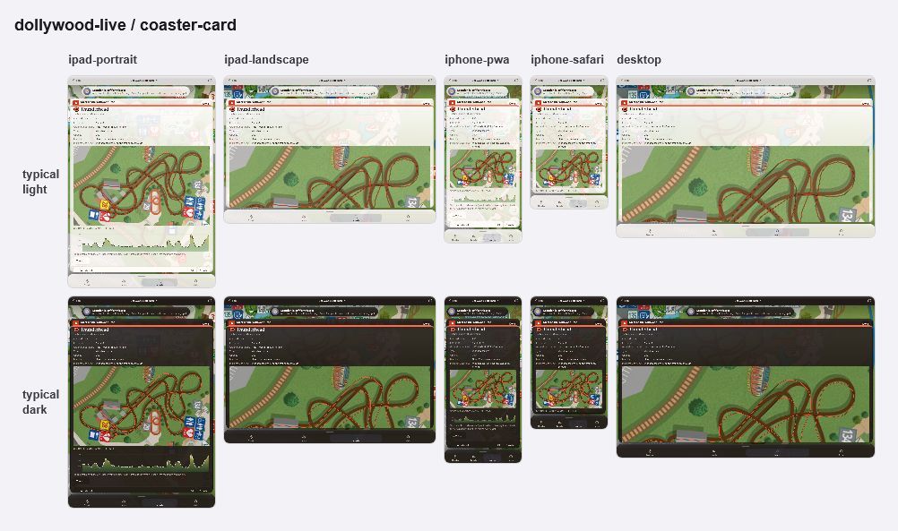

#### dollywood-live / dining-card

Spot placed, then Till & Harvest Food Hall (#144, dining) opened from Search: a listing card with no wait line and no who-can-ride row (both are ride-only). Shops use the same card.

States: typical · devices: desktop, ipad-landscape, ipad-portrait, iphone-pwa, iphone-safari · 10 files: `audits/screens/dollywood-live/dining-card-<state>-<device>-<mode>.png`

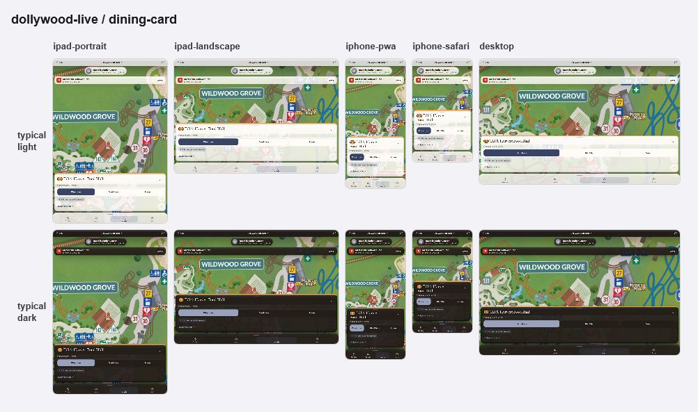

#### dollywood-live / directions-amenity

Nearby → Restroom chip: directions to the nearest restroom.

States: typical · devices: desktop, ipad-landscape, ipad-portrait, iphone-pwa, iphone-safari · 10 files: `audits/screens/dollywood-live/directions-amenity-<state>-<device>-<mode>.png`

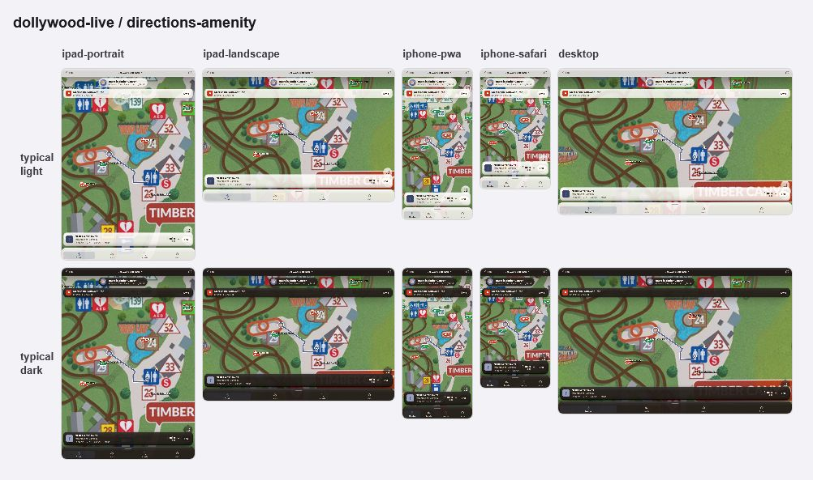

#### dollywood-live / directions

Meeting point → Go (from the fix of the meet capture): the walking route over the mapped paths, the bar with the first step, "then …", minutes and distance.

States: typical, overflow · devices: desktop, ipad-landscape, ipad-portrait, iphone-pwa, iphone-safari · 18 files: `audits/screens/dollywood-live/directions-<state>-<device>-<mode>.png`

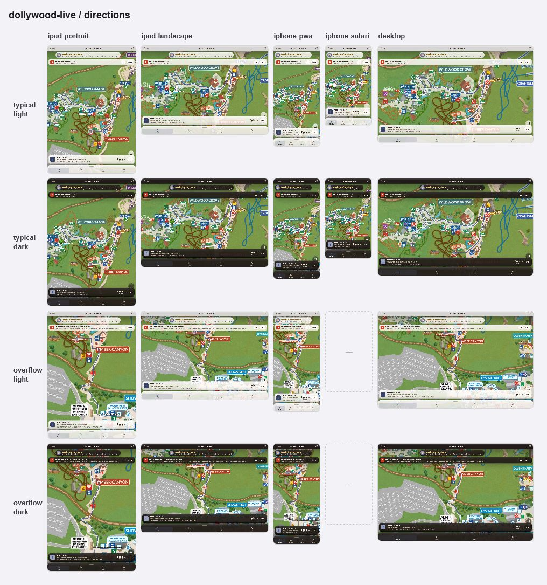

#### dollywood-live / directions-steps

Directions to Wild Eagle (#37) from its card, the bar tapped open: every step with its glyph and distance.

States: typical · devices: desktop, ipad-landscape, ipad-portrait, iphone-pwa, iphone-safari · 10 files: `audits/screens/dollywood-live/directions-steps-<state>-<device>-<mode>.png`

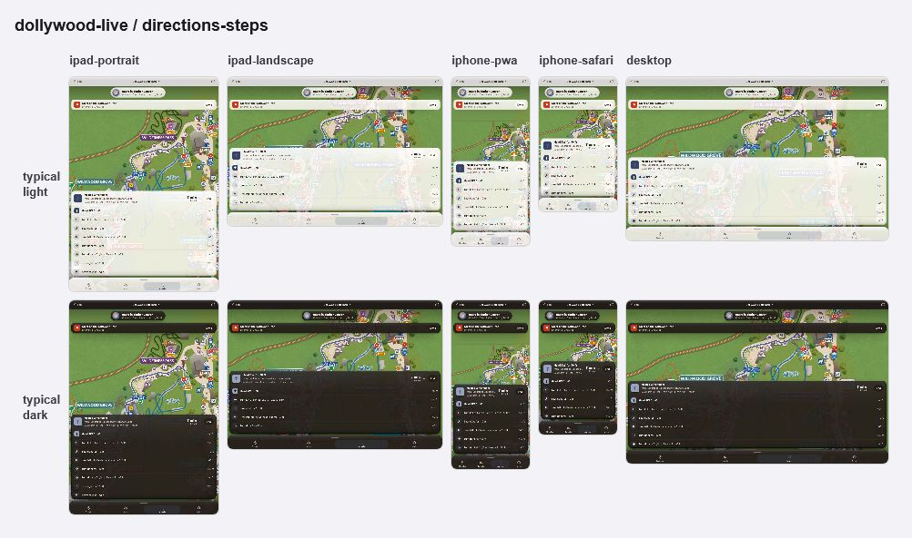

#### dollywood-live / directions-straight

Directions to Mystery Mine (#27), 140 m away: no connected mapped path, so the fallback — a dashed straight line and "Head SE straight toward…".

States: typical · devices: desktop, ipad-landscape, ipad-portrait, iphone-pwa, iphone-safari · 10 files: `audits/screens/dollywood-live/directions-straight-<state>-<device>-<mode>.png`

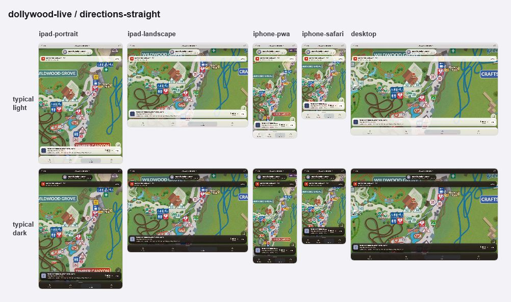

#### dollywood-live / family-card

Mae's row tapped: the map flies to her and opens her card (place, seen N min ago, accuracy).

States: typical, overflow · devices: desktop, ipad-landscape, ipad-portrait, iphone-pwa, iphone-safari · 18 files: `audits/screens/dollywood-live/family-card-<state>-<device>-<mode>.png`

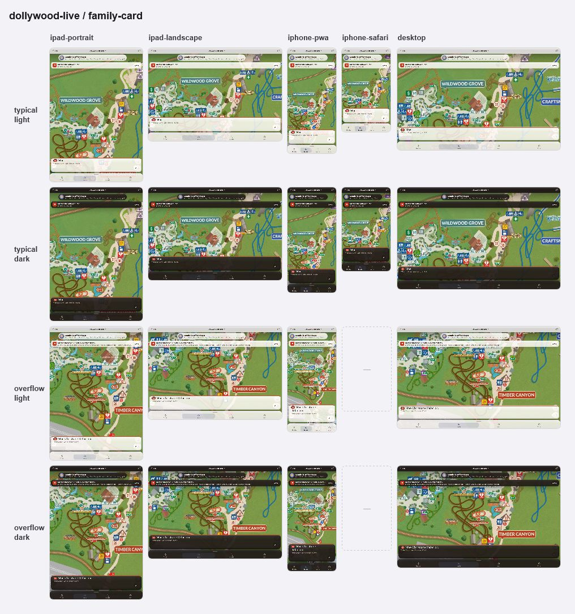

#### dollywood-live / family

Family pane (half sheet): Share my spot, Eli's own row, everyone sharing (place · seen N min ago), then Kids' beacons and Kids' heights further down. Empty: sharing off, "No one else is sharing right now" and no kids' sections at all (see family-kids). Loading: the family rows never arrive and the header already reads "offline — showing last known". Offline: the same header over the cached rows.

States: empty, typical, overflow, loading, offline · devices: desktop, ipad-landscape, ipad-portrait, iphone-pwa, iphone-safari · 42 files: `audits/screens/dollywood-live/family-<state>-<device>-<mode>.png`

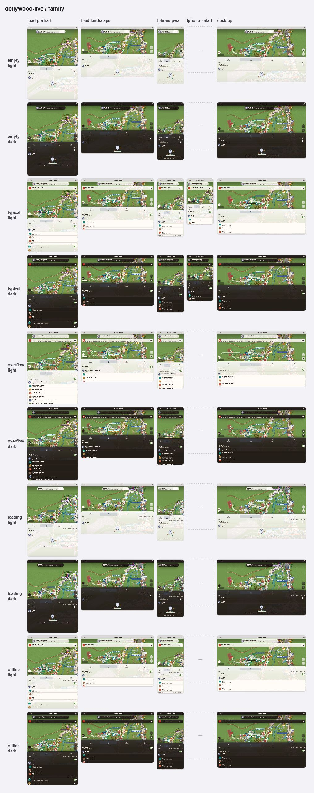

#### dollywood-live / family-guest

Grandma Jo (a guest) in the Family pane: the park map has no guest check, so a guest gets Share my spot, the kids' beacon switches and the height steppers like a household adult.

States: typical · devices: desktop, ipad-landscape, ipad-portrait, iphone-pwa, iphone-safari · 10 files: `audits/screens/dollywood-live/family-guest-<state>-<device>-<mode>.png`


#### dollywood-live / family-kids

The Family pane scrolled to the end: Kids' beacons (adults only) and the Kids' heights steppers. Empty: neither section is drawn — renderFam returns early when nobody else is sharing (:1304), before the beacons (:1307) and renderKids (:1309), so an adult cannot switch on a beacon or enter a height until someone shares (see observations).

States: empty, typical, overflow · devices: desktop, ipad-landscape, ipad-portrait, iphone-pwa, iphone-safari · 26 files: `audits/screens/dollywood-live/family-kids-<state>-<device>-<mode>.png`

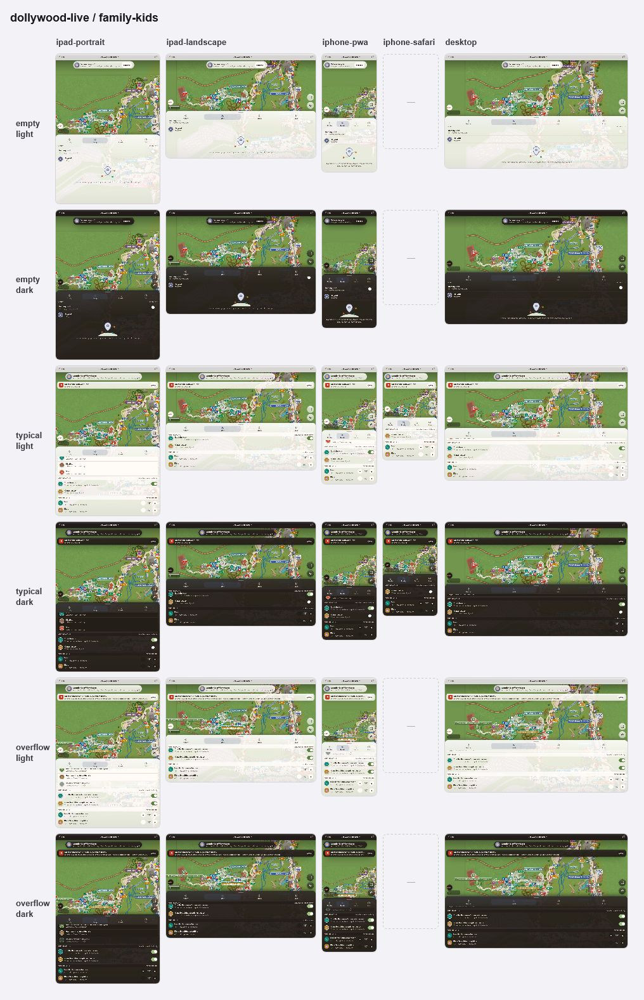

#### dollywood-live / kid

Ezra's map. Park day: his beacon is on (an adult switched it on), so he may locate and share — GPS starts and the rig denies it. Empty: no beacon → view-only ("Rides and the family, live · Ezra · just looking", no Find me). No loading: same as map/loading.

States: empty, typical, overflow, offline · devices: desktop, ipad-landscape, ipad-portrait, iphone-pwa, iphone-safari · 34 files: `audits/screens/dollywood-live/kid-<state>-<device>-<mode>.png`

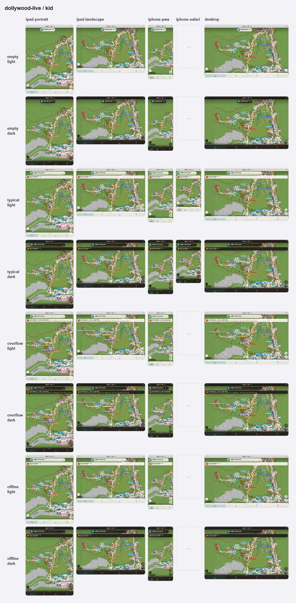

#### dollywood-live / kid-family

Ezra's Family pane: his beacon shows as Share my spot; no kids' beacons or heights (adults only).

States: typical, overflow · devices: desktop, ipad-landscape, ipad-portrait, iphone-pwa, iphone-safari · 18 files: `audits/screens/dollywood-live/kid-family-<state>-<device>-<mode>.png`

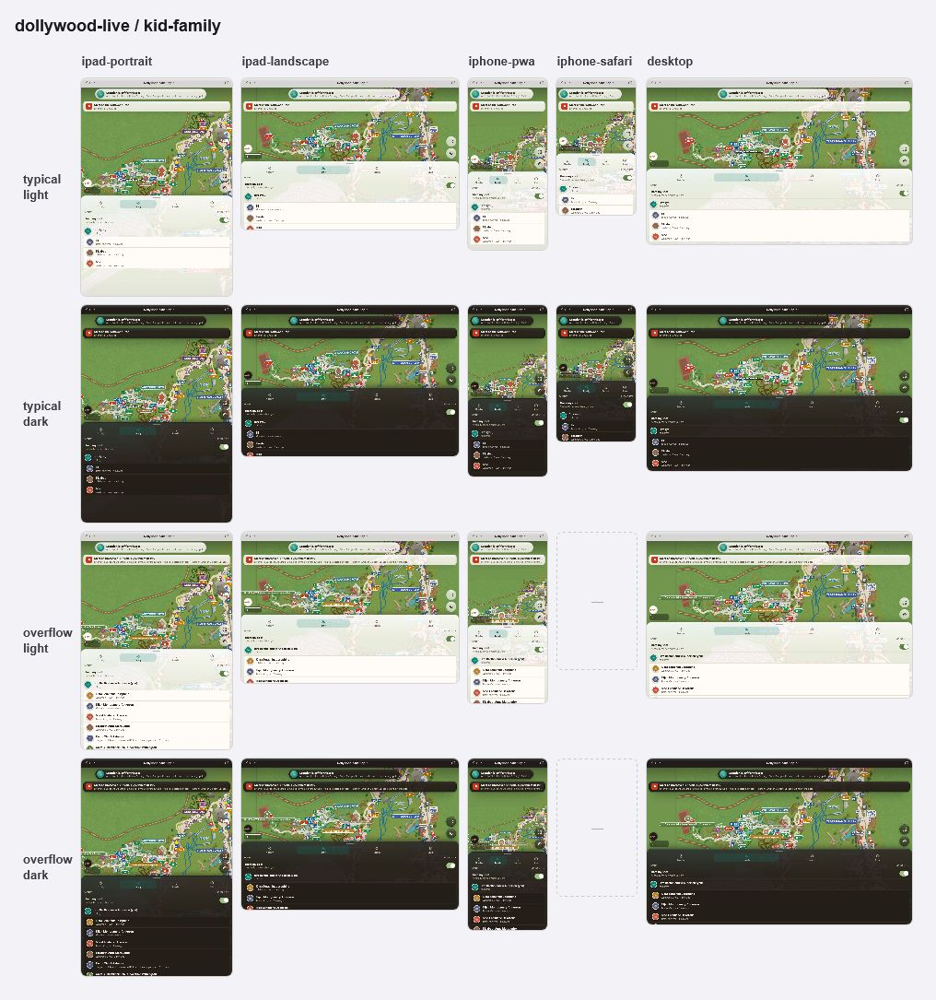

#### dollywood-live / kid-nearby

Kiara (view-only) opens Nearby: "Find yourself first: tap ◎, or use Set my spot" — but the ◎ button is hidden for her.

States: typical · devices: desktop, ipad-landscape, ipad-portrait, iphone-pwa, iphone-safari · 10 files: `audits/screens/dollywood-live/kid-nearby-<state>-<device>-<mode>.png`


#### dollywood-live / kid-viewonly

Kiara on the park day, beacon off: view-only — no Find me, idle pill "Kiara · just looking", the family and the meeting point visible.

States: typical · devices: desktop, ipad-landscape, ipad-portrait, iphone-pwa, iphone-safari · 10 files: `audits/screens/dollywood-live/kid-viewonly-<state>-<device>-<mode>.png`

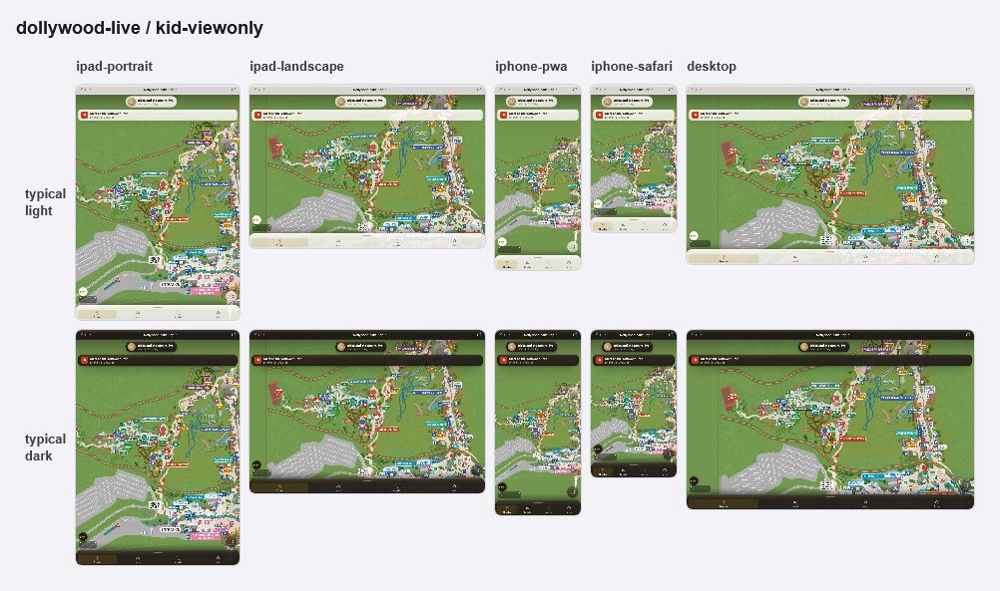

#### dollywood-live / map-arriving

Grandma Jo (not sharing, so no GPS starts) reopens the map a minute after a fix in the parking lots north of the mapped frame: the "arriving" pill ("At Dollywood — the parking lots", distance off the map and to the gates) and her dot at the frame's edge. Reached from a restored fix because the rig has no GPS; the out-of-frame branches of updLoc (:1270-1274) ignore staleness, so a live fix there shows the same pill.

States: typical · devices: desktop, ipad-landscape, ipad-portrait, iphone-pwa, iphone-safari · 10 files: `audits/screens/dollywood-live/map-arriving-<state>-<device>-<mode>.png`


#### dollywood-live / map-denied

The designed "denied" pill: after the GPS denial, Set my spot tapped and tapped again (cancel) re-runs updLoc (:1266), which only now shows "Location is off for this site" with its Set my spot chip. On first open the denial handler (:1404) writes the text but leaves the pill without the chip (see map/typical).

States: typical · devices: desktop, ipad-landscape, ipad-portrait, iphone-pwa, iphone-safari · 10 files: `audits/screens/dollywood-live/map-denied-<state>-<device>-<mode>.png`

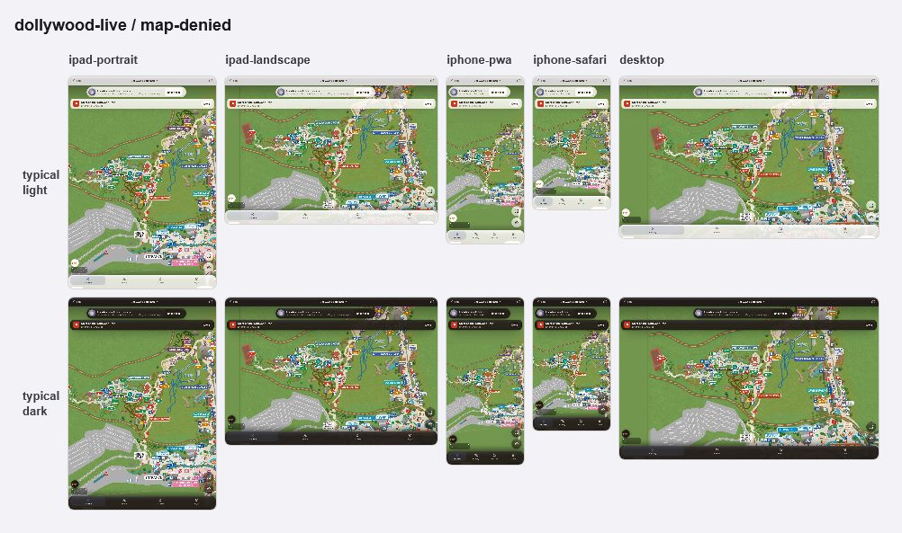

#### dollywood-live / map

Opening view, no fix. Park day (typical, overflow, offline): family markers, meeting-point bar; Eli shares his spot, so GPS starts and the rig's denial shows "Location is off for this site". Empty: idle pill "Where are you?" + Find me. Loading: map drawn, no family, no waits.

States: empty, typical, overflow, loading, offline · devices: desktop, ipad-landscape, ipad-portrait, iphone-pwa, iphone-safari · 42 files: `audits/screens/dollywood-live/map-<state>-<device>-<mode>.png`

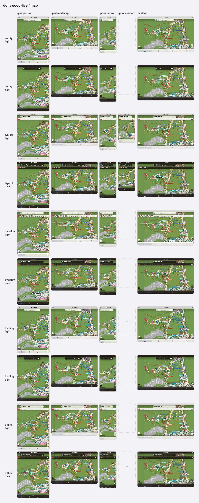

#### dollywood-live / map-far

David, at home on the family's park day (not sharing), opens the map to see where everyone is, with a fix from a few minutes ago, about eight miles away: the "far" pill ("N mi from the park · Dollywood is to your …"). Restored fix, as map-arriving.

States: typical · devices: desktop, ipad-landscape, ipad-portrait, iphone-pwa, iphone-safari · 10 files: `audits/screens/dollywood-live/map-far-<state>-<device>-<mode>.png`

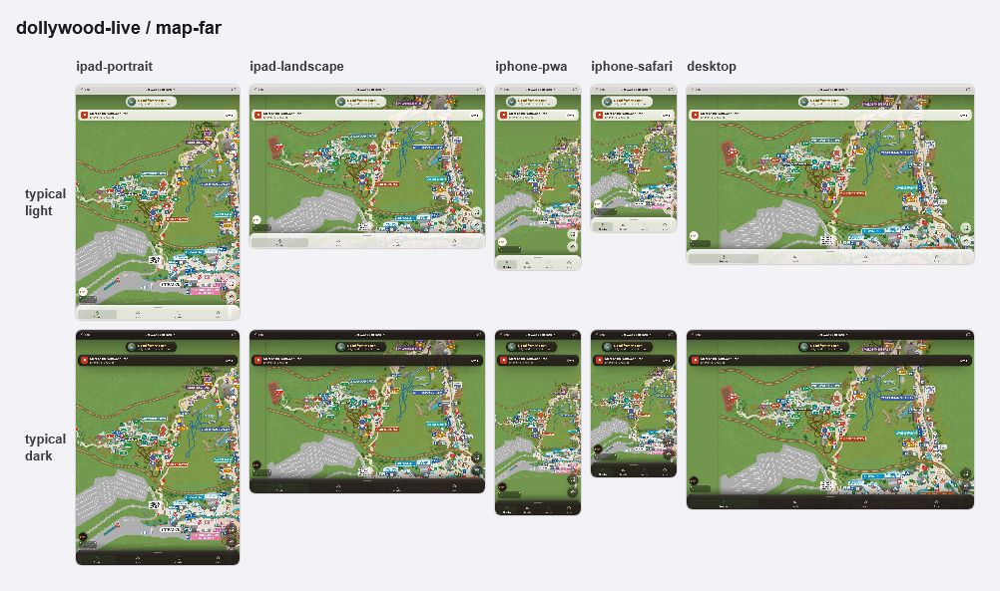

#### dollywood-live / map-restored

Grandma Jo (guest, not sharing, so no GPS starts on open) reopens the map 25 minutes after her last fix on this device (dollywood.live.last, :1478): the stale pill "Last seen 25 min ago" with Find me, her dot faded. (For anyone sharing, the rig's GPS denial overwrites this pill — see meet.)

States: typical · devices: desktop, ipad-landscape, ipad-portrait, iphone-pwa, iphone-safari · 10 files: `audits/screens/dollywood-live/map-restored-<state>-<device>-<mode>.png`

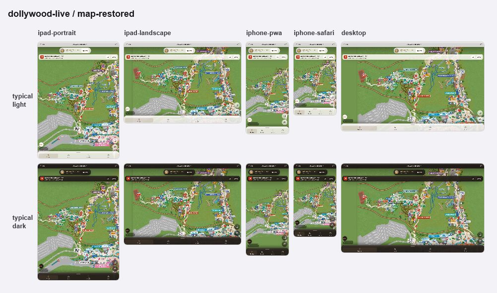

#### dollywood-live / map-satellite

Style → Satellite, sheet back to peek: the aerial photo (apps/dollywood/aerial.jpg, 1.6 MB, not precached) with paths and rides drawn on.

States: typical · devices: desktop, ipad-landscape, ipad-portrait, iphone-pwa, iphone-safari · 10 files: `audits/screens/dollywood-live/map-satellite-<state>-<device>-<mode>.png`

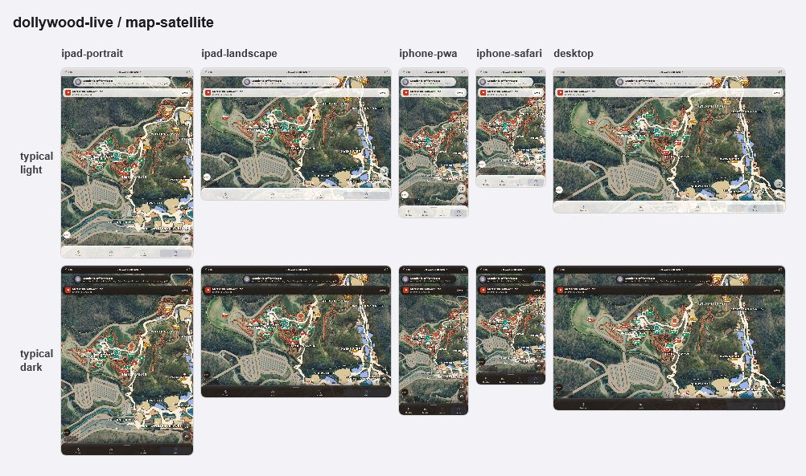

#### dollywood-live / map-spot

After Set my spot → I'm here: the good pill ("You're in Timber Canyon … placed by hand"), the area highlighted, Eli's dot. Typical and offline (the park day) carry ten minutes of breadcrumb trails. No loading: placing a spot is the same with or without data (see map/loading).

States: empty, typical, overflow, offline · devices: desktop, ipad-landscape, ipad-portrait, iphone-pwa, iphone-safari · 34 files: `audits/screens/dollywood-live/map-spot-<state>-<device>-<mode>.png`

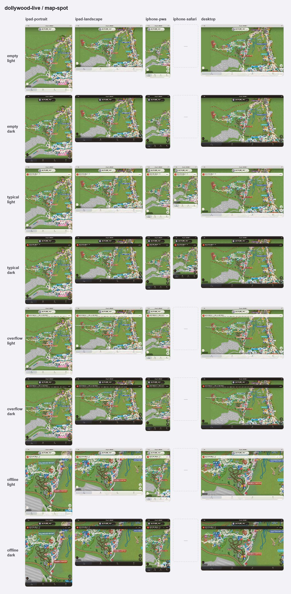

#### dollywood-live / meet

Eli with his fix from 2 minutes ago (restored on this device): the meeting-point bar shows the walk time, Go and Done (Done clears it after a confirm() the rig cannot show). The bar is only re-rendered on a family change, so a spot placed by hand does not add Go (see observations); hence the restored fix. The pill shows the rig's GPS denial. No empty/loading: no meeting point then (see map/empty).

States: typical, overflow, offline · devices: desktop, ipad-landscape, ipad-portrait, iphone-pwa, iphone-safari · 26 files: `audits/screens/dollywood-live/meet-<state>-<device>-<mode>.png`

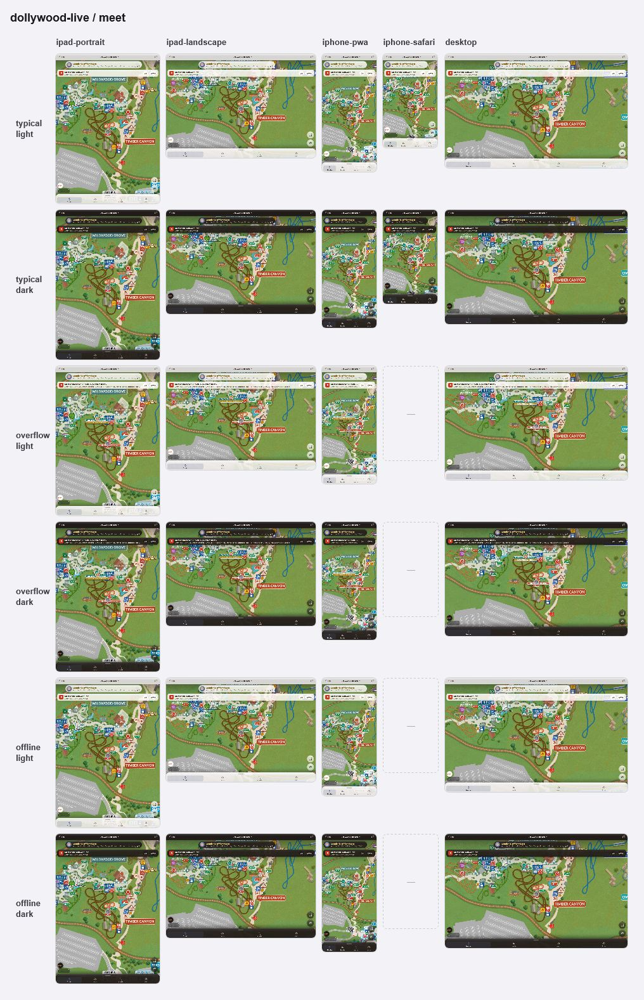

#### dollywood-live / nearby-arriving

The same arrival fix, Nearby open: "You're in the arrival area — the entrance is … away … Rides will list here once you're through the gates." (:1289).

States: typical · devices: desktop, ipad-landscape, ipad-portrait, iphone-pwa, iphone-safari · 10 files: `audits/screens/dollywood-live/nearby-arriving-<state>-<device>-<mode>.png`

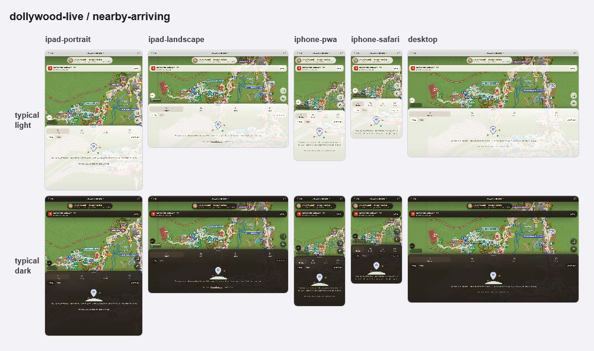

#### dollywood-live / nearby

Spot placed, Nearby open (half sheet): kid chips (with heights), the "Next ride · door to seat" card, amenity chips, the 12 nearest listings with wait chips. Loading: no waits → no hero card, no chips. Empty: no kids' heights on the chips.

States: empty, typical, overflow, loading, offline · devices: desktop, ipad-landscape, ipad-portrait, iphone-pwa, iphone-safari · 42 files: `audits/screens/dollywood-live/nearby-<state>-<device>-<mode>.png`

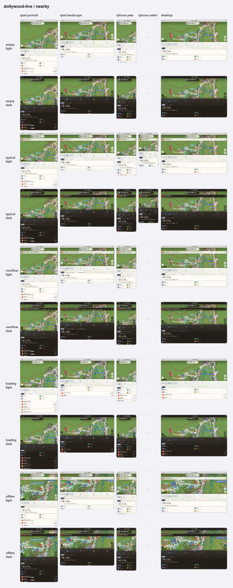

#### dollywood-live / nearby-far

The same far-away fix, Nearby open: "You are away from the park — rides will list here once you arrive." (:1290).

States: typical · devices: desktop, ipad-landscape, ipad-portrait, iphone-pwa, iphone-safari · 10 files: `audits/screens/dollywood-live/nearby-far-<state>-<device>-<mode>.png`


#### dollywood-live / nearby-nofix

Nearby before anyone has a spot: "Find yourself first: tap ◎, or use Set my spot."

States: typical · devices: desktop, ipad-landscape, ipad-portrait, iphone-pwa, iphone-safari · 10 files: `audits/screens/dollywood-live/nearby-nofix-<state>-<device>-<mode>.png`


#### dollywood-live / nearby-scrolled

Nearby scrolled to the end of the list: the last listings and the Queue-Times credit line.

States: typical · devices: desktop, ipad-landscape, ipad-portrait, iphone-pwa, iphone-safari · 10 files: `audits/screens/dollywood-live/nearby-scrolled-<state>-<device>-<mode>.png`

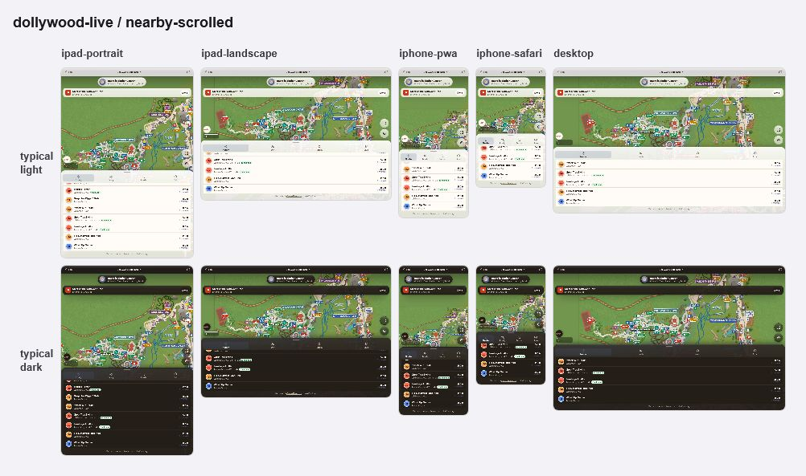

#### dollywood-live / north-up

The compass button tapped (:1467): it toggles the build guide's l-upright layer switch. The capture shows what a person gets: the view jumps from Timber Canyon (where the family is) to the Entrance and parking area at a closer zoom, with no visible change of orientation and the compass glyph re-rotated (see observations).

States: typical · devices: desktop, ipad-landscape, ipad-portrait, iphone-pwa, iphone-safari · 10 files: `audits/screens/dollywood-live/north-up-<state>-<device>-<mode>.png`

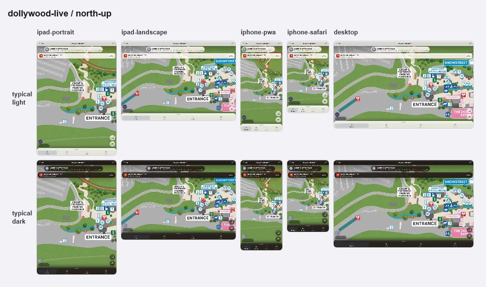

#### dollywood-live / placing

Set my spot tapped: crosshair in the middle, pill "Line up the crosshair on you — then tap I'm here". One state: nothing in it depends on data.

States: typical · devices: desktop, ipad-landscape, ipad-portrait, iphone-pwa, iphone-safari · 10 files: `audits/screens/dollywood-live/placing-<state>-<device>-<mode>.png`

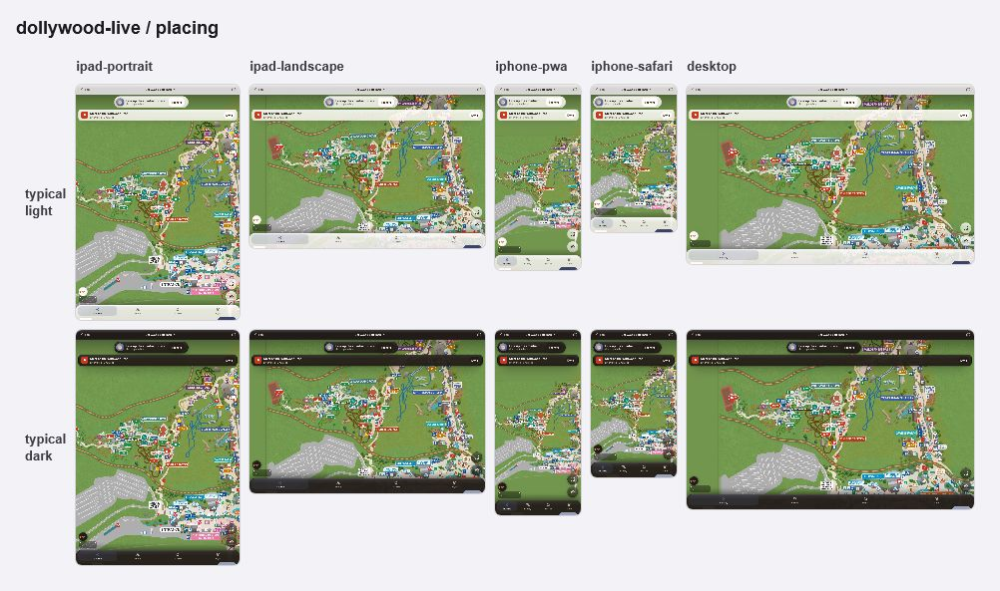

#### dollywood-live / ride-card-closed

Blazing Fury (#46), closed this morning: the grey "Closed" line on its card.

States: typical · devices: desktop, ipad-landscape, ipad-portrait, iphone-pwa, iphone-safari · 10 files: `audits/screens/dollywood-live/ride-card-closed-<state>-<device>-<mode>.png`

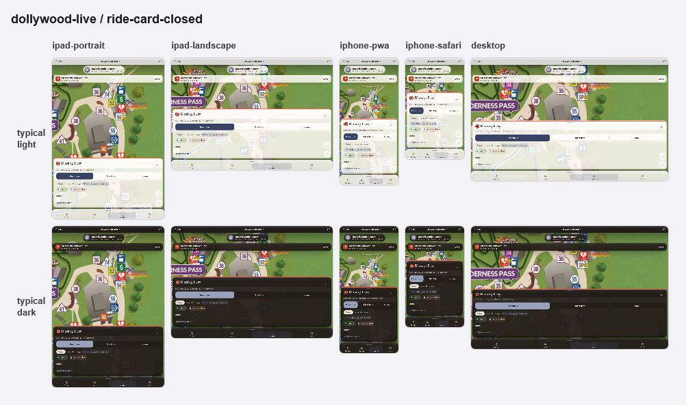

#### dollywood-live / ride-card

Spot placed, then Thunderhead (#28) opened from Search: category band, Directions / Meet here / Zoom / Track, who can ride (Ezra 43" and Kiara 40" vs 48"), the wait + distance line, About. Empty: "height?" for each kid. Loading: no wait line.

States: empty, typical, overflow, loading, offline · devices: desktop, ipad-landscape, ipad-portrait, iphone-pwa, iphone-safari · 42 files: `audits/screens/dollywood-live/ride-card-<state>-<device>-<mode>.png`

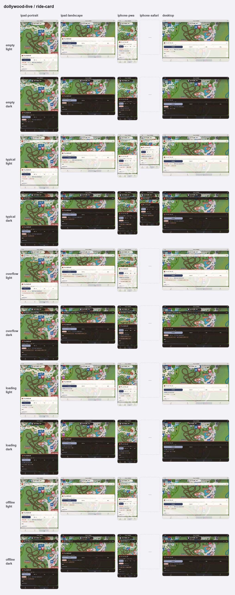

#### dollywood-live / ride-card-kid

Kiara (kid, beacon off → view-only) opens The Mad Mockingbird (#137): no Meet here, no web link; Directions still offered though a view-only kid can never get a spot.

States: typical · devices: desktop, ipad-landscape, ipad-portrait, iphone-pwa, iphone-safari · 10 files: `audits/screens/dollywood-live/ride-card-kid-<state>-<device>-<mode>.png`

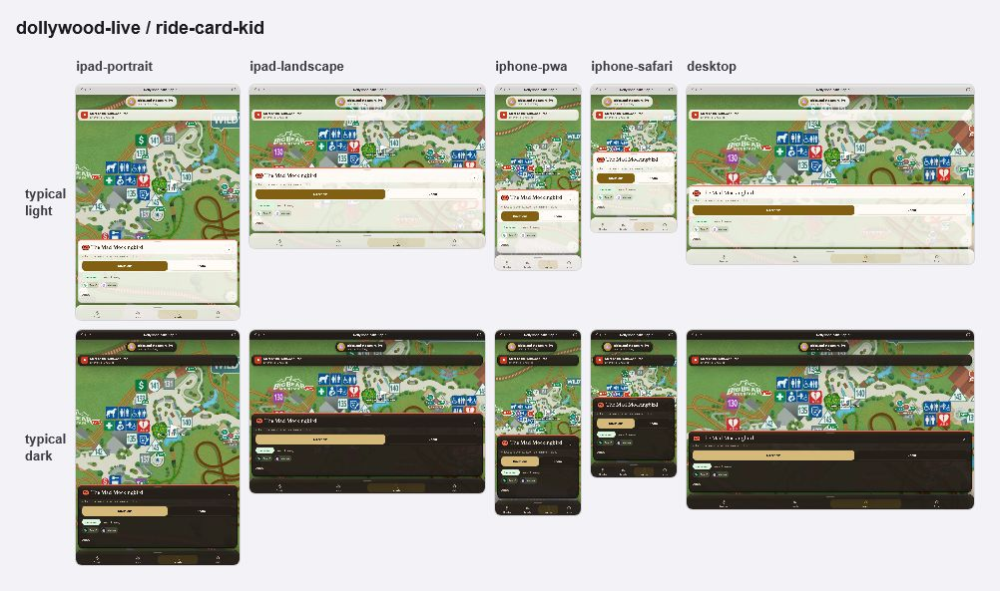

#### dollywood-live / search-full

The sheet at full height (handle tapped from half, :1471) on the Search pane: how much of the map stays visible above the tallest sheet state.

States: typical · devices: desktop, ipad-landscape, ipad-portrait, iphone-pwa, iphone-safari · 10 files: `audits/screens/dollywood-live/search-full-<state>-<device>-<mode>.png`

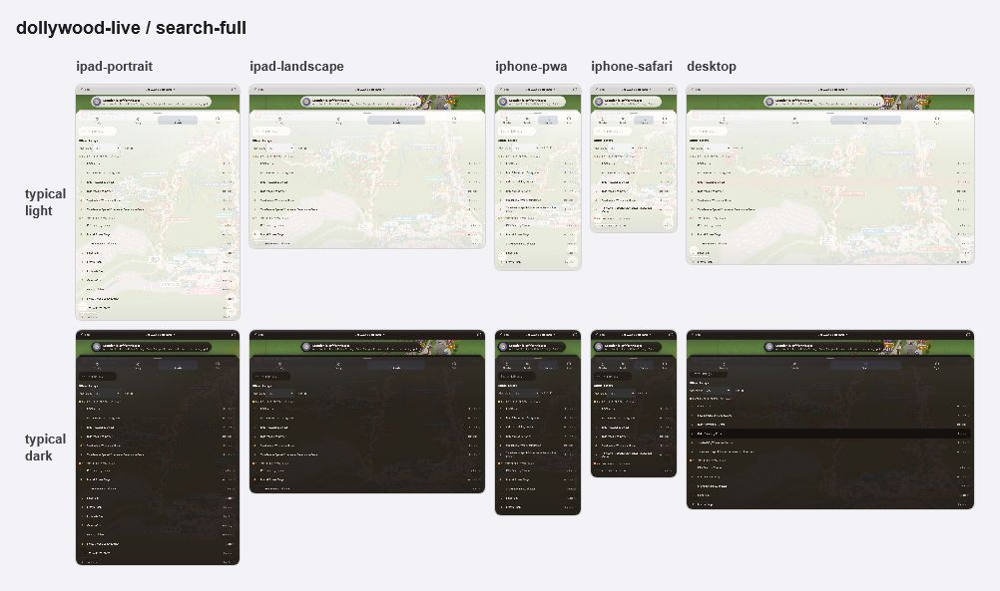

#### dollywood-live / search-none

A search with no match ("zipline"): "0 of 145" and no empty-state message.

States: typical · devices: desktop, ipad-landscape, ipad-portrait, iphone-pwa, iphone-safari · 10 files: `audits/screens/dollywood-live/search-none-<state>-<device>-<mode>.png`

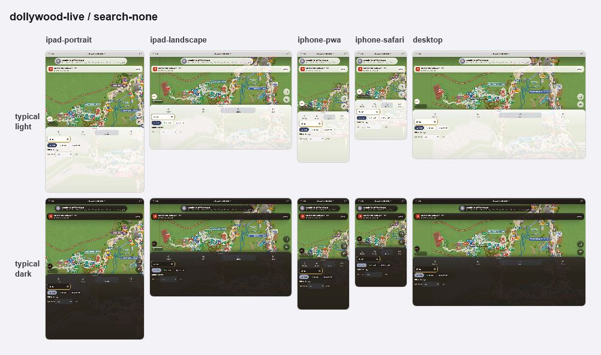

#### dollywood-live / search-query

"wild" typed: the list filters as you type (5 of 145), the kid chips appear, and rides carry their wait chip (Wild Eagle "35 min wait"). Loading: the same results without wait chips. No empty/overflow/offline: the listings are the page's own data and the waits the public feed (offline shows the cached chips, as typical).

States: typical, loading · devices: desktop, ipad-landscape, ipad-portrait, iphone-pwa, iphone-safari · 18 files: `audits/screens/dollywood-live/search-query-<state>-<device>-<mode>.png`

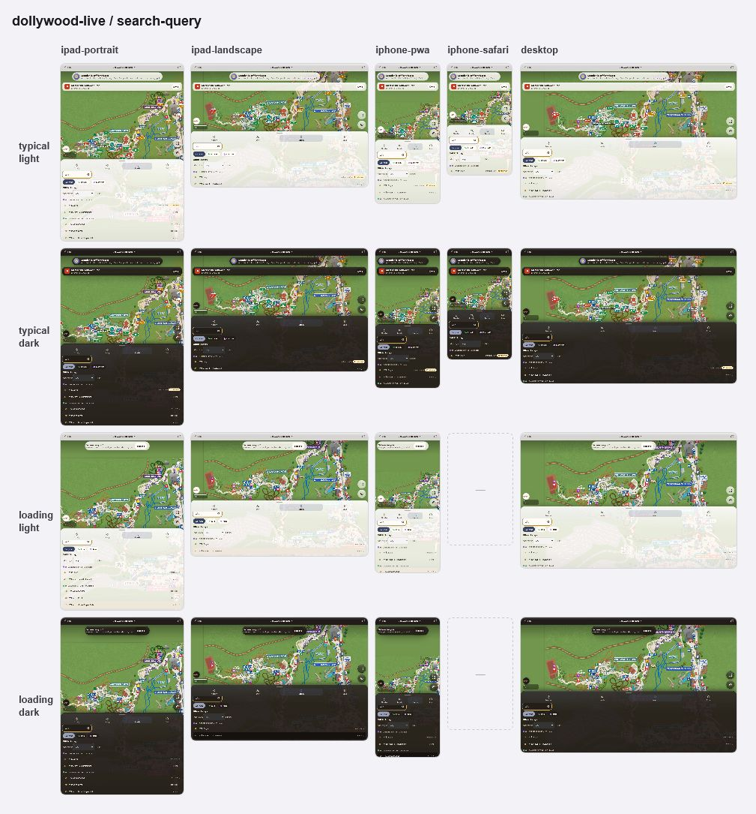

#### dollywood-live / search

Search pane before typing: the build guide's listings panel moved into the sheet (:1463) — a short search field, "Official listings", the rider-height select, "145 of 145", then every listing by area with the guide's "N/N placed" counts and category tags. Kid chips and wait chips appear only once a query is typed (search-query). Typical only: the pane is the page's own data, so empty/overflow/loading/offline change nothing in it, only the map behind it (see map/*).

States: typical · devices: desktop, ipad-landscape, ipad-portrait, iphone-pwa, iphone-safari · 10 files: `audits/screens/dollywood-live/search-<state>-<device>-<mode>.png`

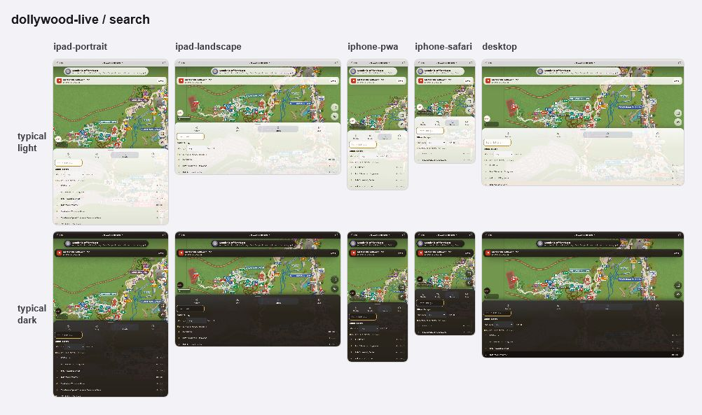

#### dollywood-live / style-scrolled

The Style pane scrolled to the end: the layer toggles and "About the data".

States: typical · devices: desktop, ipad-landscape, ipad-portrait, iphone-pwa, iphone-safari · 10 files: `audits/screens/dollywood-live/style-scrolled-<state>-<device>-<mode>.png`

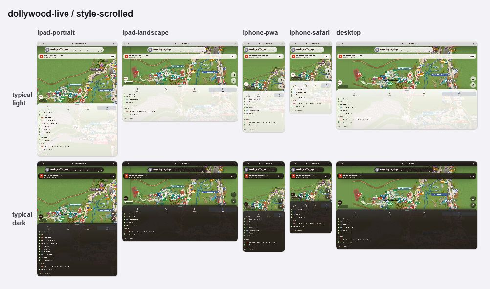

#### dollywood-live / style

Style pane: Illustrated | Satellite, "Contour interval (satellite)" and the build guide's Layers tab moved in (:1464). No data in it, so one state.

States: typical · devices: desktop, ipad-landscape, ipad-portrait, iphone-pwa, iphone-safari · 10 files: `audits/screens/dollywood-live/style-<state>-<device>-<mode>.png`

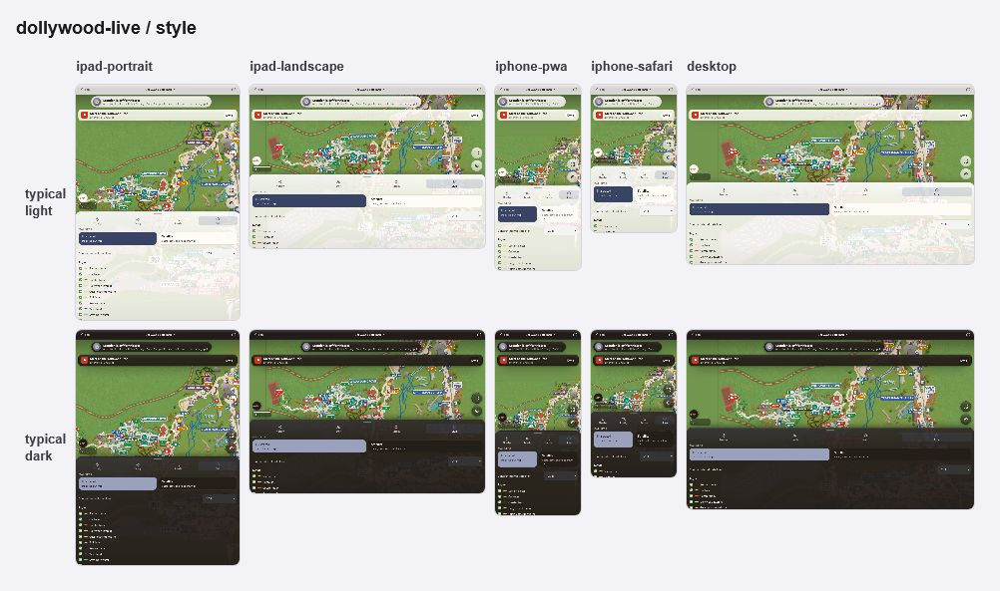

#### dollywood-live / waits

Nearby → Waits with a spot placed: banded by wait (under 15 / 15–35 / 35+ / Closed), Shortest wait | Near me. Loading: "Loading wait times…". Offline: the cached waits under "⚠ Waits as of 8:40 AM — offline, retrying". Error: the waits call answers 502 (queue-times down) → "Could not reach the wait-time feed". No empty: waits are the public feed, not app data (empty only drops the heights from the kid chips — see nearby/empty).

States: typical, overflow, loading, offline, error · devices: desktop, ipad-landscape, ipad-portrait, iphone-pwa, iphone-safari · 44 files: `audits/screens/dollywood-live/waits-<state>-<device>-<mode>.png`

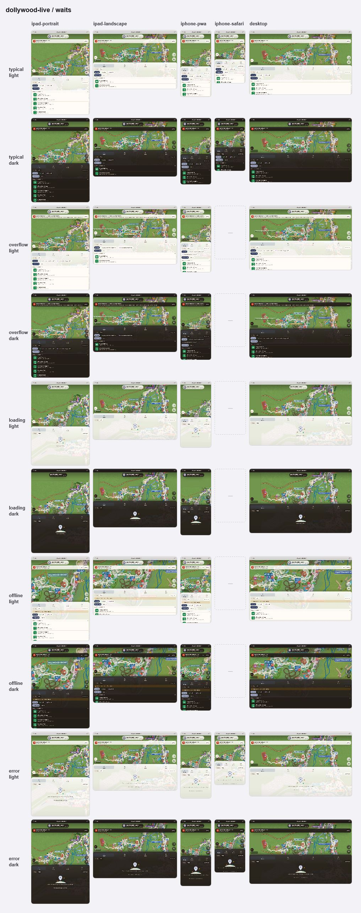

Console errors seen: `error: Failed to load resource: the server responded with a status of 502 (Bad Gateway)`

#### dollywood-live / waits-kid

Waits filtered for Ezra (43"), the "35 min and up" band scrolled to the top of the sheet: rides he is too short for are faded (Thunderhead and Lightning Rod, 48"; the Waits rows carry no "needs 48"" chip — only Nearby and Search rows do, :1292, :1452), and the chip row that says the filter is on has scrolled away; the choice is kept per device (dollywood.live.who).

States: typical, overflow · devices: desktop, ipad-landscape, ipad-portrait, iphone-pwa, iphone-safari · 18 files: `audits/screens/dollywood-live/waits-kid-<state>-<device>-<mode>.png`

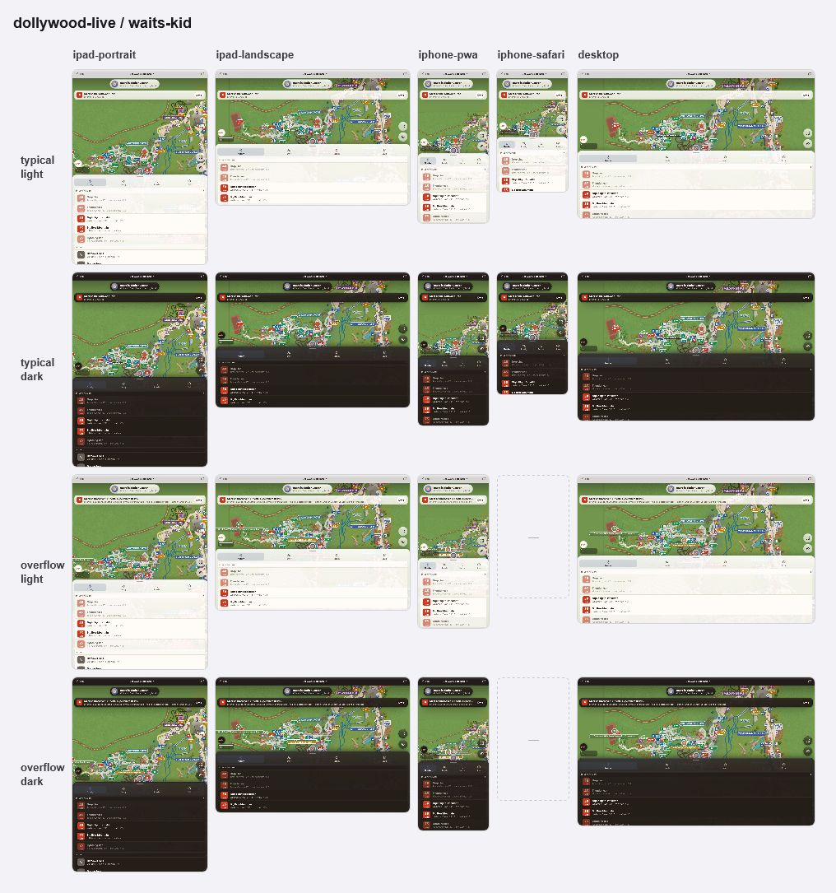

#### dollywood-live / waits-park-closed

Every ride posted closed (the feed before opening or after close): parkClosed() (:1506) drops every wait chip from the map and Waits says "The park is closed — waits will show here once rides open." (:1526). Made by answering the waits call with the seed's rides, all closed, in the Worker's shape (worker/src/index.js:71-76).

States: typical · devices: desktop, ipad-landscape, ipad-portrait, iphone-pwa, iphone-safari · 10 files: `audits/screens/dollywood-live/waits-park-closed-<state>-<device>-<mode>.png`

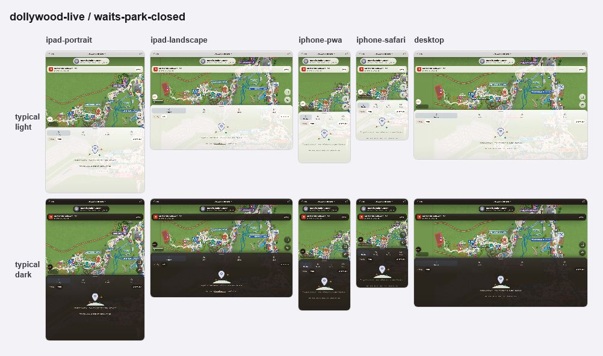

#### dollywood-live / waits-scrolled

The Waits list scrolled to the end: the 35-min-and-up band, Closed rides and the credit line.

States: typical · devices: desktop, ipad-landscape, ipad-portrait, iphone-pwa, iphone-safari · 10 files: `audits/screens/dollywood-live/waits-scrolled-<state>-<device>-<mode>.png`

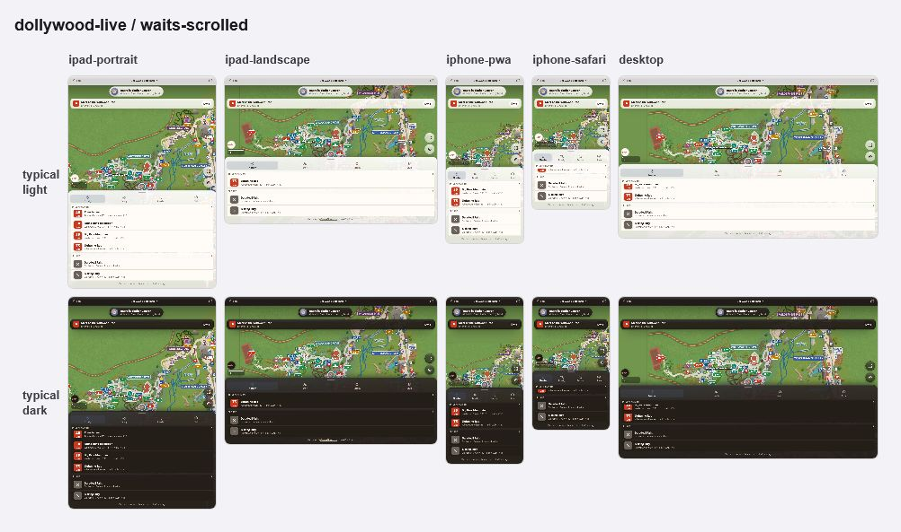

#### dollywood-live / whole-park

Whole park (the corner-brackets button, :1466): the fit-all view of the property, parking lots included, family markers and the meeting-point flag at that scale.

States: typical · devices: desktop, ipad-landscape, ipad-portrait, iphone-pwa, iphone-safari · 10 files: `audits/screens/dollywood-live/whole-park-<state>-<device>-<mode>.png`

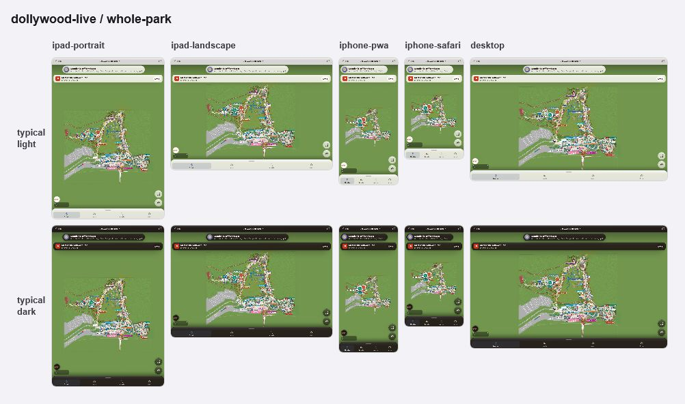

### dollywood

#### dollywood / about

Layers tab with the "About the data" disclosure opened (a native <details>, :665): the sources and caveats notes, scrolled to. Drawn from the page payload only (no person data), so empty/overflow look the same as typical; loading/offline change nothing on this view.

States: typical · devices: desktop, ipad-landscape, ipad-portrait, iphone-pwa, iphone-safari · 10 files: `audits/screens/dollywood/about-<state>-<device>-<mode>.png`

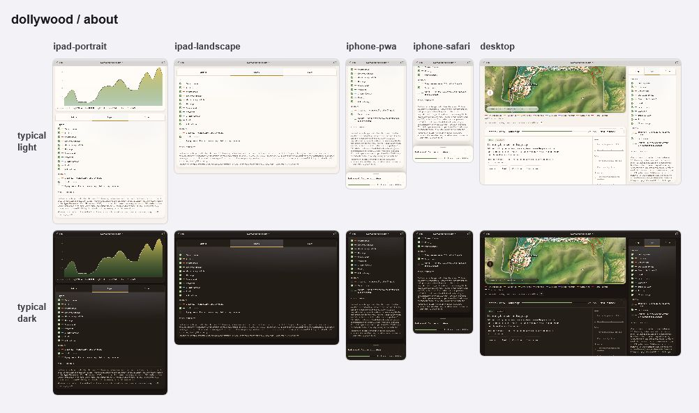

#### dollywood / aerial-mix

Basemap "Aerial + shading" (#bmap value mix, :596): the aerial photo blended with the terrain shading. Drawn from the page payload only (no person data), so empty/overflow look the same as typical; loading/offline change nothing on this view.

States: typical · devices: desktop, ipad-landscape, ipad-portrait, iphone-pwa, iphone-safari · 10 files: `audits/screens/dollywood/aerial-mix-<state>-<device>-<mode>.png`

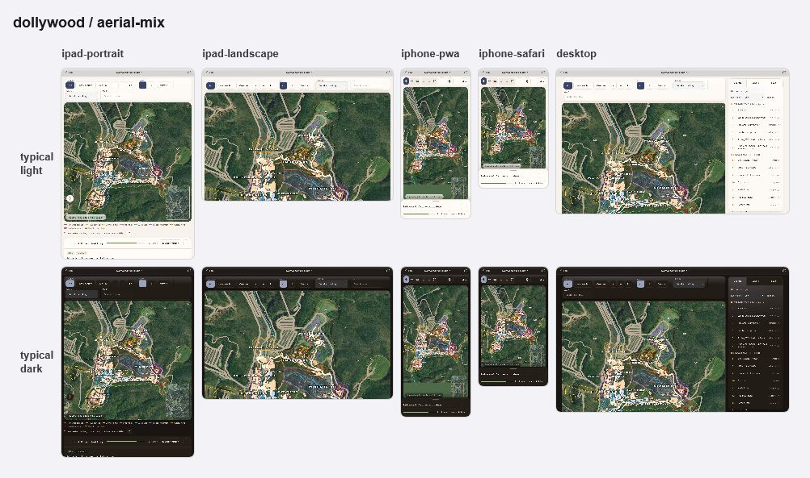

#### dollywood / aerial

Basemap "Aerial photo" (1.6 MB, not precached). Drawn from the page payload only (no person data), so empty/overflow look the same as typical; loading/offline change nothing on this view.

States: typical · devices: desktop, ipad-landscape, ipad-portrait, iphone-pwa, iphone-safari · 10 files: `audits/screens/dollywood/aerial-<state>-<device>-<mode>.png`

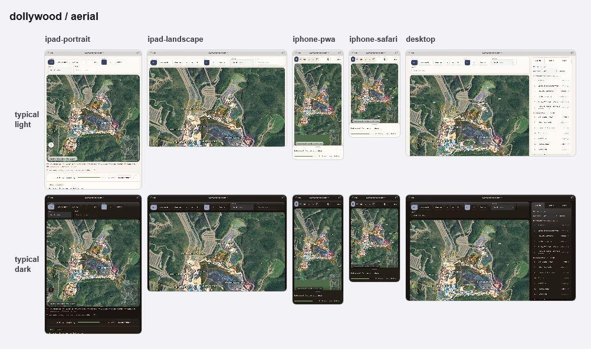

#### dollywood / building

Country Fair chip, then an unlisted 62 x 19 m building footprint (OSM building 13, clear of tracks and markers) tapped: the "Unlisted structure" card. Drawn from the page payload, except the in-game sizes, which use Eli's plot width (person 'plot'): typical 400 m (x0.44), overflow 12500 m (x13.6, four- and five-digit figures), empty none (the in-game figures disappear). Loading/offline: as empty/typical.

States: empty, typical, overflow · devices: desktop, ipad-landscape, ipad-portrait, iphone-pwa, iphone-safari · 26 files: `audits/screens/dollywood/building-<state>-<device>-<mode>.png`

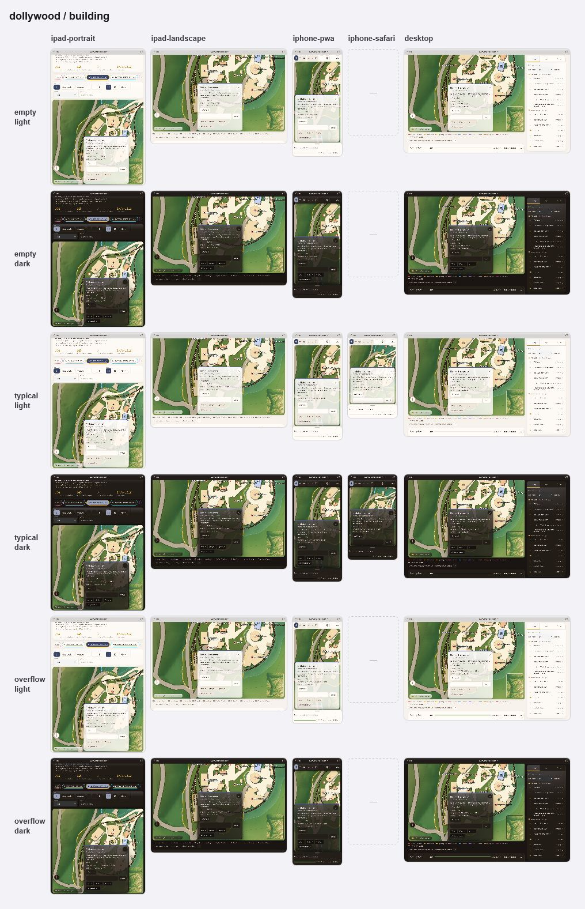

#### dollywood / coaster

From the Thunderhead listing card, "Track & profile": the coaster card with the track and the ground profile. Drawn from the page payload, except the in-game sizes, which use Eli's plot width (person 'plot'): typical 400 m (x0.44), overflow 12500 m (x13.6, four- and five-digit figures), empty none (the in-game figures disappear). Loading/offline: as empty/typical.

States: empty, typical, overflow · devices: desktop, ipad-landscape, ipad-portrait, iphone-pwa, iphone-safari · 26 files: `audits/screens/dollywood/coaster-<state>-<device>-<mode>.png`

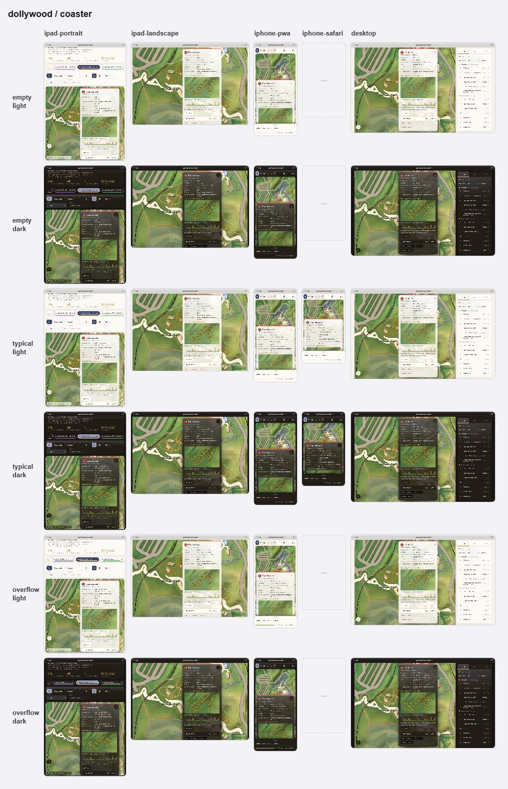

#### dollywood / cross-section-compare

Compare mode of the profile (:944, :954): Compare tapped on the boot profile (Whole park, west to east), which stays as a grey ghost and the button turns into "Clear ghost"; then the same cut as cross-section, drawn over the ghost, with the "ghost" stat in the stats row. Only typical: the plot-width states are shown on cross-section. Drawn from the page payload, except the in-game sizes, which use Eli's plot width (person 'plot'): typical 400 m (x0.44), overflow 12500 m (x13.6, four- and five-digit figures), empty none (the in-game figures disappear). Loading/offline: as empty/typical.

States: typical · devices: desktop, ipad-landscape, ipad-portrait, iphone-pwa, iphone-safari · 10 files: `audits/screens/dollywood/cross-section-compare-<state>-<device>-<mode>.png`

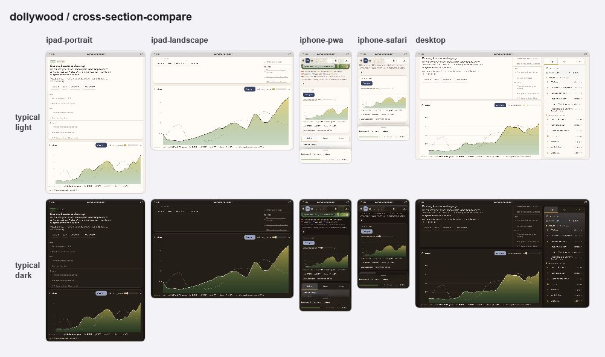

#### dollywood / cross-section-cut

The same cut as cross-section, left where the person is when they finish it: the map with the cut line drawn. Below 1180 px the profile it produced is out of sight, under the legend and the build card (phones: under the sheet). Drawn from the page payload only (no person data), so empty/overflow look the same as typical; loading/offline change nothing on this view.

States: typical · devices: desktop, ipad-landscape, ipad-portrait, iphone-pwa, iphone-safari · 10 files: `audits/screens/dollywood/cross-section-cut-<state>-<device>-<mode>.png`

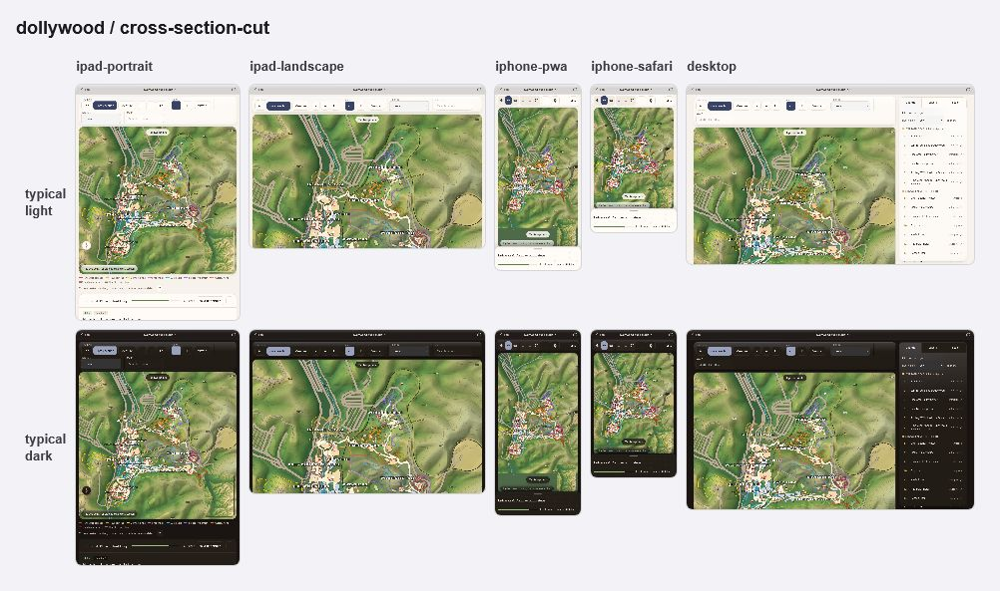

#### dollywood / cross-section

Cross-section tool on, a cut tapped across the map, then the profile panel (scrolled to; on phones centred above the peeking sheet). The only person data is the in-game length in the stats row. Drawn from the page payload, except the in-game sizes, which use Eli's plot width (person 'plot'): typical 400 m (x0.44), overflow 12500 m (x13.6, four- and five-digit figures), empty none (the in-game figures disappear). Loading/offline: as empty/typical.

States: typical, overflow · devices: desktop, ipad-landscape, ipad-portrait, iphone-pwa, iphone-safari · 18 files: `audits/screens/dollywood/cross-section-<state>-<device>-<mode>.png`

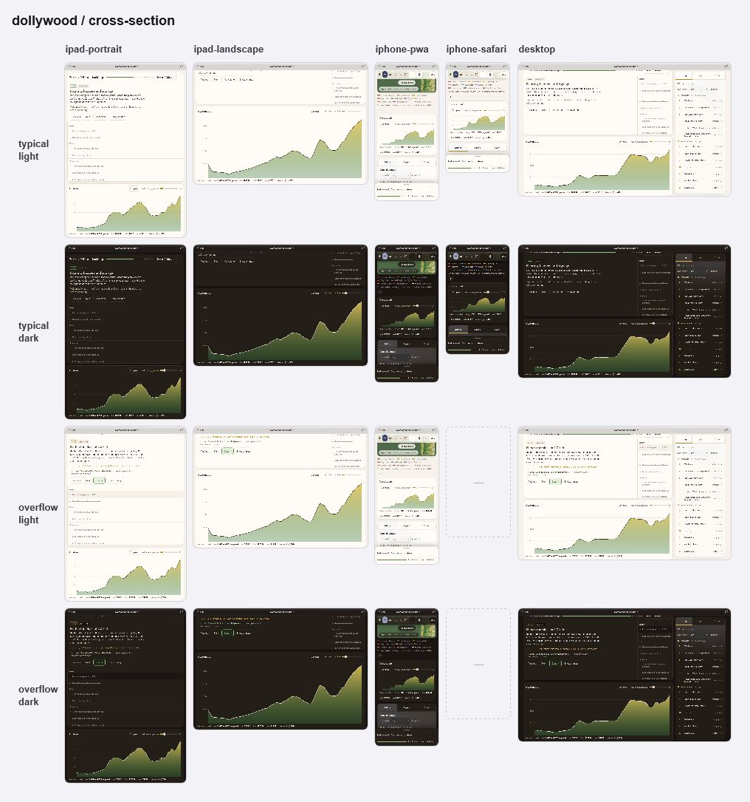

#### dollywood / help

The "?" keyboard-shortcuts popover under the map (offered on touch devices too). Drawn from the page payload only (no person data), so empty/overflow look the same as typical; loading/offline change nothing on this view.

States: typical · devices: desktop, ipad-landscape, ipad-portrait, iphone-pwa, iphone-safari · 10 files: `audits/screens/dollywood/help-<state>-<device>-<mode>.png`

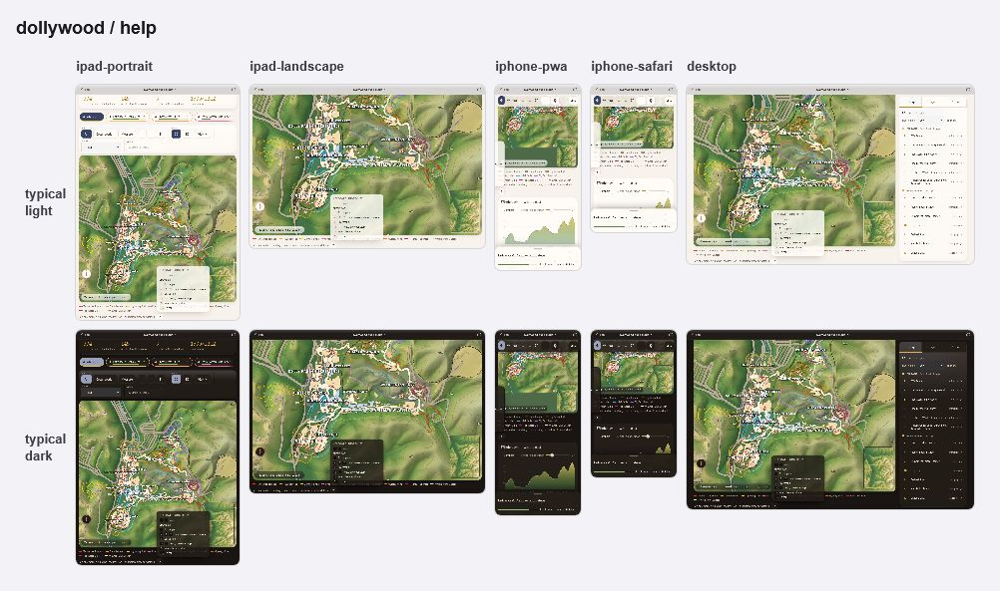

#### dollywood / illustrated

Basemap "Park map (illustrated)": the official park sheet warped into the frame. Drawn from the page payload only (no person data), so empty/overflow look the same as typical; loading/offline change nothing on this view.

States: typical · devices: desktop, ipad-landscape, ipad-portrait, iphone-pwa, iphone-safari · 10 files: `audits/screens/dollywood/illustrated-<state>-<device>-<mode>.png`

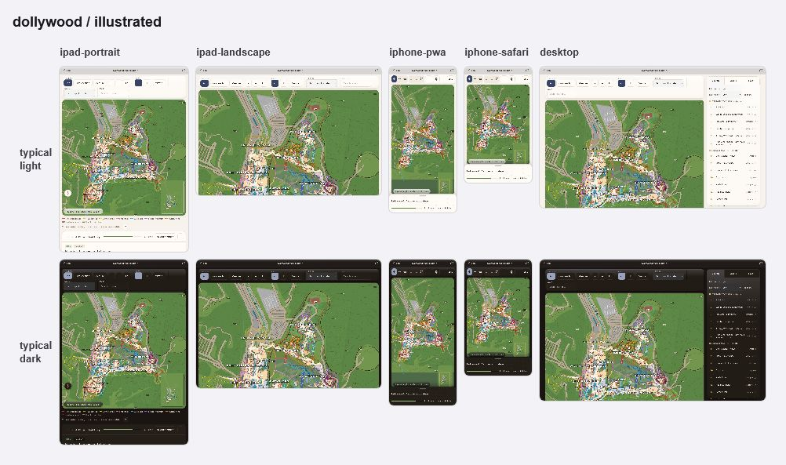

#### dollywood / layers

Side panel, Layers tab: map layer toggles, terrain options, "About the data". Drawn from the page payload only (no person data), so empty/overflow look the same as typical; loading/offline change nothing on this view.

States: typical · devices: desktop, ipad-landscape, ipad-portrait, iphone-pwa, iphone-safari · 10 files: `audits/screens/dollywood/layers-<state>-<device>-<mode>.png`

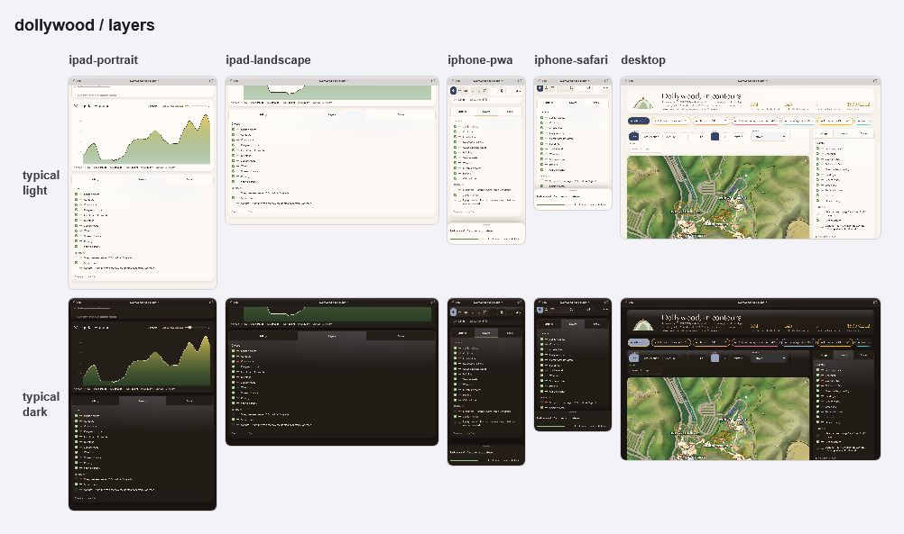

#### dollywood / listing

Timber Canyon chip, then the Thunderhead (#28) marker tapped on the map: the listing card. Drawn from the page payload only (no person data), so empty/overflow look the same as typical; loading/offline change nothing on this view.

States: typical · devices: desktop, ipad-landscape, ipad-portrait, iphone-pwa, iphone-safari · 10 files: `audits/screens/dollywood/listing-<state>-<device>-<mode>.png`

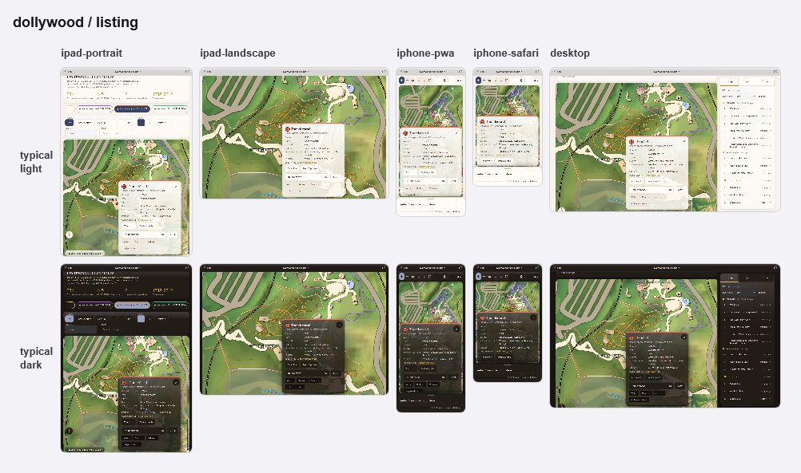

#### dollywood / listings-height

Listings tab with the rider-height filter set to "up to 36"" (#hf, :1012; the list re-renders on change): what a parent checks for a small rider. Drawn from the page payload only (no person data), so empty/overflow look the same as typical; loading/offline change nothing on this view.

States: typical · devices: desktop, ipad-landscape, ipad-portrait, iphone-pwa, iphone-safari · 10 files: `audits/screens/dollywood/listings-height-<state>-<device>-<mode>.png`

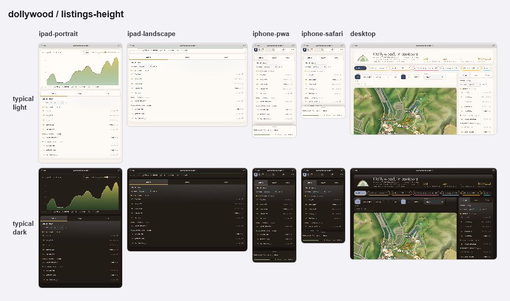

#### dollywood / listings

Side panel, Listings tab (the default): the 145 official listings by section with the rider-height filter. Drawn from the page payload only (no person data), so empty/overflow look the same as typical; loading/offline change nothing on this view.

States: typical · devices: desktop, ipad-landscape, ipad-portrait, iphone-pwa, iphone-safari · 10 files: `audits/screens/dollywood/listings-<state>-<device>-<mode>.png`

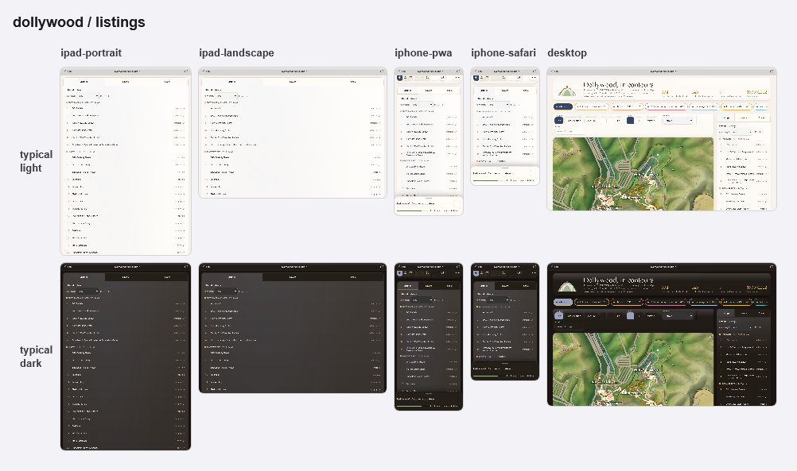

#### dollywood / map

Default view: header, section chips with per-section progress, tool bar, whole-park terrain map (phones: build sheet peeking). Loading = no progress yet (0/N everywhere).

States: empty, typical, overflow, loading, offline · devices: desktop, ipad-landscape, ipad-portrait, iphone-pwa, iphone-safari · 42 files: `audits/screens/dollywood/map-<state>-<device>-<mode>.png`

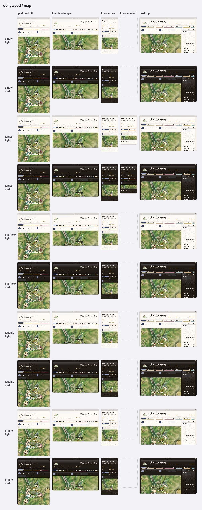

#### dollywood / measure

Measure tool on, two points tapped: the distance line and its label on the map (the label adds the in-game distance). Drawn from the page payload, except the in-game sizes, which use Eli's plot width (person 'plot'): typical 400 m (x0.44), overflow 12500 m (x13.6, four- and five-digit figures), empty none (the in-game figures disappear). Loading/offline: as empty/typical.

States: typical, overflow · devices: desktop, ipad-landscape, ipad-portrait, iphone-pwa, iphone-safari · 18 files: `audits/screens/dollywood/measure-<state>-<device>-<mode>.png`

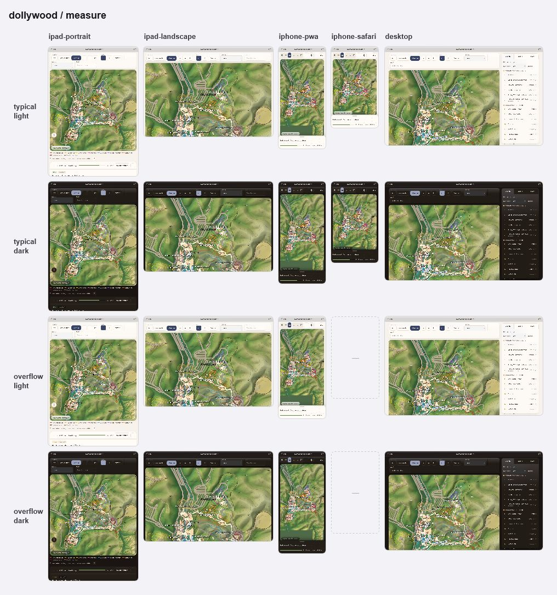

#### dollywood / next-unfinished

"Next unfinished" in the build card header (:1092, nextUnfinished :1090). Typical: step 9 of Entrance & Plaza. Overflow: Entrance & Plaza is complete, so it jumps to the only section with work left, Wildwood Grove step 24 (23/26 ticked). Phones: tapped in the peeking sheet, which stays at peek while the map fits the step. Empty: step 2 of Entrance & Plaza; loading/offline as typical/empty.

States: typical, overflow · devices: desktop, ipad-landscape, ipad-portrait, iphone-pwa, iphone-safari · 18 files: `audits/screens/dollywood/next-unfinished-<state>-<device>-<mode>.png`

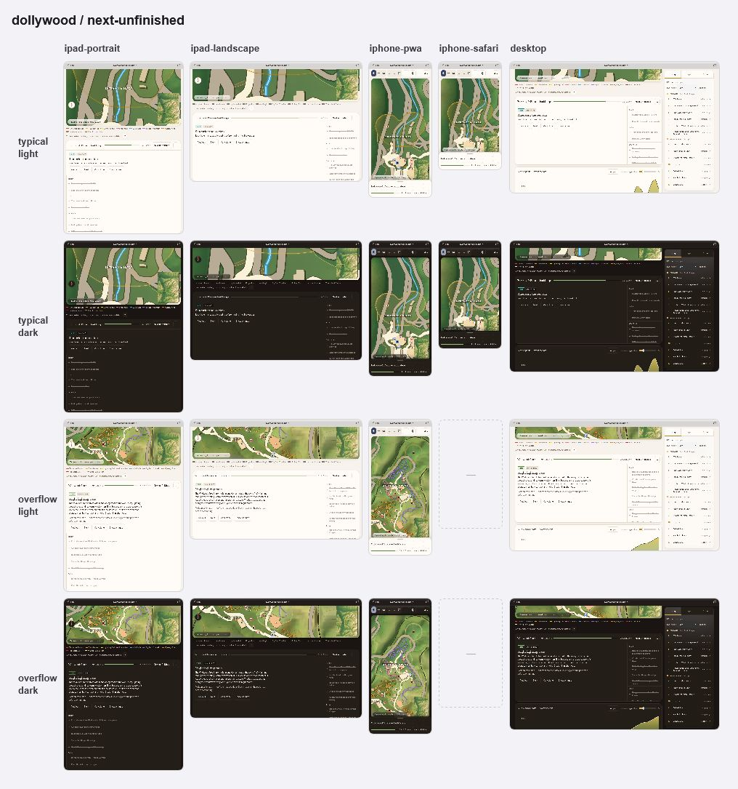

#### dollywood / progress-menu

The build card's "…" menu: Export / Import / Reset progress. Phones: tapped in the peeking sheet; the menu opens upward (CSS :371) inside the fixed sheet, whose overflow:hidden (:359) clips it to a sliver — at half height too — so what shows is what a phone user gets. Reset uses confirm() and a bad import alert(): native dialogs the rig cannot capture.

States: typical · devices: desktop, ipad-landscape, ipad-portrait, iphone-pwa, iphone-safari · 10 files: `audits/screens/dollywood/progress-menu-<state>-<device>-<mode>.png`

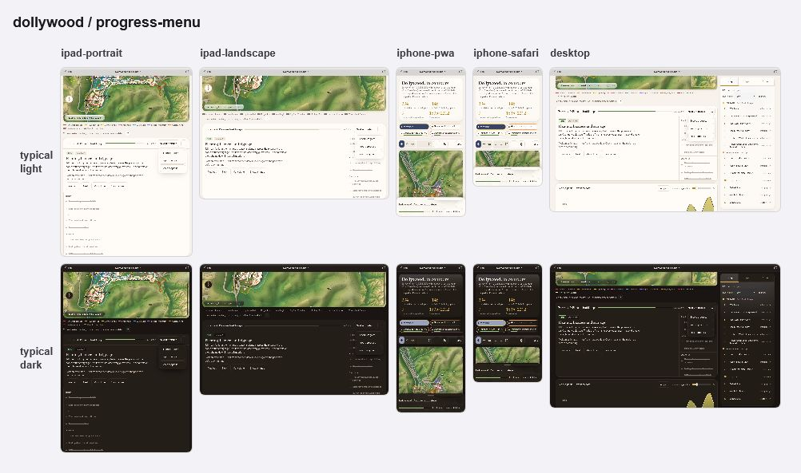

#### dollywood / scale

Side panel, Scale tab: Eli's Planet Coaster plot width (person 'plot'; empty unset, typical 400 m, overflow 12500 m). Loading/offline: the same field, filled or not.

States: empty, typical, overflow · devices: desktop, ipad-landscape, ipad-portrait, iphone-pwa, iphone-safari · 26 files: `audits/screens/dollywood/scale-<state>-<device>-<mode>.png`

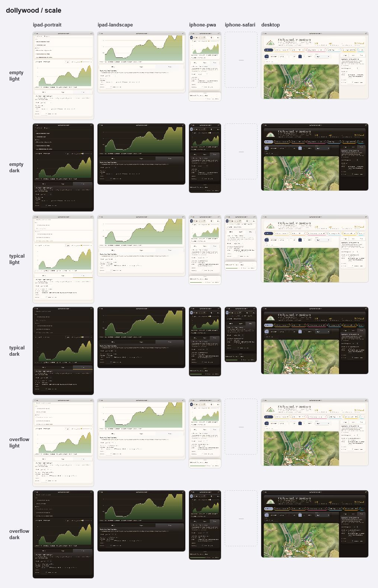

#### dollywood / search-none

Search with no match ("waterpark"). Phones: scrolled to the side panel (query still in the sticky bar); iPad: what the person sees after typing — the only feedback, "0 of 145", is far below. Drawn from the page payload only (no person data), so empty/overflow look the same as typical; loading/offline change nothing on this view.

States: typical · devices: desktop, ipad-landscape, ipad-portrait, iphone-pwa, iphone-safari · 10 files: `audits/screens/dollywood/search-none-<state>-<device>-<mode>.png`

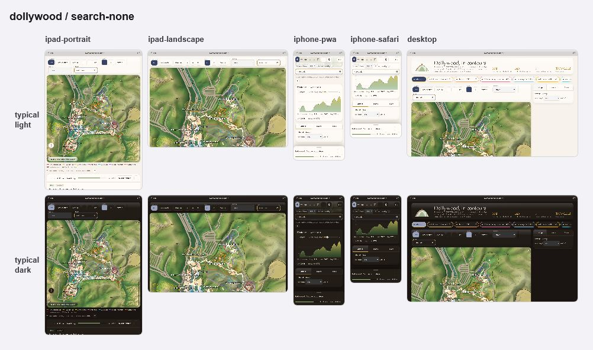

#### dollywood / search

Tool-bar search "mountain" (phones: behind More). The Listings tab filters as you type; below 1180 px it sits far under the map, so the capture scrolls to it. Drawn from the page payload only (no person data), so empty/overflow look the same as typical; loading/offline change nothing on this view.

States: typical · devices: desktop, ipad-landscape, ipad-portrait, iphone-pwa, iphone-safari · 10 files: `audits/screens/dollywood/search-<state>-<device>-<mode>.png`

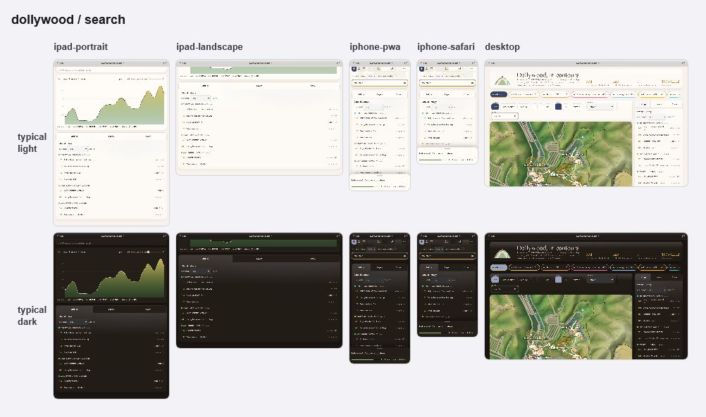

#### dollywood / section

Showstreet chip tapped: the map zooms to the section and the build card switches to its steps (typical 13/21, overflow 21/21). Empty = typical without ticks; loading/offline change only the counts, as in map/steps.

States: typical, overflow · devices: desktop, ipad-landscape, ipad-portrait, iphone-pwa, iphone-safari · 18 files: `audits/screens/dollywood/section-<state>-<device>-<mode>.png`

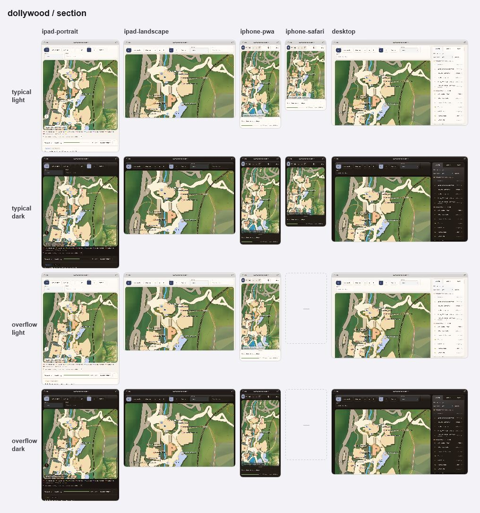

#### dollywood / steepness

Layers → Steepness on: orange >= 25 %, red >= 40 % grade over the terrain (the View menu has the same switch). Drawn from the page payload only (no person data), so empty/overflow look the same as typical; loading/offline change nothing on this view.

States: typical · devices: desktop, ipad-landscape, ipad-portrait, iphone-pwa, iphone-safari · 10 files: `audits/screens/dollywood/steepness-<state>-<device>-<mode>.png`

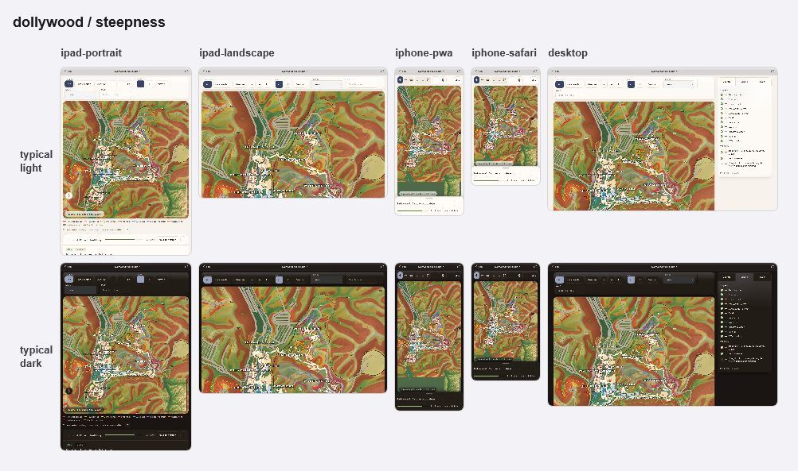

#### dollywood / step-on-map

The build card's "Show on map" on the current step (Entrance & Plaza step 8, an estimated position): the map fits the step's target and rings it (go() :1087, fitTarget :1088). Phones: tapped in the half sheet; the app keeps the sheet at half and scrolls the map under the tool bar itself (fitBoxPhone :1143). iPad/desktop: the app zooms the map but does not scroll to it (mapIntoView is phone-only, :1140), so the capture scrolls up to the map. Empty/overflow only change which step is current; loading/offline change nothing here.

States: typical · devices: desktop, ipad-landscape, ipad-portrait, iphone-pwa, iphone-safari · 10 files: `audits/screens/dollywood/step-on-map-<state>-<device>-<mode>.png`

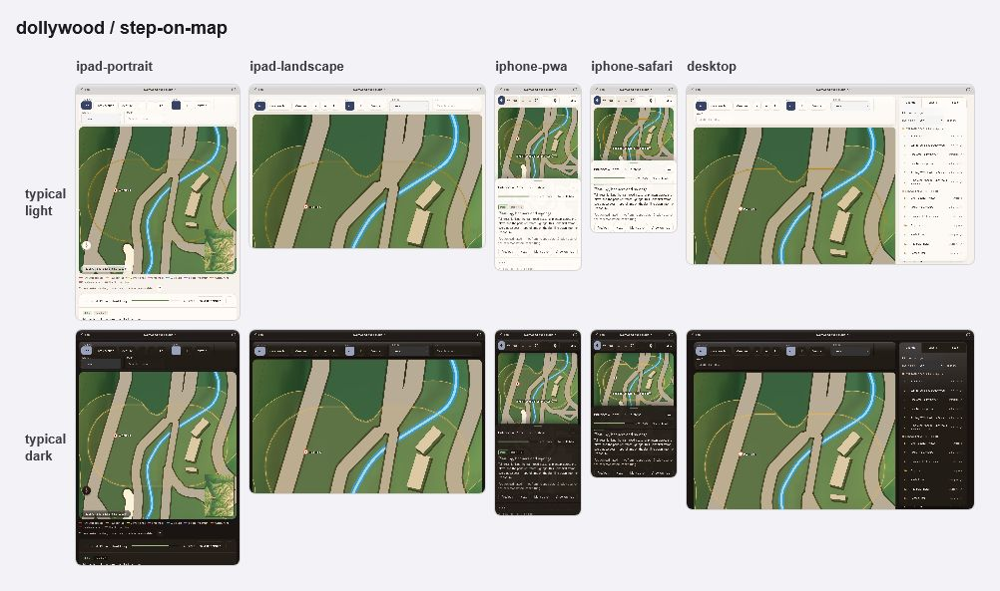

#### dollywood / steps

Build steps for the boot section (Entrance & Plaza): the card under the map on iPad/desktop, the bottom sheet at half height on phones.

States: empty, typical, overflow, loading, offline · devices: desktop, ipad-landscape, ipad-portrait, iphone-pwa, iphone-safari · 42 files: `audits/screens/dollywood/steps-<state>-<device>-<mode>.png`

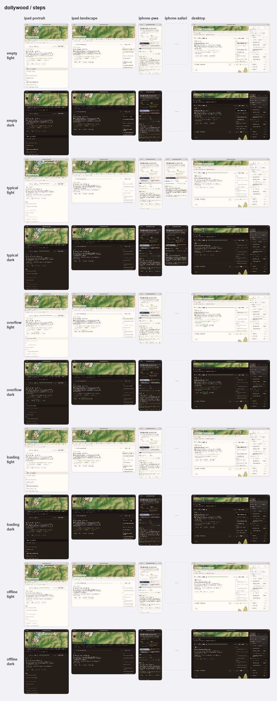

#### dollywood / steps-full

Phones only: the build sheet at full height (step card + step list). Empty looks like steps-empty; loading/offline as in steps.

States: typical, overflow · devices: iphone-pwa, iphone-safari · 8 files: `audits/screens/dollywood/steps-full-<state>-<device>-<mode>.png`

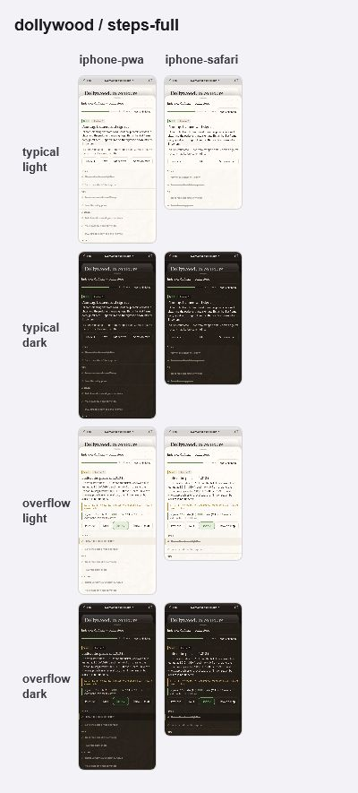

#### dollywood / upright

Layers → Upright, then Fit: the whole park turned to the printed park map's orientation (the toggle itself zooms to Entrance & Plaza, :1029). Drawn from the page payload only (no person data), so empty/overflow look the same as typical; loading/offline change nothing on this view.

States: typical · devices: desktop, ipad-landscape, ipad-portrait, iphone-pwa, iphone-safari · 10 files: `audits/screens/dollywood/upright-<state>-<device>-<mode>.png`

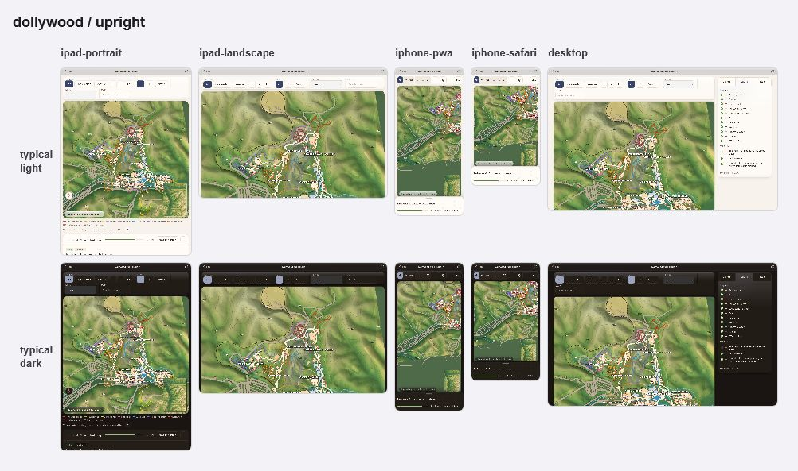

#### dollywood / view-3d

3D terrain (three.js r128 WebGL, built after the tap paints; WebGL works in Playwright WebKit here). Drawn from the page payload only (no person data), so empty/overflow look the same as typical; loading/offline change nothing on this view.

States: typical · devices: desktop, ipad-landscape, ipad-portrait, iphone-pwa, iphone-safari · 10 files: `audits/screens/dollywood/view-3d-<state>-<device>-<mode>.png`

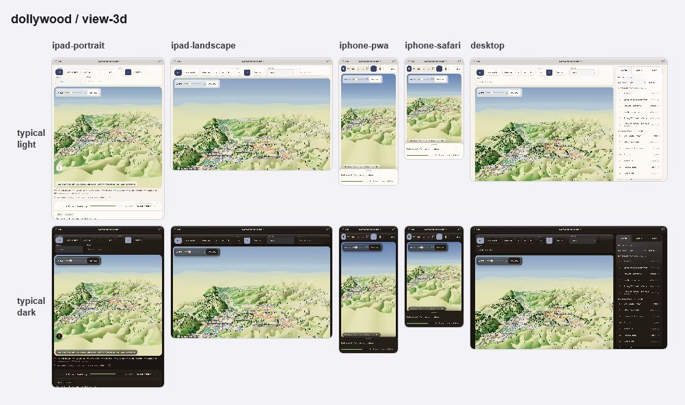

#### dollywood / view-menu

The View ▾ menu (contour interval, steepness); on phones the More disclosure, which also holds the search box. Drawn from the page payload only (no person data), so empty/overflow look the same as typical; loading/offline change nothing on this view.

States: typical · devices: desktop, ipad-landscape, ipad-portrait, iphone-pwa, iphone-safari · 10 files: `audits/screens/dollywood/view-menu-<state>-<device>-<mode>.png`

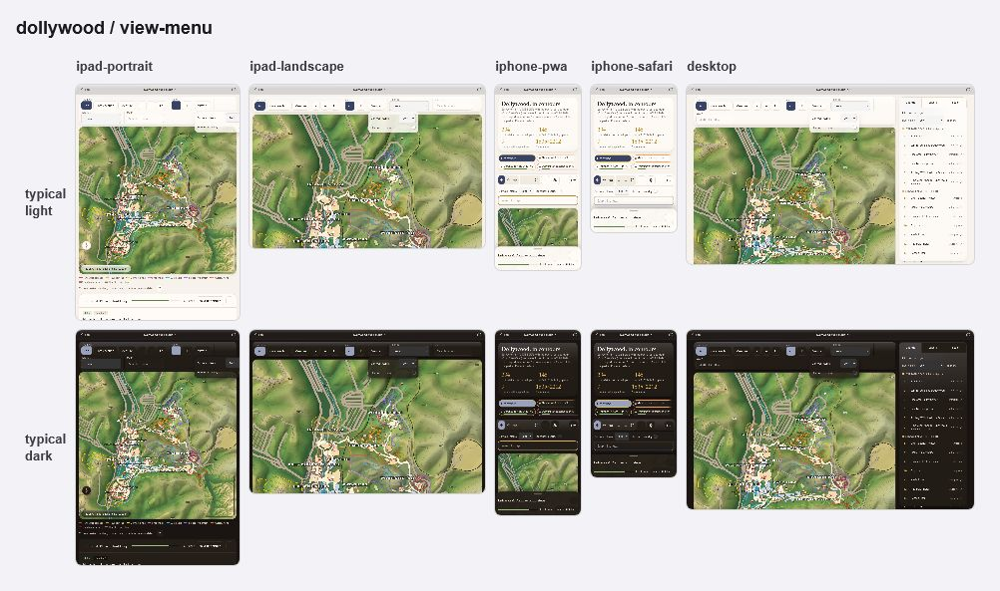

### f260

#### f260 / behind

David is behind: nothing read for over a week, so Today says “Pick up where you left off”, the streak is 0 and he has readings left behind in earlier weeks.

States: typical, overflow · devices: desktop, ipad-landscape, ipad-portrait, iphone-pwa, iphone-safari · 18 files: `audits/screens/f260/behind-<state>-<device>-<mode>.png`

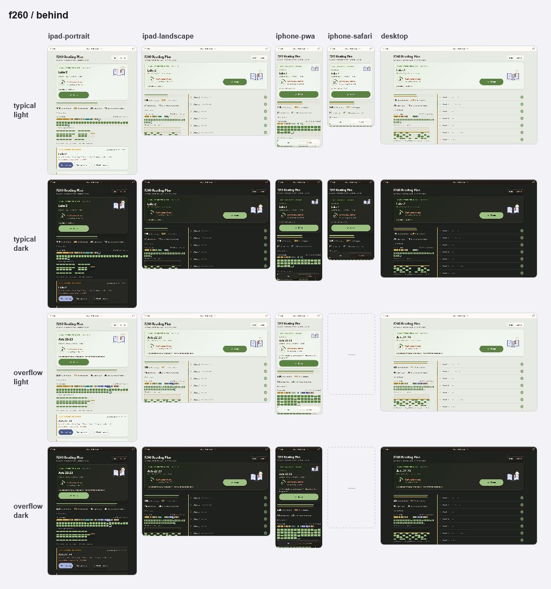

#### f260 / behind-pace

David’s side column and hero: partial weeks in the 52-week grid, a sparse heatmap, the gold “Pick up where you left off” hero with “N weeks behind · projected finish”.

States: typical, overflow · devices: desktop, ipad-landscape, ipad-portrait, iphone-pwa, iphone-safari · 18 files: `audits/screens/f260/behind-pace-<state>-<device>-<mode>.png`

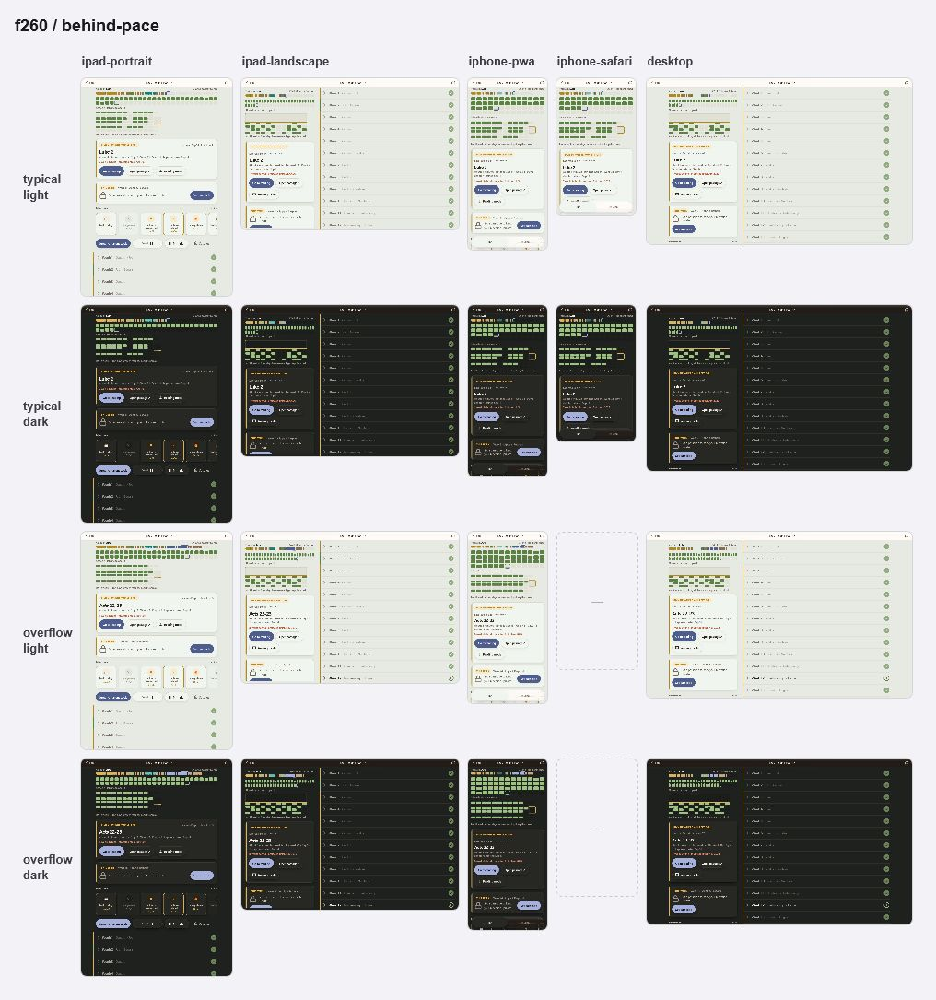

#### f260 / change-passcode

Settings → Change passcode with the journal unlocked: the passcode dialog as “New passcode”. The erase-journal confirm uses the same dialog as reset-confirm.

States: typical · devices: desktop, ipad-landscape, ipad-portrait, iphone-pwa, iphone-safari · 10 files: `audits/screens/f260/change-passcode-<state>-<device>-<mode>.png`

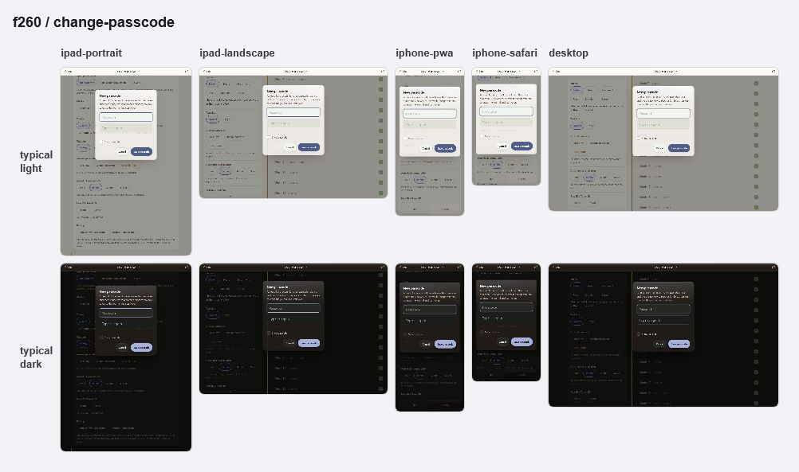

#### f260 / complete

The celebration: Eli taps Done on the plan’s last reading (Revelation 20-22). Week 52 completes and the “Plan complete — Genesis to Revelation 🎉” dialog opens with the year’s stats.

States: overflow · devices: desktop, ipad-landscape, ipad-portrait, iphone-pwa · 8 files: `audits/screens/f260/complete-<state>-<device>-<mode>.png`

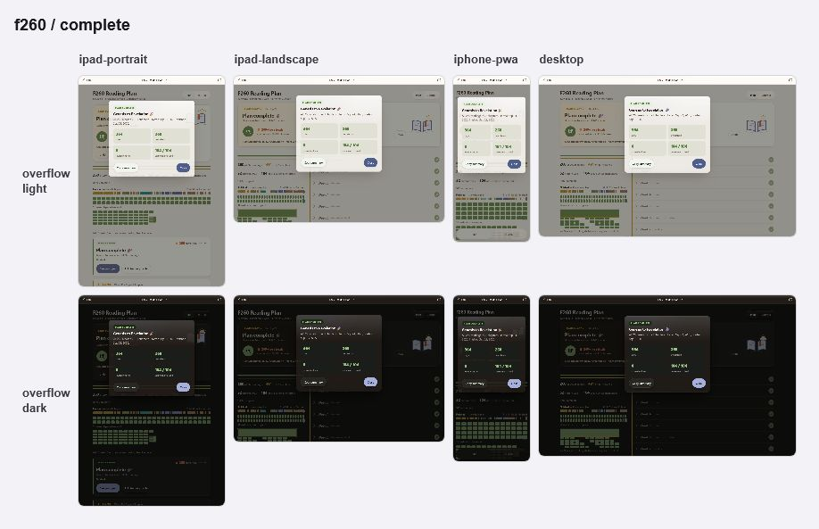

#### f260 / done-toast

The confirmation toast after Done (“✓ Acts 6 · next: Acts 7”), caught while it shows (3.4 s, fading in and out), so animations run in this capture.

States: typical · devices: desktop, ipad-landscape, ipad-portrait, iphone-pwa, iphone-safari · 10 files: `audits/screens/f260/done-toast-<state>-<device>-<mode>.png`

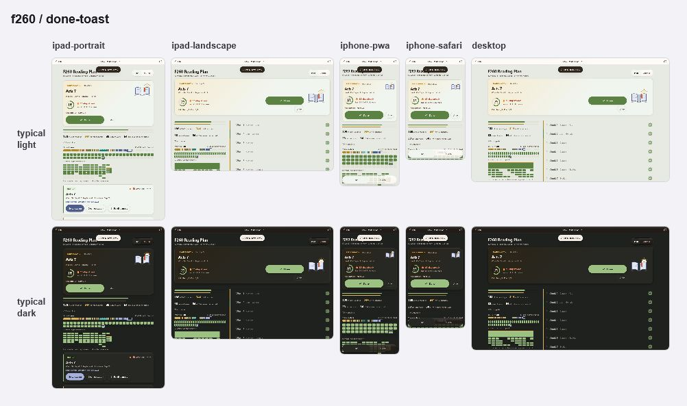

#### f260 / finished-hero

The finished plan’s side column from the book bar down: every book finished, a solid 52-week grid, the heatmap and the hero (“Week 52 done · Plan complete · Finished · See your year”). The full meters are in finished.

States: overflow · devices: desktop, ipad-landscape, ipad-portrait, iphone-pwa · 8 files: `audits/screens/f260/finished-hero-<state>-<device>-<mode>.png`

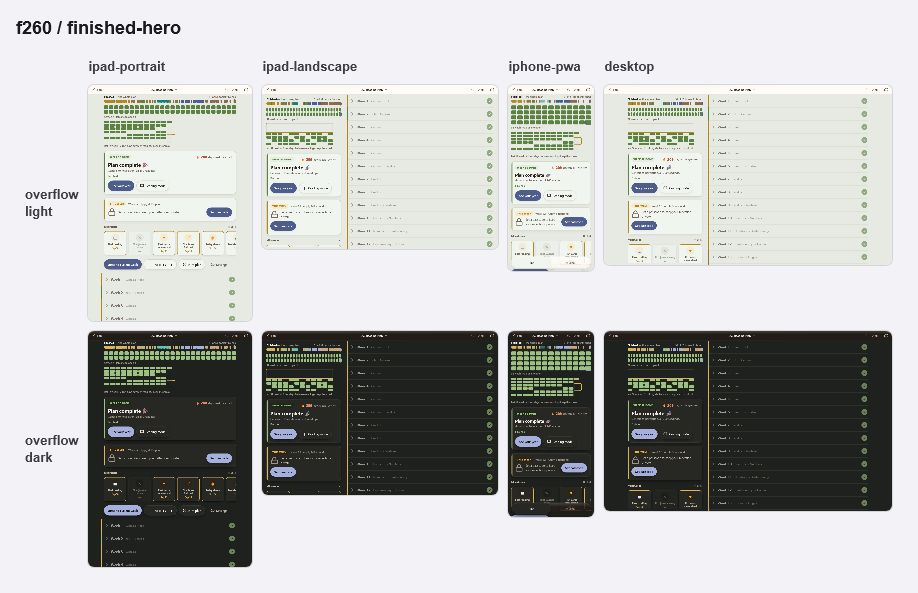

#### f260 / finished

Elizabeth finished all 260 readings yesterday: Today says “Plan complete 🎉” with no Done; the hero offers “See your year”.

States: overflow · devices: desktop, ipad-landscape, ipad-portrait, iphone-pwa · 8 files: `audits/screens/f260/finished-<state>-<device>-<mode>.png`

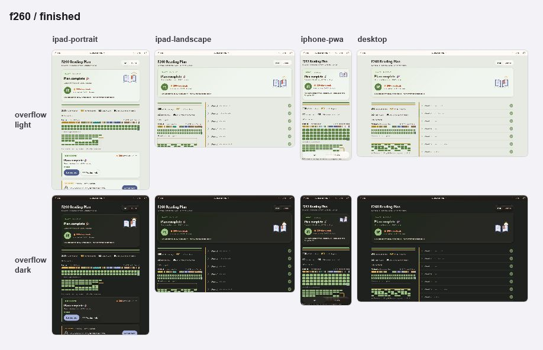

#### f260 / guest

A guest (Grandma Jo) opens F260: a guest counts as an adult, so she gets her own fresh 52-week plan.

States: typical · devices: desktop, ipad-landscape, ipad-portrait, iphone-pwa, iphone-safari · 10 files: `audits/screens/f260/guest-<state>-<device>-<mode>.png`

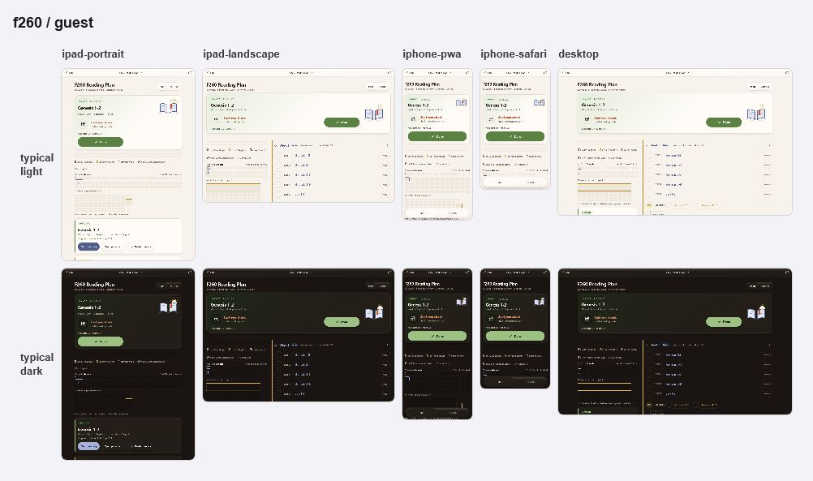

#### f260 / hear-open

A HEAR panel open with the journal unlocked (passcode set in the capture): the prompt of the week and the four fields. Empty: a blank entry on Genesis 1-2. Typical: Eli’s entry on yesterday’s reading (Acts 4-5), saved. Overflow: a long entry on Revelation 18-19. Loading/offline: see today.

States: empty, typical, overflow · devices: desktop, ipad-landscape, ipad-portrait, iphone-pwa, iphone-safari · 26 files: `audits/screens/f260/hear-open-<state>-<device>-<mode>.png`

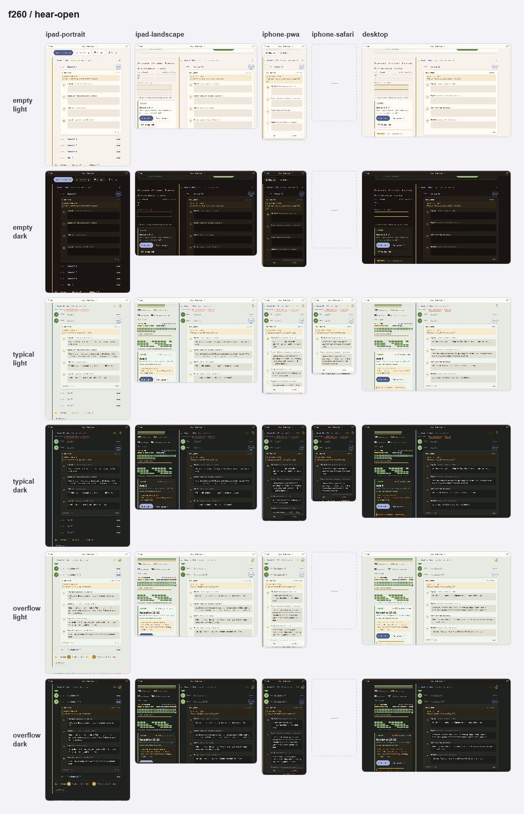

#### f260 / hear

Tapping HEAR on a reading (Acts 6) with no passcode yet: the same “Set a journal passcode” prompt, over the open week. The HEAR panel itself only opens once the journal is unlocked.

States: typical · devices: desktop, ipad-landscape, ipad-portrait, iphone-pwa, iphone-safari · 10 files: `audits/screens/f260/hear-<state>-<device>-<mode>.png`

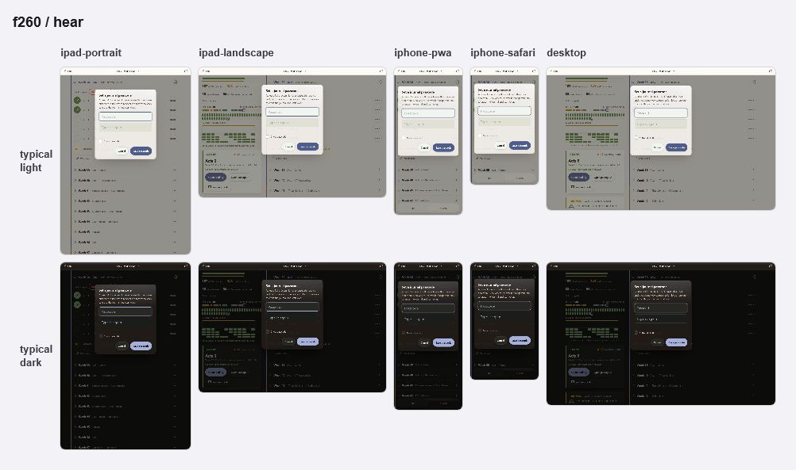

#### f260 / journal-entries

The Journal tab unlocked. Empty: “No entries yet” straight after setting a passcode. Typical: Eli’s two entries this week, in plan order. Overflow: five long entries and a week note for week 52. Entries are typed in the capture (the vault is encrypted, so none are seeded). Loading/offline: see today.

States: empty, typical, overflow · devices: desktop, ipad-landscape, ipad-portrait, iphone-pwa, iphone-safari · 26 files: `audits/screens/f260/journal-entries-<state>-<device>-<mode>.png`

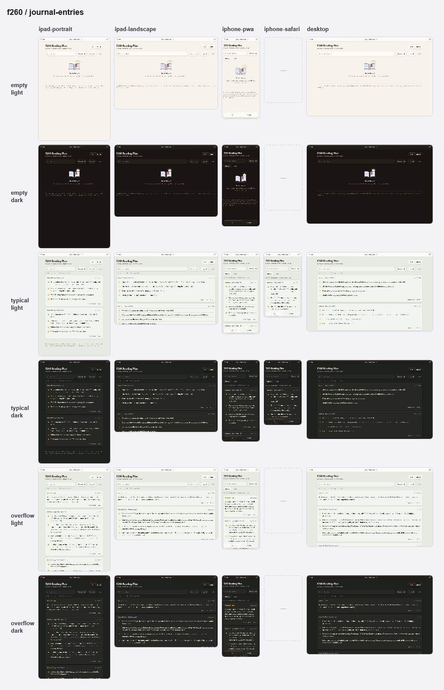

#### f260 / journal

The Journal tab. No passcode has been set, so opening it asks for one at once (“Set a journal passcode”). Error: two passcodes that do not match. The vault is encrypted, so no journal content is seeded, and empty/overflow look the same as typical.

States: typical, error · devices: desktop, ipad-landscape, ipad-portrait, iphone-pwa, iphone-safari · 20 files: `audits/screens/f260/journal-<state>-<device>-<mode>.png`

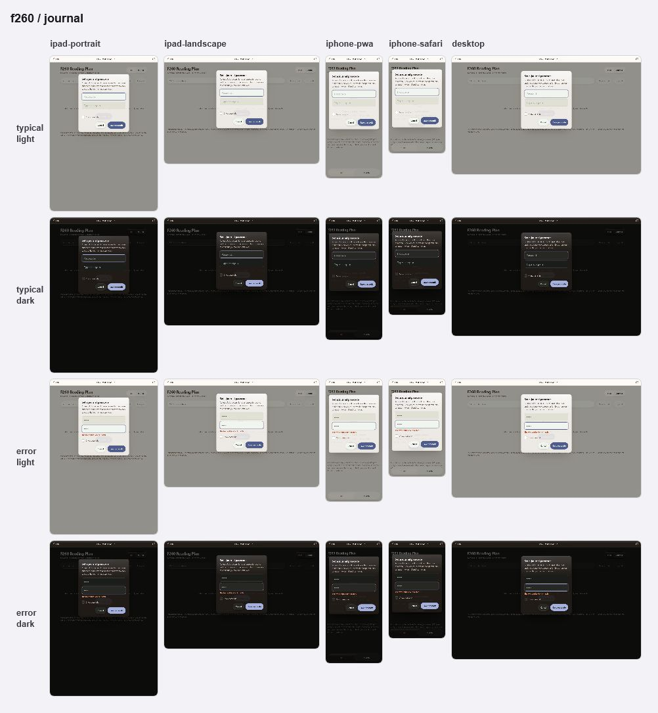

#### f260 / journal-locked

The Journal tab after cancelling the passcode prompt: the private-journal empty state with “Set passcode”, search/sort/copy disabled.

States: typical · devices: desktop, ipad-landscape, ipad-portrait, iphone-pwa, iphone-safari · 10 files: `audits/screens/f260/journal-locked-<state>-<device>-<mode>.png`


#### f260 / journal-no-match

The Journal search with no result: “Nothing matches · Try a different word.”

States: typical · devices: desktop, ipad-landscape, ipad-portrait, iphone-pwa, iphone-safari · 10 files: `audits/screens/f260/journal-no-match-<state>-<device>-<mode>.png`

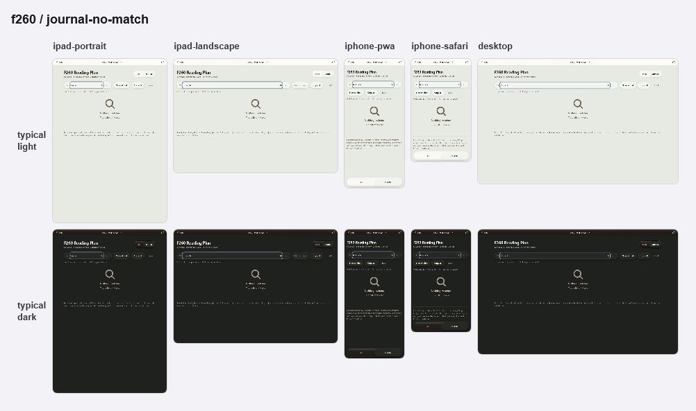

#### f260 / journal-search

The unlocked Journal tab searched for “bold”: “1 of 2 entries”, the match highlighted in the entry. Entries typed in the capture, as in journal-entries.

States: typical · devices: desktop, ipad-landscape, ipad-portrait, iphone-pwa, iphone-safari · 10 files: `audits/screens/f260/journal-search-<state>-<device>-<mode>.png`

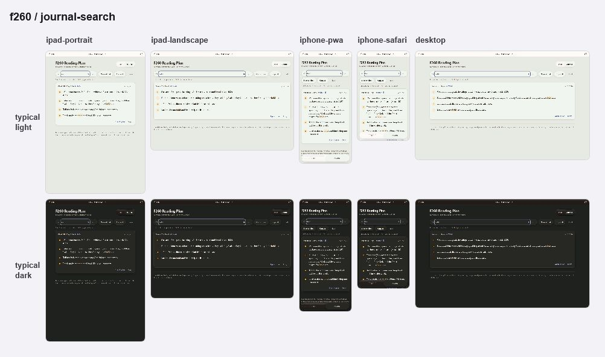

#### f260 / journal-unlock

A returning reader: the journal has a passcode and is locked (it always locks when the app is reopened), so the Journal tab asks “Unlock journal”. Made in the capture: set a passcode, Lock, then Unlock. Error: a wrong passcode (“Wrong passcode.”).

States: typical, error · devices: desktop, ipad-landscape, ipad-portrait, iphone-pwa, iphone-safari · 20 files: `audits/screens/f260/journal-unlock-<state>-<device>-<mode>.png`

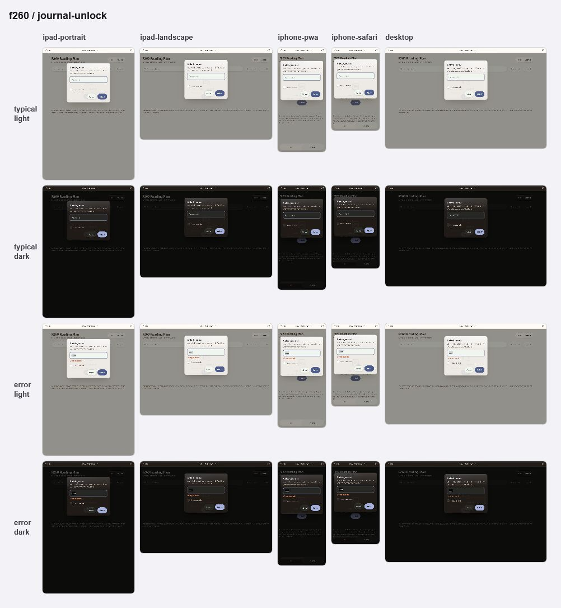

#### f260 / large-text

Settings → Text size → Large (body zoom 1.15), back at the top of the plan.

States: typical · devices: desktop, ipad-landscape, ipad-portrait, iphone-pwa, iphone-safari · 10 files: `audits/screens/f260/large-text-<state>-<device>-<mode>.png`

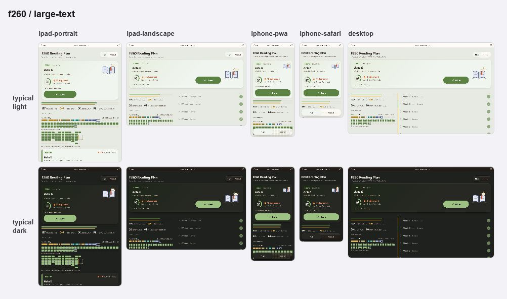

#### f260 / milestones

Milestones strip (a horizontal scroller below 1024 px, a wrapped grid in the wide side column) and the toolbar (jump, week stepper, print, settings). Empty: every tile is off, as in next-up’s empty capture.

States: typical, overflow · devices: desktop, ipad-landscape, ipad-portrait, iphone-pwa, iphone-safari · 18 files: `audits/screens/f260/milestones-<state>-<device>-<mode>.png`

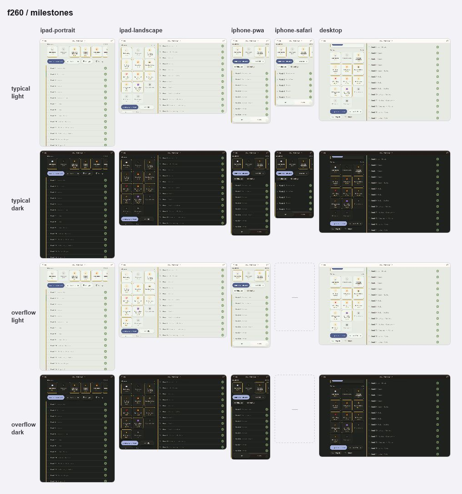

#### f260 / next-up

The “Next up” hero (pace and projected finish, Go to reading, Reading mode), this week’s reflections (locked: no journal passcode yet) and the milestones. Loading/offline: see today.

States: empty, typical, overflow · devices: desktop, ipad-landscape, ipad-portrait, iphone-pwa, iphone-safari · 26 files: `audits/screens/f260/next-up-<state>-<device>-<mode>.png`

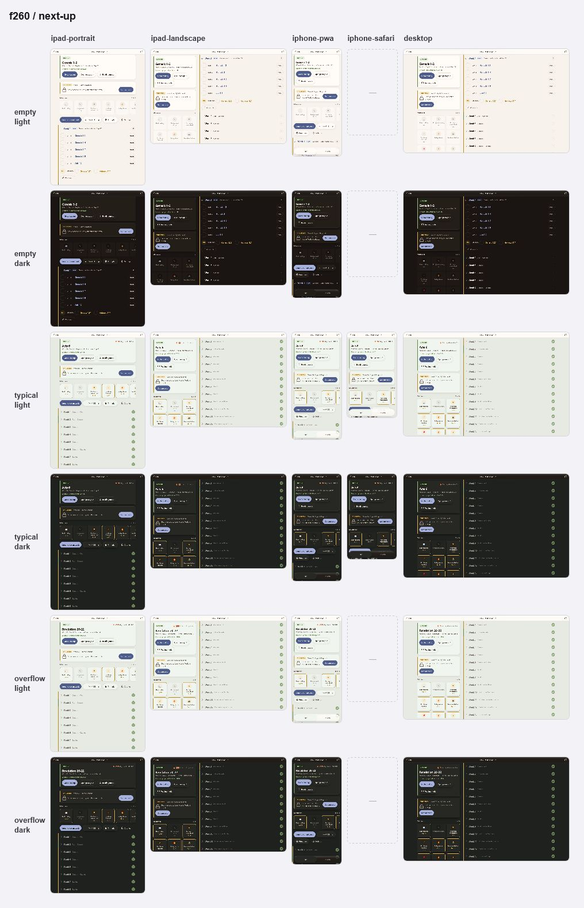

#### f260 / plan

Side column: reading and chapter meters, the stats strip, the journey through the books, the 52-week grid and the 12-week heatmap. Loading/offline: see today.

States: empty, typical, overflow · devices: desktop, ipad-landscape, ipad-portrait, iphone-pwa, iphone-safari · 26 files: `audits/screens/f260/plan-<state>-<device>-<mode>.png`

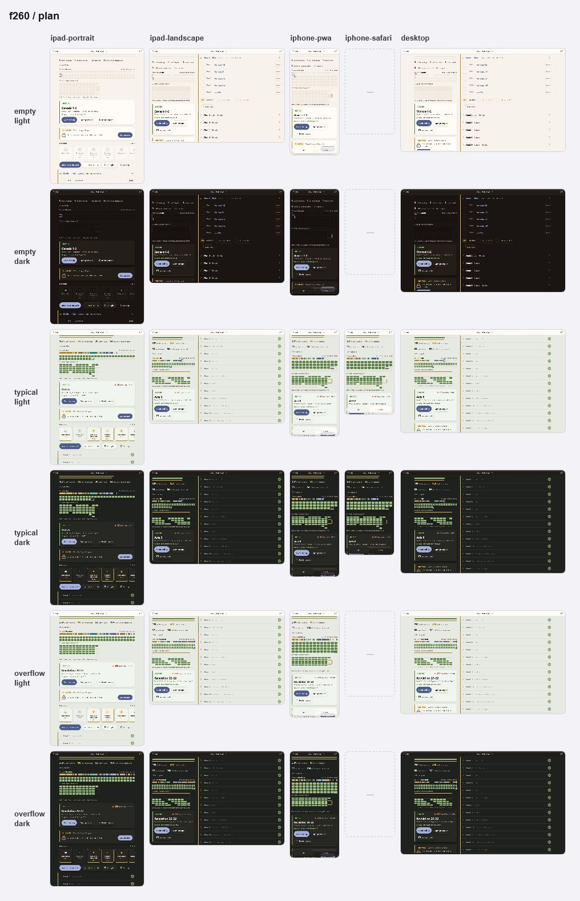

#### f260 / practice

Memory-verse practice (the “Practice again” chip in the current week): the text veiled, “Say it from memory, then reveal”. Overflow: a long passage. Empty: nothing is memorised, so there is nothing to practise.

States: typical, overflow · devices: desktop, ipad-landscape, ipad-portrait, iphone-pwa, iphone-safari · 18 files: `audits/screens/f260/practice-<state>-<device>-<mode>.png`

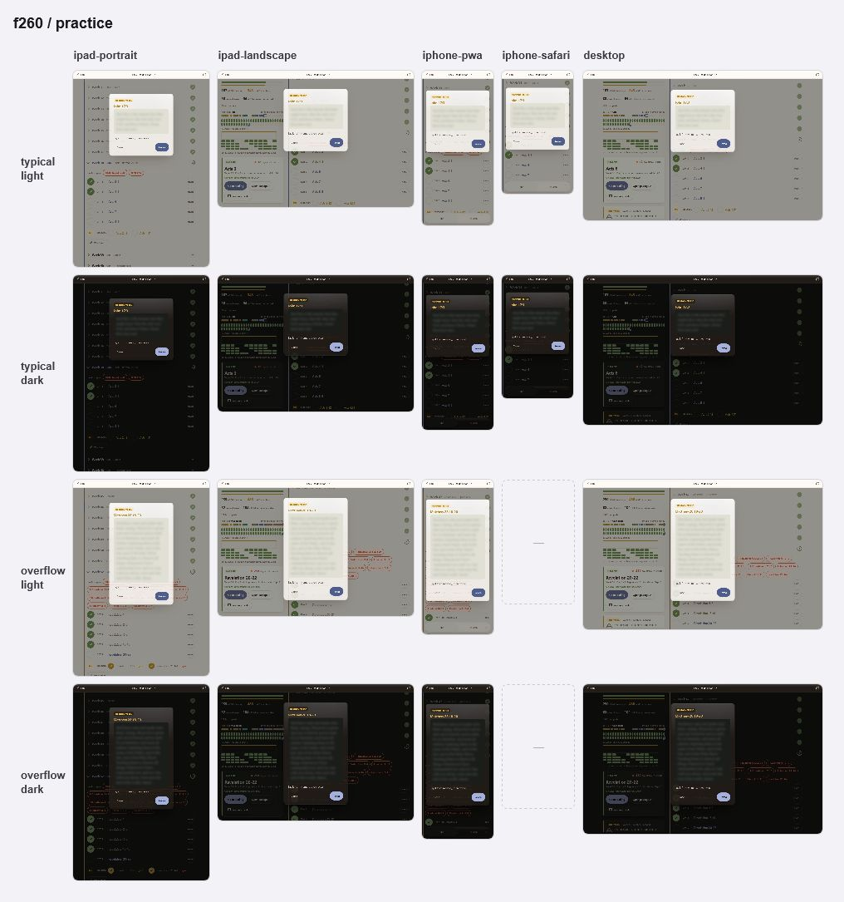

#### f260 / practice-paste

Practice for a verse whose text was never pasted: the paste box with Open passage ↗ / Cancel / Save.

States: typical · devices: desktop, ipad-landscape, ipad-portrait, iphone-pwa, iphone-safari · 10 files: `audits/screens/f260/practice-paste-<state>-<device>-<mode>.png`

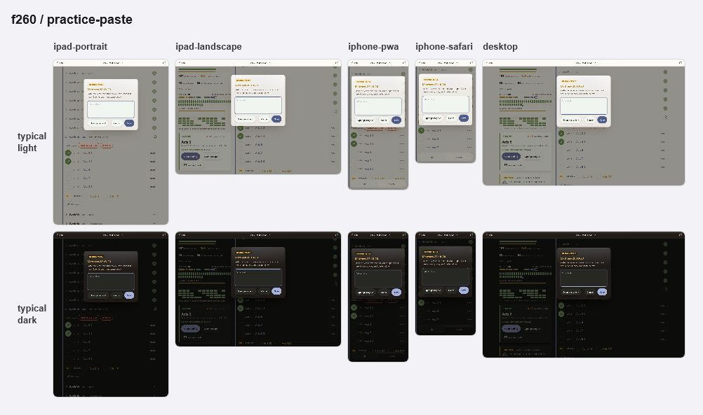

#### f260 / practice-reveal

Practice after Reveal: the verse text with Not yet / Got it.

States: typical, overflow · devices: desktop, ipad-landscape, ipad-portrait, iphone-pwa, iphone-safari · 18 files: `audits/screens/f260/practice-reveal-<state>-<device>-<mode>.png`

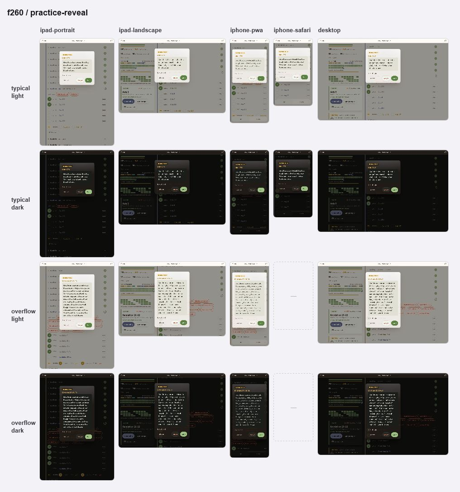

#### f260 / print

Print plan (toolbar): the app’s print stylesheet. window.print() opens a native dialog that cannot be captured, so the app document is opened on its own (what the print dialog renders from the app frame) with print media emulated at US Letter width, 816×1056 CSS px, the top of page 1. The printout forces black on white, so dark is omitted; it prints only the plan text, so empty/overflow look the same.

States: typical · devices: desktop · 1 files: `audits/screens/f260/print-<state>-<device>-<mode>.png`

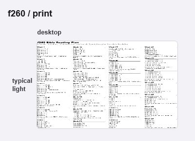

#### f260 / reading-mode

Reading mode (hero → Reading mode): one week per screen in big type with a sticky glass bar (prev / next / Done); the Today hero stays on top. Offline omitted: the second pass would reopen straight into reading mode from the cached preference.

States: empty, typical, overflow · devices: desktop, ipad-landscape, ipad-portrait, iphone-pwa, iphone-safari · 26 files: `audits/screens/f260/reading-mode-<state>-<device>-<mode>.png`

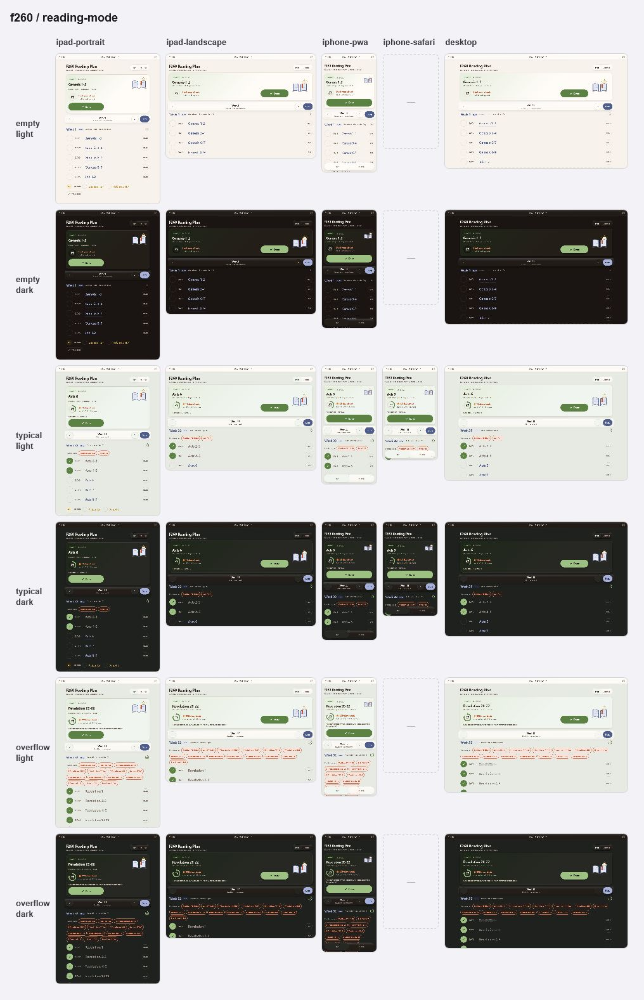

#### f260 / reading-mode-week

Reading mode scrolled down to the week itself (big-type readings and memory verses).

States: typical, overflow · devices: desktop, ipad-landscape, ipad-portrait, iphone-pwa, iphone-safari · 18 files: `audits/screens/f260/reading-mode-week-<state>-<device>-<mode>.png`

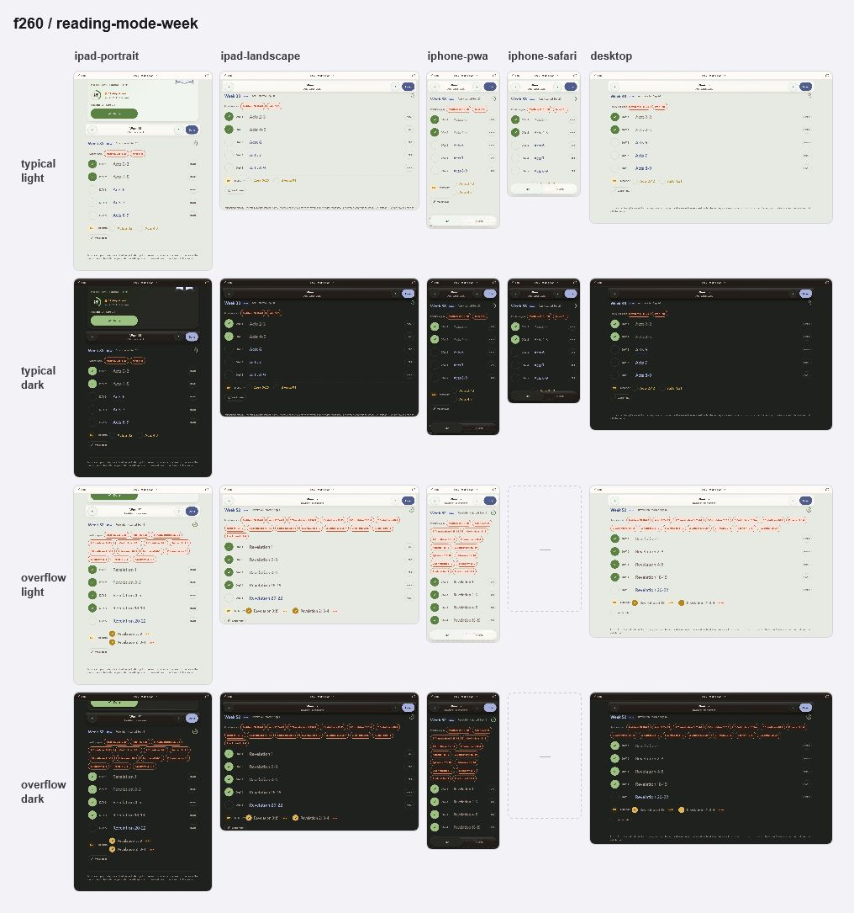

#### f260 / reflections

This week’s reflections once the journal is unlocked and has entries: the hero’s rotating reflection line and “Reflect · 2 applications”, then the “This week” card with each Apply/Respond line and a “How’s it going?” follow-up (the first one filled in, so it reads “followed up”).

States: typical · devices: desktop, ipad-landscape, ipad-portrait, iphone-pwa, iphone-safari · 10 files: `audits/screens/f260/reflections-<state>-<device>-<mode>.png`

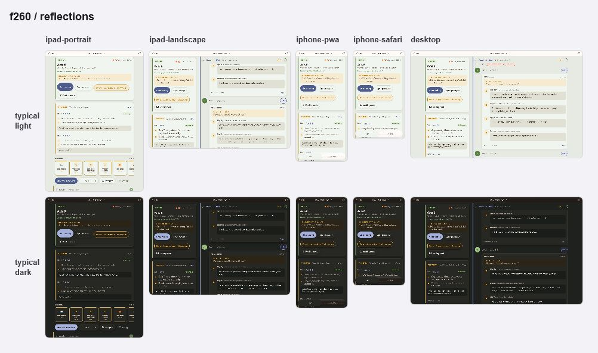

#### f260 / reset-confirm

Settings → Reset progress…: the app’s own confirm dialog (not a native confirm). Not confirmed.

States: typical · devices: desktop, ipad-landscape, ipad-portrait, iphone-pwa, iphone-safari · 10 files: `audits/screens/f260/reset-confirm-<state>-<device>-<mode>.png`

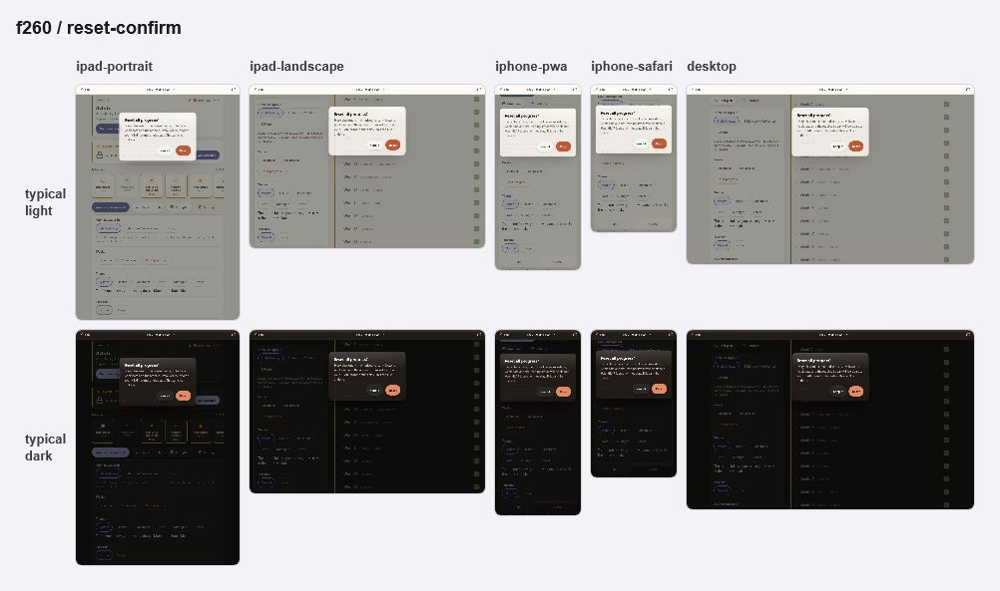

#### f260 / restore

Settings → Restore from backup…: paste box. Error: text that is not an F260 backup.

States: typical, error · devices: desktop, ipad-landscape, ipad-portrait, iphone-pwa, iphone-safari · 20 files: `audits/screens/f260/restore-<state>-<device>-<mode>.png`

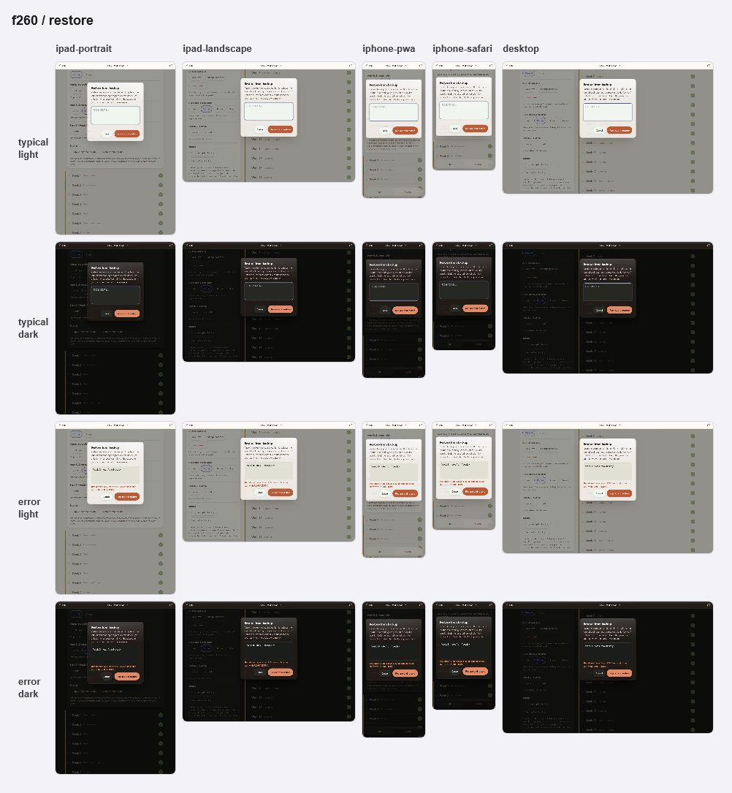

#### f260 / settings-more

The lower half of the settings sheet (passcode, auto-lock, Face ID / Touch ID, backup). Lock now, Change passcode, Erase journal and both Face ID buttons are disabled here (no passcode yet). Face ID’s hint reads “Not available in this browser” because the capture engine has no WebAuthn; an iPad would say “Unlock the journal with your passcode first, then enable it here.”

States: typical · devices: desktop, ipad-landscape, ipad-portrait, iphone-pwa, iphone-safari · 10 files: `audits/screens/f260/settings-more-<state>-<device>-<mode>.png`

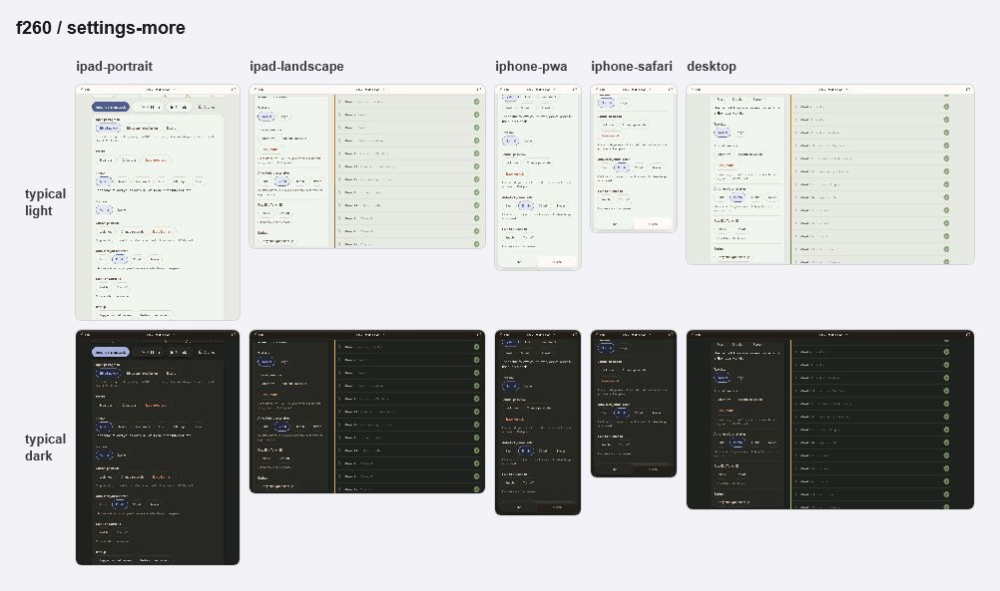

#### f260 / settings

Settings, an inline sheet under the toolbar: passage source, weeks, theme, text size, journal passcode, auto-lock, Face ID, backup. Its content does not depend on the plan data, so empty/overflow are omitted.

States: typical · devices: desktop, ipad-landscape, ipad-portrait, iphone-pwa, iphone-safari · 10 files: `audits/screens/f260/settings-<state>-<device>-<mode>.png`

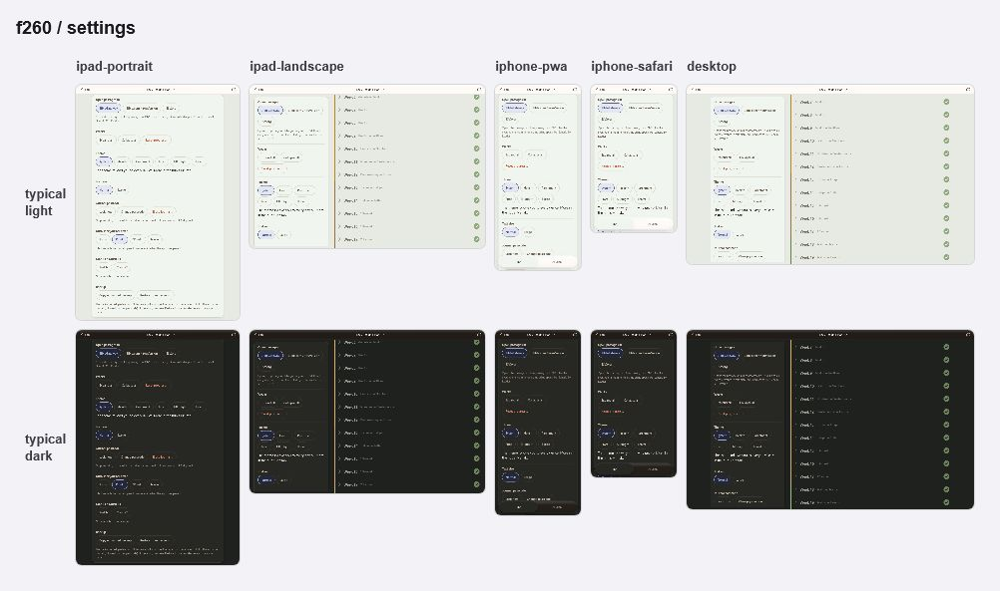

#### f260 / settings-unlocked

The lower half of settings with the journal unlocked (passcode set in the capture): Lock now, Change passcode and Erase journal are live and the hint says the journal is unlocked. Compare settings-more, where the same buttons are disabled but look the same. Face ID / Touch ID reads “Not available in this browser” because the capture engine has no WebAuthn; on an iPad it offers Enable here.

States: typical · devices: desktop, ipad-landscape, ipad-portrait, iphone-pwa, iphone-safari · 10 files: `audits/screens/f260/settings-unlocked-<state>-<device>-<mode>.png`

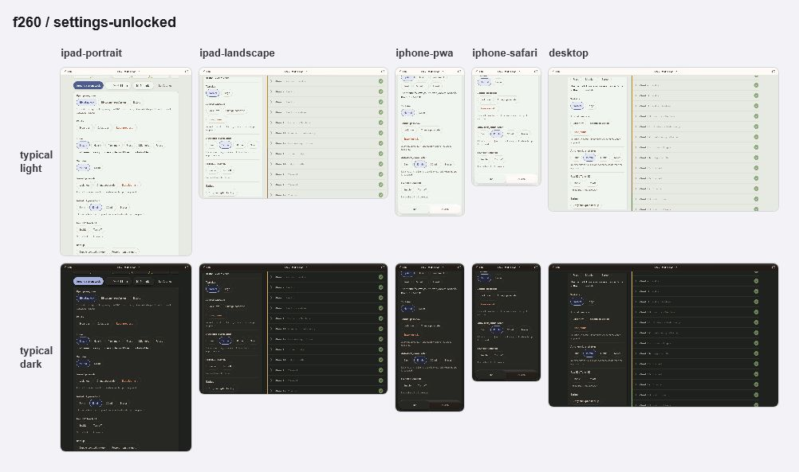

#### f260 / today-done

Right after tapping Done on the Today hero: “Read today ✓”, the ring moves on, Undo appears, the next reading slides in. Animations are finished for this capture, so the confirmation toast has faded: see done-toast. Overflow’s Done is the plan’s last reading: see complete.

States: empty, typical · devices: desktop, ipad-landscape, ipad-portrait, iphone-pwa, iphone-safari · 18 files: `audits/screens/f260/today-done-<state>-<device>-<mode>.png`

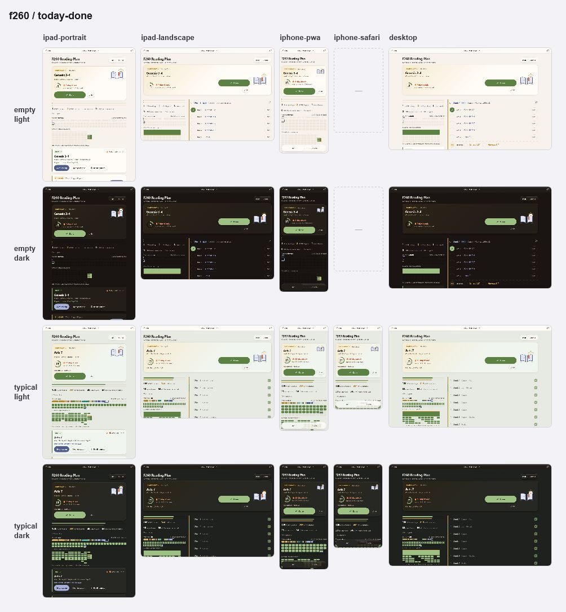

#### f260 / today

Cold open: the Today hero (next reading, Done, this week’s ring, streak, kids’ story line) at the top. Loading = before hub.ready resolves (the static page); offline = reopened from the local cache, and pixel-identical to typical: neither F260 nor the shell’s app viewer shows any offline sign.

States: empty, typical, overflow, loading, offline · devices: desktop, ipad-landscape, ipad-portrait, iphone-pwa, iphone-safari · 42 files: `audits/screens/f260/today-<state>-<device>-<mode>.png`

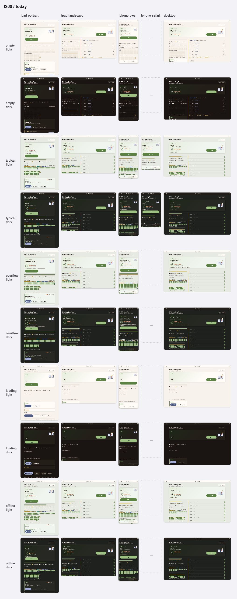

#### f260 / today-timeout

Cold device whose data never arrives: after hub.ready’s 6 s timeout F260 renders as a brand-new plan (week 1) and queues weekStart/summary writes for it. Pixel-identical to today-empty: nothing tells the reader their data has not arrived.

States: loading · devices: desktop, ipad-landscape, ipad-portrait, iphone-pwa · 8 files: `audits/screens/f260/today-timeout-<state>-<device>-<mode>.png`

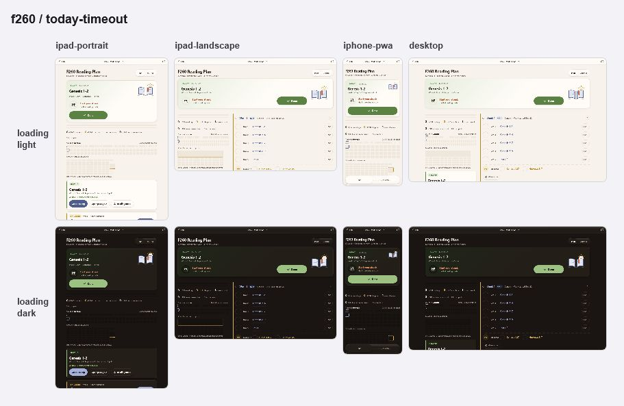

#### f260 / today-week-done

Mae read twice this morning and finished her current week: the Today hero reads “Read today ✓”, the ring is full (5/5) and the next reading is the next week’s first (“· starts week 38”; week 52 in overflow). Done there starts that week.

States: typical, overflow · devices: desktop, ipad-landscape, ipad-portrait, iphone-pwa, iphone-safari · 18 files: `audits/screens/f260/today-week-done-<state>-<device>-<mode>.png`

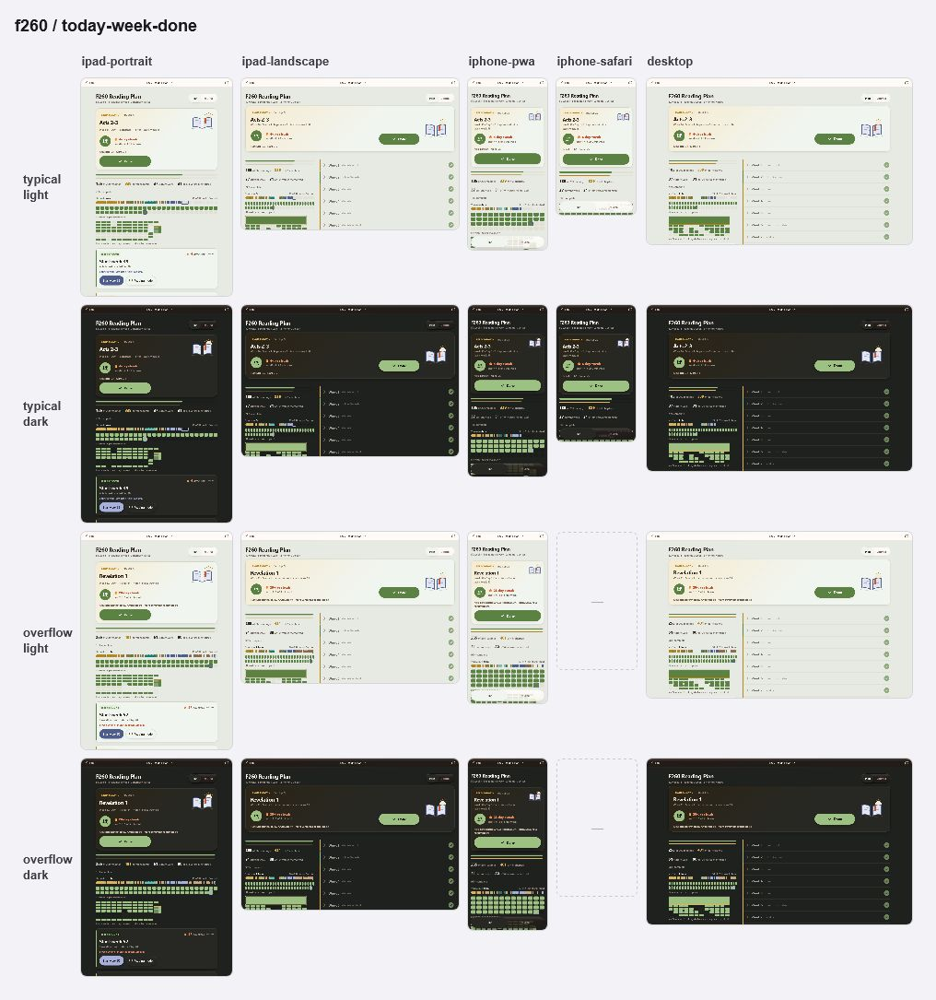

#### f260 / week-complete

Mae finished her current week this morning: the week shows “Week N done 🎉”, its summary and “Start week N+1”. No empty state: an empty plan has no finished week.

States: typical, overflow · devices: desktop, ipad-landscape, ipad-portrait, iphone-pwa, iphone-safari · 18 files: `audits/screens/f260/week-complete-<state>-<device>-<mode>.png`

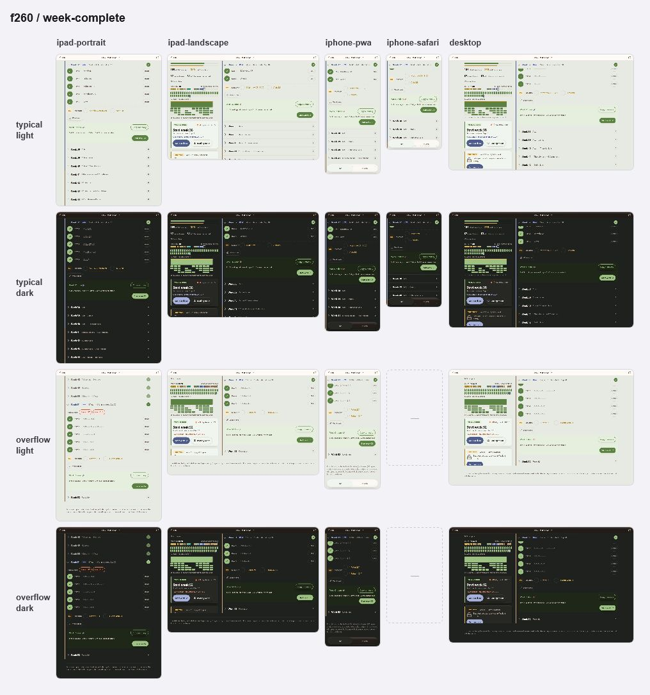

#### f260 / week-note

The current week’s “Week note” panel open with the journal unlocked (passcode set from the Week note button, a note typed and saved in the capture).

States: typical · devices: desktop, ipad-landscape, ipad-portrait, iphone-pwa, iphone-safari · 10 files: `audits/screens/f260/week-note-<state>-<device>-<mode>.png`

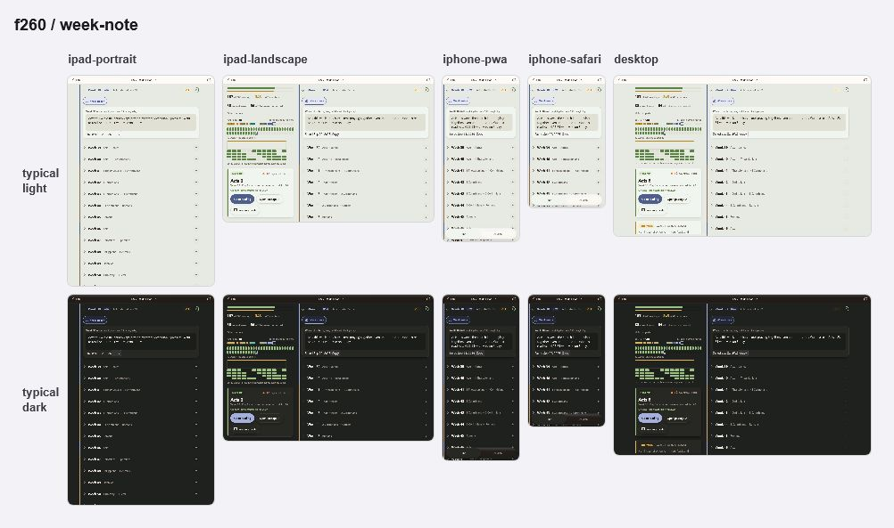

#### f260 / week-open

The current week expanded (open by default): five readings with Done marks and HEAR buttons, the memory verses, the “Practice again” row for verses marked not yet, the week note. Loading/offline: see today.

States: empty, typical, overflow · devices: desktop, ipad-landscape, ipad-portrait, iphone-pwa, iphone-safari · 26 files: `audits/screens/f260/week-open-<state>-<device>-<mode>.png`

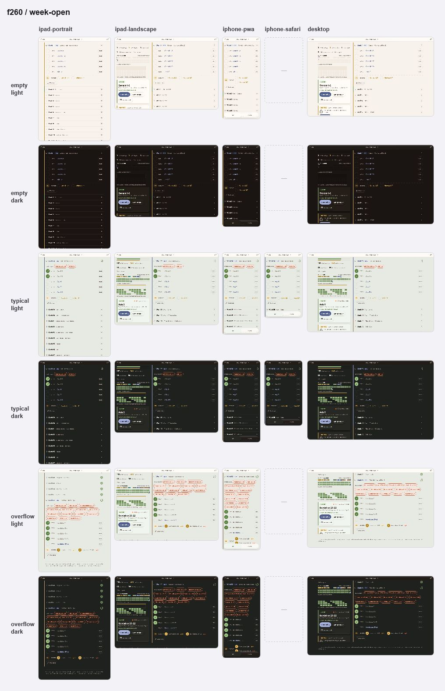

#### f260 / week-past

An earlier, finished week opened from the list (week 37; week 51 in overflow): ticked days struck through, the faded header, the verses and the “Week N done 🎉” summary with Copy summary but no Start button (it is not the current week). Empty: no week is finished.

States: typical, overflow · devices: desktop, ipad-landscape, ipad-portrait, iphone-pwa, iphone-safari · 18 files: `audits/screens/f260/week-past-<state>-<device>-<mode>.png`

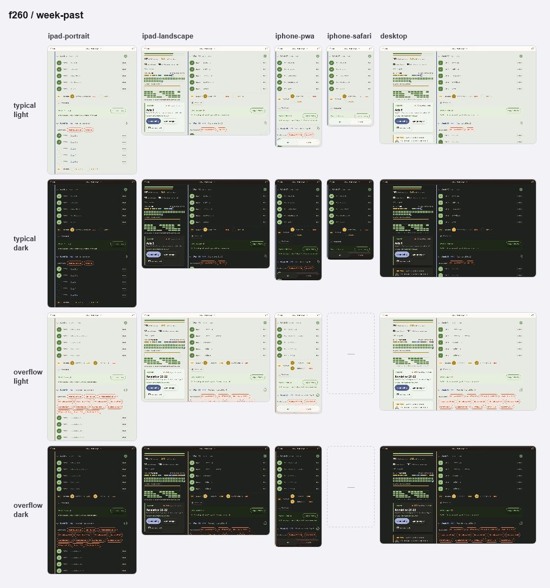

#### f260 / year

The finished plan’s “See your year” (hero button): the same Plan complete dialog, opened later.

States: overflow · devices: desktop, ipad-landscape, ipad-portrait, iphone-pwa · 8 files: `audits/screens/f260/year-<state>-<device>-<mode>.png`

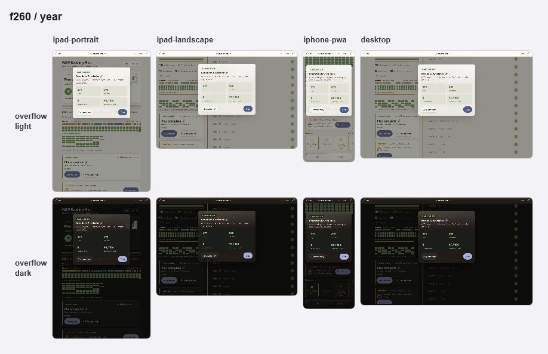

### kidverse

#### kidverse / adult

Eli scrolled to the grown-ups panel: the family week stepper (−/+) and every kid's stars this week. Empty = week 1 and no stars; overflow = long kid names, ★6 and ★4, and "Use week 52" (Eli's F260 plan is on week 52). No loading (the panel stays hidden until data arrives) or offline (the cache looks like typical; the stepper still queues its write).

States: empty, typical, overflow · devices: desktop, ipad-landscape, ipad-portrait, iphone-pwa, iphone-safari · 26 files: `audits/screens/kidverse/adult-<state>-<device>-<mode>.png`

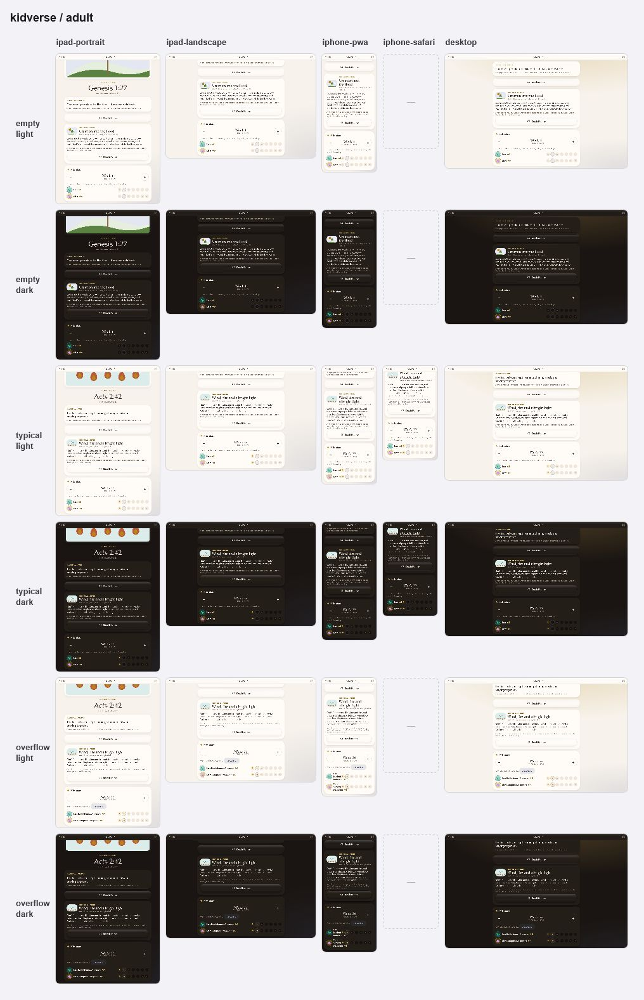

#### kidverse / adult-f260-hint

David (adult, F260 week 31 while the family is on 38) scrolled to the grown-ups panel: the "Your F260 plan is on week N · Use week N" hint (apps/kidverse.html:370). Needs the F260 seed's f260.summary for dad; without it the default hint shows. Typical only: it is a data situation, not a mode.

States: typical · devices: desktop, ipad-landscape, ipad-portrait, iphone-pwa, iphone-safari · 10 files: `audits/screens/kidverse/adult-f260-hint-<state>-<device>-<mode>.png`

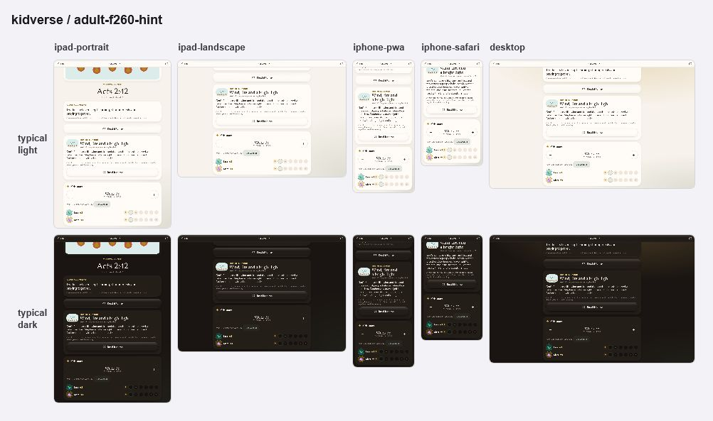

#### kidverse / adult-guest

Grandma Jo (guest, kind adult) scrolled to the grown-ups panel, just after she tapped +: a guest gets the same family week stepper as a parent (apps/kidverse.html:369; setWeek :336-338 checks only kind and canWrite), so the whole family's memory verse is now week 39 (the family row is written as { week: 39, by: 'guest-grandmajo' }). She also sees every kid's stars, while the shell hides Kids' rewards from guests (index.html isGuest). No F260 plan, so the default hint. Without the tap this capture would look exactly like adult-typical, because the pill that names her is scrolled off. Typical only.

States: typical · devices: desktop, ipad-landscape, ipad-portrait, iphone-pwa, iphone-safari · 10 files: `audits/screens/kidverse/adult-guest-<state>-<device>-<mode>.png`

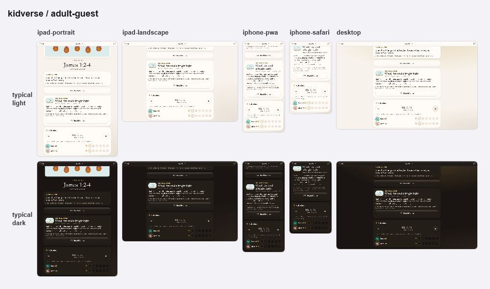

#### kidverse / adult-stalled

Eli's first open with no cache on a slow connection, about 7 s in: after hub.ready's 6 s timeout (apps/hub.js:336-337) the grown-ups panel renders from an empty cache. The stepper reads "Week 1 · the family is on" with − disabled and + live, and each kid shows ★0, although the family is on week 38. setWeek (apps/kidverse.html:336-339) writes { week: 2 } over the real row on a tap. Loading only.

States: loading · devices: desktop, ipad-landscape, ipad-portrait, iphone-pwa · 8 files: `audits/screens/kidverse/adult-stalled-<state>-<device>-<mode>.png`

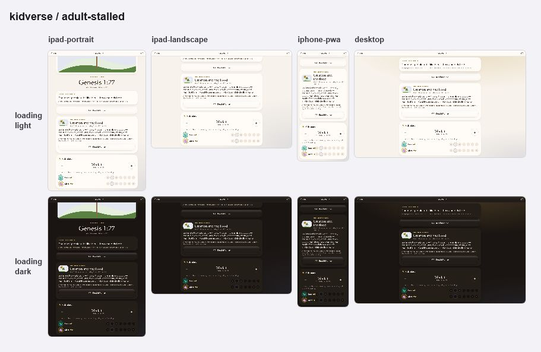

#### kidverse / adult-verse

Eli (adult) at the top: the same verse without Done ★ or stars — only Read it to me. Typical only: empty/loading/offline at the top look like the kid screen's (week 1 art, … placeholders, the cache).

States: typical · devices: desktop, ipad-landscape, ipad-portrait, iphone-pwa, iphone-safari · 10 files: `audits/screens/kidverse/adult-verse-<state>-<device>-<mode>.png`

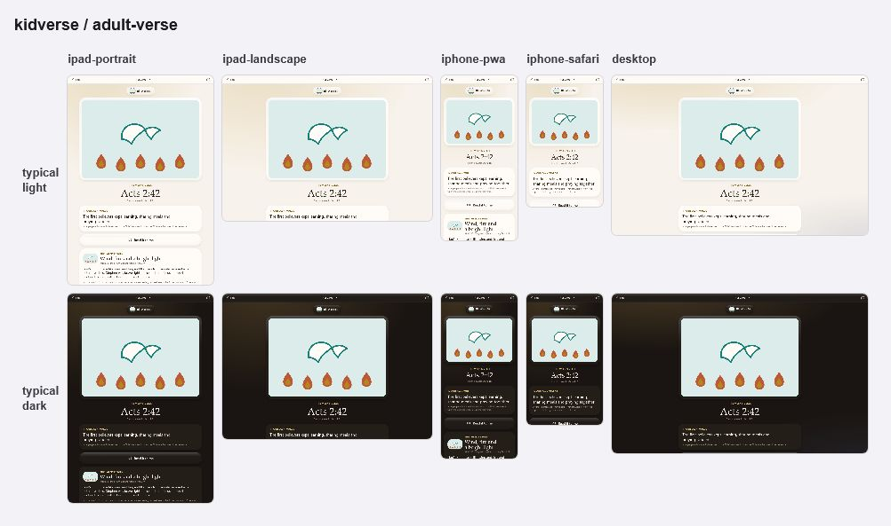

#### kidverse / kid-award

Ezra's very first star: from the empty household he taps Done ★, so the button turns to "Done today ★", his stars read 1, the calm confetti falls (it may have mostly faded by the shot) and the "New badge: First star!" toast shows at the bottom (apps/kidverse.html:323-334, 476-481). Empty only: it is the one state where a single tap earns a badge; in typical the tap only adds a star.

States: empty · devices: desktop, ipad-landscape, ipad-portrait, iphone-pwa · 8 files: `audits/screens/kidverse/kid-award-<state>-<device>-<mode>.png`

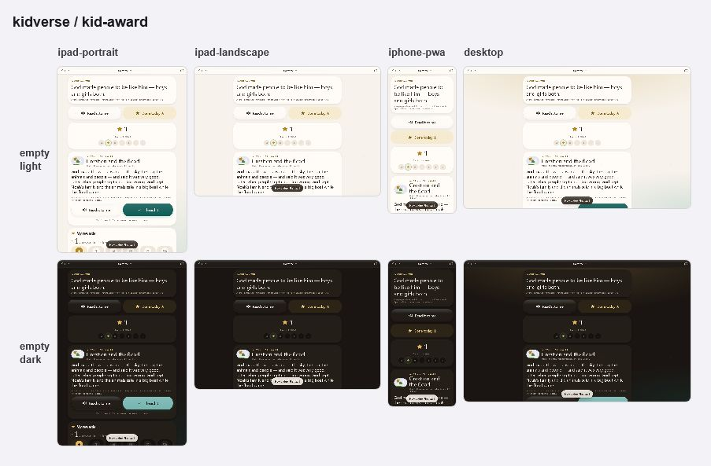

#### kidverse / kid-cashed-in

The moment a parent's cash-in reaches the kid: Eli has just tapped Cash in for Ezra's 3 stars on his phone (Me → Kids' rewards), so when Kid Verse pulls, the new ledger row is applied once: My rewards reads 0 to cash in and "Last cashed in: 3 stars on Sep 22", and the toast "Cashed in: 3 stars!" shows (apps/kidverse.html:447-450, 482-485). The ledger row is added to the family pull's answer, as if written from another device. Typical only: a one-off moment.

States: typical · devices: desktop, ipad-landscape, ipad-portrait, iphone-pwa, iphone-safari · 10 files: `audits/screens/kidverse/kid-cashed-in-<state>-<device>-<mode>.png`

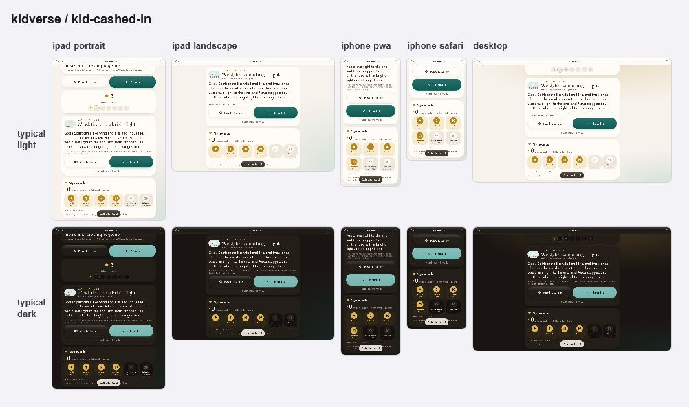

#### kidverse / kid

Ezra (kid) at the top: week art, the reference, the paraphrase, Read it to me / Done ★ and his stars this week. Empty = no family week yet (defaults to week 1) and no stars; overflow = long name, 6 stars this week with today's ★ already done. Loading = the … placeholders and the default creation art; offline = the cache, with no offline cue anywhere on screen.

States: empty, typical, overflow, loading, offline · devices: desktop, ipad-landscape, ipad-portrait, iphone-pwa, iphone-safari · 42 files: `audits/screens/kidverse/kid-<state>-<device>-<mode>.png`

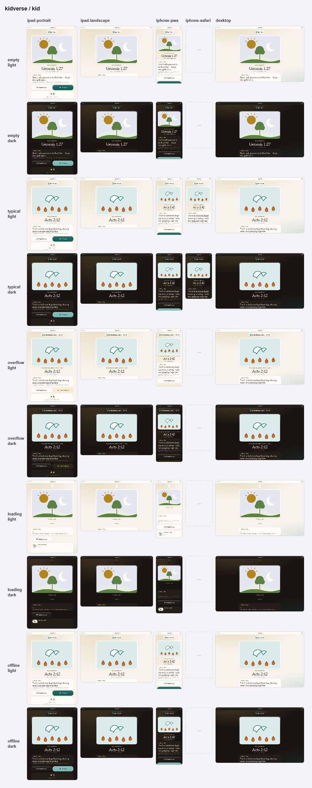

#### kidverse / kid-kiara

Kiara (kid, 4) at the top: one star this week, her own colour on the Done ★ button and in the glass. Typical only: every other state looks like Ezra's kid screen.

States: typical · devices: desktop, ipad-landscape, ipad-portrait, iphone-pwa, iphone-safari · 10 files: `audits/screens/kidverse/kid-kiara-<state>-<device>-<mode>.png`

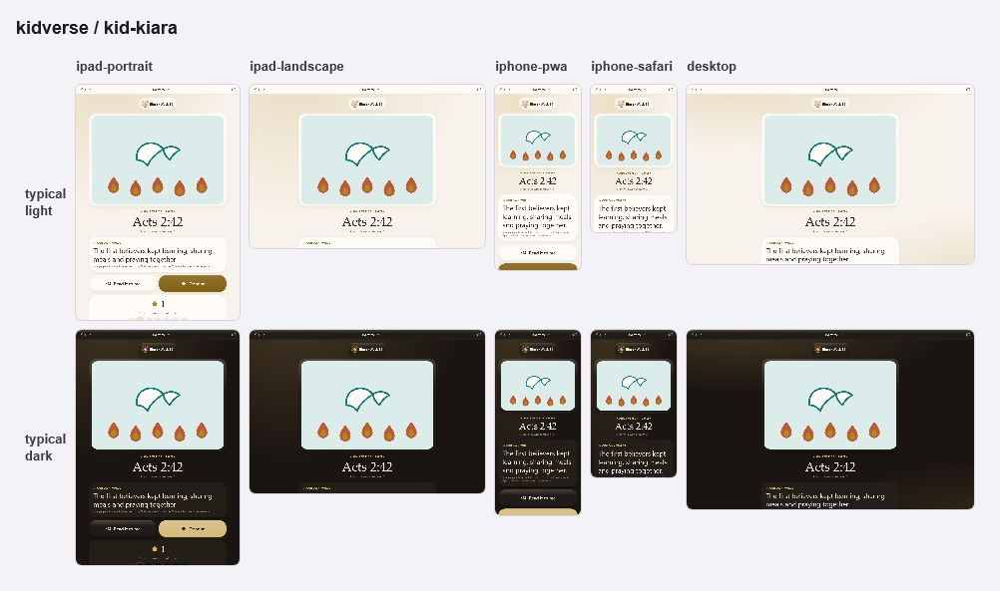

#### kidverse / kid-reading

Ezra has tapped "Read it to me": the button reads "Reading…" with its speaker icon pulsing (still in the shot) while the device speaks the reference and the paraphrase. speechSynthesis is a silent stand-in that never finishes. Typical only: the other states differ only in the verse shown.

States: typical · devices: desktop, ipad-landscape, ipad-portrait, iphone-pwa, iphone-safari · 10 files: `audits/screens/kidverse/kid-reading-<state>-<device>-<mode>.png`

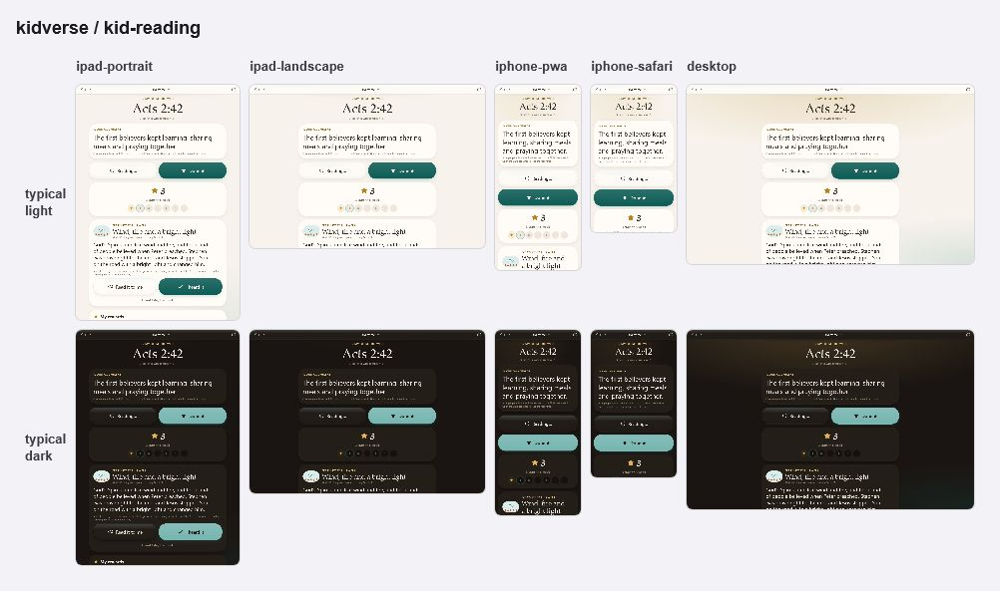

#### kidverse / kid-rewards

Ezra scrolled to My rewards: the balance to cash in, the six badges and the last cash-in. Typical: 3 to cash in, 4 badges, last cashed in Sep 20; overflow: hundreds to cash in, every badge; empty: nothing earned yet. Loading/offline: see the kid screen (the card stays hidden while loading; the cache looks like typical).

States: empty, typical, overflow · devices: desktop, ipad-landscape, ipad-portrait, iphone-pwa, iphone-safari · 26 files: `audits/screens/kidverse/kid-rewards-<state>-<device>-<mode>.png`

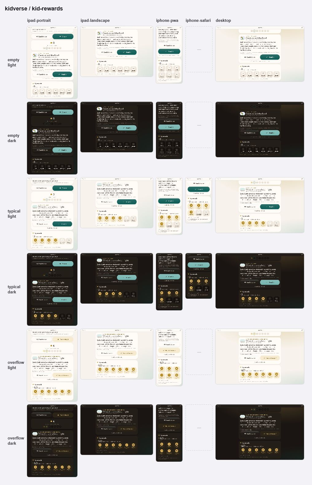

#### kidverse / kid-stalled

First open with no cache on a slow connection, about 7 s in: hub.ready stops waiting after 6 s (apps/hub.js:336-337) and Kid Verse renders from an empty cache, scrolled to the buttons. "Ezra · Week 1", Genesis 1:27, "No stars yet this week", 0 to cash in, and Done ★ live, although the family is on week 38 and Ezra has ★3. reconcile() waits for a real pull (apps/kidverse.html:467-469), but award() does not (:323-334), so a tap here writes a fresh stars row stamped now that out-dates the real one (apps/hub.js:236). Loading only.

States: loading · devices: desktop, ipad-landscape, ipad-portrait, iphone-pwa · 8 files: `audits/screens/kidverse/kid-stalled-<state>-<device>-<mode>.png`

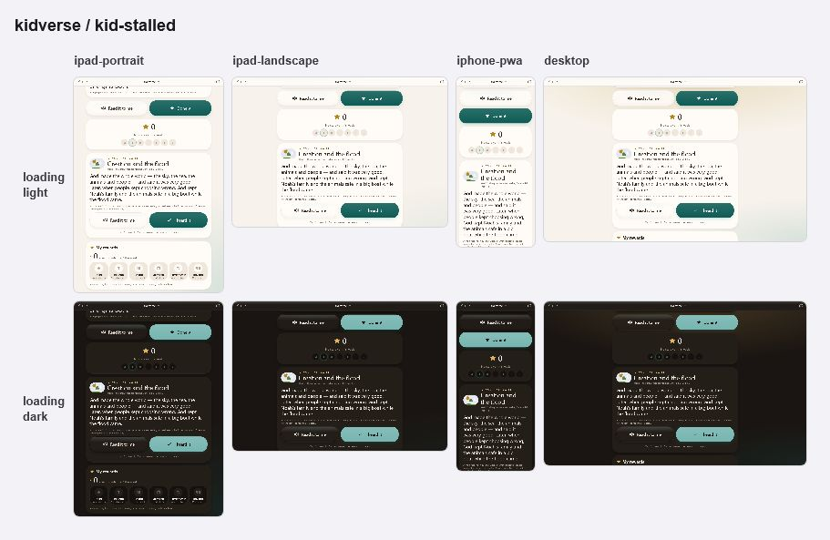

#### kidverse / kid-stars

Ezra scrolled to his buttons and "my stars this week" (the count and seven day dots), which sit below the fold on phones and desktop. Typical: Done ★ still to do, ★3; overflow: "Done today ★", ★6; empty: no stars yet. Loading/offline: see the kid screen (the card stays hidden while loading; the cache looks like typical).

States: empty, typical, overflow · devices: desktop, ipad-landscape, ipad-portrait, iphone-pwa, iphone-safari · 26 files: `audits/screens/kidverse/kid-stars-<state>-<device>-<mode>.png`

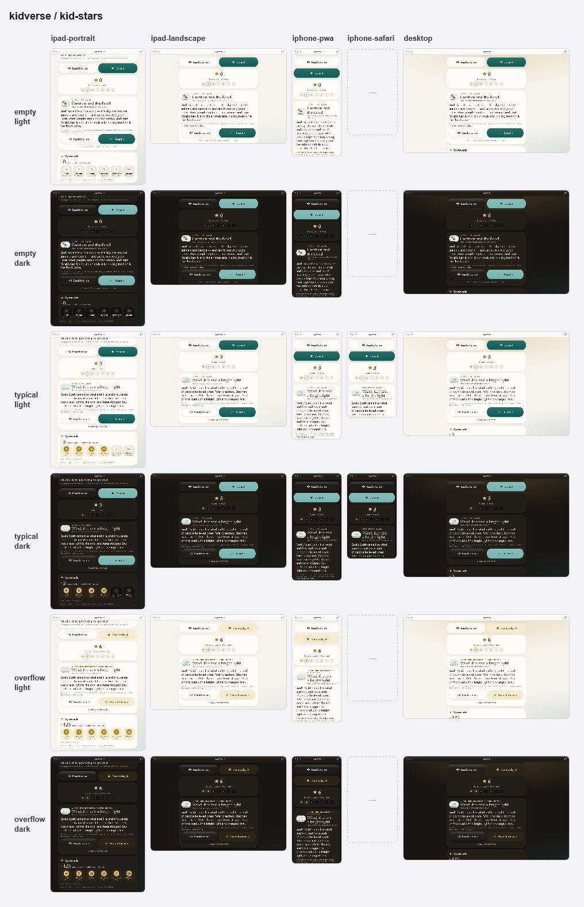

#### kidverse / kid-story

Ezra scrolled to this week's story card (retelling, Read it to me / I heard it). Overflow has the story already heard today. Loading/offline look the same as on the kid screen, so they are captured there only.

States: empty, typical, overflow · devices: desktop, ipad-landscape, ipad-portrait, iphone-pwa, iphone-safari · 26 files: `audits/screens/kidverse/kid-story-<state>-<device>-<mode>.png`

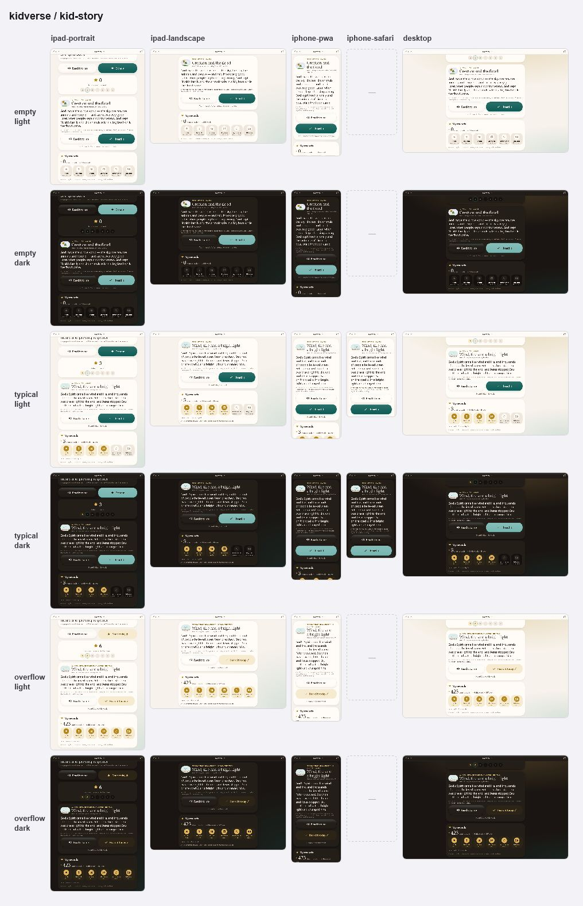

#### kidverse / kid-week-reset

The moment a parent's Reset week reaches the kid: Eli has just reset Ezra's week (Me → Kids' rewards), so Kid Verse applies the ledger row. Monday's verse ★ and story and today's prayed star are marked reset, the stars card drops from ★3 to "No stars yet this week" with no lit dots, the balance loses 3, and the toast "Your week starts over." shows. Done ★ stays open for today (apps/kidverse.html:451-458, 482-485). Added to the pull like kid-cashed-in. Typical only.

States: typical · devices: desktop, ipad-landscape, ipad-portrait, iphone-pwa, iphone-safari · 10 files: `audits/screens/kidverse/kid-week-reset-<state>-<device>-<mode>.png`

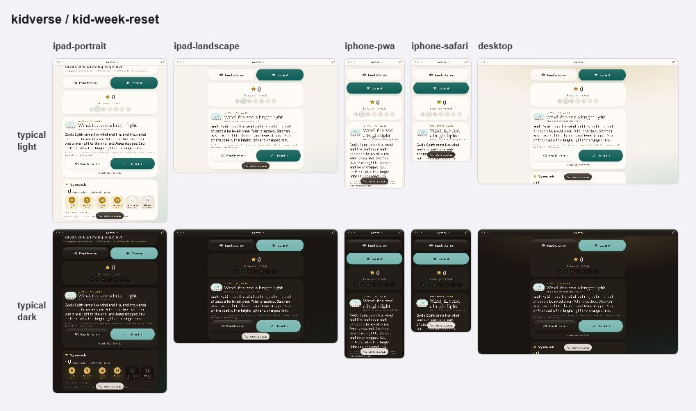

### leftovers

#### leftovers / add

Logging a leftover: the name field focused with "Chicken tortilla soup" typed and the size set to Large (not submitted). The on-screen keyboard, the size picker and the date picker are native and do not render in the capture (the page is not pushed up by a keyboard either). Nothing checks the name until Log: an empty name is ignored silently (:292).

States: typical · devices: desktop, ipad-landscape, ipad-portrait, iphone-pwa, iphone-safari · 10 files: `audits/screens/leftovers/add-<state>-<device>-<mode>.png`

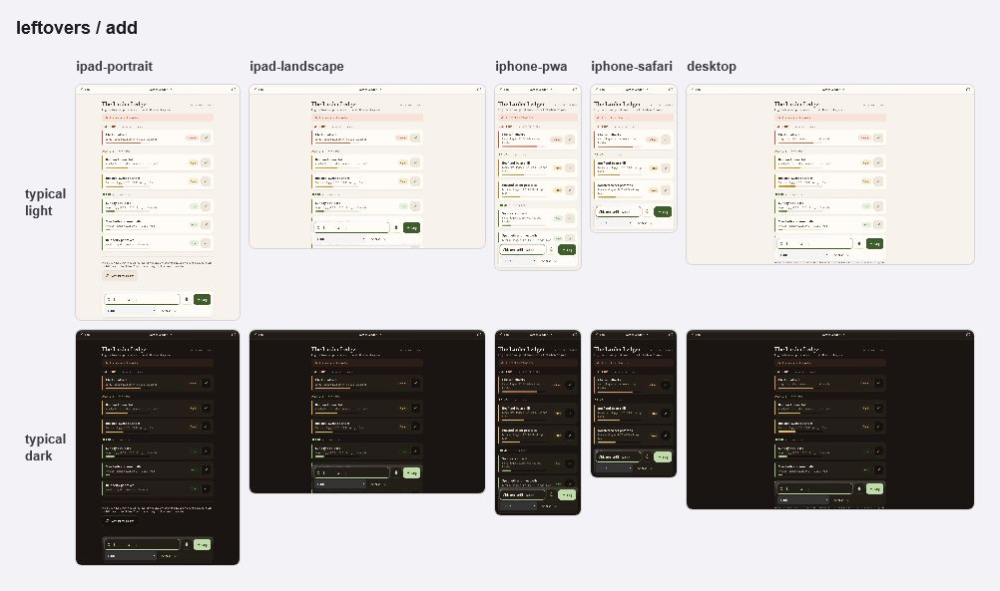

#### leftovers / copy

After tapping "Copy list for Hearth": the button label for ~2 s. typical: " Copied!" (WebKit's clipboard accepts). error: " Copy failed — select manually" (:353), made by a stub that refuses both navigator.clipboard.writeText and the execCommand("copy") fallback (:340-346), as Safari can in an iframe — the label asks the user to select text, but the copied text is never shown anywhere to select.

States: typical, error · devices: desktop, ipad-landscape, ipad-portrait, iphone-pwa, iphone-safari · 20 files: `audits/screens/leftovers/copy-<state>-<device>-<mode>.png`

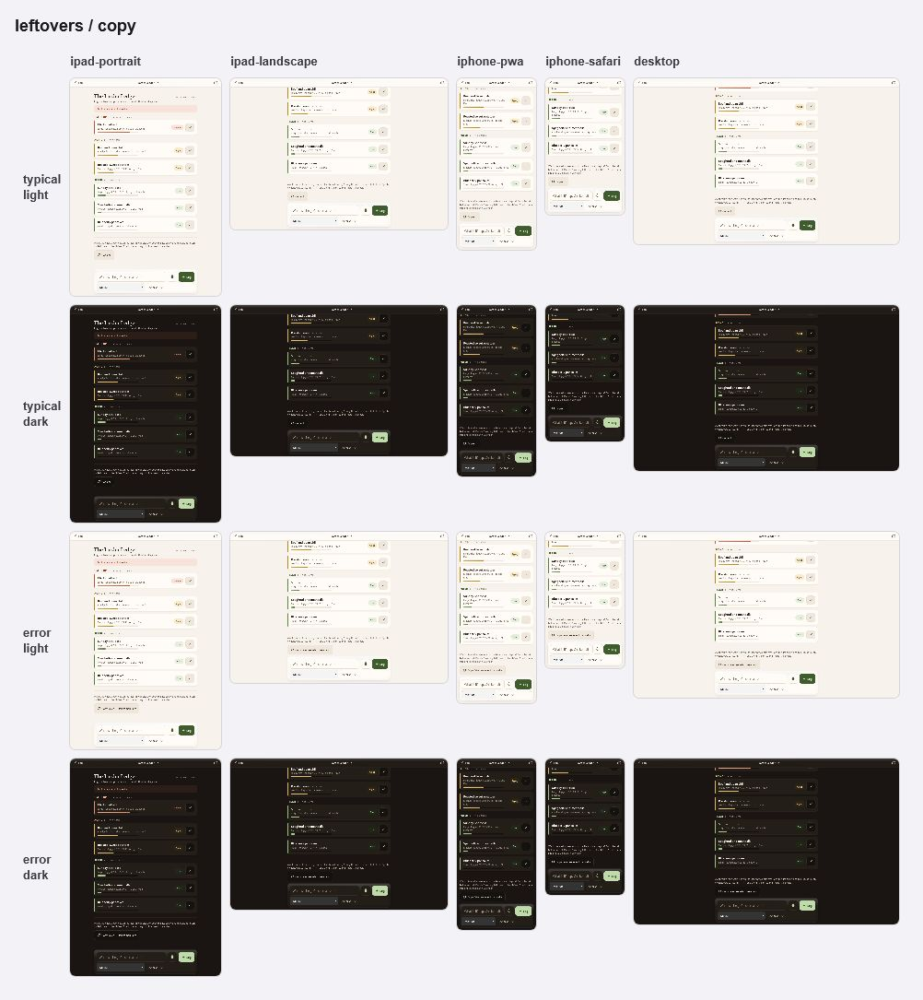

#### leftovers / finished

Right after tapping ✓ on the 8-day-old Chicken alfredo: the card and the red banner vanish at once — no confirm, no undo, no toast. With the banner gone, the AGING heading sits tight under the lede.

States: typical · devices: desktop, ipad-landscape, ipad-portrait, iphone-pwa, iphone-safari · 10 files: `audits/screens/leftovers/finished-<state>-<device>-<mode>.png`

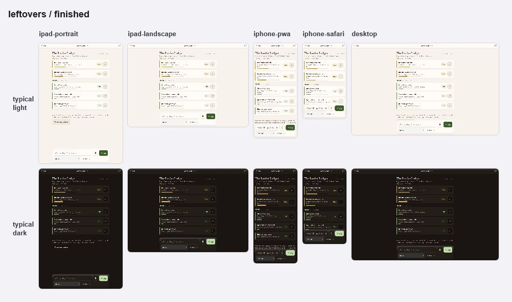

#### leftovers / kid

Ezra (5, pre-reader). The app has no kid rules: same text-heavy page, same ✓ buttons and add bar as an adult (a kid can log or finish family items). Guests see the adult page unchanged, so they have no screen of their own.

States: typical · devices: desktop, ipad-landscape, ipad-portrait, iphone-pwa, iphone-safari · 10 files: `audits/screens/leftovers/kid-<state>-<device>-<mode>.png`

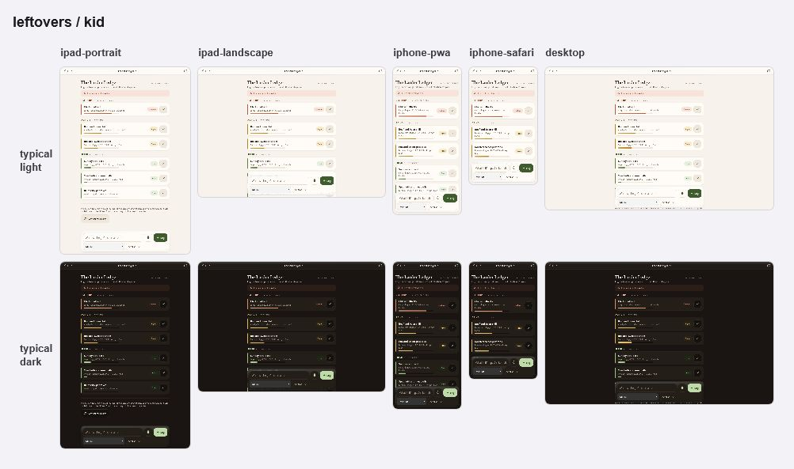

#### leftovers / logged

Right after logging "Chicken tortilla soup" (Large) online: the name field clears, the size snaps back to Medium, the tally reads 7 and the card lands at the end of Fresh (apps/leftovers.html:289-304). There is no toast or other confirmation, and the page does not scroll, so on phones and iPad landscape the new card is out of sight under the add bar. Compare queued (the same tap offline).

States: typical · devices: desktop, ipad-landscape, ipad-portrait, iphone-pwa, iphone-safari · 10 files: `audits/screens/leftovers/logged-<state>-<device>-<mode>.png`

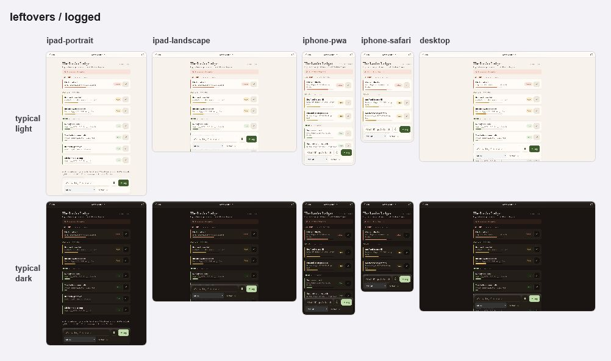

#### leftovers / lower

Scrolled to the bottom: the "Copy list for Hearth" section above the fixed add bar (overflow: the end of a 32-item list). On iPad portrait the typical page fits the screen, so lower-typical there is the same frame as main-typical. empty is omitted: the whole page fits on one screen there, so it is main-empty.

States: typical, overflow · devices: desktop, ipad-landscape, ipad-portrait, iphone-pwa, iphone-safari · 18 files: `audits/screens/leftovers/lower-<state>-<device>-<mode>.png`

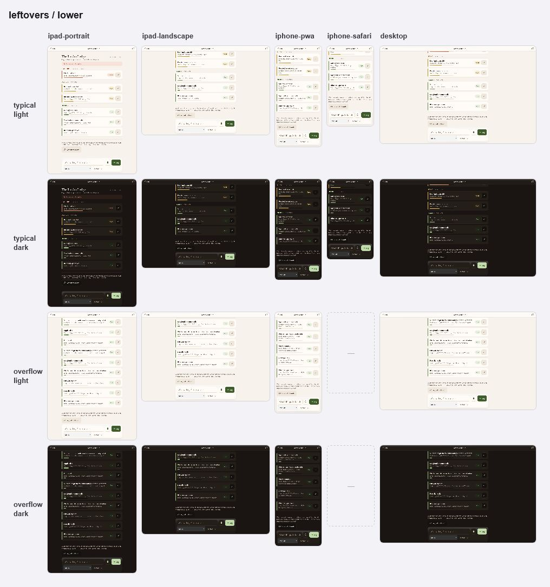

#### leftovers / main

Top of the ledger as Eli. typical: 6 items, red banner for the 8-day-old alfredo; overflow: 32 items, long names; loading (1.2 s): data calls never answer; the bare page with no tally, no list, and blank Log/Copy buttons, size and date (they are filled after hub.ready); offline: warm cache, "Can't reach the house list" line; error: /api/data/leftovers answers 500 {error:"internal"} (with CORS headers, as the Worker does) after a warm load (t.failApi, since no tap can cause it) → "The house list had a problem: internal."

States: empty, typical, overflow, loading, offline, error · devices: desktop, ipad-landscape, ipad-portrait, iphone-pwa, iphone-safari · 52 files: `audits/screens/leftovers/main-<state>-<device>-<mode>.png`

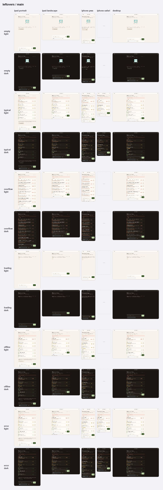

Console errors seen: `error: Failed to load resource: the server responded with a status of 500 (Internal Server Error)`

#### leftovers / middle

overflow, scrolled so the AGING group heading is at the top: the middle of a 32-item list that neither main (the top) nor lower (the end) reaches on iPad or desktop — the amber group with the longest byName ("Great-Aunt Wilhelmina Fairweather-Pennington") and 80-90-character names. typical is omitted: its Aging group is already in main.

States: overflow · devices: desktop, ipad-landscape, ipad-portrait, iphone-pwa · 8 files: `audits/screens/leftovers/middle-<state>-<device>-<mode>.png`

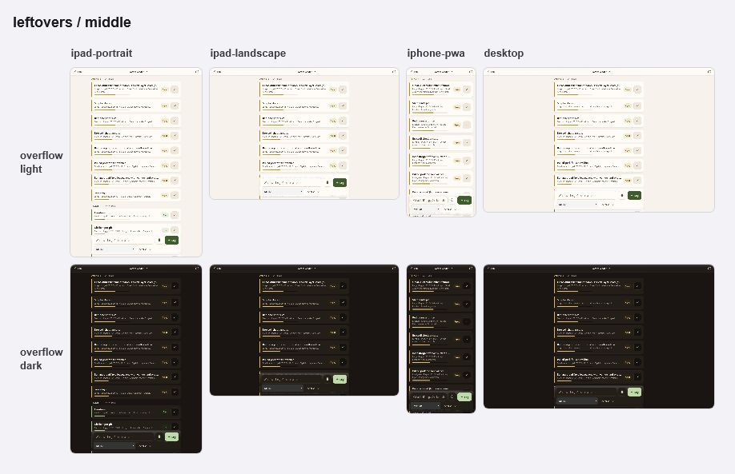

#### leftovers / queued

Logged while offline: "Chicken tortilla soup" lands at once at the end of Fresh ("7 in the fridge") and the sync line adds "Your changes will send when it is back." (the write waits in hub.js's local queue). The page does not scroll after Log, so on phones and iPad landscape the new card is below the fixed add bar, off-screen, as the user sees it; it has no pending marker of its own.

States: offline · devices: desktop, ipad-landscape, ipad-portrait, iphone-pwa · 8 files: `audits/screens/leftovers/queued-<state>-<device>-<mode>.png`

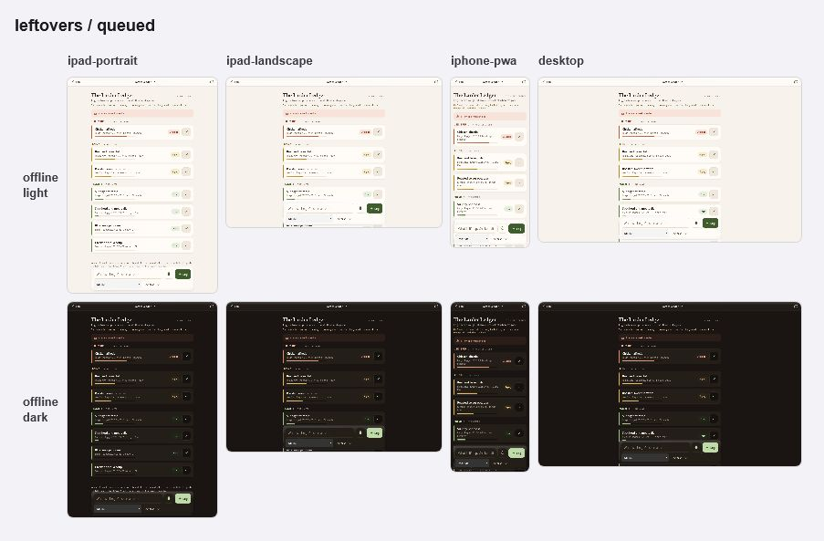

#### leftovers / slow-sync

A device with the list cached opens the ledger while the house server is slow (after a warm load the screen holds /api/data/leftovers with t.hold, so the pull never returns in time): the cached list shows under "Can't reach the house list — showing the last copy saved here." Every warm open shows that line until the first pull returns, because hub.sync starts as 'offline' (apps/hub.js:51) and the ledger subscribes after hub.ready (apps/leftovers.html:183).

States: typical · devices: desktop, ipad-landscape, ipad-portrait, iphone-pwa, iphone-safari · 10 files: `audits/screens/leftovers/slow-sync-<state>-<device>-<mode>.png`


#### leftovers / stalled

First open with no cache, still waiting 7.5 s in: hub.ready stops waiting after 6 s (apps/hub.js:337) and the ledger renders "0 in the fridge" + "Nothing logged yet." + "Can't reach the house list" (hub.sync starts as 'offline', apps/hub.js:51), although the server is only slow, not unreachable, and the list is not empty.

States: loading · devices: desktop, ipad-landscape, ipad-portrait, iphone-pwa · 8 files: `audits/screens/leftovers/stalled-<state>-<device>-<mode>.png`

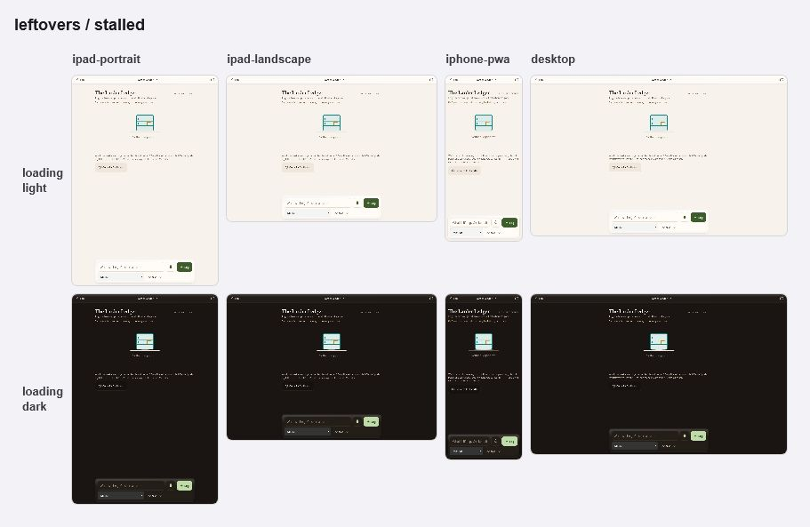

#### leftovers / voice

Voice add: the mic beside the name field only exists where the browser has SpeechRecognition (apps/leftovers.html:315; hub.js:427). Safari on iOS/macOS has it; Playwright WebKit does not, so the rig gives every capture an inert stand-in and this screen swaps in one that can report "no-speech" (no audio either way). typical: the mic just tapped and listening (.mic.on: red tint; its pulse is frozen by the capture) — there is no "Listening…" text. error: recognition ended with "no-speech" → "Couldn't hear that — try again or type it." under the fields (:322). The system's microphone/speech permission prompt on first use is native and not captured.

States: typical, error · devices: desktop, ipad-landscape, ipad-portrait, iphone-pwa, iphone-safari · 20 files: `audits/screens/leftovers/voice-<state>-<device>-<mode>.png`

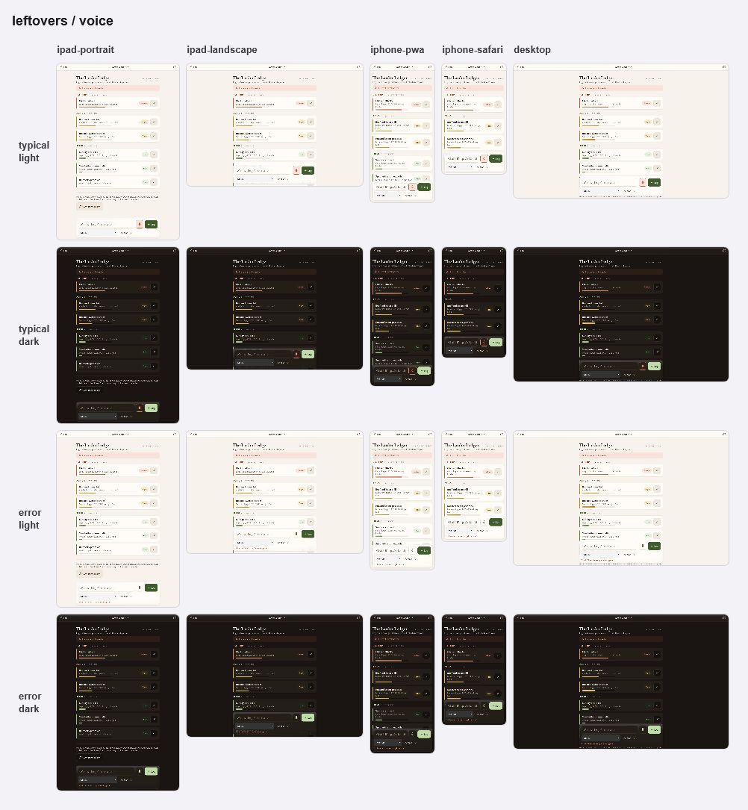

### prayer

#### prayer / add

Add tab: title with the mic button (the rig's inert speech stub stands in for Safari's, so it shows as on an iPad), who, detail, phone, category, cadence chips. error: "Add to the list" with no title → "Add a few words about what you are praying for." The form does not depend on the list's data, so empty/overflow are the same picture; offline changes nothing visible. On the phones "Add to the list" starts under the nav (scroll to reach it).

States: typical, error · devices: desktop, ipad-landscape, ipad-portrait, iphone-pwa, iphone-safari · 20 files: `audits/screens/prayer/add-<state>-<device>-<mode>.png`

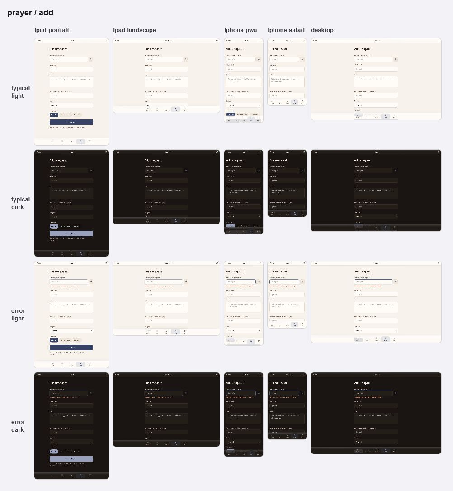

#### prayer / add-filled

Add form filled in: "On certain days" with Tue and Thu picked shows the day chips; category Friends. Scrolled so the chips and the Add button show.

States: typical · devices: desktop, ipad-landscape, ipad-portrait, iphone-pwa, iphone-safari · 10 files: `audits/screens/prayer/add-filled-<state>-<device>-<mode>.png`

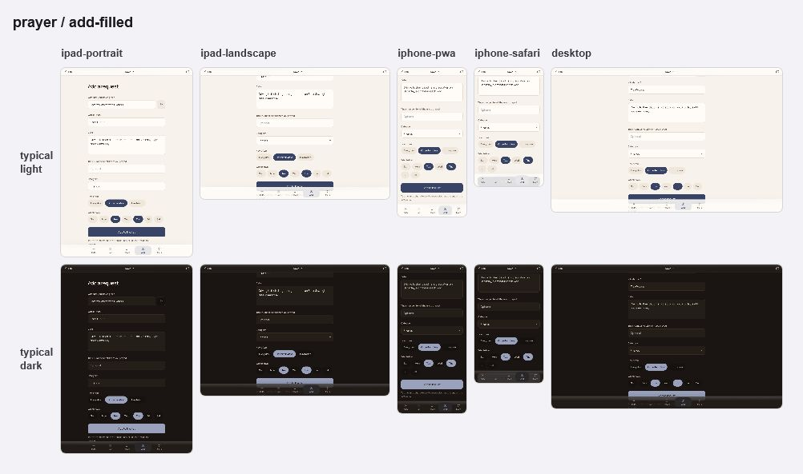

#### prayer / ask-answer

"Mark answered" opens an inline panel under the buttons (the app's stand-in for prompt()): a required note, "Mark answered" disabled until something is typed. Rig limit: no backdrop blur in this WebKit build, so the page behind shows through the sheet (and the nav) more sharply than on an iPad or iPhone.

States: typical · devices: desktop, ipad-landscape, ipad-portrait, iphone-pwa, iphone-safari · 10 files: `audits/screens/prayer/ask-answer-<state>-<device>-<mode>.png`

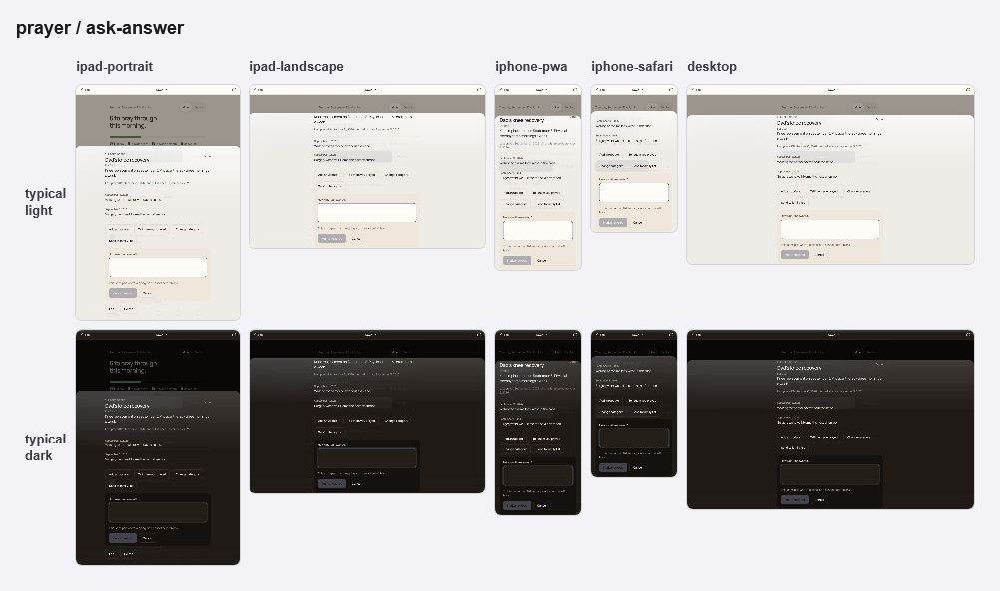

#### prayer / ask-delete

Delete on a family request: the red inline confirm (stand-in for confirm()) — "Sync does not carry deletions, so it can come back from another device." (the code does sync the delete, apps/prayer.html:692). Rig limit: no backdrop blur in this WebKit build, so the page behind shows through the sheet (and the nav) more sharply than on an iPad or iPhone.

States: typical · devices: desktop, ipad-landscape, ipad-portrait, iphone-pwa, iphone-safari · 10 files: `audits/screens/prayer/ask-delete-<state>-<device>-<mode>.png`

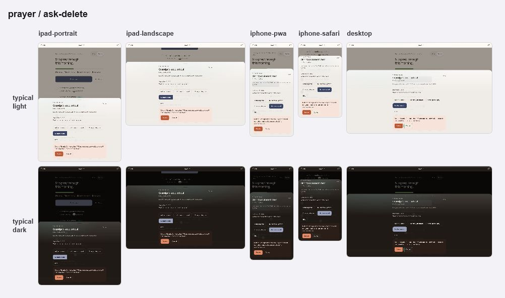

#### prayer / ask-recat

"Change category": the inline panel "Move to which category?" with the list's categories in a native select and Move / Cancel. Rig limit: no backdrop blur in this WebKit build, so the page behind shows through the sheet (and the nav) more sharply than on an iPad or iPhone.

States: typical · devices: desktop, ipad-landscape, ipad-portrait, iphone-pwa, iphone-safari · 10 files: `audits/screens/prayer/ask-recat-<state>-<device>-<mode>.png`

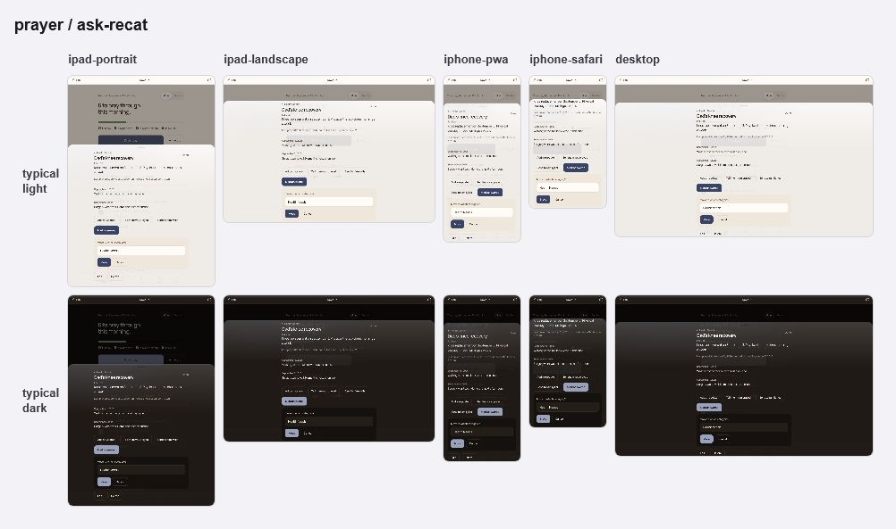

#### prayer / ask-share

"Send to family list" (private list only): the inline panel "How should this read on the family list?" with the title filled in, "Everyone in the house can see it." and Send. Sending would add a family row and show an "Added to the family list. Open it" toast (not captured: it writes). Rig limit: no backdrop blur in this WebKit build, so the page behind shows through the sheet (and the nav) more sharply than on an iPad or iPhone.

States: typical · devices: desktop, ipad-landscape, ipad-portrait, iphone-pwa, iphone-safari · 10 files: `audits/screens/prayer/ask-share-<state>-<device>-<mode>.png`

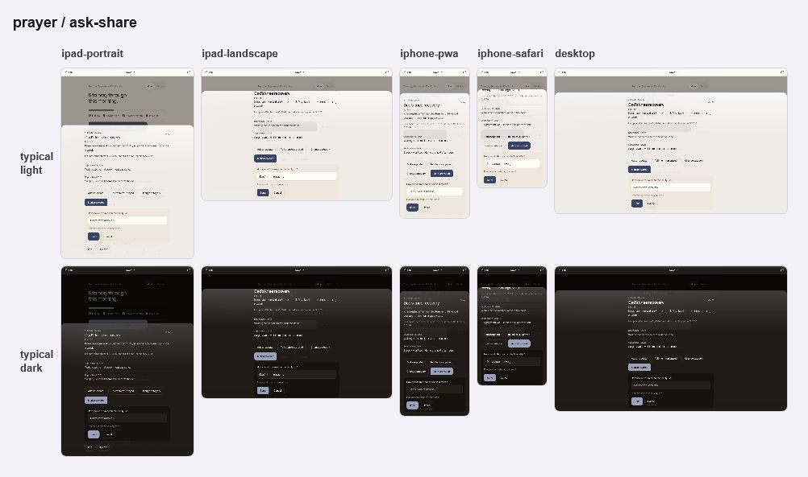

#### prayer / ask-tell

"Tell them you prayed" on a request with a number: the inline panel "Send this to Dad?" with the message filled in and "Open Messages" (an sms: link, not followed here). Without a number the button reads Copy. Rig limit: no backdrop blur in this WebKit build, so the page behind shows through the sheet (and the nav) more sharply than on an iPad or iPhone.

States: typical · devices: desktop, ipad-landscape, ipad-portrait, iphone-pwa, iphone-safari · 10 files: `audits/screens/prayer/ask-tell-<state>-<device>-<mode>.png`

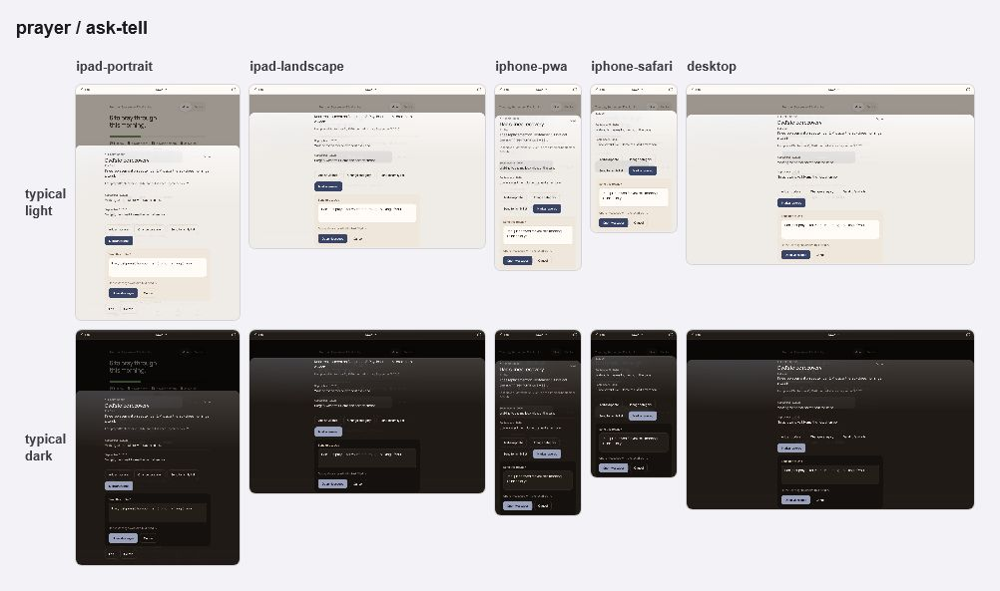

#### prayer / ask-update

"Add an update": the inline textarea panel "What is the update?" with Save disabled until something is typed (the app's stand-in for prompt()). Rig limit: no backdrop blur in this WebKit build, so the page behind shows through the sheet (and the nav) more sharply than on an iPad or iPhone.

States: typical · devices: desktop, ipad-landscape, ipad-portrait, iphone-pwa, iphone-safari · 10 files: `audits/screens/prayer/ask-update-<state>-<device>-<mode>.png`

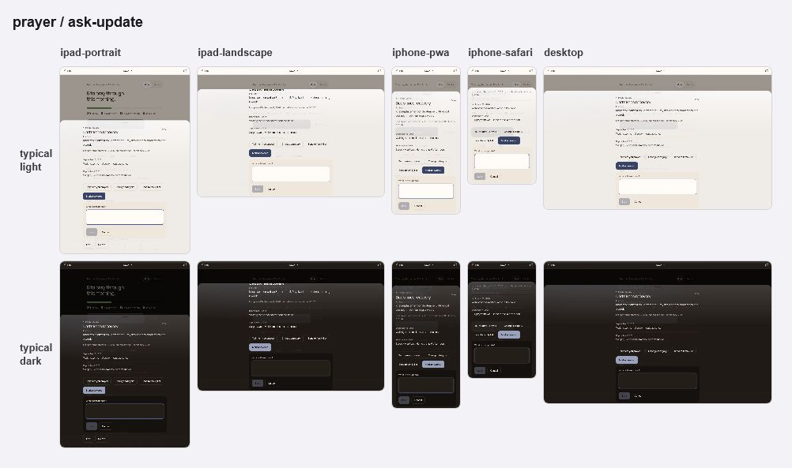

#### prayer / detail-answered

An answered request's sheet, from the Record: "Answered <date>" in gold, the note, and "Put back on the list". Rig limit: no backdrop blur in this WebKit build, so the page behind shows through the sheet (and the nav) more sharply than on an iPad or iPhone.

States: typical, overflow · devices: desktop, ipad-landscape, ipad-portrait, iphone-pwa, iphone-safari · 18 files: `audits/screens/prayer/detail-answered-<state>-<device>-<mode>.png`

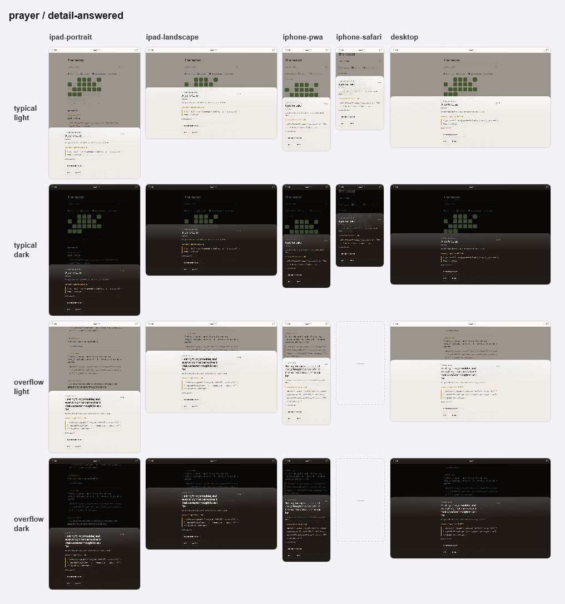

#### prayer / detail-family

A family request's sheet: no "Send to family list"; the delete warning differs (see ask-delete). The sheet shows neither who asked nor who prayed today. Rig limit: no backdrop blur in this WebKit build, so the page behind shows through the sheet (and the nav) more sharply than on an iPad or iPhone.

States: typical, overflow · devices: desktop, ipad-landscape, ipad-portrait, iphone-pwa, iphone-safari · 18 files: `audits/screens/prayer/detail-family-<state>-<device>-<mode>.png`

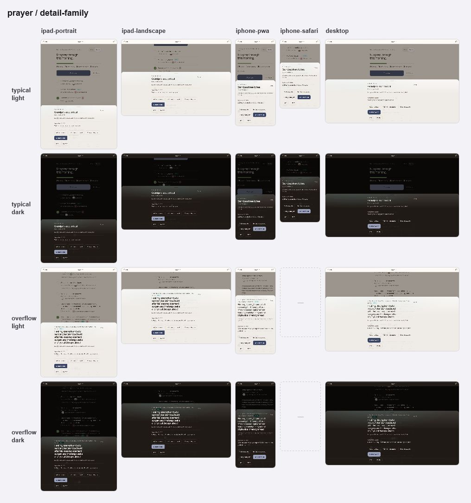

#### prayer / detail

Tapping a request opens its sheet: category, title, who, detail, last prayed / on the list since, history of updates, then Add an update · Tell them you prayed · Change category · Send to family list · Mark answered, and Edit · Delete. typical: "Dad's knee recovery"; overflow: long title, 400-character detail, 8 updates. Needs a request, so no empty/loading. The rows are opened with a mouse click: a touch tap on a row (a <div> handled only by a document-level click listener) fires no click in this WebKit build. The row body has cursor:pointer (apps/prayer.html:101), which is what lets iOS Safari dispatch a delegated click, so this is likely the rig's touch emulation — still worth one tap on a real iPhone/iPad. Rig limit: no backdrop blur in this WebKit build, so the page behind shows through the sheet (and the nav) more sharply than on an iPad or iPhone. Offline shots are in the system font, not Manrope: Google Fonts is unreachable and sw.js does not cache it (sw.js:36), as on a device whose browser cache no longer holds the fonts.

States: typical, overflow, offline · devices: desktop, ipad-landscape, ipad-portrait, iphone-pwa, iphone-safari · 26 files: `audits/screens/prayer/detail-<state>-<device>-<mode>.png`

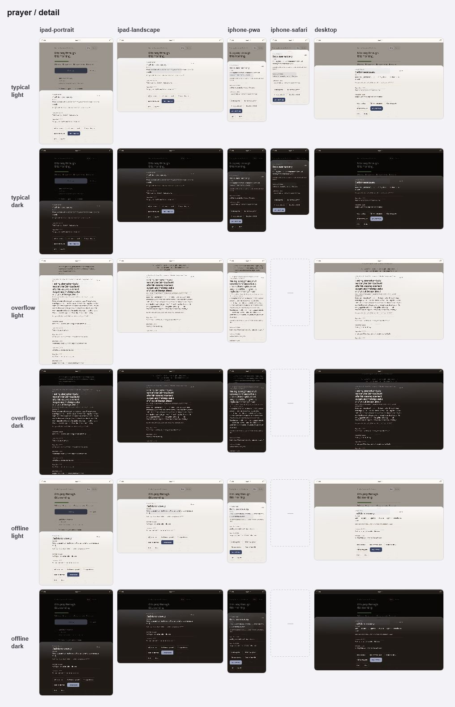

#### prayer / edit

Edit, in the same sheet: every field of the request, cadence chips, Save / Cancel. Rig limit: no backdrop blur in this WebKit build, so the page behind shows through the sheet (and the nav) more sharply than on an iPad or iPhone.

States: typical, overflow · devices: desktop, ipad-landscape, ipad-portrait, iphone-pwa, iphone-safari · 18 files: `audits/screens/prayer/edit-<state>-<device>-<mode>.png`

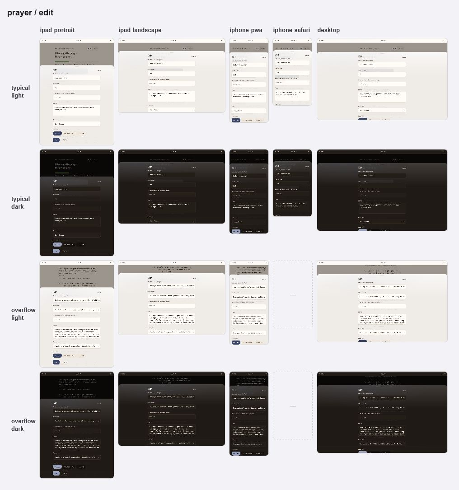

#### prayer / family-reset

Evidence of a data-loss bug, reproduced on purpose (compare today-family-typical): Eli switches to Family (activeList "shared", synced), then opens Prayer on a device that has never shown the family list (its family cache dropped; the shell's prayer/person cache kept). hub.ready does not wait for the family pull, the empty default family list renders, and todaySet() → save() writes the defaults over the real family settings with a newer updated_at, which the Worker accepts: the family streak and month count fall to 0 and the plan "Around the table" becomes "Everything" — for everyone. On the device that did it, today's rotation requests also drop out for the day (3/6 instead of 3/8; the frozen rotation was computed from the empty list). A kid opening Prayer on a new device takes the same path. Every capture performs the reset on its own fresh database.

States: typical · devices: desktop, ipad-landscape, ipad-portrait, iphone-pwa, iphone-safari · 10 files: `audits/screens/prayer/family-reset-<state>-<device>-<mode>.png`


#### prayer / guest

Guest Grandma Jo (adult rules): opens on her own empty private list — the illustrated empty state — with the Family switch next to it.

States: typical · devices: desktop, ipad-landscape, ipad-portrait, iphone-pwa, iphone-safari · 10 files: `audits/screens/prayer/guest-<state>-<device>-<mode>.png`


#### prayer / kid-all-prayed

Ezra after tapping Prayed on the six cards he had not prayed yet: "You prayed for everyone today!", every card in olive with his face added to the prayed-today row. No toast, sound or star here (Kid Verse credits the prayed day the next time it opens).

States: typical · devices: desktop, ipad-landscape, ipad-portrait, iphone-pwa, iphone-safari · 10 files: `audits/screens/prayer/kid-all-prayed-<state>-<device>-<mode>.png`

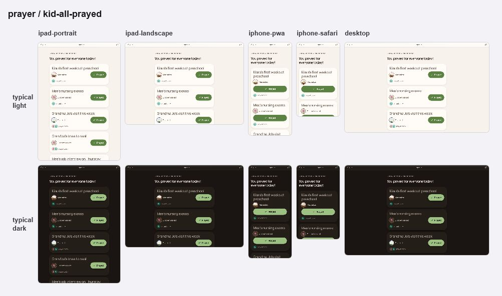

#### prayer / kid

Ezra (kid mode): the family list only, one big card per request with who asked and a 64 px Prayed button; no nav, switch, Pray now or Add. loading: 1.2 s in, before hub.ready — a blank page (kid CSS hides the switch, actions and strip, and there is no heading or card until the data arrives, up to 6 s on a slow start); offline: reopened from the warm cache. typical: 8 cards, the two he prayed this morning (Grandpa's knee, Mae's interview) in olive; overflow: 30 cards with long titles and long requester names (the cards with up to 9 prayed-today faces are further down, see kid-faces); empty: "Nothing to pray for yet." with the empty art. Opened as on a device that has shown Prayer before (warm family cache): a kid's first open on a new device resets the family settings instead — see family-reset. Offline shots are in the system font, not Manrope: Google Fonts is unreachable and sw.js does not cache it (sw.js:36), as on a device whose browser cache no longer holds the fonts.

States: empty, typical, overflow, loading, offline · devices: desktop, ipad-landscape, ipad-portrait, iphone-pwa, iphone-safari · 42 files: `audits/screens/prayer/kid-<state>-<device>-<mode>.png`

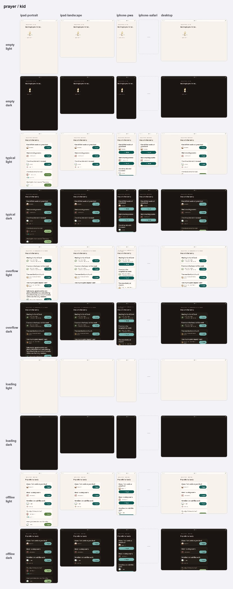

#### prayer / kid-faces

Kid cards scrolled to the one with the most people on today's prayed list: five faces then "+4", under "prayed today", on a card Ezra has prayed (olive).

States: overflow · devices: desktop, ipad-landscape, ipad-portrait, iphone-pwa · 8 files: `audits/screens/prayer/kid-faces-<state>-<device>-<mode>.png`

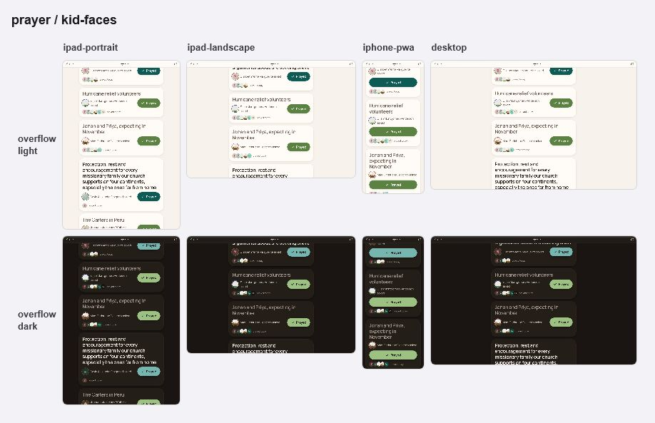

#### prayer / kitchen-family

Kitchen view of the family list (heading "Family list", category labels in teal).

States: typical · devices: desktop, ipad-landscape, ipad-portrait, iphone-pwa, iphone-safari · 10 files: `audits/screens/prayer/kitchen-family-<state>-<device>-<mode>.png`

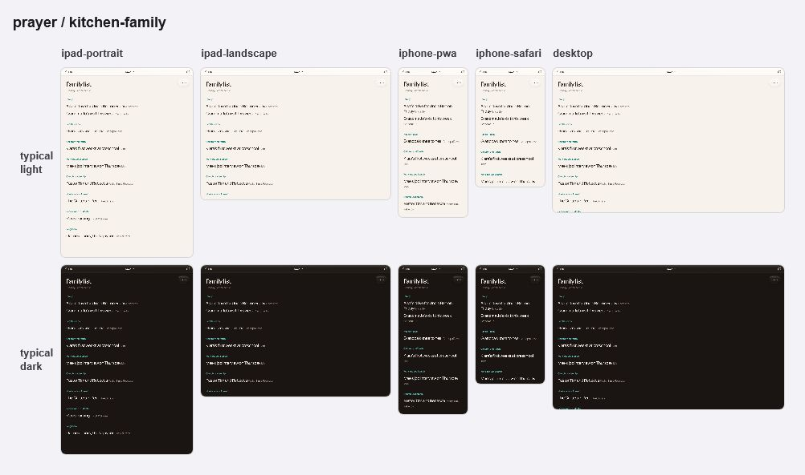

#### prayer / kitchen

More → Kitchen view: the whole active list in big type by category, with a glass Close. Reached only through More, which is hidden when today's list is empty.

States: typical, overflow · devices: desktop, ipad-landscape, ipad-portrait, iphone-pwa, iphone-safari · 18 files: `audits/screens/prayer/kitchen-<state>-<device>-<mode>.png`


#### prayer / list

List tab: search box and every active request grouped by category in closed <details> (count + Copy per group). Answered requests only appear when searching. overflow: 36 requests, five long custom category names. loading: the tab tap lands before hub.ready: go() switches the screen and the nav, then the render throws (D undefined, a pageerror in the console lines), so the heading and search box show over nothing, with no sign of loading. Offline shots are in the system font, not Manrope: Google Fonts is unreachable and sw.js does not cache it (sw.js:36), as on a device whose browser cache no longer holds the fonts.

States: empty, typical, overflow, loading, offline · devices: desktop, ipad-landscape, ipad-portrait, iphone-pwa, iphone-safari · 42 files: `audits/screens/prayer/list-<state>-<device>-<mode>.png`

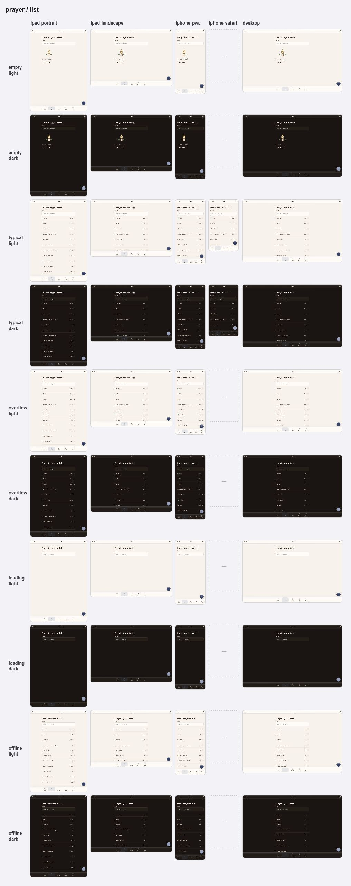

Console errors seen: `pageerror: undefined is not an object (evaluating 'D.activeList')`

#### prayer / list-open

List tab with two category groups opened: the rows inside a group (mark circle, title, category, last update). typical: the first two groups; overflow: the first two groups with long custom category names (the long "Grandparents, Great-Grandparents and Extended Family Across Three States" group holds the longest titles), scrolled to. empty has no groups (list-empty).

States: typical, overflow · devices: desktop, ipad-landscape, ipad-portrait, iphone-pwa, iphone-safari · 18 files: `audits/screens/prayer/list-open-<state>-<device>-<mode>.png`

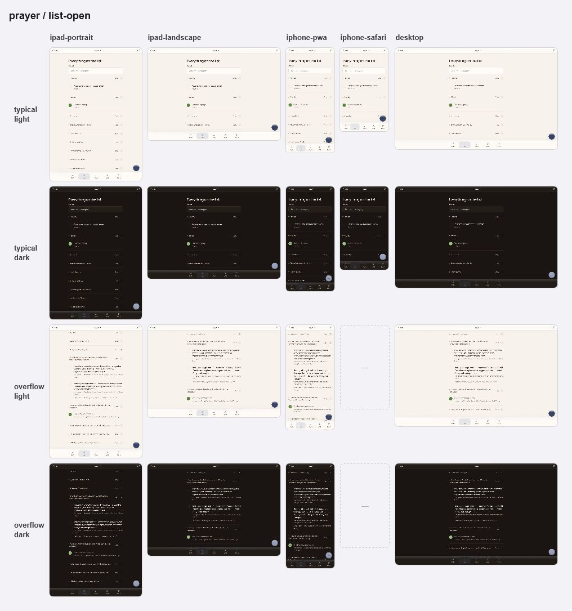

#### prayer / list-search

Searching: typical "job" finds the active interview request and, in its own "Answered" group, "A job for Luke"; overflow "the" matches most of the list and a long Answered group; empty: "Nothing matches that." The keyboard a phone would show is not emulated.

States: empty, typical, overflow · devices: desktop, ipad-landscape, ipad-portrait, iphone-pwa, iphone-safari · 26 files: `audits/screens/prayer/list-search-<state>-<device>-<mode>.png`

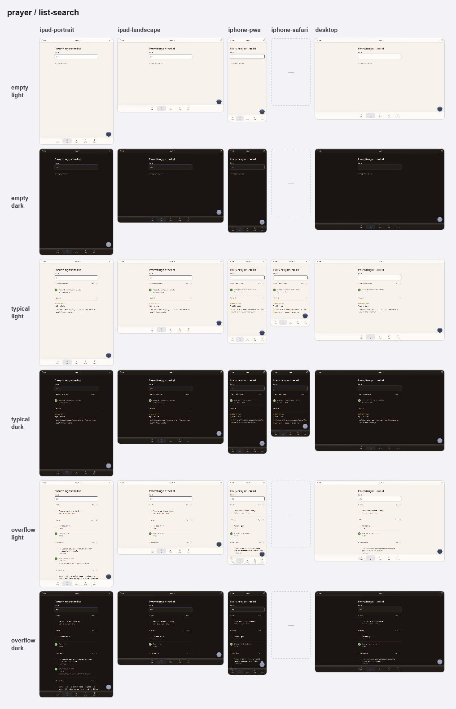

#### prayer / mark-answered

After "Mark answered" is saved: the app jumps to the Record, scrolled to the top (the new answer heads the Answered list under the calendar: in view on the tall screens, below the fold on iPhone Safari and the landscape ones), with the "Moved to the record." toast and Undo for 6 s.

States: typical · devices: desktop, ipad-landscape, ipad-portrait, iphone-pwa, iphone-safari · 10 files: `audits/screens/prayer/mark-answered-<state>-<device>-<mode>.png`

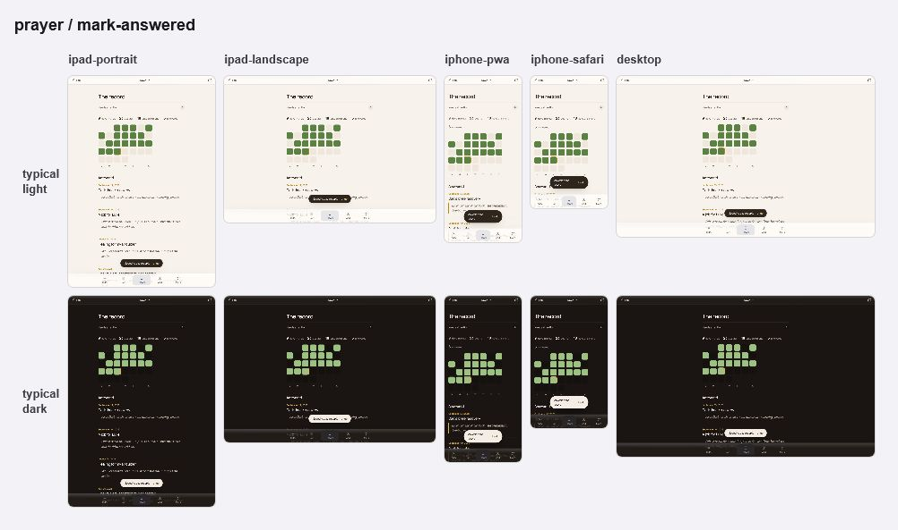

#### prayer / more-copy

More → "Copy as text". typical: the clipboard accepts, the sheet closes and a "Copied 9 requests." toast shows (the copied text itself is never shown). error: the clipboard refuses (as Safari may inside an iframe) — the screen makes navigator.clipboard.writeText reject before the app loads — and the sheet stays up with the "Copy this yourself" box holding the list (apps/prayer.html:1132-1139). Rig limit: no backdrop blur in this WebKit build, so the page behind shows through the sheet (and the nav) more sharply than on an iPad or iPhone.

States: typical, error · devices: desktop, ipad-landscape, ipad-portrait, iphone-pwa, iphone-safari · 20 files: `audits/screens/prayer/more-copy-<state>-<device>-<mode>.png`

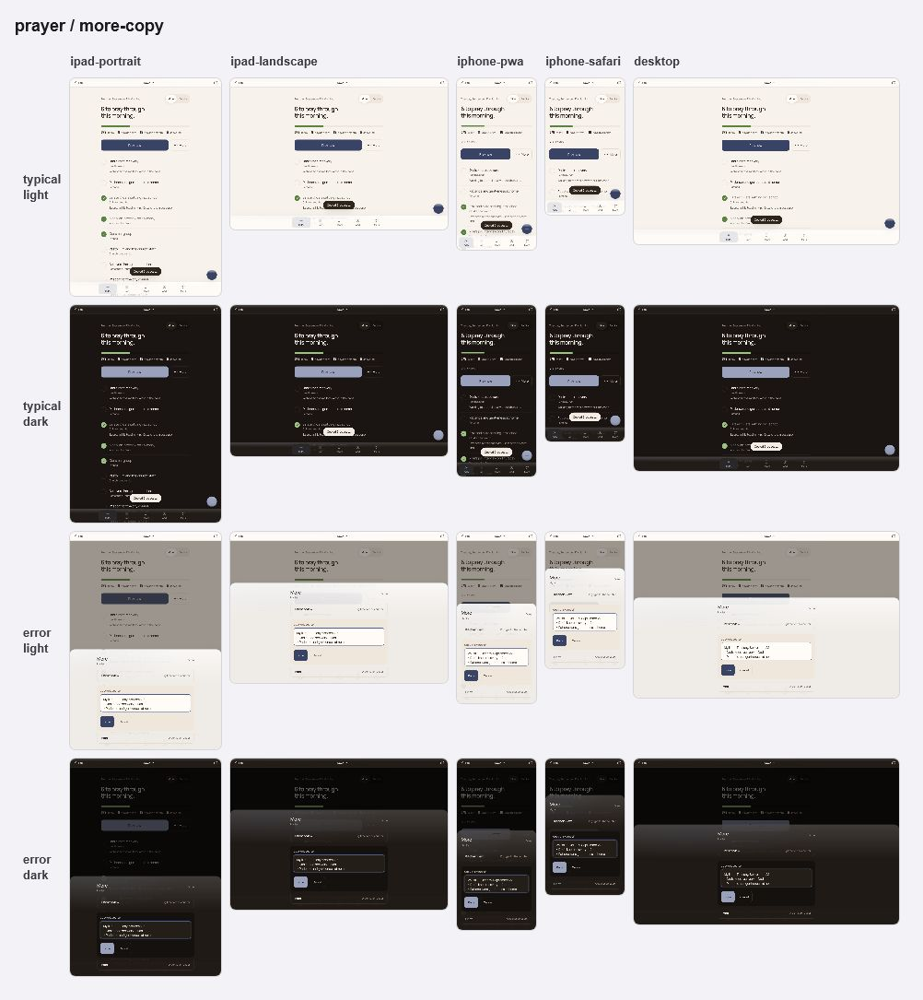

#### prayer / more

Today's More sheet: Kitchen view · Copy as text · Print. The same three for every list and variant; hidden when today's list is empty. Print calls window.print(), which the rig cannot show (manual check). Rig limit: no backdrop blur in this WebKit build, so the page behind shows through the sheet (and the nav) more sharply than on an iPad or iPhone.

States: typical · devices: desktop, ipad-landscape, ipad-portrait, iphone-pwa, iphone-safari · 10 files: `audits/screens/prayer/more-<state>-<device>-<mode>.png`

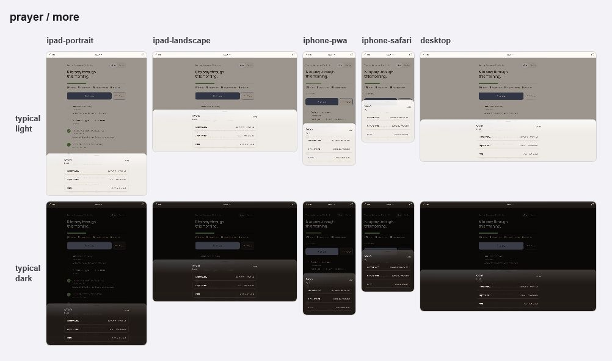

#### prayer / pray-mode-last

Pray now after five Skips: the sixth and last of the six still to pray, with "Prayed, finish" and the bar at 83%. Skip writes nothing.

States: typical · devices: desktop, ipad-landscape, ipad-portrait, iphone-pwa, iphone-safari · 10 files: `audits/screens/prayer/pray-mode-last-<state>-<device>-<mode>.png`

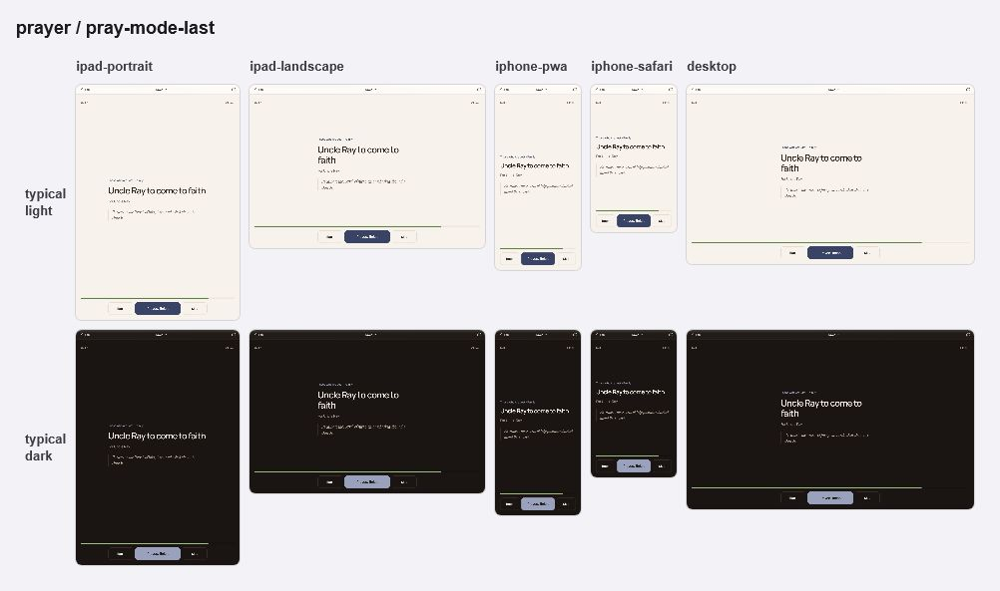

#### prayer / pray-mode

"Pray now": full-screen, one request at a time from those not yet prayed today — count, category, title, who, the last update in serif italic, progress bar, Back / Prayed / Skip. typical starts at "Dad's knee recovery"; overflow "1 of 23" on a five-line title under a two-line category ("That the whole extended family would come together…"). Swipe and keys (→, Space, Esc) are not shown.

States: typical, overflow · devices: desktop, ipad-landscape, ipad-portrait, iphone-pwa, iphone-safari · 18 files: `audits/screens/prayer/pray-mode-<state>-<device>-<mode>.png`

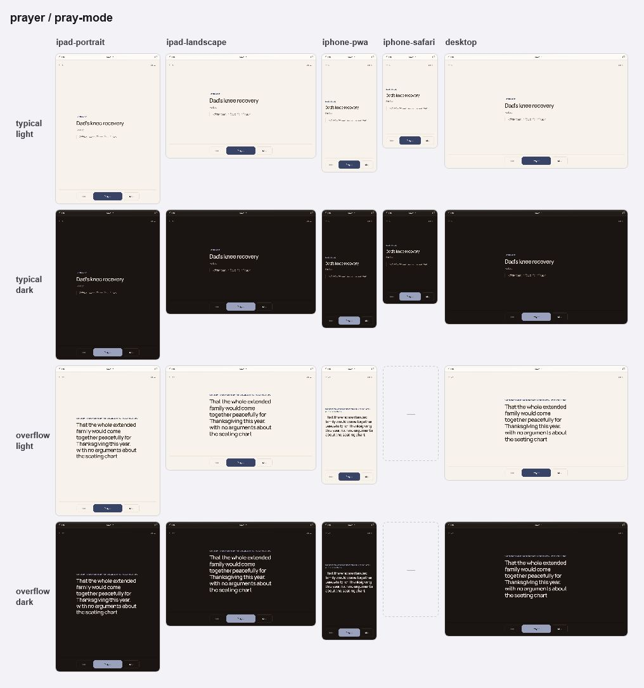

#### prayer / print

More → Print, as the page lays out for paper: the app builds #printArea (title, date, "N requests", a tick box per active request by category, answered in the last 90 days) and calls window.print(). The rig stubs window.print (the dialog cannot be captured) and switches the page to print media: the shell's bar hides as well, so the shot is the frame's print layout at the device's width, first screenful only — a stand-in for the paper page, not the paper page (no printer margins, no page breaks).

States: typical, overflow · devices: desktop, ipad-landscape, ipad-portrait, iphone-pwa, iphone-safari · 9 files: `audits/screens/prayer/print-<state>-<device>-<mode>.png`

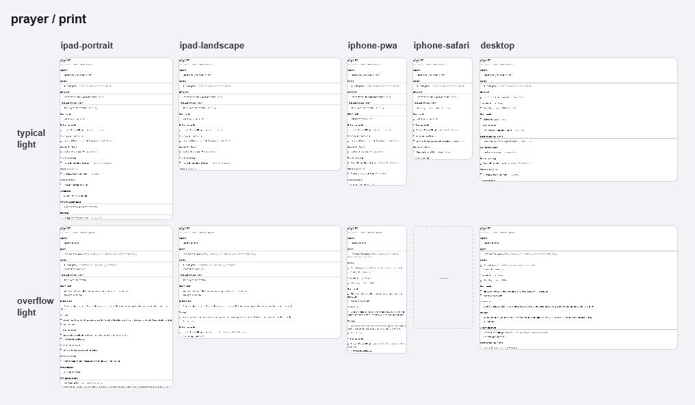

#### prayer / record-answered

Record scrolled to the Answered list (dates in gold, notes in Instrument Serif italic). empty: the list is one line ("Nothing answered yet"), see record-empty.

States: typical, overflow · devices: desktop, ipad-landscape, ipad-portrait, iphone-pwa, iphone-safari · 18 files: `audits/screens/prayer/record-answered-<state>-<device>-<mode>.png`

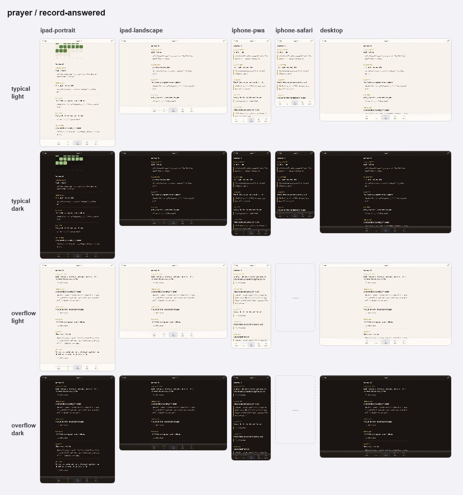

#### prayer / record

Record tab: "Needs attention" (folded unless the review is due), streak strip (in a row / best run / this month / answered), this month's calendar, then Answered with dates and notes. typical: 9 in a row, best 23, 18 days in September, 5 answered; overflow: 1204-day streak, 26 answered, review open. empty: "Nothing answered yet — it will come." loading: the tab tap lands before hub.ready: the screen and nav switch, then reviewDue() throws (D undefined), leaving the static heading, a folded "Needs attention" with no count and a bare "Answered" — and the + button, which the loaded Record never shows (screenName is never updated). overflow: a request can sit in two review groups and the count adds both. Offline shots are in the system font, not Manrope: Google Fonts is unreachable and sw.js does not cache it (sw.js:36), as on a device whose browser cache no longer holds the fonts.

States: empty, typical, overflow, loading, offline · devices: desktop, ipad-landscape, ipad-portrait, iphone-pwa, iphone-safari · 42 files: `audits/screens/prayer/record-<state>-<device>-<mode>.png`

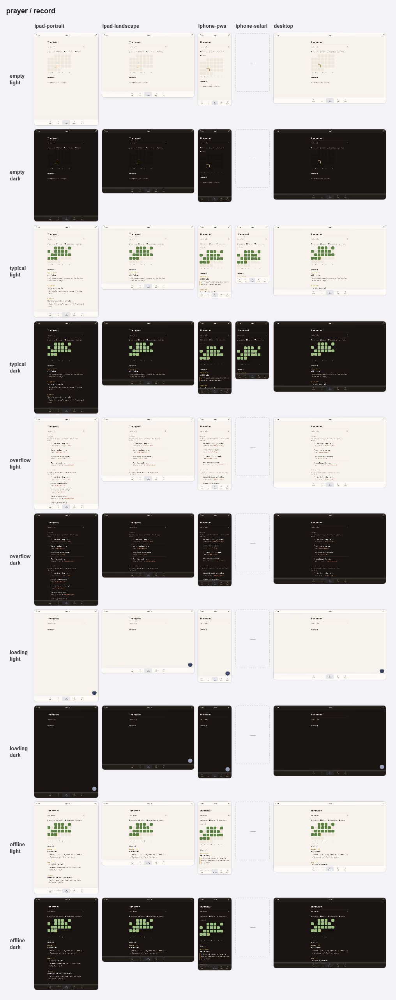

Console errors seen: `pageerror: undefined is not an object (evaluating 'D.lists')`

#### prayer / record-family

The family list's Record (Family switch, then Record): the family streak (typical 16 days, best run 16, 20 this month), its September calendar and the two answered family requests; overflow 701 days and 6 answered. These are the numbers family-reset wipes to 0.

States: typical, overflow · devices: desktop, ipad-landscape, ipad-portrait, iphone-pwa, iphone-safari · 18 files: `audits/screens/prayer/record-family-<state>-<device>-<mode>.png`

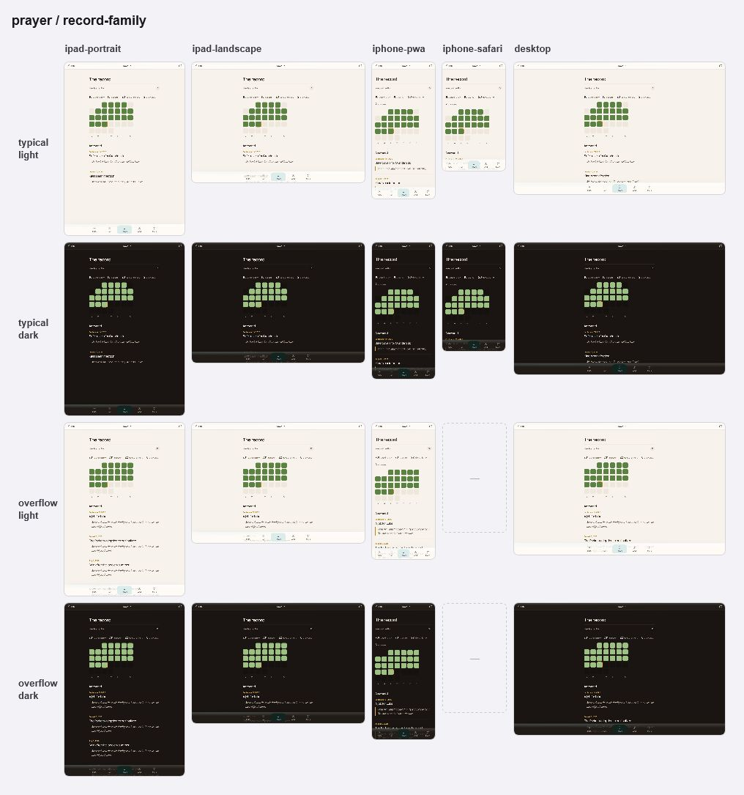

#### prayer / record-review

Record with "Needs attention" opened: Gone quiet / No news in a while / Added recently, each a list of rows. empty: "Nothing needs attention. The list is current." typical: tapped open (Believers facing persecution and the city council sit in both of the first two groups). overflow: the review is due, so it is already open on record-overflow; this one is scrolled to "No news in a while", the long second group.

States: empty, typical, overflow · devices: desktop, ipad-landscape, ipad-portrait, iphone-pwa, iphone-safari · 26 files: `audits/screens/prayer/record-review-<state>-<device>-<mode>.png`

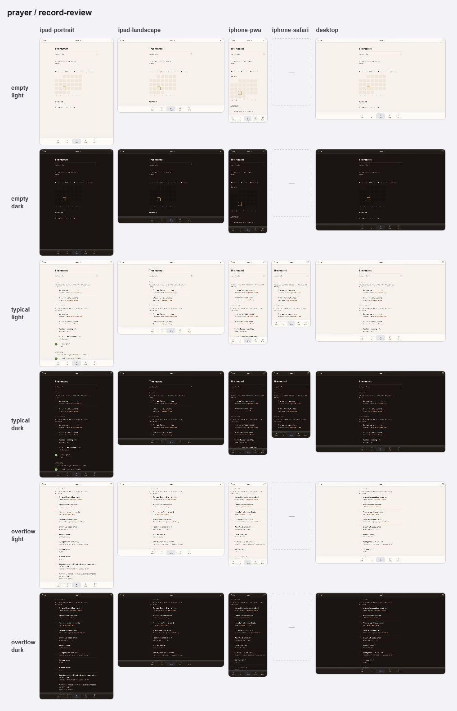

#### prayer / settings-byday

Elizabeth's by-day plan in Settings: day chips, the native multi-select of categories ("tap to toggle") and "Always include every-day requests".

States: typical · devices: desktop, ipad-landscape, ipad-portrait, iphone-pwa, iphone-safari · 10 files: `audits/screens/prayer/settings-byday-<state>-<device>-<mode>.png`

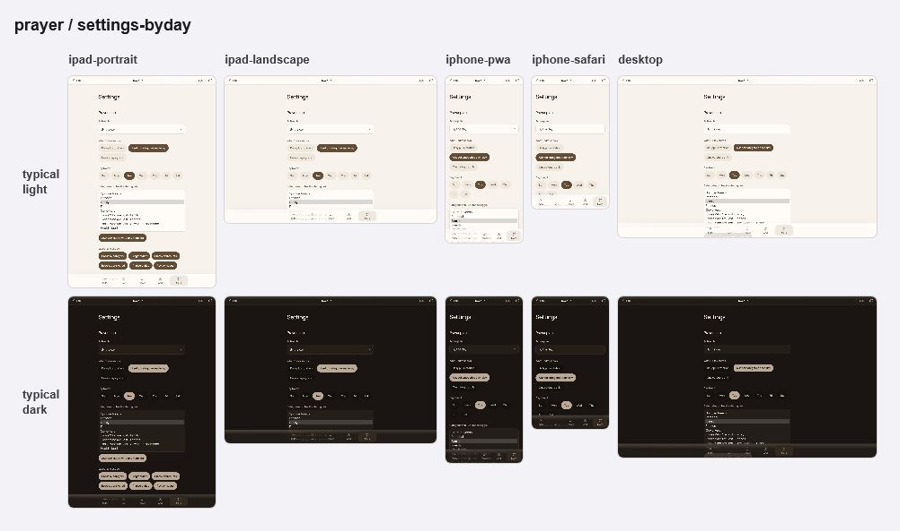

#### prayer / settings-categories

Settings scrolled to Categories: each with its dot, active count, Rename / Remove (small text buttons, padding 5px 3px, well under 44 px), then Add a category and Backup. typical: the top of the list; overflow: the end of its 33, where the five long custom names wrap beside Rename / Remove.

States: typical, overflow · devices: desktop, ipad-landscape, ipad-portrait, iphone-pwa, iphone-safari · 18 files: `audits/screens/prayer/settings-categories-<state>-<device>-<mode>.png`


#### prayer / settings-delcat

Remove on a category that holds requests: the red inline confirm under its row ("2 requests are in "Health Needs". Remove it and move them to Personal?"). overflow: the longest custom category. Nothing is removed.

States: typical, overflow · devices: desktop, ipad-landscape, ipad-portrait, iphone-pwa, iphone-safari · 18 files: `audits/screens/prayer/settings-delcat-<state>-<device>-<mode>.png`

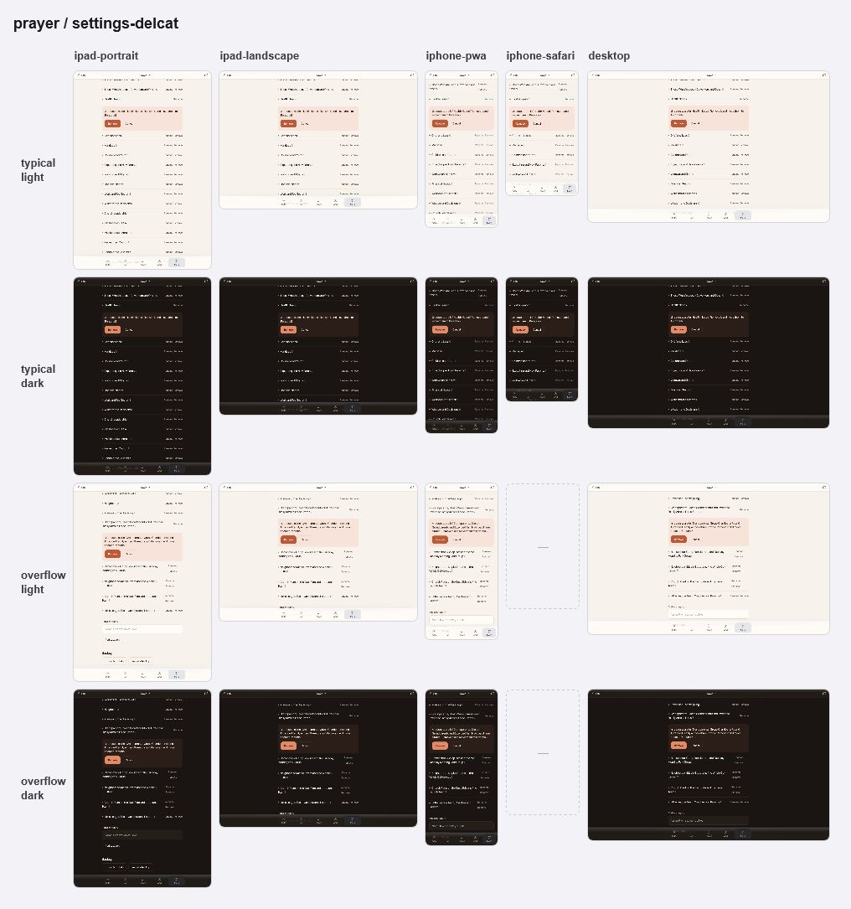

#### prayer / settings

More tab (#s-more, titled "Settings"): Prayer plan (active plan select, what Today shows, rotation size, layout chips, Rename/Delete plan, New plan), Paste a list, Categories, Backup. overflow: three long plan names, 33 categories. loading: the tab tap lands before hub.ready, the screen switches and the render throws: the static form with an empty plan select, no plan editor and no categories, but live-looking New plan, Read these lines, Add category and Export/Import buttons. Offline shots are in the system font, not Manrope: Google Fonts is unreachable and sw.js does not cache it (sw.js:36), as on a device whose browser cache no longer holds the fonts.

States: empty, typical, overflow, loading, offline · devices: desktop, ipad-landscape, ipad-portrait, iphone-pwa, iphone-safari · 42 files: `audits/screens/prayer/settings-<state>-<device>-<mode>.png`

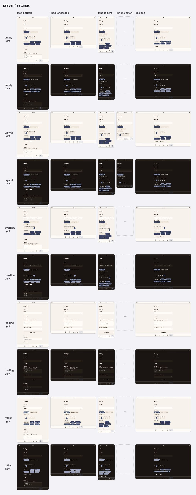

Console errors seen: `pageerror: undefined is not an object (evaluating 'D.activeList')`

#### prayer / settings-import

Backup → "Import a backup": the inline panel "Paste the contents of a backup file" with "This replaces both lists on this device." (Import stays disabled until something is pasted). "Export both lists" downloads a JSON file, which the rig does not follow.

States: typical · devices: desktop, ipad-landscape, ipad-portrait, iphone-pwa, iphone-safari · 10 files: `audits/screens/prayer/settings-import-<state>-<device>-<mode>.png`

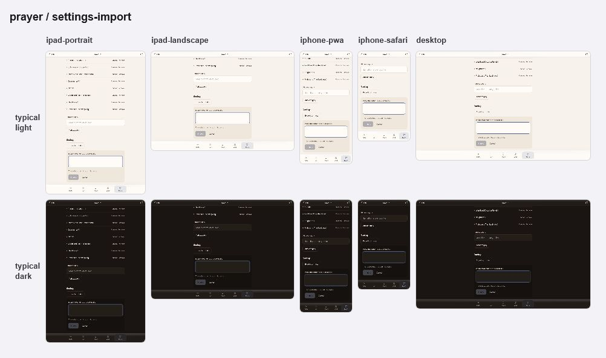

#### prayer / settings-paste

Paste a list → "Read these lines": the parsed requests with a Keep button each and Keep all (nothing is kept here).

States: typical · devices: desktop, ipad-landscape, ipad-portrait, iphone-pwa, iphone-safari · 10 files: `audits/screens/prayer/settings-paste-<state>-<device>-<mode>.png`


#### prayer / stalled

Loading that never finishes, 7.5 s in: hub.ready stops waiting after 6 s (apps/hub.js:337) and Prayer renders "Nothing on this list yet." with the Add button, although the lists simply have not arrived — pixel-identical to today-empty, so a slow start cannot be told from an empty list. It also queues the default settings of Eli's list (the rig guard line in the console): held here, but on a real slow start they would be sent once the network answers and, being newer, replace his real plan and streak.

States: loading · devices: desktop, ipad-landscape, ipad-portrait, iphone-pwa · 8 files: `audits/screens/prayer/stalled-<state>-<device>-<mode>.png`

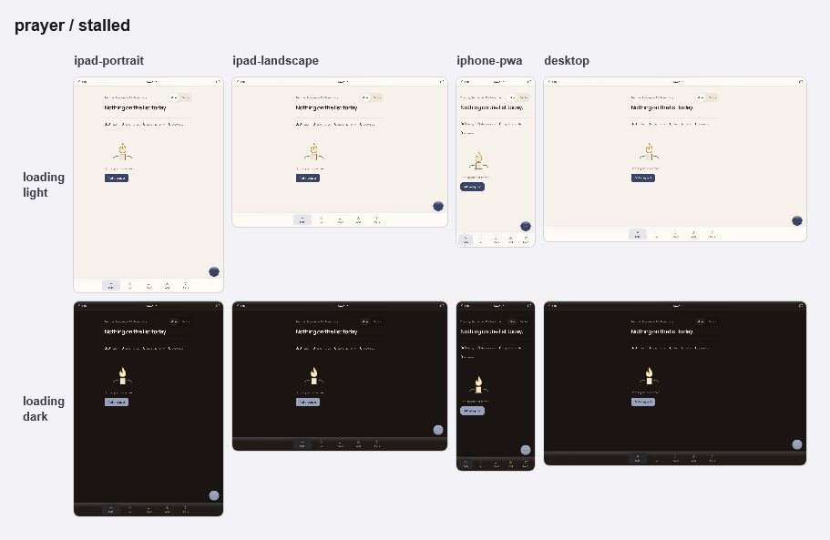

#### prayer / today-done

Pray now → "Prayed" through the six still to pray: back on Today, "You have prayed through the whole list.", the meter full, 9/9, the milestone cheer line ("9 days in a row.") and the finish toast repeating it. Only typical: the same page for any list once every row is done.

States: typical · devices: desktop, ipad-landscape, ipad-portrait, iphone-pwa, iphone-safari · 10 files: `audits/screens/prayer/today-done-<state>-<device>-<mode>.png`

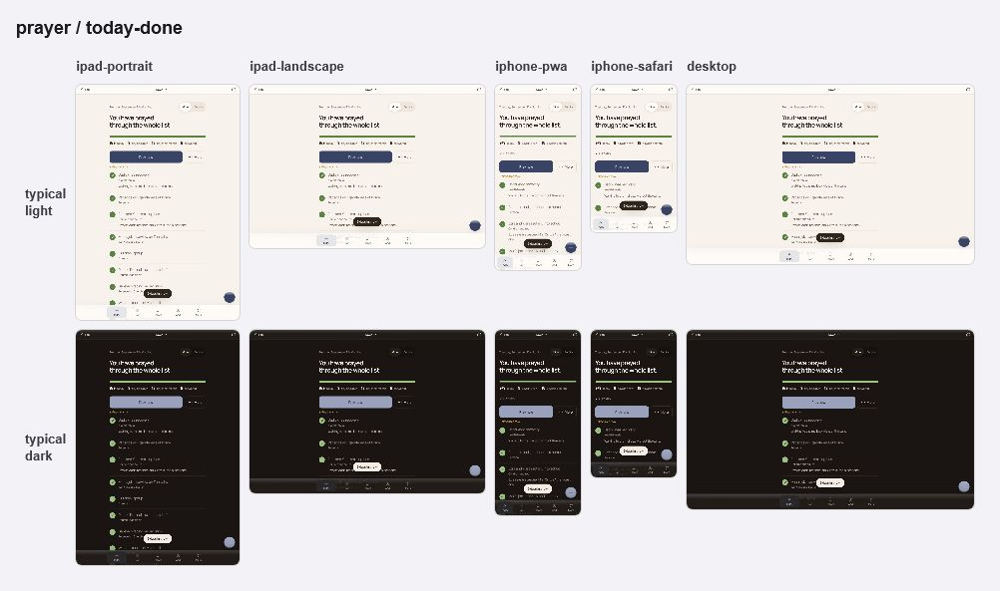

#### prayer / today

Eli's own list (Mine). typical: plan "Morning", 9 today, 3 done ("6 to pray through this morning"), three quiet rotation rows in terracotta, a two-year anniversary and "Answered recently"; overflow: 34 today, 11 done, long titles and a long custom category at the top, the review nudge, a 1204-day streak, long plan name; empty: illustrated empty state; loading: 1.2 s in, before hub.ready — the static page (no date, no headline, but "Pray now" and More already showing); offline: reopened from the warm cache (the app has no offline indicator of its own). No error state: the app has no error UI. Offline shots are in the system font, not Manrope: Google Fonts is unreachable and sw.js does not cache it (sw.js:36), as on a device whose browser cache no longer holds the fonts.

States: empty, typical, overflow, loading, offline · devices: desktop, ipad-landscape, ipad-portrait, iphone-pwa, iphone-safari · 42 files: `audits/screens/prayer/today-<state>-<device>-<mode>.png`

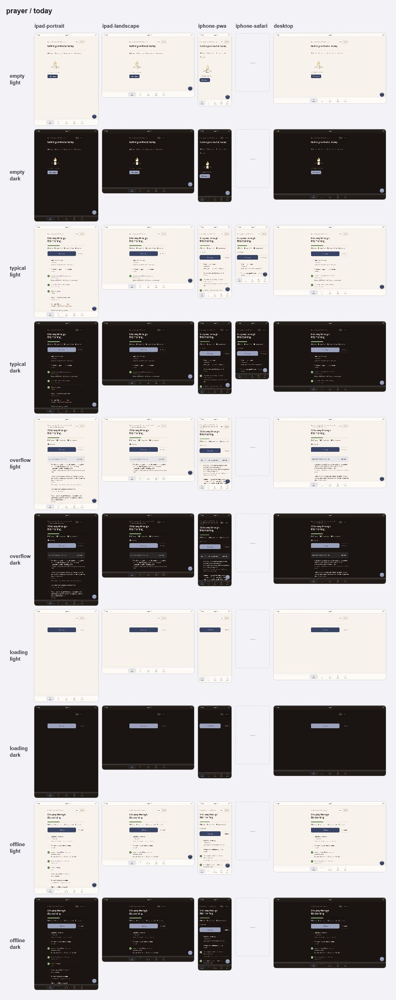

#### prayer / today-family

Family switch: plan "Around the table", 8 today, 16 days in a row; teal on the switch and nav (Pray now, Add and + keep Eli's navy: body.shared rebinds --accent but not --accent-deep), "Elizabeth asked" faces, who prayed today (Elizabeth, Ezra). Rows Elizabeth or Ezra prayed show as done for Eli too (done reads the row's single lastPrayedAt), and his tap on such a check would clear lastPrayedAt for everyone (setPrayed toggles, apps/prayer.html:1595). overflow: long requester names; the rows with up to 9 prayed-today names (5 faces then "+N") are below the fold, see today-family-faces. loading: the tap lands before hub.ready, so nothing changes (pixel-identical to today-loading: the tap is simply lost) and the page logs a TypeError (the click handler reads D before load(), apps/prayer.html:1273) — the console lines are the evidence. Offline shots are in the system font, not Manrope: Google Fonts is unreachable and sw.js does not cache it (sw.js:36), as on a device whose browser cache no longer holds the fonts.

States: empty, typical, overflow, loading, offline · devices: desktop, ipad-landscape, ipad-portrait, iphone-pwa, iphone-safari · 42 files: `audits/screens/prayer/today-family-<state>-<device>-<mode>.png`

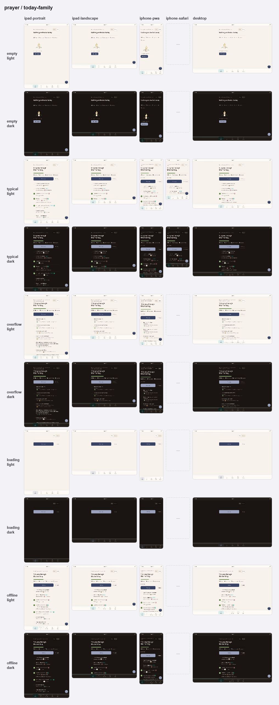

Console errors seen: `pageerror: undefined is not an object (evaluating 'D.activeList = t.dataset.list')`

#### prayer / today-family-faces

Family Today scrolled to the row with the most people on today's prayed list (nine long names: five faces, then "+4" beside a long title). Rows prayed today sit below the rest (the order they were synced in), so today-family-overflow never reaches them.

States: overflow · devices: desktop, ipad-landscape, ipad-portrait, iphone-pwa · 8 files: `audits/screens/prayer/today-family-faces-<state>-<device>-<mode>.png`

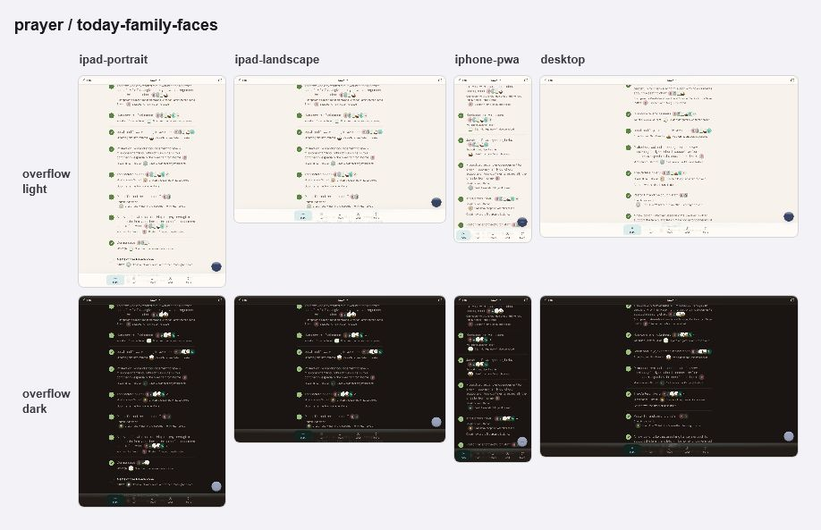

#### prayer / today-grouped

Elizabeth's own list under a by-day plan with "Group by category" on: Tuesday's categories as open <details> groups with Copy buttons, her colour as accent. empty/loading/offline are today-*: the grouping is the only difference.

States: typical, overflow · devices: desktop, ipad-landscape, ipad-portrait, iphone-pwa, iphone-safari · 18 files: `audits/screens/prayer/today-grouped-<state>-<device>-<mode>.png`

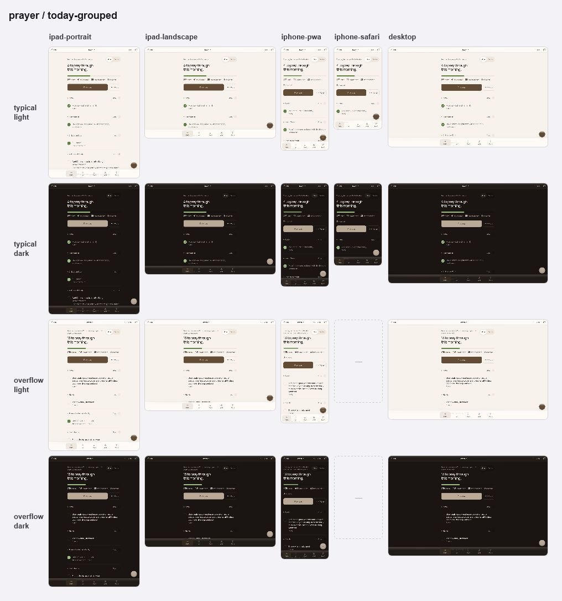

#### prayer / today-lower

Today scrolled to the end: the anniversary line (typical: "2 years ago today you started praying for this." — Uncle Ray; overflow: "A year ago today this was answered.") and the gold "Answered recently" box (last 30 days), above the nav. empty has neither (today-empty is the whole page).

States: typical, overflow · devices: desktop, ipad-landscape, ipad-portrait, iphone-pwa, iphone-safari · 18 files: `audits/screens/prayer/today-lower-<state>-<device>-<mode>.png`

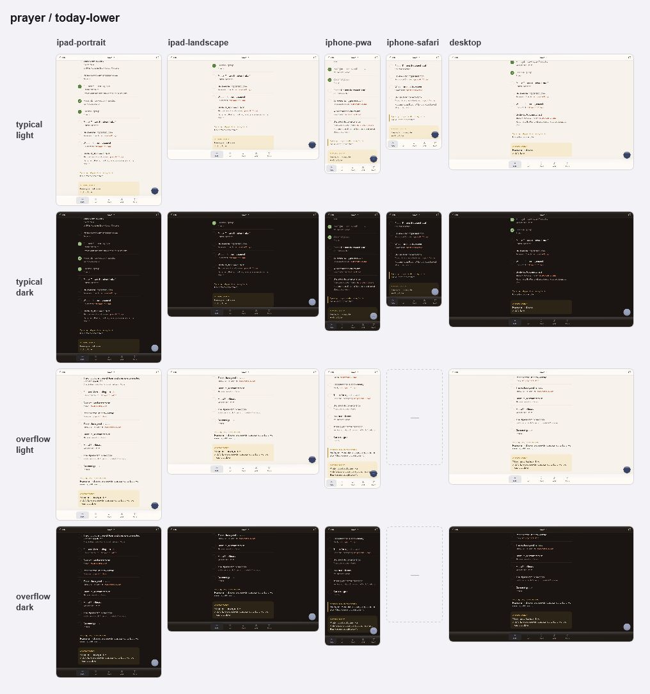

#### prayer / today-unscheduled

Mae: requests on the list but her by-day plan has nothing for Tuesdays → "Nothing scheduled for today under this plan." with "Change the plan"; Pray now and More are hidden, while the gold cheer "3 days in a row." shows under "Nothing on the list today." (milestone() fires whenever none are left, 0 of 0 included; her streak ended yesterday). Only reachable with data, so typical only.

States: typical · devices: desktop, ipad-landscape, ipad-portrait, iphone-pwa, iphone-safari · 10 files: `audits/screens/prayer/today-unscheduled-<state>-<device>-<mode>.png`

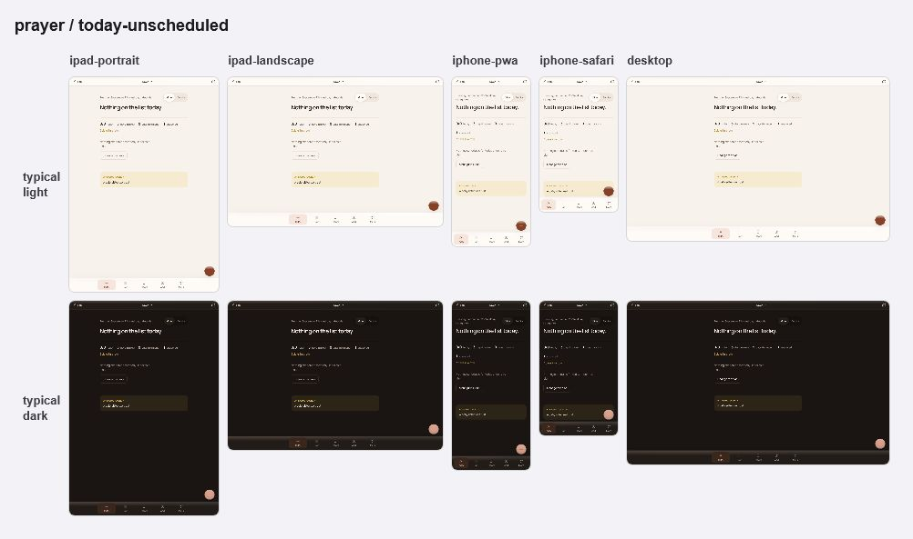

### shell

#### shell / app-blocked

A kid following a link to an app he cannot see (#f260): the Apps tab with the toast "That app is not available for this profile." (index.html:715).

States: typical · devices: desktop, ipad-landscape, ipad-portrait, iphone-pwa, iphone-safari · 10 files: `audits/screens/shell/app-blocked-<state>-<device>-<mode>.png`


#### shell / apps

Eli's Apps tab: the tile grid with the wide F260 tile (ring + week/next/streak) and the Larder badge. Loading = the F260 tile's "loading" skeleton; empty = "Start week 1" and no badge.

States: empty, typical, overflow, loading, offline · devices: desktop, ipad-landscape, ipad-portrait, iphone-pwa, iphone-safari · 42 files: `audits/screens/shell/apps-<state>-<device>-<mode>.png`

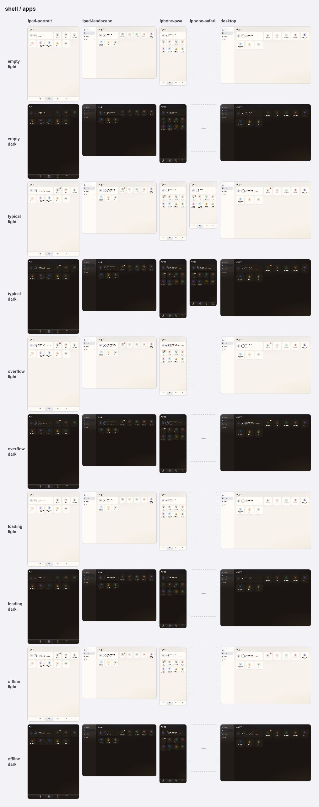

#### shell / apps-guest

Grandma Jo's Apps: every app open to any household adult (guest rule, index.html:480).

States: typical · devices: desktop, ipad-landscape, ipad-portrait, iphone-pwa, iphone-safari · 10 files: `audits/screens/shell/apps-guest-<state>-<device>-<mode>.png`


#### shell / apps-kid

Ezra's Apps: only the apps whose visibleTo lists him, in the bigger kid tiles.

States: typical · devices: desktop, ipad-landscape, ipad-portrait, iphone-pwa, iphone-safari · 10 files: `audits/screens/shell/apps-kid-<state>-<device>-<mode>.png`

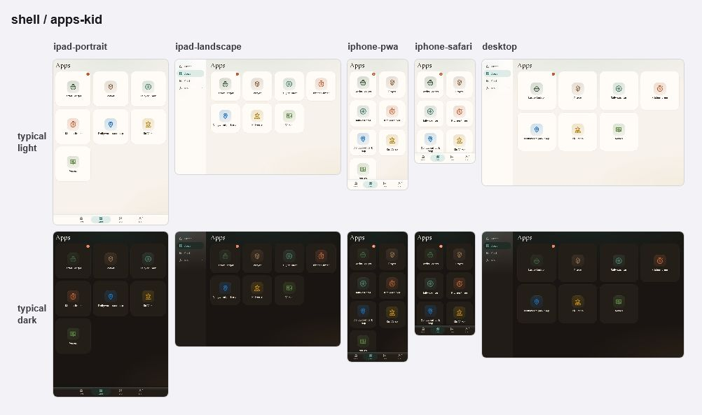

#### shell / chat

Chat as Eli (admin). Empty: the greeting with art. Typical: a question last night and four this morning (counter 4/60); two replies carry a tool chip (the pancakes on the fridge list, the dentist reminder). Overflow: 60 messages today, so the counter reads 60/60 and the input is disabled with "Back tomorrow"; very long messages, a long link and a six-chip reply. Loading: the skeleton bubble. Offline: "Could not load the chat". Error: a message sent while the assistant is down; the rig answers POST /api/chat with the error event the Worker streams on an upstream failure, in the Worker's own wording (worker/src/chat.js:353, 441-442).

States: empty, typical, overflow, loading, offline, error · devices: desktop, ipad-landscape, ipad-portrait, iphone-pwa, iphone-safari · 52 files: `audits/screens/shell/chat-<state>-<device>-<mode>.png`

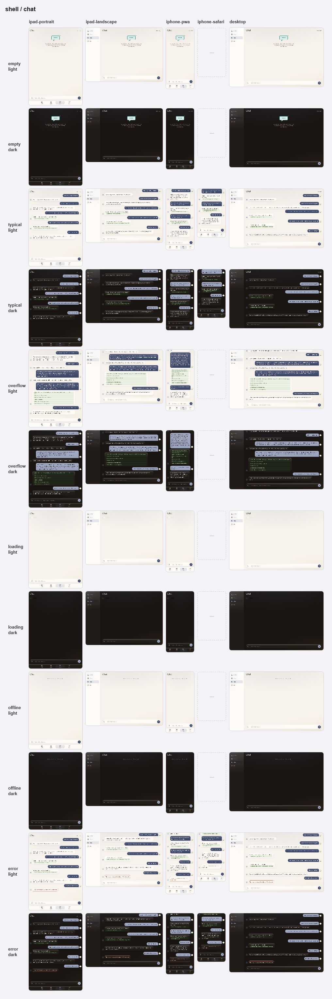

#### shell / chat-guest

Chat as the guest Grandma Jo: a guest gets the adult tools and apps. Her history: the fridge and the family memory verse. Other states are the same as the adult chat.

States: typical · devices: desktop, ipad-landscape, ipad-portrait, iphone-pwa, iphone-safari · 10 files: `audits/screens/shell/chat-guest-<state>-<device>-<mode>.png`

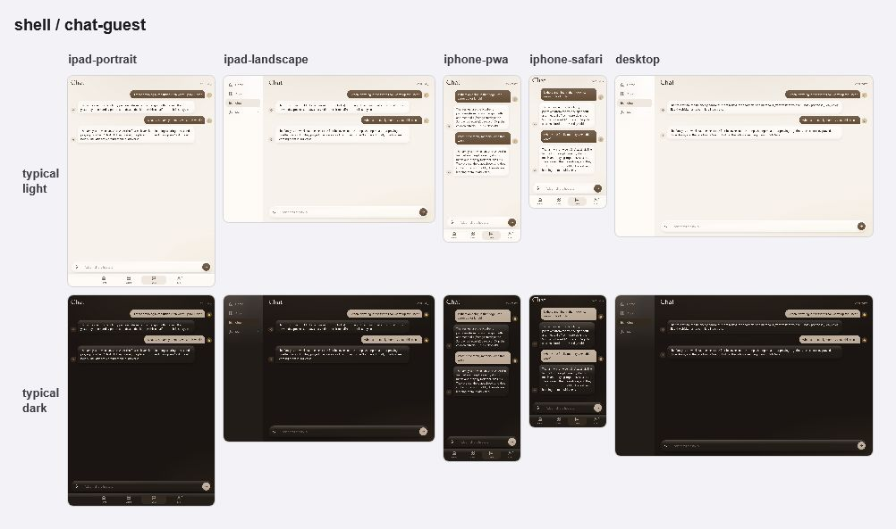

#### shell / chat-kid

Chat as Ezra (kid mode). Empty: the kid greeting ("Hi Ezra! Ask me something fun…"). Typical: he asked for the week's verse (the hub reads it aloud — not captured), why the place shook, and told it which family prayer he prayed this morning. Overflow: a long chat with long replies. Loading/offline are the same as the adult chat.

States: empty, typical, overflow · devices: desktop, ipad-landscape, ipad-portrait, iphone-pwa, iphone-safari · 26 files: `audits/screens/shell/chat-kid-<state>-<device>-<mode>.png`

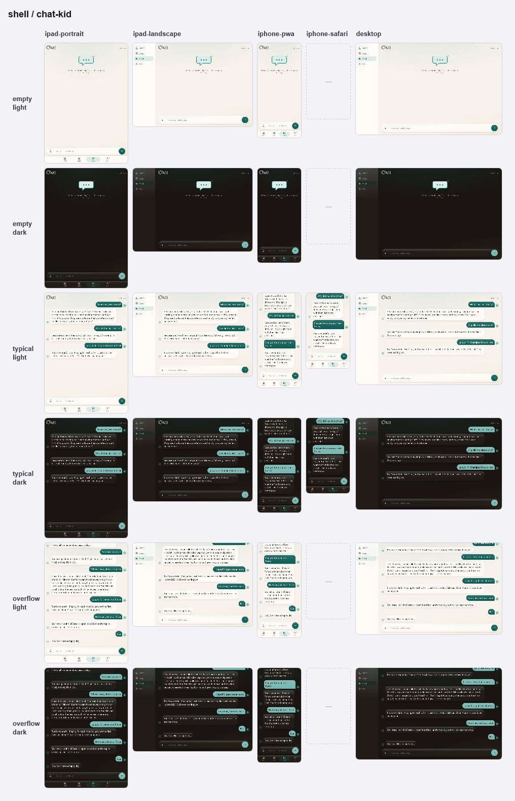

#### shell / chat-kid-listening

Ezra (a pre-reader) taps the mic: the button turns red and pulses while the browser listens (index.html:265, 1522-1526). The rig's speech recognition is inert, so nothing is ever heard and the mic stays on. Other states are the chat-kid ones.

States: typical · devices: desktop, ipad-landscape, ipad-portrait, iphone-pwa, iphone-safari · 10 files: `audits/screens/shell/chat-kid-listening-<state>-<device>-<mode>.png`

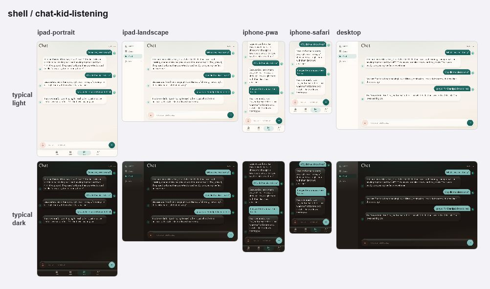

#### shell / chat-not-set-up

The house server has no Anthropic key: the rig answers GET /api/chat/history with enabled:false (what chatHistory returns without ANTHROPIC_API_KEY, worker/src/chat.js:457), so the tab shows "The assistant is not set up yet…" (index.html:1473). The composer stays enabled; Send then does nothing (index.html:1488).

States: error · devices: desktop, ipad-landscape, ipad-portrait, iphone-pwa, iphone-safari · 10 files: `audits/screens/shell/chat-not-set-up-<state>-<device>-<mode>.png`

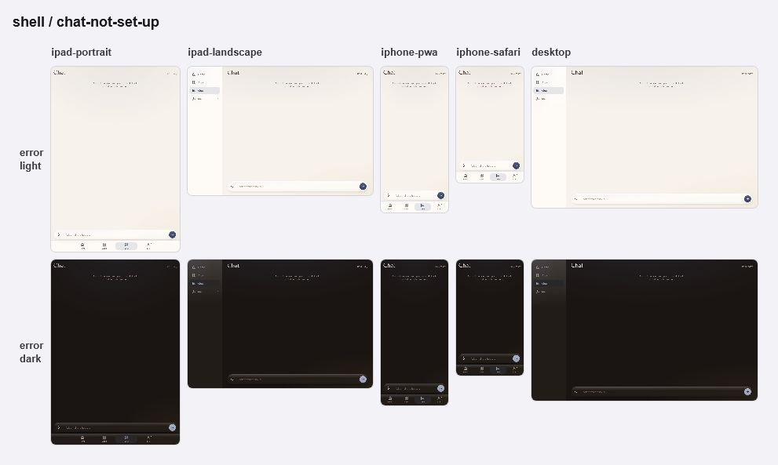

#### shell / chat-sending

Eli has just sent a message: his bubble, the assistant bubble with the typing dots, and the Send button disabled while the reply streams. The rig holds POST /api/chat open so the reply never arrives. Loading/offline/empty are the chat screen's.

States: typical · devices: desktop, ipad-landscape, ipad-portrait, iphone-pwa, iphone-safari · 10 files: `audits/screens/shell/chat-sending-<state>-<device>-<mode>.png`

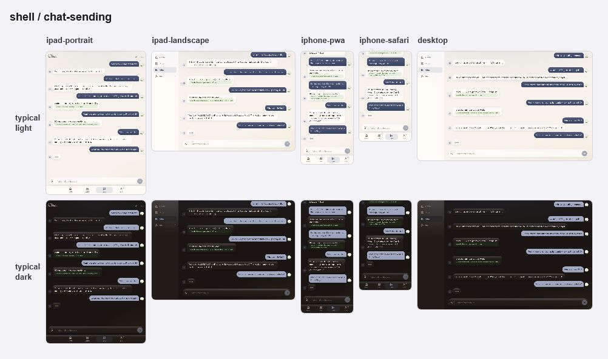

#### shell / chat-top

The overflow chat scrolled back to the top: the "60/60 today" counter and the oldest of the 20 messages the tab keeps, a very long question and a very long answer. (The Chat tab shows only the newest 20 rows, so the first 50 of today's messages are not reachable.) Only overflow: the other logs fit on one screen or differ from chat only in scroll position.

States: overflow · devices: desktop, ipad-landscape, ipad-portrait, iphone-pwa · 8 files: `audits/screens/shell/chat-top-<state>-<device>-<mode>.png`

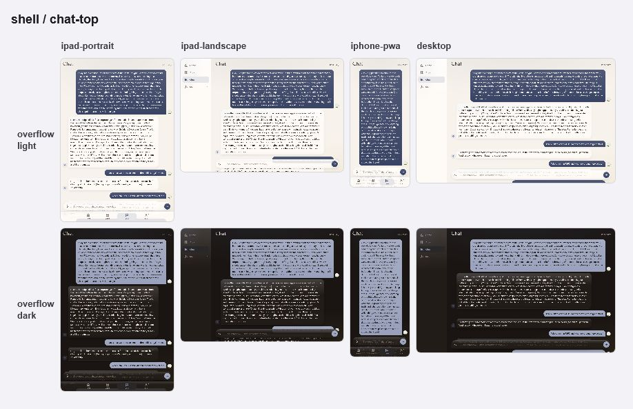

#### shell / first-visit

Service worker allowed: the first install on a device. Documents whether the shell's "Hub updated — it will use the new version next time it opens." toast (index.html:1695) shows on a first visit, when nothing was updated. It does in most WebKit runs (a race between clients.claim and the installed statechange); when it does not, go() drops the worker and its cache and reloads (up to twice) and logs that to the manifest, so a capture without the toast is possible but rare.

States: typical · devices: ipad-portrait, iphone-pwa · 4 files: `audits/screens/shell/first-visit-<state>-<device>-<mode>.png`

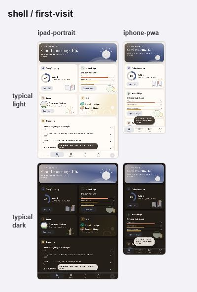

#### shell / guest-add

Me → Guests → Add a guest: name, a face from 24 emoji, a colour, an optional PIN and how long they stay. Error: a 2-digit PIN ("The PIN is 4 to 8 digits…"). The sheet shows no stored data, so empty/overflow/loading/offline would repeat typical. Adding the guest ends in a toast (not captured).

States: typical, error · devices: desktop, ipad-landscape, ipad-portrait, iphone-pwa, iphone-safari · 20 files: `audits/screens/shell/guest-add-<state>-<device>-<mode>.png`

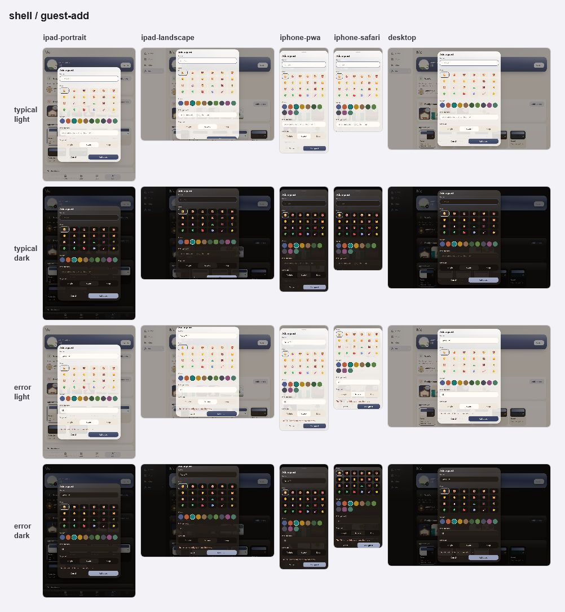

#### shell / home-bottom

Eli's Home scrolled to the end: the end of the feed with "Show more" (shown once a full page of 30 lines is loaded, index.html:954). At 1024 px and wider the Reminders column ends beside it; in one column the reminders sit above (home-rem-add).

States: typical, overflow · devices: desktop, ipad-landscape, ipad-portrait, iphone-pwa, iphone-safari · 18 files: `audits/screens/shell/home-bottom-<state>-<device>-<mode>.png`

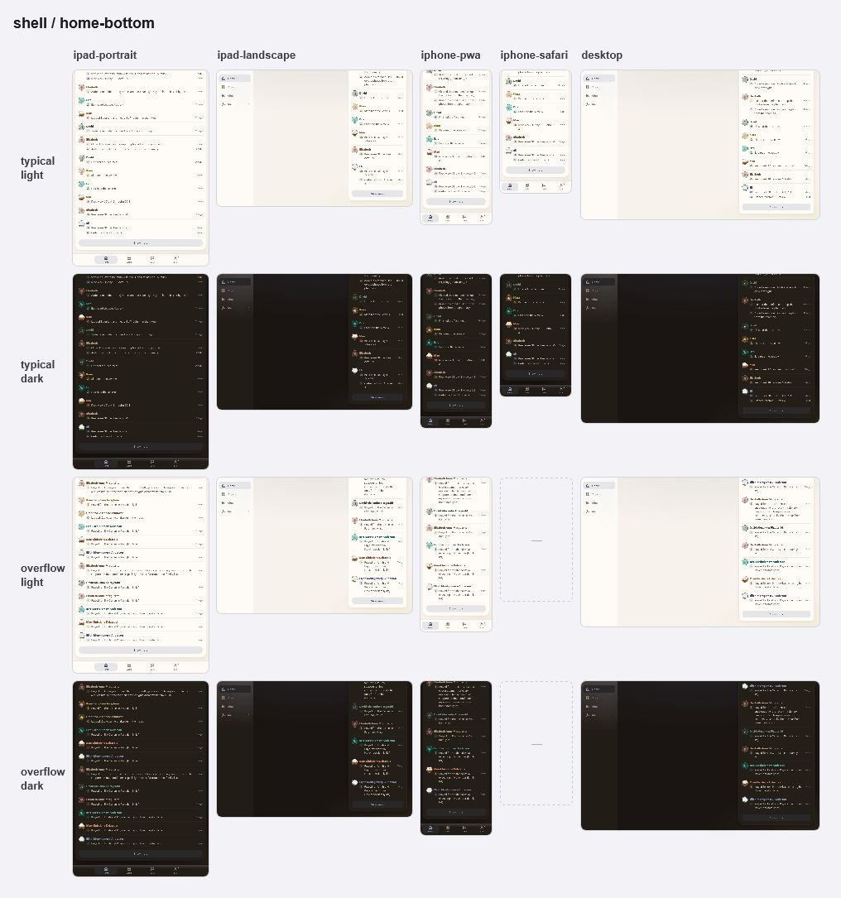

#### shell / home

Eli's Home, top: hero (date, greeting, summary line) and the glance cards (Today's reading, In the fridge, Prayer, Kids). Loading = /api/data pending: only the feed shows skeleton rows — the cards and the hero show their empty wording, because hub.sync.state starts as offline (apps/hub.js:51) and index.html:1158 counts that as pulled. Offline = the cached copy.

States: empty, typical, overflow, loading, offline · devices: desktop, ipad-landscape, ipad-portrait, iphone-pwa, iphone-safari · 42 files: `audits/screens/shell/home-<state>-<device>-<mode>.png`

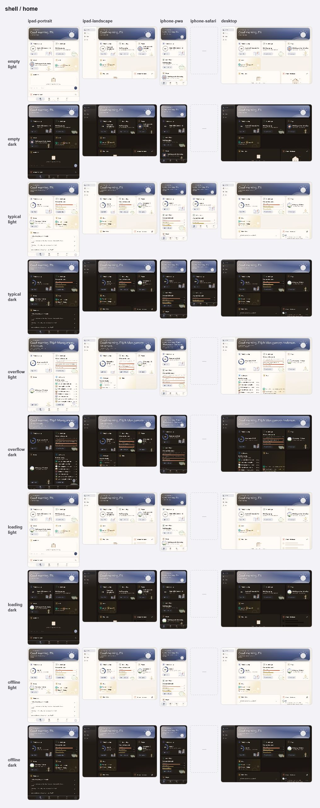

#### shell / home-guest

Guest Grandma Jo (no PIN, signed in on tap): the adult Home with her own empty F260 and prayer cards, the family fridge, kids, reminders and feed.

States: typical · devices: desktop, ipad-landscape, ipad-portrait, iphone-pwa, iphone-safari · 10 files: `audits/screens/shell/home-guest-<state>-<device>-<mode>.png`

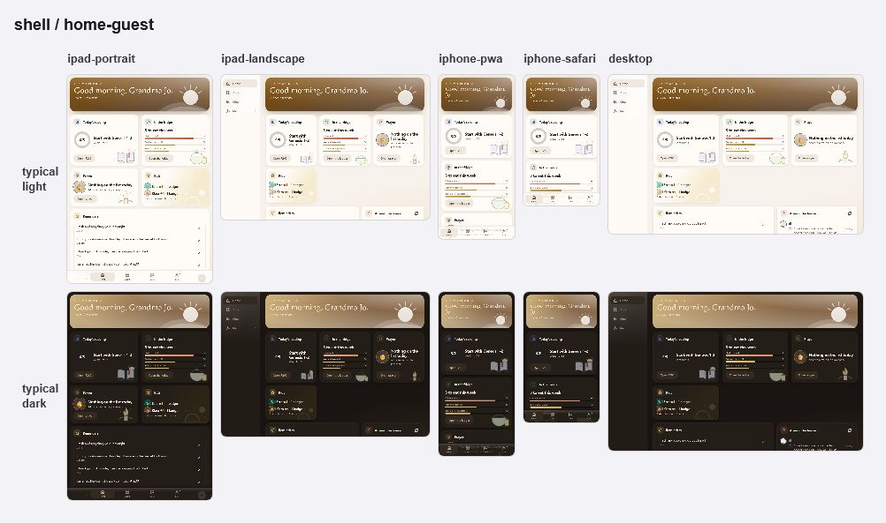

#### shell / home-kid

Ezra's kid Home: big hero, "Let's play" button to his apps, the Stars card and the read-only Reminders (no add field, no Done).

States: empty, typical, overflow, loading, offline · devices: desktop, ipad-landscape, ipad-portrait, iphone-pwa, iphone-safari · 42 files: `audits/screens/shell/home-kid-<state>-<device>-<mode>.png`

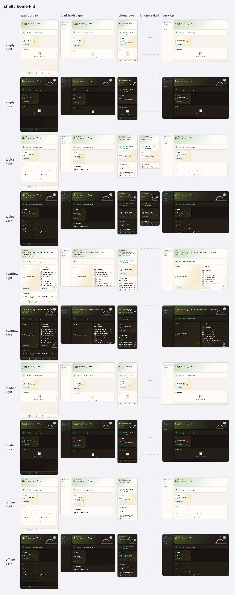

#### shell / home-kid-lower

Ezra's Home scrolled to the read-only Reminders card (long list in overflow).

States: typical, overflow · devices: desktop, ipad-landscape, ipad-portrait, iphone-pwa, iphone-safari · 18 files: `audits/screens/shell/home-kid-lower-<state>-<device>-<mode>.png`

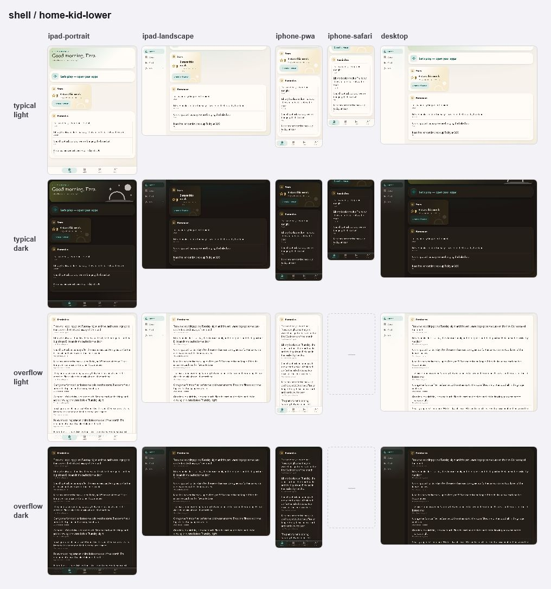

#### shell / home-kid-park

Park day on the kid Home: the At-the-park card joins the Stars card (only when the park-map seed wrote fresh family locations).

States: typical · devices: desktop, ipad-landscape, ipad-portrait, iphone-pwa, iphone-safari · 10 files: `audits/screens/shell/home-kid-park-<state>-<device>-<mode>.png`

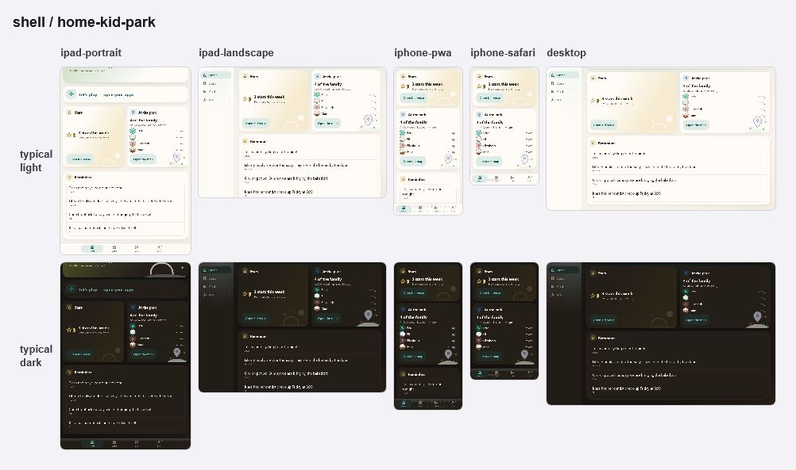

#### shell / home-lower

The same Home scrolled to Reminders (with the add field) and the "Around the house" feed.

States: empty, typical, overflow, loading, offline · devices: desktop, ipad-landscape, ipad-portrait, iphone-pwa, iphone-safari · 42 files: `audits/screens/shell/home-lower-<state>-<device>-<mode>.png`

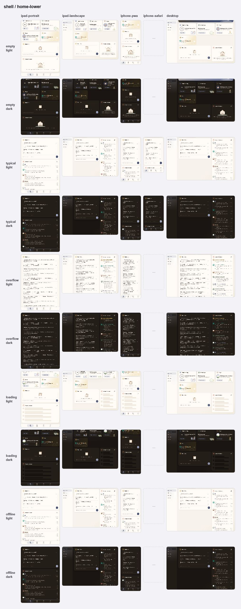

#### shell / home-park

Park day: the At the park card (who is at Dollywood, last seen) scrolled into view.

States: typical · devices: desktop, ipad-landscape, ipad-portrait, iphone-pwa, iphone-safari · 10 files: `audits/screens/shell/home-park-<state>-<device>-<mode>.png`

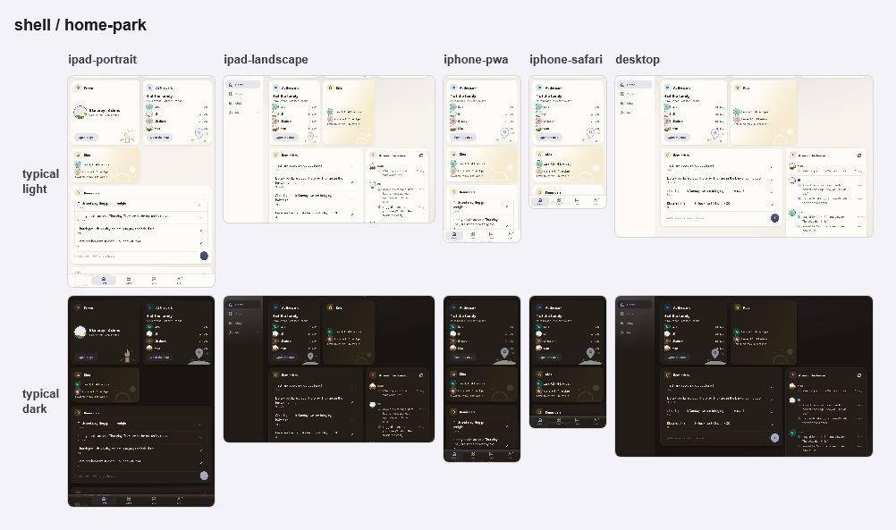

#### shell / home-pull

Pull-to-refresh armed (touch only): a synthetic 130 px downward touch drag on #views at the top shows the arrow indicator. The content does not rubber-band in the capture; check the real gesture on the iPad.

States: typical · devices: ipad-landscape, ipad-portrait, iphone-pwa · 6 files: `audits/screens/shell/home-pull-<state>-<device>-<mode>.png`

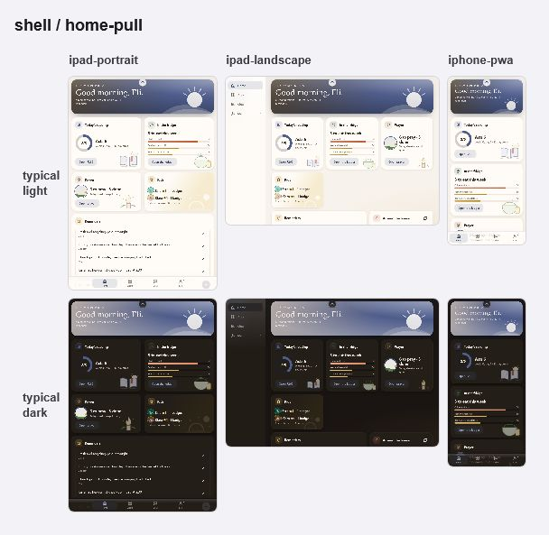

#### shell / home-rem-add

Eli's Home in overflow, scrolled to the end of the 15 long reminders: the last rows and the "Add a reminder for the house" field (maxlength 140) with its + button, the feed starting below.

States: overflow · devices: ipad-portrait, iphone-pwa · 4 files: `audits/screens/shell/home-rem-add-<state>-<device>-<mode>.png`

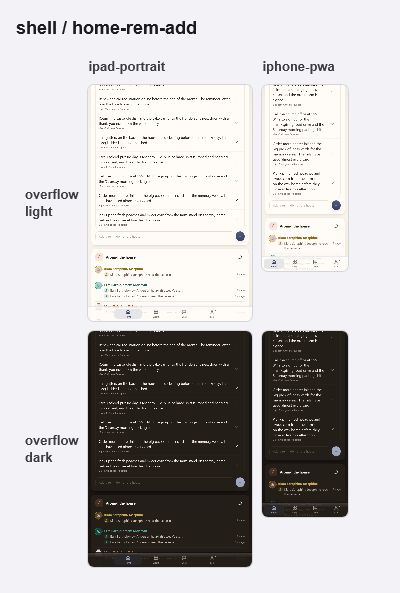

#### shell / home-timer

Elizabeth's Home while her kitchen timer runs: the shell's floating timer pill (bottom centre; right of the sidebar at 1024+).

States: typical · devices: desktop, ipad-landscape, ipad-portrait, iphone-pwa, iphone-safari · 10 files: `audits/screens/shell/home-timer-<state>-<device>-<mode>.png`

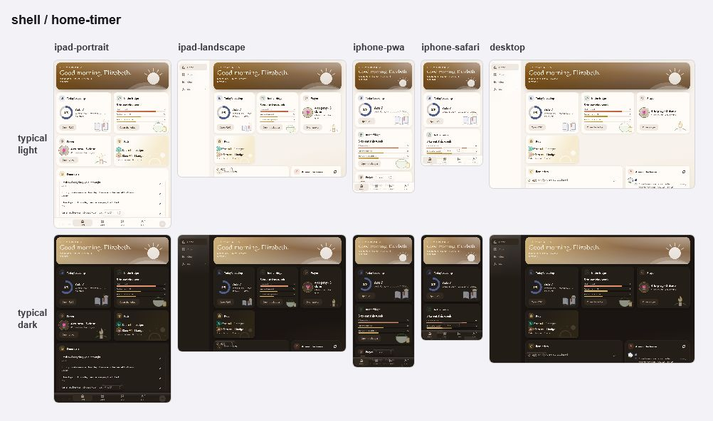

#### shell / me-admin

Me → Admin, top: the profile list with Edit / Reset PIN, and for guests Edit / Clear PIN / Remove / Purge (overflow has an ended guest with Purge and a guest with a PIN). Loading: the skeleton. Offline: "Could not load admin data". Reset PIN, Remove, Purge and Unpair ask with a native confirm() (not capturable).

States: empty, typical, overflow, loading, offline · devices: desktop, ipad-landscape, ipad-portrait, iphone-pwa, iphone-safari · 42 files: `audits/screens/shell/me-admin-<state>-<device>-<mode>.png`

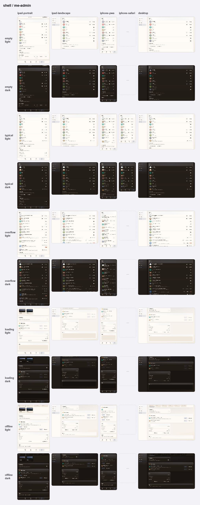

#### shell / me-admin-usage

Me → Admin, lower half: Devices (paired / last seen / Unpair) and Usage (30 days): chat messages and pushes per person per day. The chat table counts UTC days (index.js:522) while the chat cap counts New York days, so evening messages land on the next day. No seed writes push_log rows (h.push is unused), so the push table always reads "No pushes yet." Loading (skeleton) and offline (the error line) are me-admin's.

States: empty, typical, overflow · devices: desktop, ipad-landscape, ipad-portrait, iphone-pwa, iphone-safari · 26 files: `audits/screens/shell/me-admin-usage-<state>-<device>-<mode>.png`

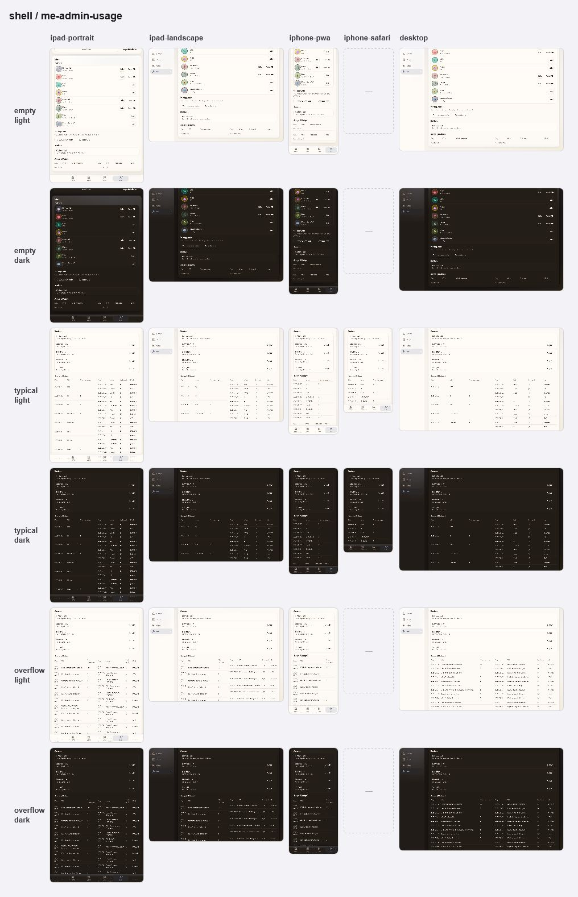

#### shell / me-adult

Me as David, a household adult who is not the admin: no Admin card; Guests, album, appearance, notifications, kids' rewards and sync. Overflow: long name. Empty, loading and offline are Eli’s me captures without the Admin card.

States: typical, overflow · devices: desktop, ipad-landscape, ipad-portrait, iphone-pwa, iphone-safari · 18 files: `audits/screens/shell/me-adult-<state>-<device>-<mode>.png`

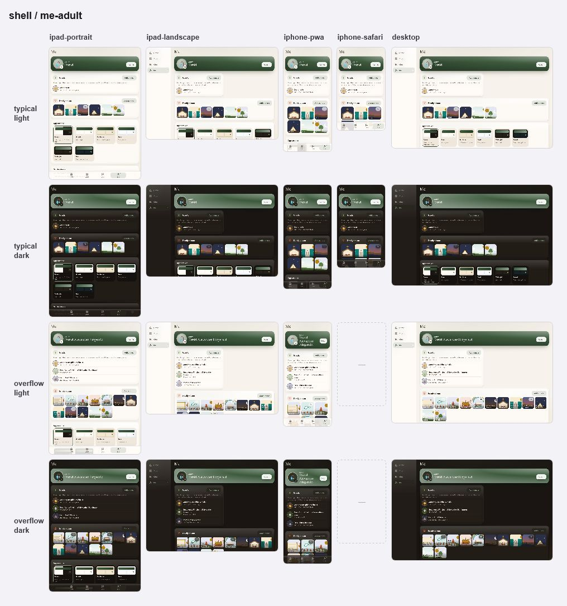

#### shell / me-album

Me → Family album (Eli sees a remove × on every photo as the admin). Empty: the illustrated empty state. Overflow: 12 photos. Removing a photo asks with a native confirm() (not capturable). Loading shows the empty state (see me loading); offline paints the cached album, the same as typical.

States: empty, typical, overflow · devices: desktop, ipad-landscape, ipad-portrait, iphone-pwa, iphone-safari · 26 files: `audits/screens/shell/me-album-<state>-<device>-<mode>.png`

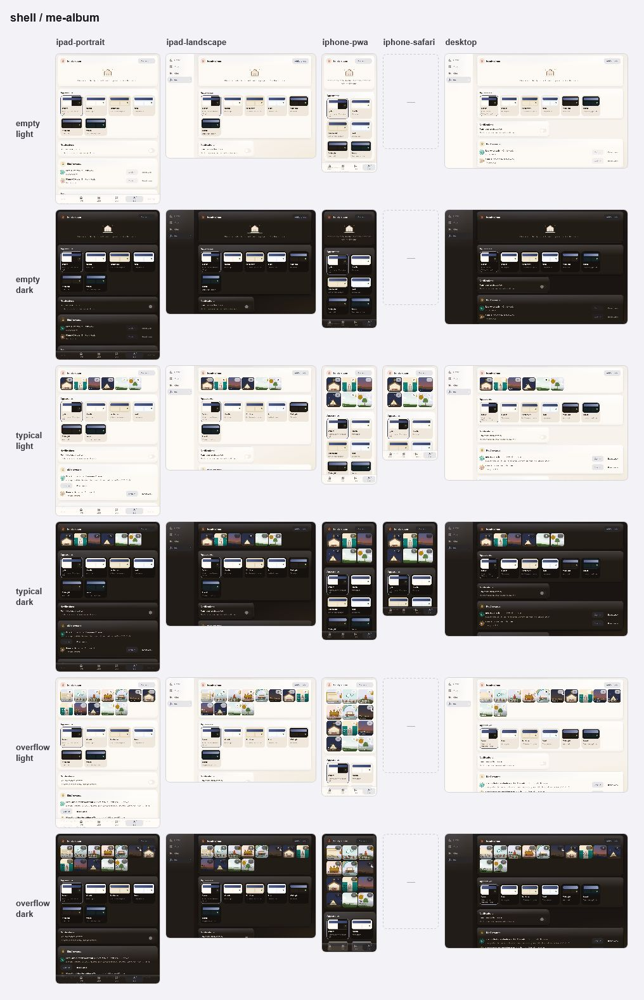

#### shell / me-appearance

Me → Appearance: the six theme cards (System picked by default). Other states do not change this card.

States: typical · devices: desktop, ipad-landscape, ipad-portrait, iphone-pwa, iphone-safari · 10 files: `audits/screens/shell/me-appearance-<state>-<device>-<mode>.png`

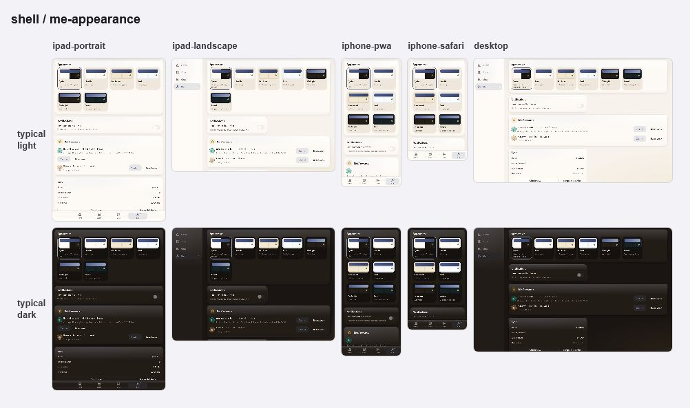

#### shell / me

Top of Me as Eli: the hero (photo, "Adult · Admin", Switch), then the Guests card and the Family album. Empty: no photo, no guests, no album. Loading: the album shows its empty state because no data has arrived. Offline: painted from the local cache.

States: empty, typical, overflow, loading, offline · devices: desktop, ipad-landscape, ipad-portrait, iphone-pwa, iphone-safari · 42 files: `audits/screens/shell/me-<state>-<device>-<mode>.png`

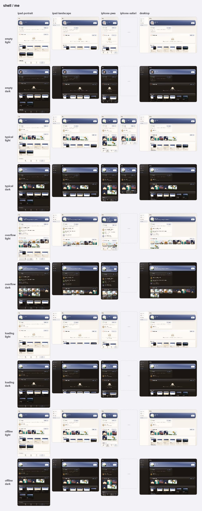

#### shell / me-guest

Me as the guest Grandma Jo: she can set her own photo and add album photos (a guest is an adult), but has no Guests or Kids' rewards card; the kicker reads "Adult". The empty variant has no guests; loading and offline are as in Eli’s me captures.

States: typical, overflow · devices: desktop, ipad-landscape, ipad-portrait, iphone-pwa, iphone-safari · 18 files: `audits/screens/shell/me-guest-<state>-<device>-<mode>.png`

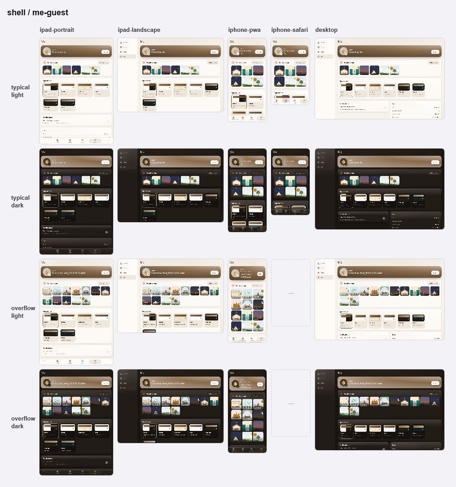

#### shell / me-kid

Me as Ezra (kid mode): the photo button is disabled, no guests, album or rewards; appearance, notifications and sync only. Overflow: long name. Nothing on a kid’s Me depends on app data, so empty, loading and offline look like typical (the sync card is the only change, as in me-admin offline).

States: typical, overflow · devices: desktop, ipad-landscape, ipad-portrait, iphone-pwa, iphone-safari · 18 files: `audits/screens/shell/me-kid-<state>-<device>-<mode>.png`

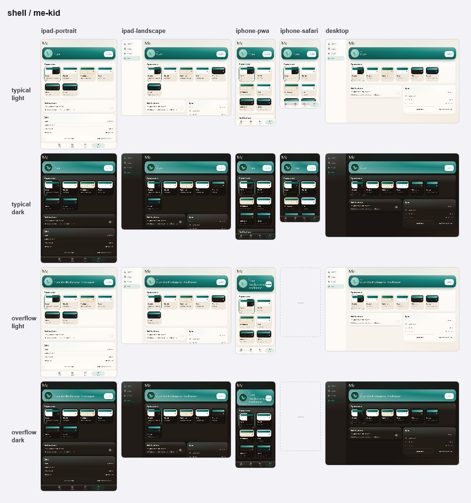

#### shell / me-notifications

Me → Notifications. The local instance is plain http and WebKit here has no Push API, so the card always shows its "cannot receive" help text with the switch disabled; the per-kind switches and "Send a test notification" only appear once subscribed (a manual check on a real device).

States: typical · devices: desktop, ipad-landscape, ipad-portrait, iphone-pwa, iphone-safari · 10 files: `audits/screens/shell/me-notifications-<state>-<device>-<mode>.png`

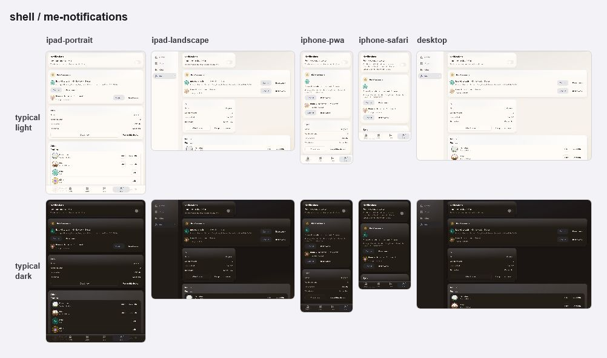

#### shell / me-rewards

Me → Kids' rewards: each kid's balance to cash in, this week, all-time, badges, last cash-in, with Cash in / Reset week (both ask with a native confirm(), not capturable). Empty: both kids at ★0 with the buttons disabled. Loading looks like empty (★0, see me-admin loading); offline paints the cached rows, the same as typical.

States: empty, typical, overflow · devices: desktop, ipad-landscape, ipad-portrait, iphone-pwa, iphone-safari · 26 files: `audits/screens/shell/me-rewards-<state>-<device>-<mode>.png`

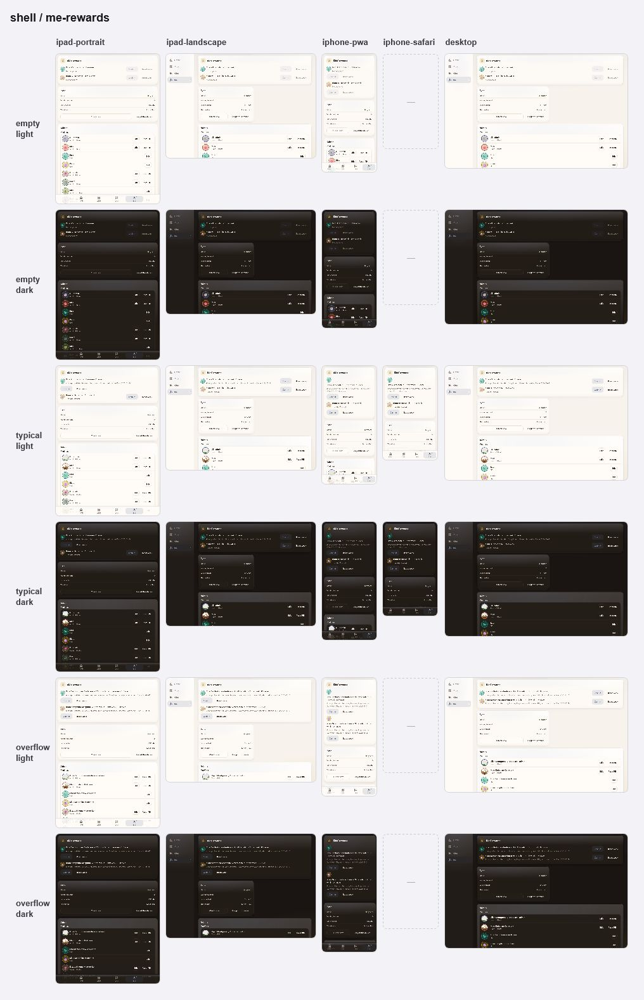

#### shell / me-sync

Me → Sync: status, waiting to send, last checked, this device, Check now, Forget this device (asks with a native confirm()). The offline Sync card ("offline", "Last checked: not yet") is in me-admin offline: both cards sit at the bottom of Me, so a separate offline capture here was the same image.

States: typical · devices: desktop, ipad-landscape, ipad-portrait, iphone-pwa, iphone-safari · 10 files: `audits/screens/shell/me-sync-<state>-<device>-<mode>.png`

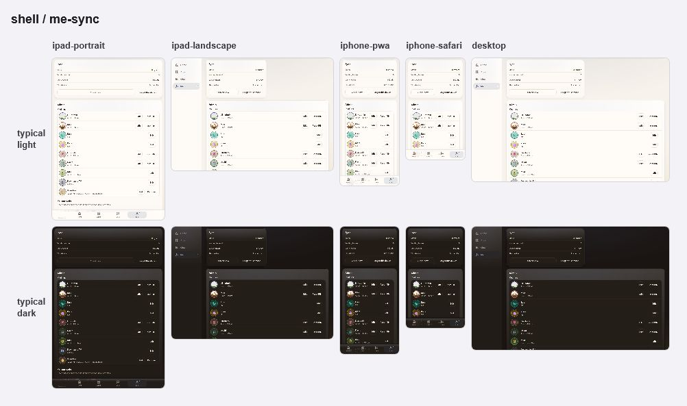

#### shell / me-theme-forest

Me → Appearance → Forest: the Me tab repaints in the Forest palette at once, the card shows as picked, and the choice follows Eli to his other devices (apps/hub.js:88-93). One mode only: a named palette ignores the device's light/dark setting. The Sync card below still reads "pending · 1 waiting" after the write has gone (the tab-bar dot is green): Me does not repaint on sync (index.html:1243). Home, Apps and the apps in this palette are not captured here.

States: typical · devices: desktop, ipad-landscape, ipad-portrait, iphone-pwa, iphone-safari · 5 files: `audits/screens/shell/me-theme-forest-<state>-<device>-<mode>.png`

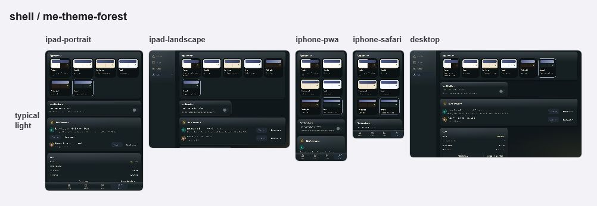

#### shell / me-theme-frost

Me → Appearance → Frost: the Me tab repaints in the Frost palette at once, the card shows as picked, and the choice follows Eli to his other devices (apps/hub.js:88-93). One mode only: a named palette ignores the device's light/dark setting. The Sync card below still reads "pending · 1 waiting" after the write has gone (the tab-bar dot is green): Me does not repaint on sync (index.html:1243). Home, Apps and the apps in this palette are not captured here.

States: typical · devices: desktop, ipad-landscape, ipad-portrait, iphone-pwa, iphone-safari · 5 files: `audits/screens/shell/me-theme-frost-<state>-<device>-<mode>.png`

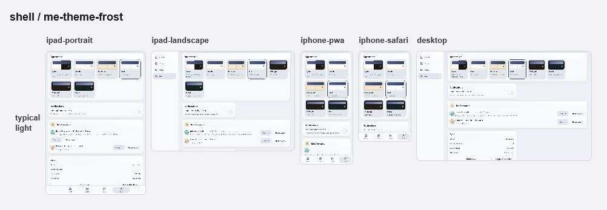

#### shell / me-theme-parchment

Me → Appearance → Parchment: the Me tab repaints in the Parchment palette at once, the card shows as picked, and the choice follows Eli to his other devices (apps/hub.js:88-93). One mode only: a named palette ignores the device's light/dark setting. The Sync card below still reads "pending · 1 waiting" after the write has gone (the tab-bar dot is green): Me does not repaint on sync (index.html:1243). Home, Apps and the apps in this palette are not captured here.

States: typical · devices: desktop, ipad-landscape, ipad-portrait, iphone-pwa, iphone-safari · 5 files: `audits/screens/shell/me-theme-parchment-<state>-<device>-<mode>.png`

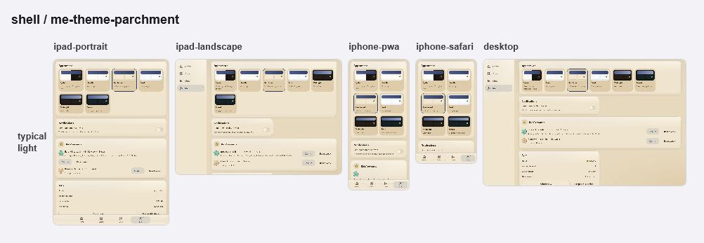

#### shell / pairing-code

Me → Admin → Pairing code → Choose a new code: the code typed twice. Error: the two do not match. (Example strings only; nothing is submitted to the server.) The sheet shows no stored data, so other states would repeat typical.

States: typical, error · devices: desktop, ipad-landscape, ipad-portrait, iphone-pwa, iphone-safari · 20 files: `audits/screens/shell/pairing-code-<state>-<device>-<mode>.png`

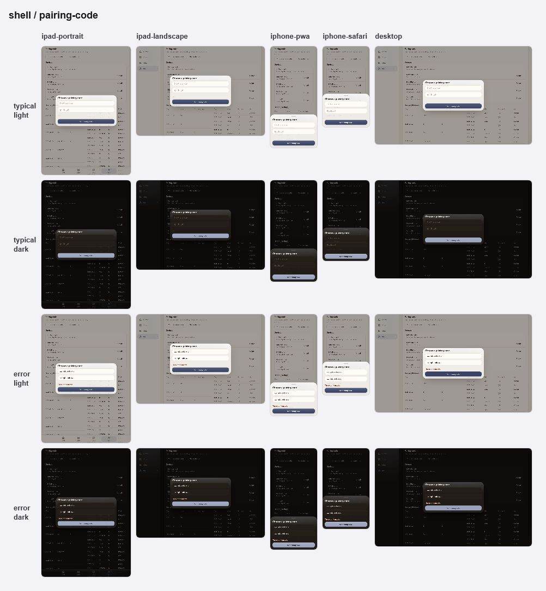

#### shell / pairing-code-new

Me → Admin → Pairing code → Generate one → (native confirm, accepted by the rig) → the one-time "New pairing code" sheet. The rig answers the rotate call with a placeholder code, so no code is generated and the demo instance keeps its own.

States: typical · devices: desktop, ipad-landscape, ipad-portrait, iphone-pwa, iphone-safari · 10 files: `audits/screens/shell/pairing-code-new-<state>-<device>-<mode>.png`

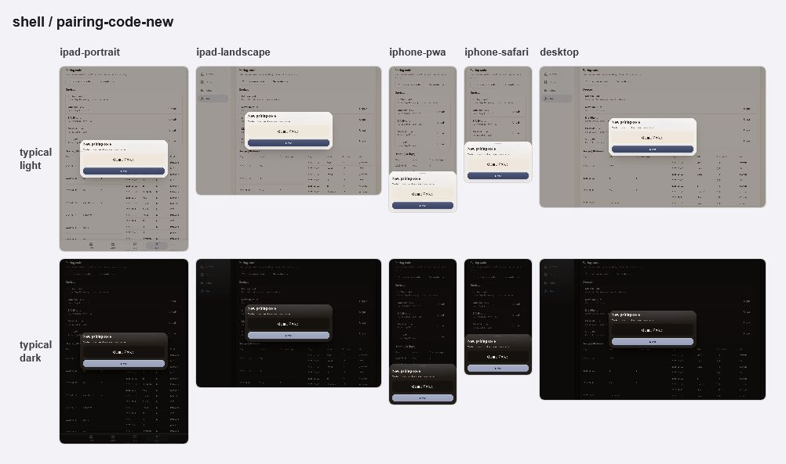

#### shell / pairing

First run on a new device: the pairing code form. Error = a wrong code typed and submitted: "That pairing code is not right." under the form. No data states: nothing is loaded before pairing, and a pair attempt offline shows "No connection." on the same message line.

States: typical, error · devices: desktop, ipad-landscape, ipad-portrait, iphone-pwa, iphone-safari · 20 files: `audits/screens/shell/pairing-<state>-<device>-<mode>.png`

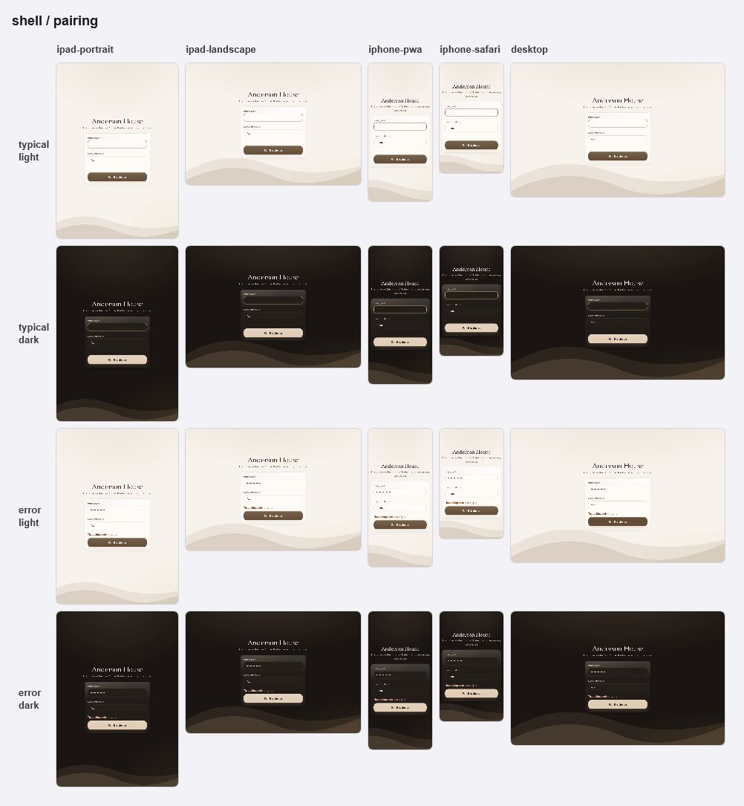

Console errors seen: `error: Failed to load resource: the server responded with a status of 401 (Unauthorized)`

#### shell / pairing-unpaired

This device was unpaired while Eli was signed in: the shell drops from Home to the pairing form with "This device was unpaired." (index.html:771).

States: error · devices: desktop, ipad-landscape, ipad-portrait, iphone-pwa, iphone-safari · 10 files: `audits/screens/shell/pairing-unpaired-<state>-<device>-<mode>.png`

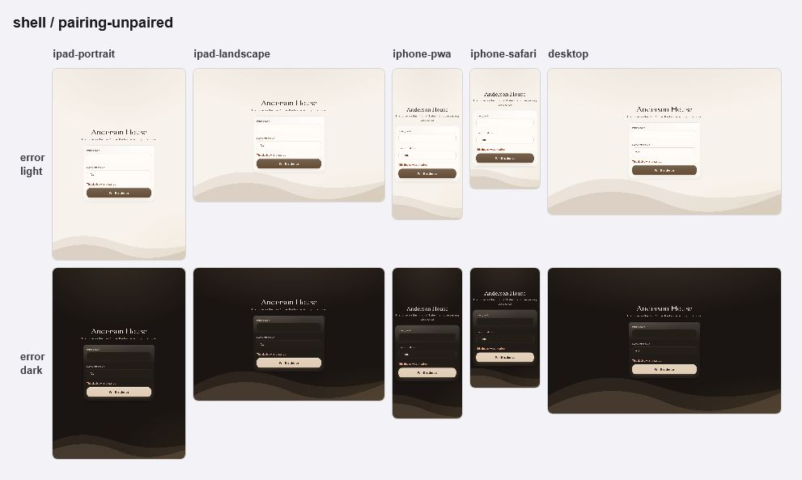

Console errors seen: `error: Failed to load resource: the server responded with a status of 401 (Unauthorized)`

#### shell / photo

Me → the photo button → "Your photo": Choose a photo (opens the system picker, not capturable), Remove photo (only when a photo is set: typical), Cancel. Nothing else in the sheet depends on data.

States: empty, typical · devices: desktop, ipad-landscape, ipad-portrait, iphone-pwa, iphone-safari · 18 files: `audits/screens/shell/photo-<state>-<device>-<mode>.png`

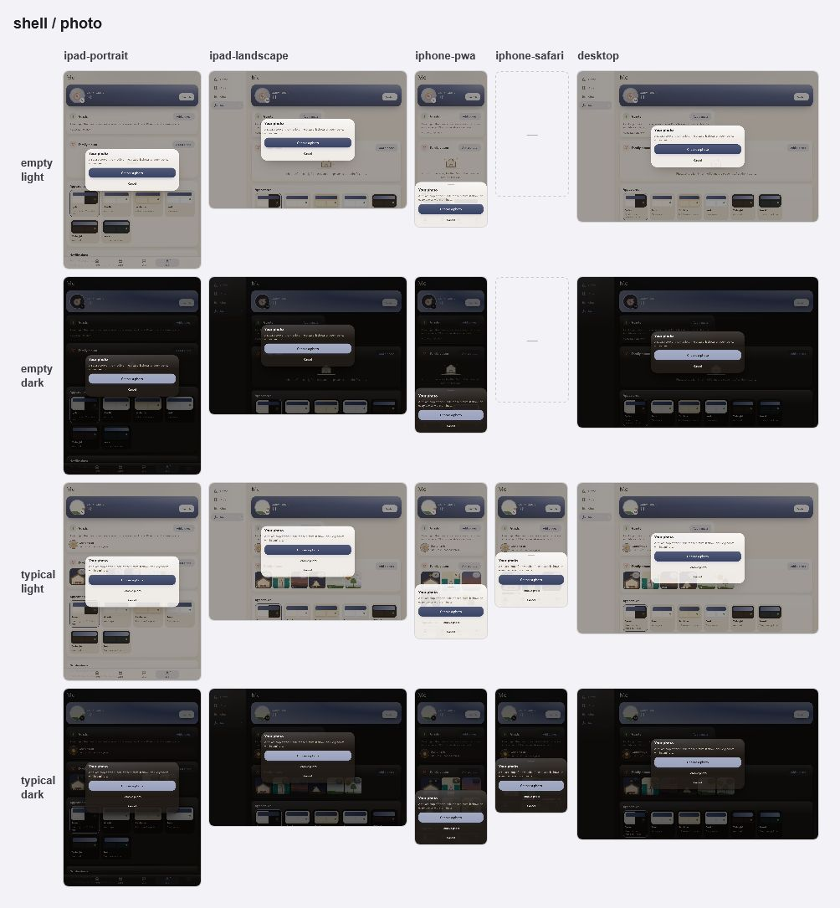

#### shell / picker

Who's this? One card per profile (Eli was last on this device: ring + "Welcome back"). Empty = the household with no photos and no guests; overflow = long names + four guests (one ended, so hidden); loading = the 8 skeleton cards while /api/profiles is pending; offline = the cached list, which looks exactly like typical (the picker gives no sign it is offline). On iPhone (and iPad landscape in overflow) the centred gate clips its own title (index.html:29); picker-lower shows the rest.

States: empty, typical, overflow, loading, offline, error · devices: desktop, ipad-landscape, ipad-portrait, iphone-pwa, iphone-safari · 52 files: `audits/screens/shell/picker-<state>-<device>-<mode>.png`

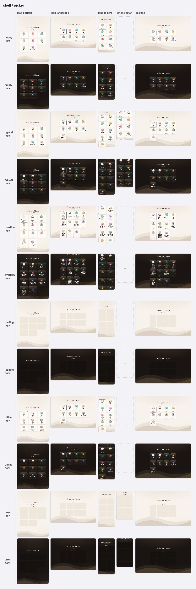

#### shell / picker-lower

The picker scrolled to its end on the screens where it does not fit: the guest cards (typical: Grandma Jo; overflow: three guests with long names, one with a PIN and one leaving tonight; the guest whose stay ended is not listed).

States: typical, overflow · devices: ipad-landscape, iphone-pwa, iphone-safari · 10 files: `audits/screens/shell/picker-lower-<state>-<device>-<mode>.png`

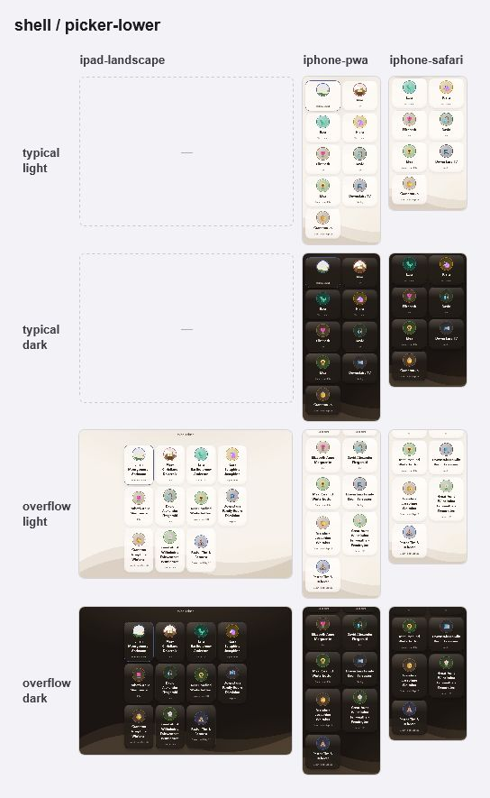

#### shell / picker-signed-out

Eli's session stopped working while Home was open: the picker returns with "Please choose your profile again." above the cards (index.html:771).

States: error · devices: desktop, ipad-landscape, ipad-portrait, iphone-pwa, iphone-safari · 10 files: `audits/screens/shell/picker-signed-out-<state>-<device>-<mode>.png`

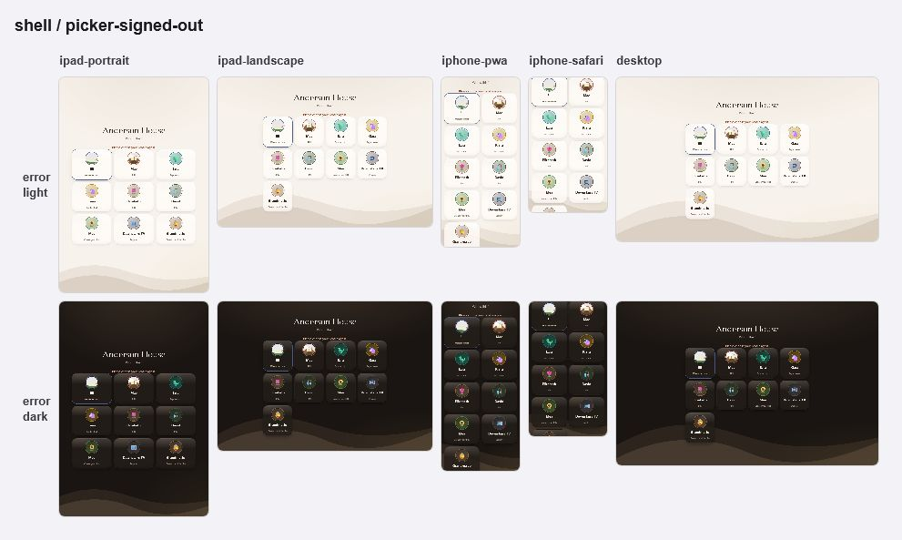

Console errors seen: `error: Failed to load resource: the server responded with a status of 401 (Unauthorized)`

#### shell / picker-tap

Offline, Ezra (a kid, no PIN) tapped on the cached picker: the sign-in fails and "No connection." shows in the message line above the cards (index.html:546). Nothing else changes: the picker still offers every card.

States: offline · devices: desktop, ipad-landscape, ipad-portrait, iphone-pwa · 8 files: `audits/screens/shell/picker-tap-<state>-<device>-<mode>.png`

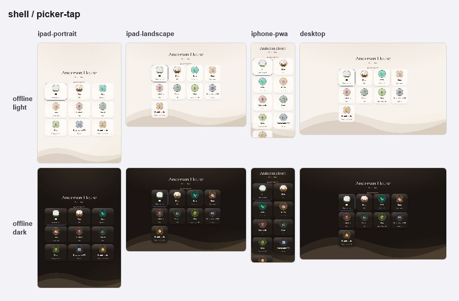

#### shell / pin-confirm

Mea's second pass of Create your PIN: four digits chosen and Continue tapped, so the hint reads "Type it again to confirm." (index.html:607); two digits of the confirmation typed. Nothing reaches the server.

States: typical · devices: desktop, ipad-landscape, ipad-portrait, iphone-pwa, iphone-safari · 10 files: `audits/screens/shell/pin-confirm-<state>-<device>-<mode>.png`

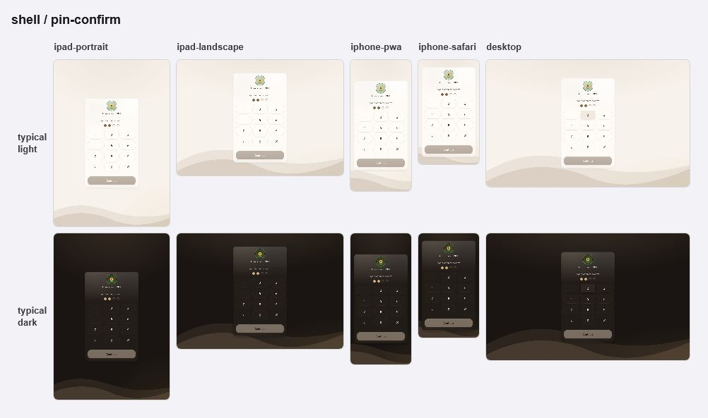

#### shell / pin-create

Mea (no PIN yet) tapped: "Create your PIN". Typical = two digits typed on the first pass; error = a confirmation that did not match ("Those didn't match — start again.", checked on the device, no server call). No PIN is ever saved.

States: typical, error · devices: desktop, ipad-landscape, ipad-portrait, iphone-pwa, iphone-safari · 20 files: `audits/screens/shell/pin-create-<state>-<device>-<mode>.png`

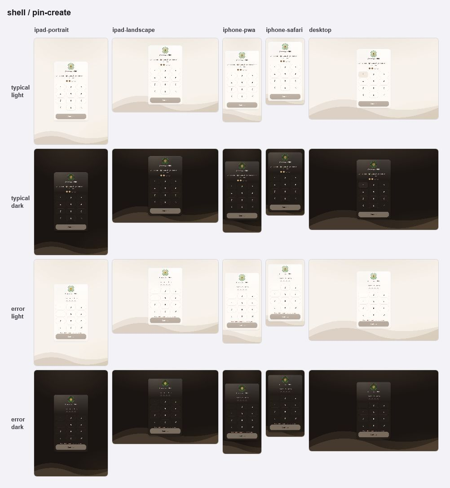

#### shell / pin-entry

Eli tapped on the picker: the PIN pad. Typical = two digits typed (dots fill in the person's colour; Continue stays disabled under 4). Error = a wrong PIN submitted: the dots clear and "Wrong PIN." shows under the pad. Offline = the cached picker, Eli tapped and four digits submitted with no connection: "No connection." (apps/hub.js:137).

States: typical, offline, error · devices: desktop, ipad-landscape, ipad-portrait, iphone-pwa, iphone-safari · 28 files: `audits/screens/shell/pin-entry-<state>-<device>-<mode>.png`

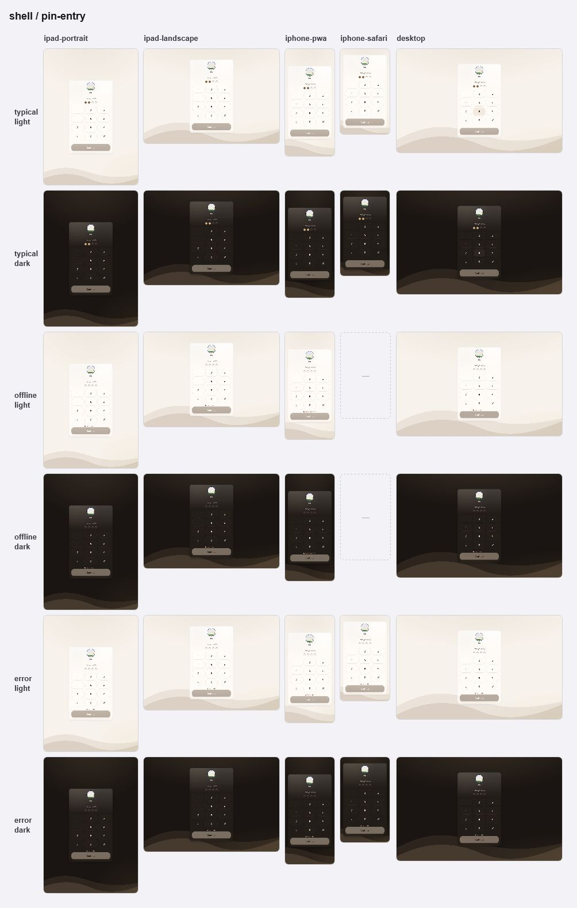

Console errors seen: `error: Failed to load resource: the server responded with a status of 401 (Unauthorized)`

#### shell / pin-locked

After five wrong PINs for Eli on this device: "Too many attempts. Try again in 15 min." (worker/src/auth.js:133).

States: error · devices: desktop, ipad-landscape, ipad-portrait, iphone-pwa, iphone-safari · 10 files: `audits/screens/shell/pin-locked-<state>-<device>-<mode>.png`

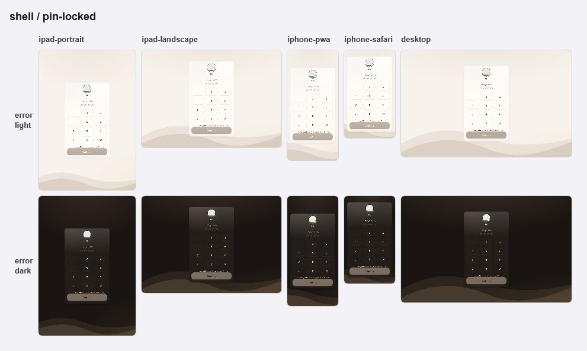

Console errors seen: `error: Failed to load resource: the server responded with a status of 401 (Unauthorized)`; `error: Failed to load resource: the server responded with a status of 429 (Too Many Requests)`

#### shell / profile-edit

Me → Admin → Edit on Mae: name, emoji, photo, colour, kind. Overflow: her long name in the title and field. Empty is typical without her photo (no Remove); the sheet opens only once the admin data has loaded, so there is no loading/offline sheet (see me-admin).

States: typical, overflow · devices: desktop, ipad-landscape, ipad-portrait, iphone-pwa, iphone-safari · 18 files: `audits/screens/shell/profile-edit-<state>-<device>-<mode>.png`

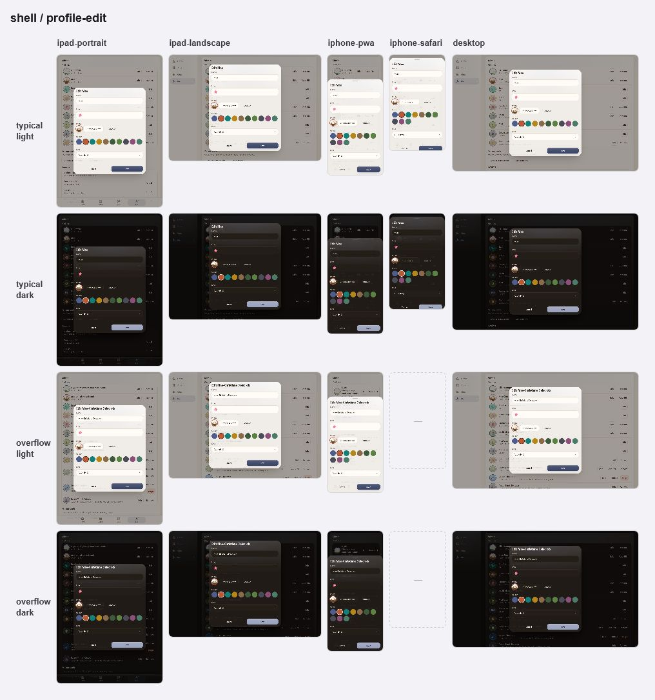

#### shell / switch-app-kid

Ezra in the Tally counter, the app name tapped: the Switch app sheet lists only his other apps (apps.json visibleTo), plus Home and Me.

States: typical · devices: desktop, ipad-landscape, ipad-portrait, iphone-pwa, iphone-safari · 10 files: `audits/screens/shell/switch-app-kid-<state>-<device>-<mode>.png`

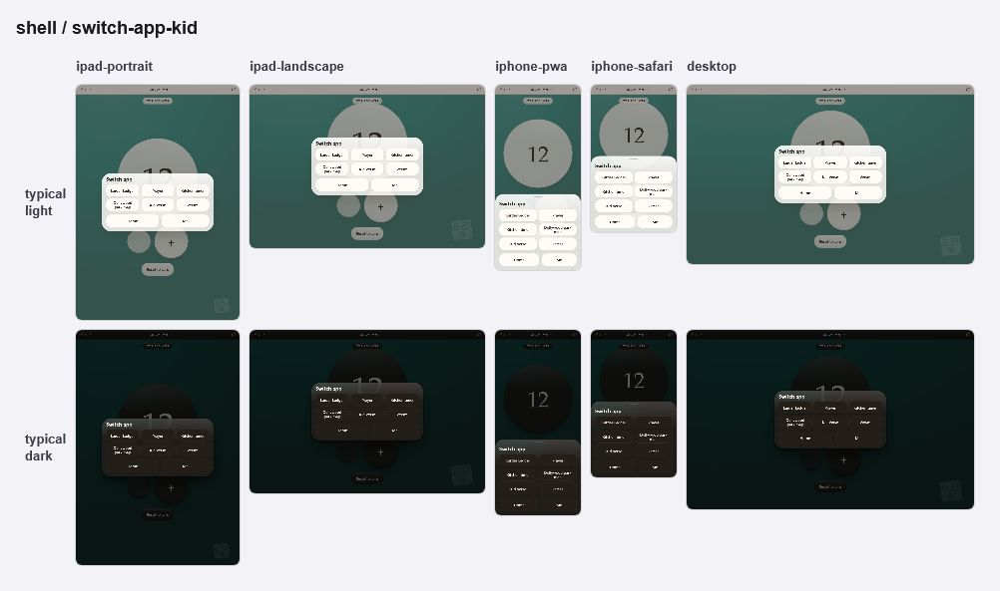

#### shell / switch-app

In the viewer (Tally counter), the app name tapped: the Switch app sheet listing Eli's other apps, plus Home and Me.

States: typical · devices: desktop, ipad-landscape, ipad-portrait, iphone-pwa, iphone-safari · 10 files: `audits/screens/shell/switch-app-<state>-<device>-<mode>.png`

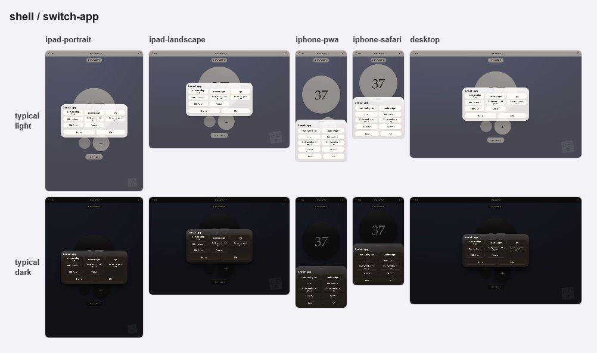

#### shell / viewer-timer

Elizabeth in another app (Tally counter) while her kitchen timer runs: the timer chip in the viewer bar instead of the floating pill.

States: typical · devices: desktop, ipad-landscape, ipad-portrait, iphone-pwa, iphone-safari · 10 files: `audits/screens/shell/viewer-timer-<state>-<device>-<mode>.png`

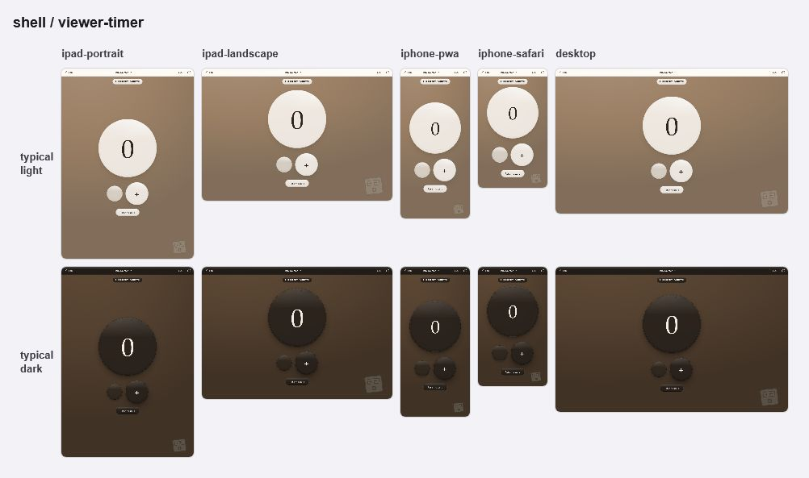

#### shell / viewer

An app open in the viewer (Tally counter): the slim glass bar with Hub back, the app name (opens Switch app) and reload.

States: typical · devices: desktop, ipad-landscape, ipad-portrait, iphone-pwa, iphone-safari · 10 files: `audits/screens/shell/viewer-<state>-<device>-<mode>.png`

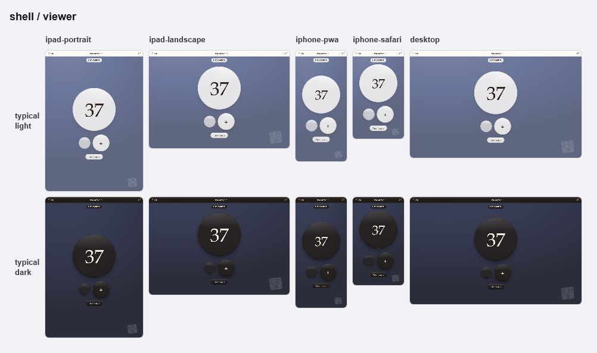

### tally

#### tally / kid

Ezra's counter in kid mode (bigger dial and buttons, apps/tally.html:122-124): 12 (typical), 250,000 with the long name (overflow). Empty/loading/offline look like the adult's.

States: typical, overflow · devices: desktop, ipad-landscape, ipad-portrait, iphone-pwa, iphone-safari · 18 files: `audits/screens/tally/kid-<state>-<device>-<mode>.png`

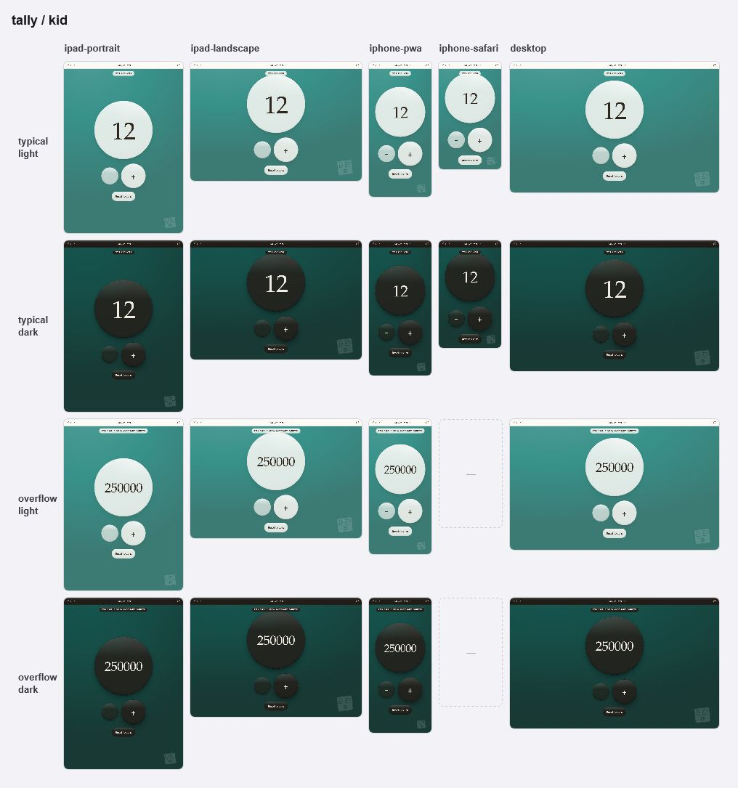

#### tally / main

Eli's counter: 0 (empty), 37 (typical), 1,284,750 with the long name in the pill (overflow). Loading = the bare markup (count 0, empty name pill, buttons not wired yet) while hub.ready() waits up to 6 s. Offline is pixel-identical to typical: the app shows no offline or pending indicator.

States: empty, typical, overflow, loading, offline · devices: desktop, ipad-landscape, ipad-portrait, iphone-pwa, iphone-safari · 42 files: `audits/screens/tally/main-<state>-<device>-<mode>.png`

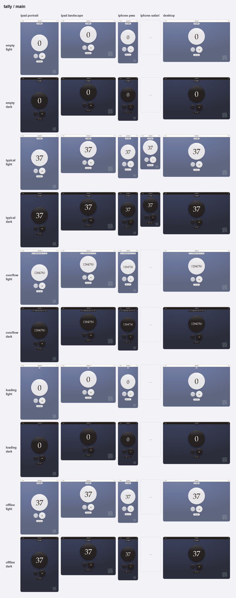

### timer

#### timer / chip

Inside another app (Tally) the running timer is a chip in the viewer bar (index.html:410, 821), not the pill: 104:05 beside the app name in the narrow bar. The typical 6:20 chip is shell/viewer-timer.

States: overflow · devices: desktop, ipad-landscape, ipad-portrait, iphone-pwa · 8 files: `audits/screens/timer/chip-<state>-<device>-<mode>.png`

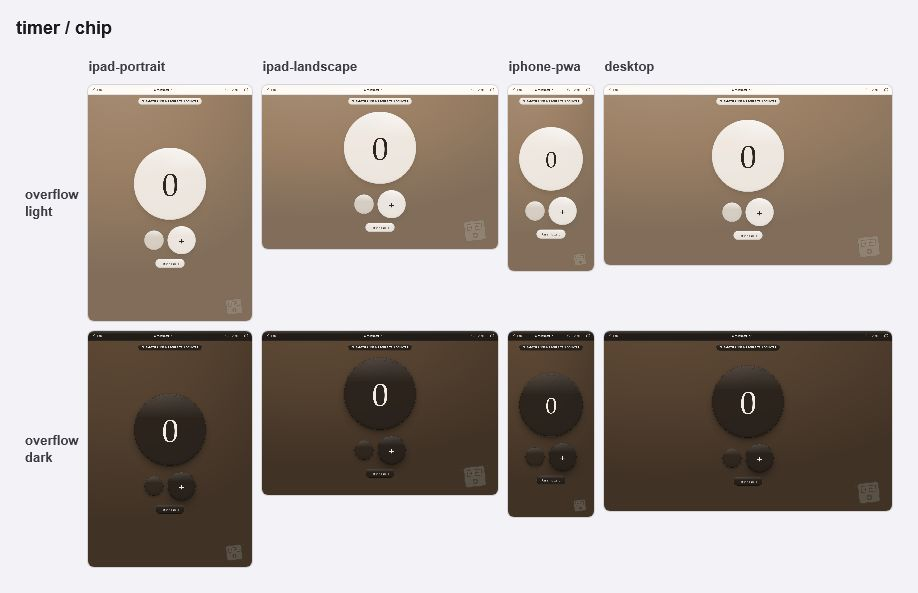

#### timer / done-toast

The timer ran out while Elizabeth was on Home (the fixed clock moved 1.5 s past endAt): the shell hides the pill and shows "Timer done — 15:00 is up." for 4 s (index.html:804-812). Its beep and local notification cannot be captured.

States: typical · devices: desktop, ipad-landscape, ipad-portrait, iphone-pwa, iphone-safari · 10 files: `audits/screens/timer/done-toast-<state>-<device>-<mode>.png`

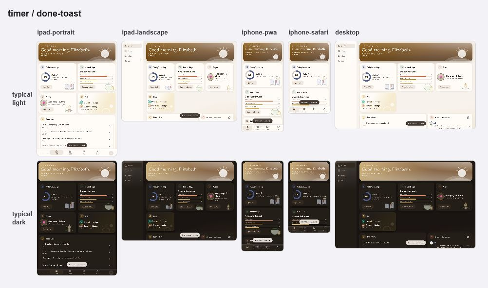

#### timer / done

Elizabeth's timer ran out with the app open (the fixed clock moved 1.5 s past endAt): danger ring, 0:00 in danger red (it blinks in the app; captured on its first frame), the app's own beep. timer.active is cleared.

States: typical · devices: desktop, ipad-landscape, ipad-portrait, iphone-pwa, iphone-safari · 10 files: `audits/screens/timer/done-<state>-<device>-<mode>.png`

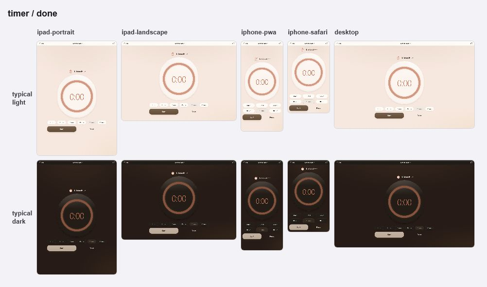

#### timer / idle

Eli, no timer running: the 5:00 default (empty); his last preset, 10:00 (typical; offline opens the same from the cache and shows no offline indicator); 30:00, the last chip (overflow; the view has no names or lists to overflow). Loading = the bare markup (5:00, 5 min chip) while hub.ready() waits, which looks like empty.

States: empty, typical, overflow, loading, offline · devices: desktop, ipad-landscape, ipad-portrait, iphone-pwa, iphone-safari · 42 files: `audits/screens/timer/idle-<state>-<device>-<mode>.png`

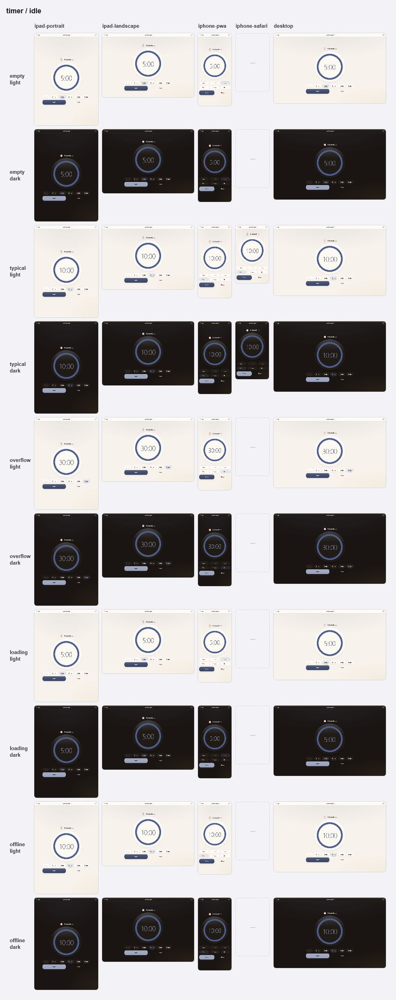

#### timer / kid

Ezra (kid): the adult view. The timer has no kid rules of its own (no data-kind CSS, no visibleTo); only design.css's kid tokens (--tap 64 px, bigger type, apps/design.css:280-284) make the chips and buttons larger. He has no timer data, so it opens on 5:00.

States: typical · devices: desktop, ipad-landscape, ipad-portrait, iphone-pwa, iphone-safari · 10 files: `audits/screens/timer/kid-<state>-<device>-<mode>.png`

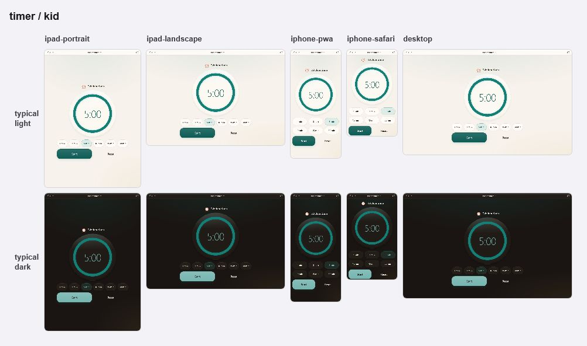

#### timer / paused

Elizabeth tapped Pause at 6:20: the dial keeps 6:20 and the button is back to Start. timer.active is cleared (apps/timer.html:114), so the pill disappears on every device and there is no "paused" record to resume from.

States: typical · devices: desktop, ipad-landscape, ipad-portrait, iphone-pwa, iphone-safari · 10 files: `audits/screens/timer/paused-<state>-<device>-<mode>.png`


#### timer / pill-chat

The pill on Elizabeth's Chat tab: the composer owns the bottom band there, so the pill lifts above it (index.html:356-358; --chat-h is measured in showTab, :639). Typical: her two short exchanges, so the pill sits in the empty space above the composer (6:20). Overflow: two weeks of her messages fill the log, and the pill (104:05) floats over the newest bubbles at the bottom of the scrolled history. The Apps and Me tabs place it as Home does.

States: typical, overflow · devices: desktop, ipad-landscape, ipad-portrait, iphone-pwa, iphone-safari · 18 files: `audits/screens/timer/pill-chat-<state>-<device>-<mode>.png`

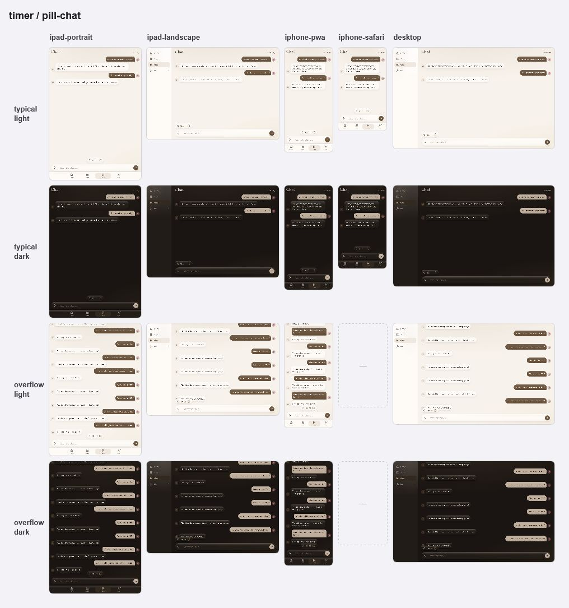

#### timer / pill

The shell's timer pill on Elizabeth's Home tab (index.html:404, 813-823) with a three-digit minute count, 104:05, beside her long name. At 1024 px and wider it sits right of the sidebar. The typical 6:20 pill is shell/home-timer.

States: overflow · devices: desktop, ipad-landscape, ipad-portrait, iphone-pwa · 8 files: `audits/screens/timer/pill-<state>-<device>-<mode>.png`

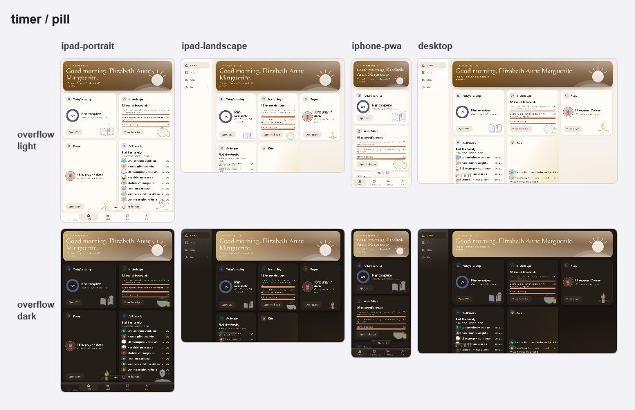

#### timer / running

Elizabeth's running timer: 15 min with 6:20 left (typical; offline resumes it from the cache and looks the same, with no offline indicator); a 2-hour one with 104:05 left (overflow; the presets stop at 30 min, but chat's set_data can write any timer record). Loading shows the idle 5:00 markup although a timer is running. No empty: with no data nothing is running (that is idle-empty).

States: typical, overflow, loading, offline · devices: desktop, ipad-landscape, ipad-portrait, iphone-pwa, iphone-safari · 34 files: `audits/screens/timer/running-<state>-<device>-<mode>.png`

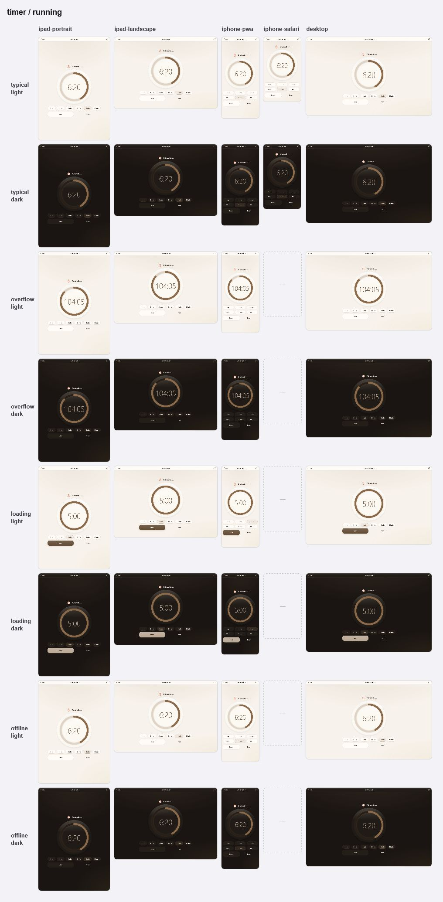

### tv

#### tv / board-below-fold

The overflow board with #views scrolled to the bottom: what sits below the 1080 px edge (the rest of Around the house and Reading today, and every reminder). Nothing on the board shows that it scrolls, and a TV with only a remote cannot scroll it.

States: overflow · devices: tv · 2 files: `audits/screens/tv/board-below-fold-<state>-<device>-<mode>.png`

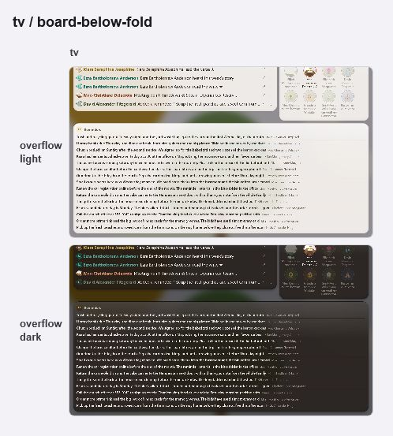

#### tv / board

Kiosk Home (TV glue board), read-only, 1920×1080, first settled paint (clock fixed, so no later crossfade). Loading looks like empty and offline like typical: the board has no loading or offline cue. No error state: a failed pull or feed read is silent. No park variant: the kiosk branch returns before atPark(), so nothing park-related shows.

States: empty, typical, overflow, loading, offline · devices: tv · 10 files: `audits/screens/tv/board-<state>-<device>-<mode>.png`

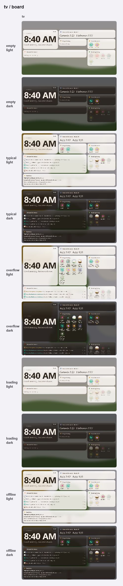

#### tv / board-evening

The board at 8:30 pm (browser clock only; the day's rows are the morning's): "Good evening", and with an empty album the ambient stand-in is art/ambient/night.svg (ambientOf, index.html:1044). With photos the backdrop is the album at any hour, so typical differs from the morning board only in the greeting and the "ago" times.

States: empty, typical · devices: tv · 4 files: `audits/screens/tv/board-evening-<state>-<device>-<mode>.png`

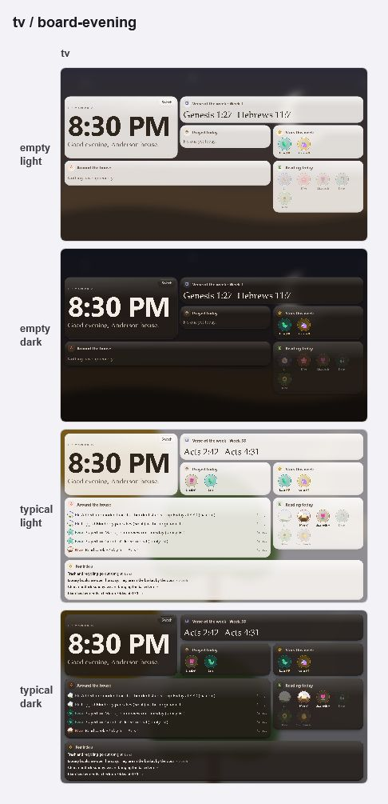

#### tv / board-ipad

The same board on the "kiosk iPad" of the user guide (README.md:25: add to Home Screen, pick Downstairs TV once, leave it). Below 1200 px the grid is two columns (index.html:134-136), so both orientations get the stacked layout, tightened by the max-height rules on the landscape iPad (174-175). First screen only; #views scrolls by touch here. Loading and offline behave as on the TV (see board).

States: empty, typical, overflow · devices: ipad-landscape, ipad-portrait · 12 files: `audits/screens/tv/board-ipad-<state>-<device>-<mode>.png`

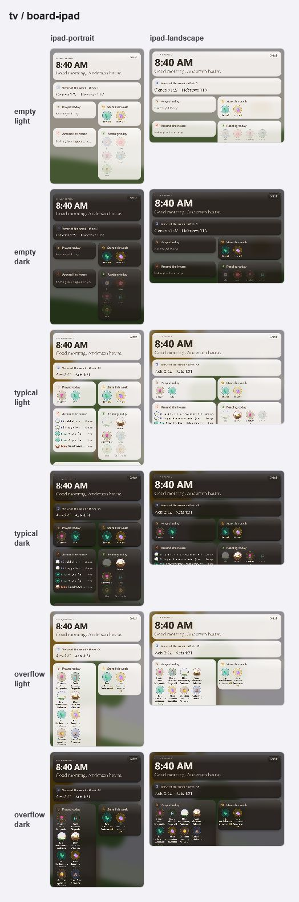

#### tv / chat-kiosk

Typing …#chat on the open board: the chat composer un-hides over the board (index.html:636) although openChat returns early for the kiosk (1465); chatEnabled stays true (1437), so a send reaches the server and gets 403 no_chat, and the reply bubble lands in the chat view below the board, out of sight.

States: typical · devices: tv · 2 files: `audits/screens/tv/chat-kiosk-<state>-<device>-<mode>.png`

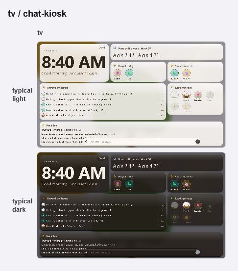

#### tv / me-kiosk

The kiosk's Me, the only place the TV's device-local theme is set, reached by typing …#me on the open board and shown here scrolled into view. The board stays on screen (index.html:129 beats 68), so Me renders below it, and its cards paint under the board's fixed backdrop and scrim (.tv-bg, index.html:130-133): only the hero, the card headings and Switch show, while the hidden theme cards still take taps (the backdrop is pointer-events: none). Kiosk Me: "Display" kicker, Appearance, Sync with "Forget this device", Switch (signs out, unlike the board's Switch). #apps, reached the same way, puts the "No apps for this profile yet." empty state below the board (index.html:696).

States: typical · devices: tv · 2 files: `audits/screens/tv/me-kiosk-<state>-<device>-<mode>.png`

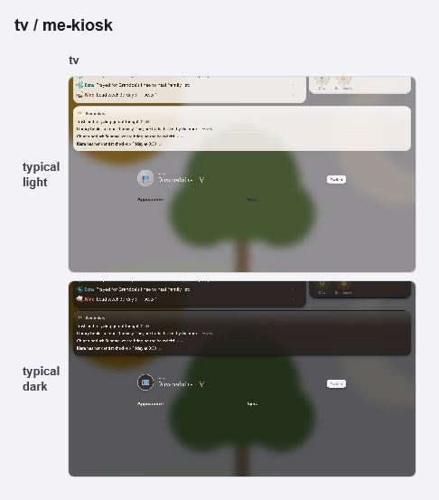

#### tv / picker-tv

What the TV shows after its Switch button: the profile picker at 1920×1080 with the Downstairs TV card as last profile. Other picker states are covered by the shell area on the handheld devices.

States: typical · devices: tv · 2 files: `audits/screens/tv/picker-tv-<state>-<device>-<mode>.png`

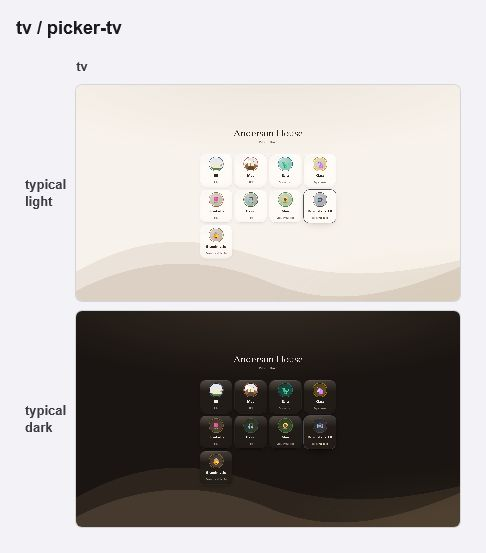

### verses

#### verses / done

All reviewed today: the capture rates each of Eli's 3 due cards "Got it" (kept on the device), so "All done for today · N reviews today", Practise one anyway, the stats and an empty Due today queue show. Typical only: overflow would need 20 ratings, and empty/loading/offline have no queue to finish.

States: typical · devices: desktop, ipad-landscape, ipad-portrait, iphone-pwa, iphone-safari · 10 files: `audits/screens/verses/done-<state>-<device>-<mode>.png`

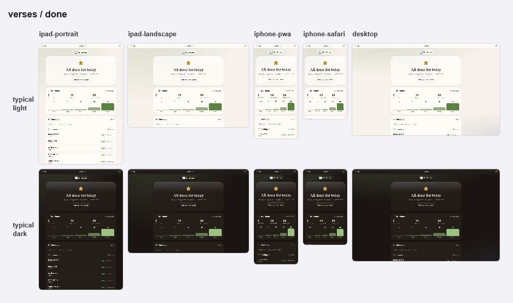

#### verses / kid-done

Ezra after rating both of the week's verses (kept on the device): "All done for today" with Practise again. Typical only: the other states look the same once rated.

States: typical · devices: desktop, ipad-landscape, ipad-portrait, iphone-pwa, iphone-safari · 10 files: `audits/screens/verses/kid-done-<state>-<device>-<mode>.png`

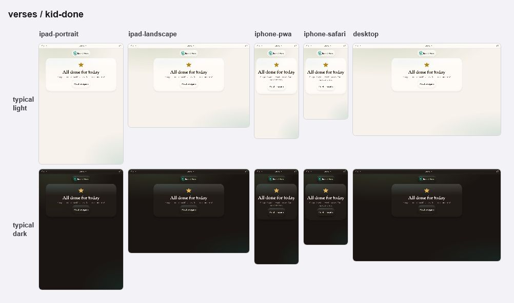

#### verses / kid

Ezra (kid): the family week's first verse, big type and 64 px buttons, no stats or queue. Empty: no family week set, so the trainer falls back to week 1 (Genesis 1:27). Overflow: the long name in the pill. No loading: the same blank page as trainer-loading.

States: empty, typical, overflow, offline · devices: desktop, ipad-landscape, ipad-portrait, iphone-pwa, iphone-safari · 34 files: `audits/screens/verses/kid-<state>-<device>-<mode>.png`

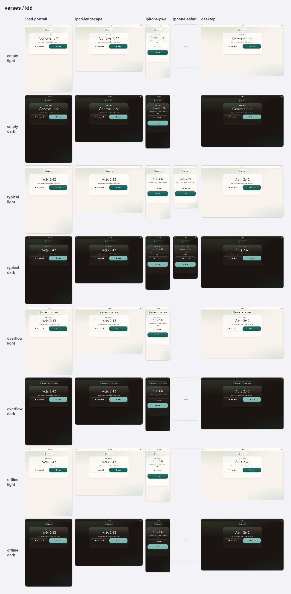

#### verses / kid-revealed

Ezra after Show: the three rating buttons at kid size (stacked on a phone), under adult copy, with nothing revealed (kids have no verse text). Typical only: the other states look like the kid screen.

States: typical · devices: desktop, ipad-landscape, ipad-portrait, iphone-pwa, iphone-safari · 10 files: `audits/screens/verses/kid-revealed-<state>-<device>-<mode>.png`

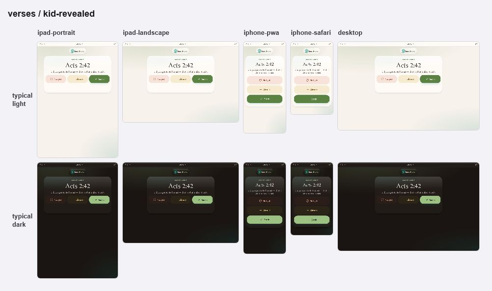

#### verses / nothing-due

Elizabeth has memorised verses but none is due today and she has not rated any yet: "Nothing due today", Next up …, Practise one anyway, her boxes and Coming up. Typical only: it is a data situation, not a mode; loading/offline look like the trainer captures.

States: typical · devices: desktop, ipad-landscape, ipad-portrait, iphone-pwa, iphone-safari · 10 files: `audits/screens/verses/nothing-due-<state>-<device>-<mode>.png`

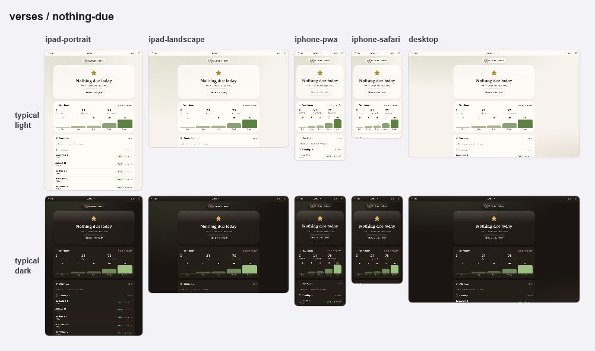

#### verses / overdue

Eli comes back on Friday 25 Sep after three days away (the browser clock moved on 3 days; the data is typical): 25 to go, scrolled to the stats (the day streak back to 0) and a Due today list that starts with verses "3 days overdue" and "2 days overdue" in the late colour before the ones due today. The seeds have no overdue verse on the demo Tuesday, so this is the only capture of the late styling. Typical only.

States: typical · devices: desktop, ipad-landscape, ipad-portrait, iphone-pwa, iphone-safari · 10 files: `audits/screens/verses/overdue-<state>-<device>-<mode>.png`

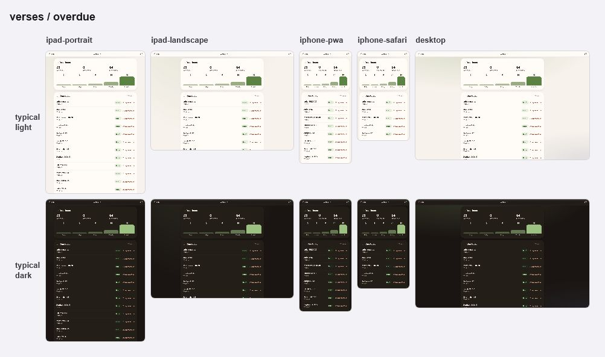

#### verses / practise-anyway

Elizabeth, with nothing due, taps "Practise one anyway": the next verse to come due (Exodus 20:1-3, box 5, due tomorrow) goes on the card as "Week 8 · verse 1 · last one", and the Due today list shows it with its "tomorrow" label (apps/verses.html:307, 366-371). Nothing is rated, so nothing is written. Typical only.

States: typical · devices: desktop, ipad-landscape, ipad-portrait, iphone-pwa, iphone-safari · 10 files: `audits/screens/verses/practise-anyway-<state>-<device>-<mode>.png`

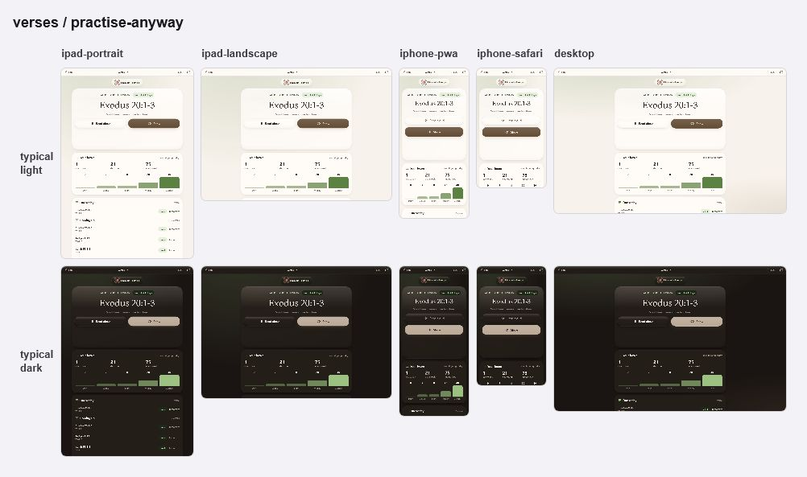

#### verses / rated

The moment after rating: Eli rated his first due card (Luke 14:26-27) "Got it" (kept on the device), so the toast "Got it — Luke 14:26-27 moves to box 4" shows at the bottom over the next card, John 17:3, and the pill reads 2 to go (apps/verses.html:290-306). Typical only: a one-off moment.

States: typical · devices: desktop, ipad-landscape, ipad-portrait, iphone-pwa, iphone-safari · 10 files: `audits/screens/verses/rated-<state>-<device>-<mode>.png`

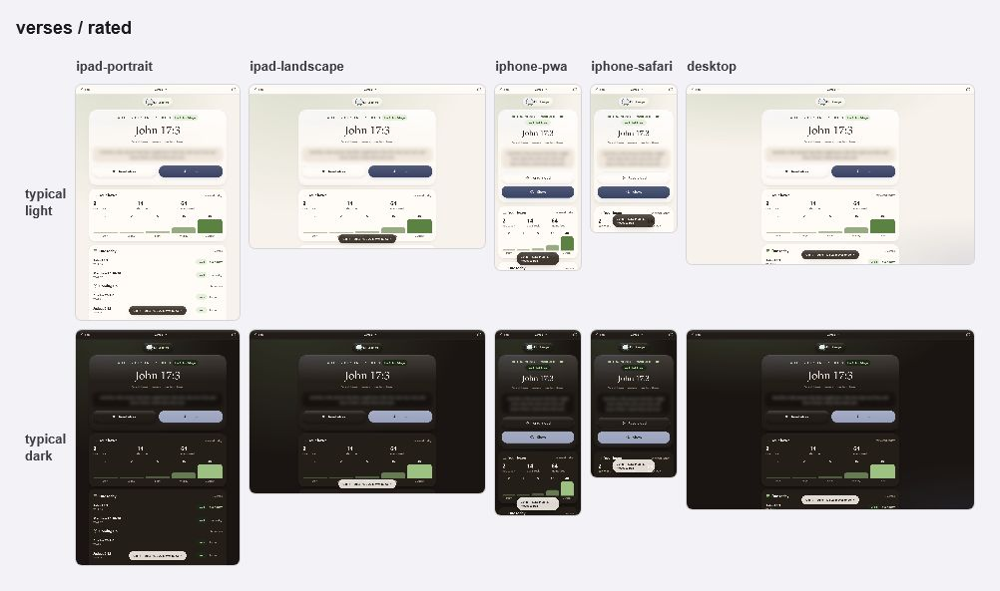

#### verses / revealed

After tapping Show on the first due card, which has no verse text on file: the honesty hint and Not yet / Almost / Got it. Overflow: the long name and 20 to go. No empty (no card to reveal); loading/offline match the trainer captures.

States: typical, overflow · devices: desktop, ipad-landscape, ipad-portrait, iphone-pwa, iphone-safari · 18 files: `audits/screens/verses/revealed-<state>-<device>-<mode>.png`

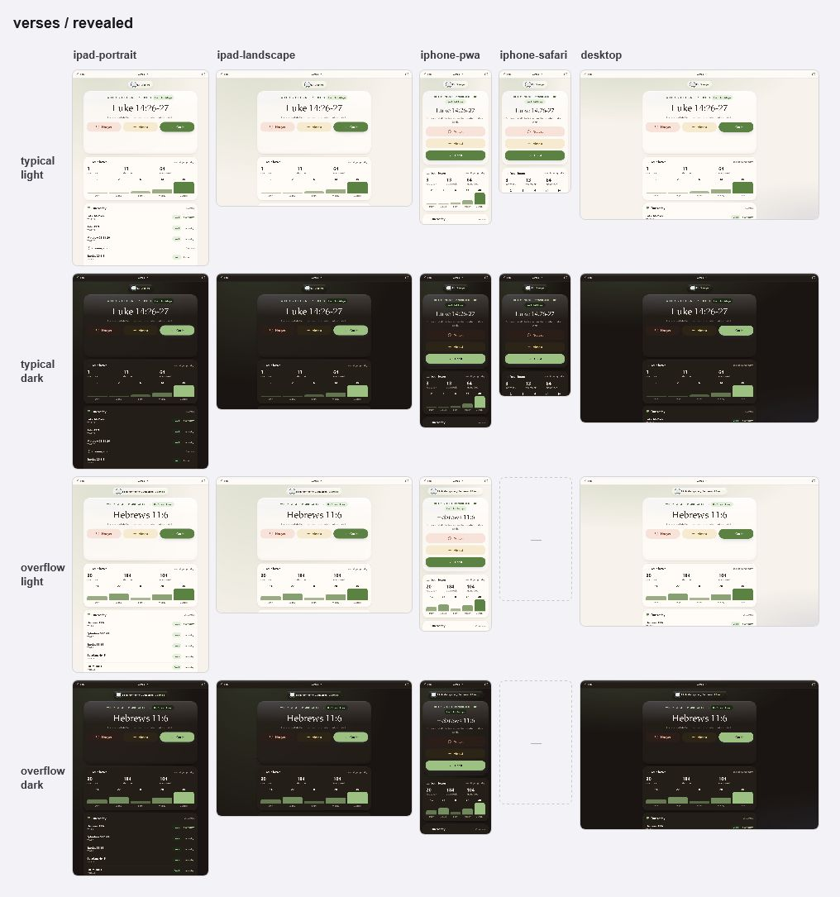

#### verses / text-revealed

The same card after Show: the verse text (KJV, from F260) unblurred, "How did it go?" and the three ratings. Overflow is the long-text case: the card grows past its fixed min-height. States as for text-veiled.

States: typical, overflow · devices: desktop, ipad-landscape, ipad-portrait, iphone-pwa, iphone-safari · 18 files: `audits/screens/verses/text-revealed-<state>-<device>-<mode>.png`

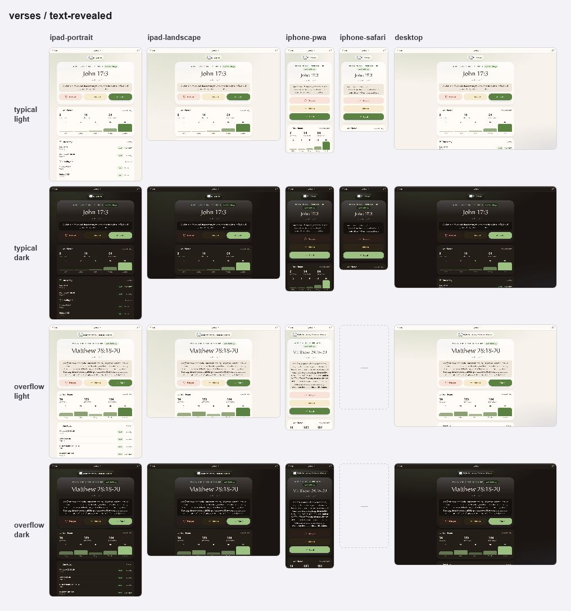

#### verses / text-veiled

A card whose verse text F260 has on file, reached by rating the cards before it Got it on the device: the text sits blurred under the reference until Show. Typical: John 17:3 (2 to go). Overflow: Matthew 28:18-20, 352 characters, after six ratings (14 to go). No empty/loading/offline: needs a live queue and on-device ratings.

States: typical, overflow · devices: desktop, ipad-landscape, ipad-portrait, iphone-pwa, iphone-safari · 18 files: `audits/screens/verses/text-veiled-<state>-<device>-<mode>.png`

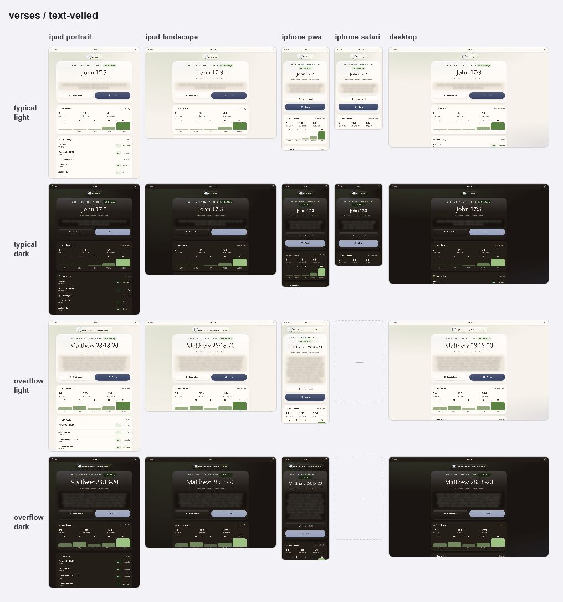

#### verses / trainer

Eli's trainer: the card for the first due verse (reference, box chip, Read aloud / Show), then his boxes and the Due today / Coming up queues. Empty = no memorised verses (the "Nothing to train yet" card); overflow = many due.

States: empty, typical, overflow, loading, offline · devices: desktop, ipad-landscape, ipad-portrait, iphone-pwa, iphone-safari · 42 files: `audits/screens/verses/trainer-<state>-<device>-<mode>.png`

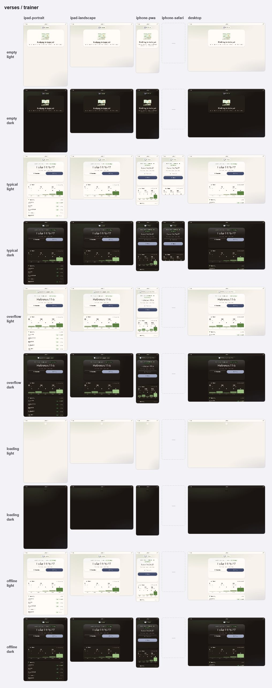

#### verses / trainer-stalled

Eli's first open with no cache on a slow connection, about 7 s in: hub.ready stops waiting after 6 s (apps/hub.js:336-337) and the trainer renders from an empty cache. "Eli · all done" over "Nothing to train yet", although he has 64 memorised verses and 3 due. writeSummary (apps/verses.html:239-245) also queues a { total: 0 } summary. Loading only; the 1.2 s moment is trainer-loading.

States: loading · devices: desktop, ipad-landscape, ipad-portrait, iphone-pwa · 8 files: `audits/screens/verses/trainer-stalled-<state>-<device>-<mode>.png`

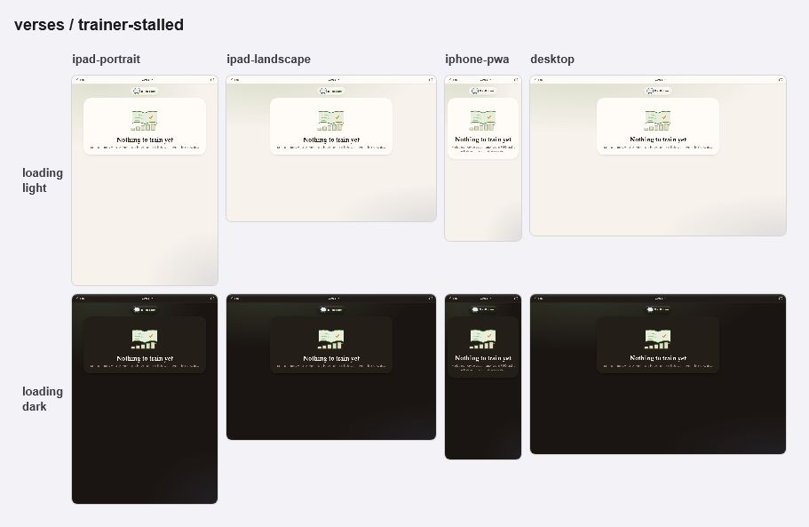
<!-- INDEX:END -->
